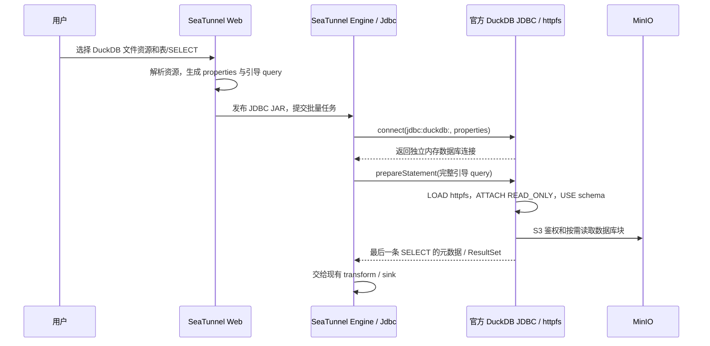

# DuckDB 文件资源 Source 接入方案

> 状态：评审修订稿（2026-10-09）；尚未完成目标 SeaTunnel 集群端到端验收。
>
> 范围：SeaTunnel Web 的批量文件引接任务；Web 1.0.0、Engine 3.0.0；仅 Web 端、只读 source。
>
> 本次只修订方案文档，不实现代码、不部署或重启服务。

## 结论

**首版推荐复用现有 `Jdbc` source 和官方 DuckDB JDBC：用 `properties` 传入 MinIO 连接配置，在 `query` 前附加固定的 `LOAD → ATTACH → USE` 引导语句。无需新增 SeaTunnel 选项、修改 connector 或实现自定义 JDBC 驱动。**

DuckDB `.db` / `.duckdb` 文件继续作为 MinIO 文件资源管理，用户仍在文件引接任务中选择文件、schema、表或自定义 SELECT。SeaTunnel 节点上的 DuckDB `httpfs` 通过 S3 API 只读访问数据库对象，不向 Web 下载任务输入文件，不要求 Web/Engine 共享数据库目录。

该推荐有明确边界：**锁定已验证的驱动版本；使用顶层 `query`；单 split；不配置 `table_path`、`table_list`、`partition_column` 或 `where_condition`。** 初始化依赖 DuckDB JDBC 对多语句 SQL 的处理，而非通用 JDBC 标准保证。上线前必须在实际部署的 SeaTunnel 3.0.0 构建上验证元数据获取、reader、重试和恢复全链路。

如果该构建会改写 query，或以后需要并行分片，则切换到**轻量 JDBC 包装驱动，在 `connect()` 返回前初始化连接**；仍不要求修改 SeaTunnel。原稿的 `connection_init_sql` connector 补丁降为最后备选，不作为本功能的前置依赖。

## 原方案评审

原稿保留文件资源语义、复用 `Jdbc`、只读访问 MinIO、预置匹配版本扩展的方向正确。主要需要修正以下判断：

| 问题 | 评审结论与修订 |
|---|---|
| 将“需要连接初始化”直接推导为“必须新增 `connection_init_sql`” | 结论过强。当前 DuckDB JDBC 的多语句 prepare 可以先初始化，再取得最后一条 SELECT 的元数据；现有单 split 读取可以沿用完整 query。先验证这条最小改动路径。 |
| 在初始化 SQL 中写入 AK/SK | 不采用。当前 Engine `ChunkSplitter.createPreparedStatement` 会在 INFO 日志输出 SQL；应通过现有 JDBC `properties` 传递凭证，query 不包含凭证。配置存储和其他日志仍需独立保护。 |
| 无条件否定包装 JDBC driver | 包装驱动可只委托官方 driver 并初始化连接，原生库、ResultSet、重连机制均继续复用。它比长期维护 Engine 补丁更独立，适合作为扩展方案。 |
| 认为 `session_init_sql_file` 必然需要 Web/Engine 共享卷 | Web 动态生成的本地文件确实无法自然分发，但统一在 Engine 节点部署初始化文件也可行；只是有任务文件生命周期和凭证落盘成本。 |
| 将 secret 当作天然隔离的 session 状态 | DuckDB secret、附加 catalog 可能由同一数据库实例的多个连接共享。使用连接独立的无名内存实例，避免不同任务共用 named-memory 数据库。 |
| 声称 Web 不读取 `.db` 内容 | 仅适用于任务提交的数据面。现有 `DuckDbCatalogReader` 的检查/预览仍下载完整文件到 Web 临时目录；本方案保留现状并明确容量影响。 |

## 核对依据与验证边界

本次检查了 Web 仓库及 `/home/haruka/workspace/seatunnel` 的现有源码。后者当前提交为 `fcd8a74ec`；这是本地实现证据，不能替代对已部署 Engine 二进制的确认。

- Web 的 `seatunnel-web-api/pom.xml` 当前声明 DuckDB JDBC `1.3.1.0`。首版以该版本为验证基线，记录实际发布 JAR 的校验和；不能因 `current` 文档更新而隐式升级 driver 或扩展。
- `JdbcConnectionConfig` 接收 `properties`，`SimpleJdbcConnectionProvider.getOrEstablishConnection()` 将其传入所配置 driver 的 `connect(url, info)`。元数据连接通过 `JdbcCatalogUtils` 使用相同 connection provider。
- DuckDB dialect 接受 `jdbc:duckdb:` 前缀；元数据查询调用 `Connection.prepareStatement(query).getMetaData()`。单 split 的 `ChunkSplitter` 保留原 query 并准备执行；设置 `enable_concurrent_read=false` 跳过分片分析。现有 [`JDBC source` 文档](https://seatunnel.apache.org/docs/3.0.0/connectors/source/Jdbc/)也提供连接 properties 和该分片开关。
- `EngineDriverJarPublisher` 已支持 `driver_location` 中以分号分隔的多个本地 JAR，并复用现有上传流程改写为 Engine 路径。推荐路径只需官方 JDBC JAR；包装驱动备选可以分发两个 JAR。

本次在独立 JShell 进程中使用本机缓存的 `duckdb_jdbc-1.3.1.0.jar` 做了最小能力探测，没有修改项目代码或启动 SeaTunnel：

探测 JAR 的 SHA-256 为 `612c1e55e45fb496902b8ec7f9bb957a404813e6d1fc1c4531df000d1bab2d07`；发布时必须核对实际 artifact，不能仅凭文件名认定与本次探测一致。

| 探测 | 结果 | 能说明什么 |
|---|---|---|
| `jdbc:duckdb:https://blobs.duckdb.org/databases/stations.duckdb`，只读连接 | 失败；URL 被解析成工作目录下的本地数据库路径 | 当前驱动不能通过替换 JDBC 数据库路径来省掉远程 `ATTACH`。 |
| 无名内存连接，通过 Properties 传入示例 `s3_*` 值，随后 `LOAD httpfs` | `current_setting('s3_endpoint')` 返回示例 endpoint | 当前 driver/httpfs 接受这条参数传递路径；示例未使用真实 AK/SK，也未访问私有 MinIO。 |
| prepare 多语句 `LOAD; ATTACH IF NOT EXISTS; USE; SELECT count(*)`，读取官方公开 HTTPS 数据库 | 两个独立连接，每个连接重复 prepare 两次，均得到 1 列元数据、578 行统计结果 | 初始化先于最终 SELECT 的元数据绑定；重复 prepare 与新连接都能工作。 |

**已验证的是 JDBC 层能力；尚未验证私有 MinIO 鉴权、实际 SeaTunnel 提交/恢复、类型转换及 sink 输出。** 原生多语句行为需要随发布 driver 一起锁定和回归，不能推广为任意 JDBC driver 均支持。[官方 `1.3.1.0` PreparedStatement 源码](https://github.com/duckdb/duckdb-java/blob/v1.3.1.0/src/main/java/org/duckdb/DuckDBPreparedStatement.java)是对应实现入口。

## 目标运行链路



初始化发生在 prepare 阶段，**不是在 connect 阶段**。因此必须确认所有依赖远程 catalog 的操作都从完整 query 开始；只执行连接健康检查不需要预先 ATTACH。需要独立执行表元数据、MIN/MAX、采样或改写查询时，应改用包装驱动备选。

## 首版 HOCON 与 SQL 契约

### 现有选项即可表达

以下为生成契约示例，占位值均由文件资源元数据和运行配置提供：

```hocon
env {
  job.mode = "BATCH"
  parallelism = 1
}

source {
  Jdbc {
    url = "jdbc:duckdb:"
    driver = "org.duckdb.DuckDBDriver"
    driver_location = "/web-visible-driver-dir/duckdb_jdbc-1.3.1.0.jar"
    enable_concurrent_read = false
    properties {
      s3_endpoint = "<host:port>"
      s3_region = "<region>"
      s3_url_style = "path"
      s3_use_ssl = "false"
      s3_access_key_id = "<access-key>"
      s3_secret_access_key = "<secret-key>"
      autoinstall_known_extensions = "false"
      threads = "2"
      memory_limit = "512MB"
      jdbc_stream_results = "true"
    }
    query = """
      LOAD httpfs;
      ATTACH IF NOT EXISTS 's3://<bucket>/<object-key>' AS duckdb_source (READ_ONLY);
      USE "duckdb_source"."main";
      SELECT * FROM "duckdb_source"."main"."<table>"
    """
    plugin_output = "<existing-output-route>"
  }
}
```

`properties` 是现有字符串 Map，布尔值也按字符串传递。`threads`、`memory_limit` 为示例预算，应按 Engine 容量设置；`jdbc_stream_results` 必须由锁定版本支持并验收，避免大查询结果被一次性物化到 native 内存。`plugin_output` 仅在现有路由需要时输出。

该路径采用 DuckDB/httpfs 仍支持的 **legacy `s3_*` 配置**，是首版简化实现的明确取舍。官方更推荐 Secrets Manager；这里没有把 `CREATE SECRET` 和静态凭证塞进 SQL。后续 driver/httpfs 升级必须回归该配置，若不再支持则采用包装驱动和临时 secret，不能静默回退为明文 SQL。配置含义见[官方 legacy S3 文档](https://duckdb.org/docs/current/core_extensions/httpfs/s3api_legacy_authentication)。

无名内存数据库保持可初始化；**不要设置整个内存连接的 `duckdb.read_only=true` 来代替远程库的只读属性**。源对象的只读约束由 `ATTACH ... (READ_ONLY)` 保证。

### Web 生成规则

保留现有 `sourceMode=FILE_RESOURCE`、`fileFormatType=duckdb` 和 `fileResourceId` 工作流：

1. 校验 `.db` / `.duckdb` 文件资源和静态 MinIO AK/SK；从 `FileResourceResolver` 取得 bucket、object key、endpoint、region、TLS 和 path-style 信息，不为任务提交下载数据库。
2. 插件名生成 `Jdbc`，不生成 `DuckDB { ... }`；配置官方 driver 和 Web 可读的 `driver_location`。
3. 使用 `properties` 传递连接信息，query 中只放系统生成的 `LOAD / ATTACH / USE` 和用户数据查询。endpoint 使用 host:port，TLS 单独配置；不改变共享 JVM 的环境变量或系统属性。
4. 表模式生成完整 catalog/schema/table SELECT；SQL 模式使用用户原本的单条 SELECT 或 WITH 查询，前置相同的引导段，并通过 USE 设置所选 schema（默认 main）。过滤条件写入最终 SELECT。
5. 用户提交的 SQL 与最终多语句 query 分开保存。用户仍只能编辑数据查询；初始化段不可编辑。先校验用户查询，再拼固定引导段，不能让用户借该能力提交任意 DDL、ATTACH 或 secret 语句。
6. 对对象 URI 做正确编码和 SQL 字面量转义，对 catalog/schema/table 分别做 identifier 引用；使用配置序列化器生成 HOCON，不能直接拼接未转义的文件名或用户输入。
7. 首版显式设置 `enable_concurrent_read=false`，不输出 `table_path`、`table_list`、分区选项或 `where_condition`。`where_condition` 会把完整 SQL 包成子查询，多语句引导段不适用该包装。
8. 每次执行、重提任务都重新解析文件资源和凭证，沿用现有 `plugin_output`/transform 路由。固定源对象后，同一连接重复 prepare 使用 `ATTACH IF NOT EXISTS`；不得在复用的同一连接中切换到另一个对象。

现有 SQL 校验与权限需要覆盖源对象外的数据访问：单条 SELECT 仍可能包含外部文件函数或引用外部数据的 view；`READ_ONLY` 只限制数据库写入。现有预览在本地打开后关闭 external access 的方式，不能直接复制到依赖 httpfs 的远程 source 上。首版支持范围应限定为所选库中的表和仅引用该库数据的 view/SELECT，并验收实际执行边界。

### 凭证保护

把 AK/SK 移出 SQL 能避免当前 Engine 的 prepared-statement 日志直接泄露凭证，**不能让 HOCON 自动成为安全存储**。`properties.s3_secret_access_key` 仍是敏感值。

- 长期任务定义保存文件资源引用及用户 SELECT；运行时才从现有受控文件资源配置取凭证，生成提交快照。
- 运行快照、配置查看/下载接口、Engine 配置日志和异常链必须验证脱敏及访问控制；不能假设通用 JDBC password 脱敏规则会识别 `s3_secret_access_key`。
- 不把原始 Properties、包含密钥的配置或 HTTP 鉴权信息写入日志；SQL 可以包含对象地址，但不能包含静态密钥或预签名 token。
- 若已部署 Engine 会输出未保护的 properties，首版不能通过验收。可采用包装驱动读取节点提供的受控 secret 引用；需要另外设计 secret 的分发与轮换，不能认为换 driver 就自动解决凭证管理。

## 其他实现路径与选择条件

| 路径 | 新增 Engine 源码改动 | 主要成本或限制 | 定位 |
|---|---|---|---|
| 现有 Jdbc + properties + 多语句引导 query | 无 | 锁定 DuckDB 行为；仅 query/单 split；使用 legacy S3 配置 | **首版推荐，实际 Engine 验收通过后采用** |
| 轻量 JDBC 包装驱动，connect 内初始化 | 无 | 维护很小的独立 driver artifact；验证类加载及连接生命周期 | **需要改写 query/并行分片或首版门禁失败时优先采用** |
| 官方 `session_init_sql_file`，统一部署到 Engine 节点 | 无 | 每个相关节点必须有本地初始化文件；任务文件和凭证落盘管理 | 已有受控文件分发机制时可采用 |
| 原稿新增 source-only `connection_init_sql` | 有 | 自维护 connector、重新构建/发布、覆盖全部连接入口及升级回归 | 另有通用 JDBC 初始化需求并计划上游化时再考虑 |
| 提前导出查询结果为 Parquet，再用 `S3File` | 无 | 新增物化步骤、存储与生命周期；数据链路和时效性改变 | 接受预处理且希望 Engine 完全不加载 DuckDB 时可考虑 |
| HTTPS 预签名 URL | 通常仍需 ATTACH 初始化 | HEAD/GET 签名、Range、有效期和恢复限制 | 不是当前 S3 鉴权链路的直接替代 |
| 下载 `.db` 到节点本地再打开 | 无或取决于下载接入 | 整库复制、磁盘容量、节点路径及缓存清理 | 放弃对象直读目标时的降级方案 |

### 包装驱动备选的边界

只实现 JDBC `Driver` 委托，不复制 DuckDB driver，不包装所有 Connection/Statement/ResultSet，也不创建连接池或自行实现重连：

1. SeaTunnel 配置的 `driver` 指向独立包装类；URL 仍为 `jdbc:duckdb:`，让现有 DuckDB dialect 正常识别。自定义参数通过现有 `properties` 传递，不另造 JDBC URL 前缀。
2. 每次 `connect()` 创建一个独立的官方内存连接；从参数或受控引用取得凭证，在该连接依次执行 `LOAD httpfs`、临时 scoped S3 secret、只读 `ATTACH` 和 `USE`。
3. 移除包装参数和认证参数后，仅把允许的 DuckDB 运行配置交给官方 driver；初始化全部成功才返回官方 Connection。
4. 初始化失败关闭连接，输出资源标识、失败阶段和经过过滤的错误；不能把包含密钥的 SQL 或原始异常上下文直接透传到 Engine 日志。
5. 新连接由 SeaTunnel 现有 provider 创建，每次都重新初始化。包装类仅用于 DuckDB 文件资源 source，其他 JDBC source/sink 不选择它。
6. 包装 JAR 与官方 JDBC JAR 分开发布，复用已有分号分隔的 `driver_location`；不 relocate `org.duckdb` 或重打包原生库。验证 metadata/enumerator/reader 的任务 classloader 都能看见二者。

该备选将初始化与用户 SELECT 分开，允许后续分片查询引用已初始化的 catalog，并可转向官方 Secrets Manager。但并行读取的性能、快照一致性和资源预算仍要独立验收。[DuckDB S3 secret 文档](https://duckdb.org/docs/current/core_extensions/httpfs/s3api)说明了 endpoint、URL style、TLS 等配置。

### 初始化文件与预签名 URL 的限制

[`session_init_sql_file`](https://duckdb.org/docs/current/clients/java/connecting)由官方 JDBC driver 读取 Engine 进程可见的本地文件，不是远程 SQL URI，也不是通过 JDBC Properties 传递的初始化文本。统一部署文件能消除 Web 共享卷，但动态任务仍需要节点分发、权限、保留期及清理机制；文件的 per-connection 部分要按 driver 支持的 marker 规则放置。现有 driver JAR 上传流程不能直接当作 SQL 文件分发协议。

预签名 GET URL 同样不能当作任意 HTTP 方法的通行证；MinIO SDK 对 GET/HEAD 分别签名。[官方 MinIO Java API](https://github.com/minio/minio-java/blob/master/docs/API.md)规定签名有效期，需覆盖排队、运行、重试和恢复。DuckDB httpfs 会使用 HEAD/GET 和 Range 请求，必须测试签名兼容；当前直接 JDBC URL 打开远程库的探测也已失败。加代理来处理这些问题会新增数据服务，不属于首版最小路径。

## 驱动、扩展与快照部署要求

- 建议配置 `seatunnel.web.duckdb.driver-location` / `SEATUNNEL_WEB_DUCKDB_DRIVER_LOCATION` 指向 Web 可读的官方 JAR，后续沿用 `EngineDriverJarPublisher`。已有通用 artifact 路径可用时优先复用，不新增重复上传 UI；不把 Engine 本地路径当作 Web 文件。
- “无需 Engine 源码改动”仍包含运行依赖准备：每个可能创建 JDBC 连接的进程/节点都要能加载 JDBC driver、匹配版本与 OS/架构的 `httpfs`，并访问 MinIO DNS、端口及 TLS 证书。按实际提交、规划、执行阶段确定节点范围。
- httpfs 在受控发布阶段预置到运行用户可发现的扩展目录。任务只 LOAD，关闭自动安装；不能在每个任务中 INSTALL 或依赖外网下载。driver artifact 分发不等于 native extension 分发。
- 上游生成文件时先完成 checkpoint/正常关闭，再发布不可变对象；只上传 `.db` 不能补齐仍在 `.wal` 中的事务。任务期间禁止覆盖源对象；使用不可变 object key 或已验证的版本固定方式。
- 每个无名内存连接有独立的 DuckDB 实例和资源预算。设置 threads、memory_limit，并验证同节点多任务的总 native 内存、临时空间和回收；JVM 堆限制不能代表 DuckDB 的全部资源限制。
- 当前 Web 元数据检查和预览仍会整库下载，需评估文件大小、临时盘和超时。若后续统一改为远程读取，应单独评审；本次不把该变化混入 source 接入。

## 分步实施与验收门禁

以下均为后续实施计划，本次不执行：

1. **先验证目标构建**：使用实际 SeaTunnel 3.0.0、锁定官方 JDBC JAR 和预置 httpfs，完成 Jdbc 配置解析、prepare 元数据、单 split reader 和私有 MinIO 鉴权。确认完整引导 query 未被包装或截断，properties 未丢失，日志无密钥。失败时优先切换包装驱动，不默认新增 Engine 补丁。
2. **再修改 Web**：DuckDB 文件资源生成 `Jdbc`、properties、固定引导段和单条用户 SELECT；接入 driver-location；保留文件资源 UI、预览和现有 transform/sink 路由。只读 source、静态凭证为首版边界。
3. **验收连接与恢复**：非 main schema、带空格/中文/引号的标识符和对象名；同连接重复 prepare；metadata 与 reader 使用不同连接；连接重建/任务重提/恢复后重新 ATTACH；两个文件任务并发时无 catalog 或凭证串用。
4. **验收数据与错误**：表模式、自定义 SELECT/WITH、transform、现有 sink；行数及值与冻结快照一致；空表、NULL、常见数值/时间/BLOB 类型、大结果集；坏凭证、缺少对象/扩展、TLS 失败、版本不兼容等有可诊断错误，错误中不含凭证。
5. **完成实际 Web happy path**：使用 Chrome dev/Playwright 从文件资源选择、schema/表或 SQL 配置，到任务提交和成功读取 sink，完成受影响行为的实际验收。
6. **最后清理旧实现**：替代路径通过验收、旧任务兼容处理明确后，再删除 `DuckDbSourceInitSqlFileService`、init-sql-dir 配置、相关生成/清理调用和仅为该目录存在的共享挂载；不先删除其他功能仍依赖的配置或部署项。

本方案可以消除本功能新增 SeaTunnel 补丁的依赖，但不能据本次 JDBC 探测宣称集群接入已经完成。

## 参考资料

- [SeaTunnel 3.0.0：JDBC Source](https://seatunnel.apache.org/docs/3.0.0/connectors/source/Jdbc/)
- [SeaTunnel 3.0.0：DuckDB 使用说明](https://seatunnel.apache.org/docs/3.0.0/connectors/source/DuckDB/)
- [DuckDB：远程 DuckDB 数据库只读 ATTACH](https://duckdb.org/docs/current/guides/network_cloud_storage/duckdb_over_https_or_s3)
- [DuckDB：legacy S3 参数与环境变量](https://duckdb.org/docs/current/core_extensions/httpfs/s3api_legacy_authentication)
- [DuckDB：S3 API 与 Secrets Manager](https://duckdb.org/docs/current/core_extensions/httpfs/s3api)
- [DuckDB：ATTACH 语句](https://duckdb.org/docs/current/sql/statements/attach)
- [DuckDB：HTTP(S) 与 Range 请求](https://duckdb.org/docs/current/core_extensions/httpfs/https)
- [DuckDB：Java/JDBC 连接与初始化文件](https://duckdb.org/docs/current/clients/java/connecting)
- [DuckDB Java 1.3.1.0：Driver 源码](https://github.com/duckdb/duckdb-java/blob/v1.3.1.0/src/main/java/org/duckdb/DuckDBDriver.java)
- [DuckDB Java 1.3.1.0：PreparedStatement 源码](https://github.com/duckdb/duckdb-java/blob/v1.3.1.0/src/main/java/org/duckdb/DuckDBPreparedStatement.java)
- [MinIO Java SDK：预签名 GET/HEAD API](https://github.com/minio/minio-java/blob/master/docs/API.md)

以上 `current` 文档用于解释能力和约束；参数与行为是否可用，以锁定的 JDBC JAR、匹配扩展和实际 SeaTunnel 3.0.0 构建验收为准。
