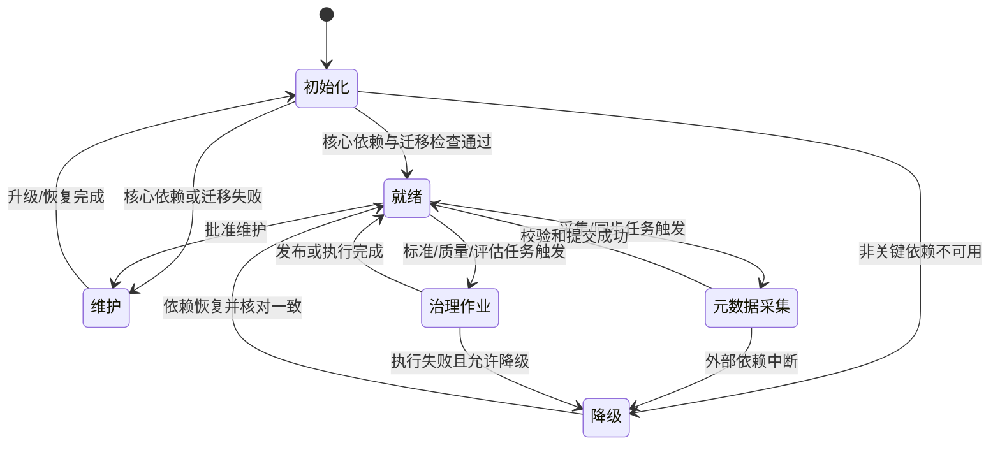
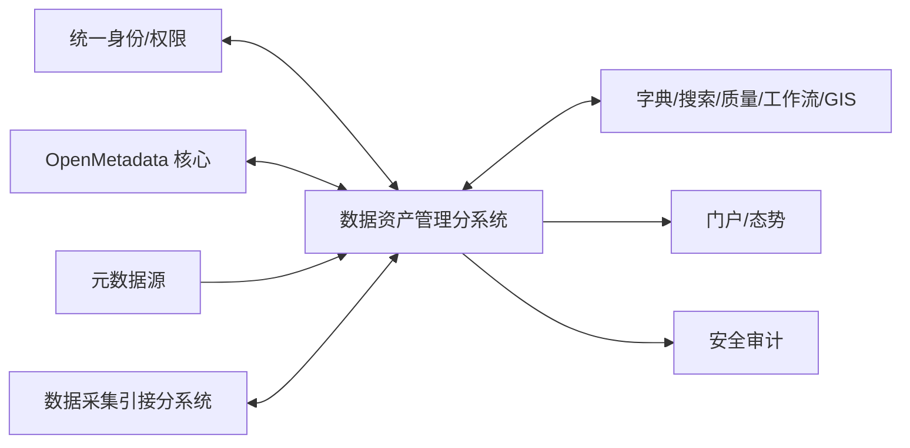

# 数据资产管理分系统规格说明（SSS）

| 项目 | 内容 |
|---|---|
| 文档标识 | ZCGL-SSS-001 |
| 软件/分系统标识 | ZCGL-CSCI |
| 版本 | V0.2 |
| 状态 | 需求分析阶段初稿 |
| 密级 | 按项目保密规定确定（TBC） |
| 编制/审核/批准 | 待签署 |
| 日期 | 2026-07-19 |

## 修改页

| 版本 | 日期 | 修改章节 | 修改说明 | 修改人 | 审核人 |
|---|---|---|---|---|---|
| V0.1 | 2026-07-19 | 全文 | 依据合同指标、功能拆解和 GJB 438C 附录 F 建立需求基线初稿 | 待定 | 待定 |
| V0.2 | 2026-07-19 | 第 3、5、6 章 | 闭环 GN-03 漏拆，展开 GN-04 标签能力及标准/质量工作流，补充状态图、性能假设、公共服务和 TBC 分级 | 待定 | 待定 |

## 目录

- [1 范围](#1-范围)
- [2 引用文档](#2-引用文档)
- [3 需求](#3-需求)
- [4 合格性规定](#4-合格性规定)
- [5 需求可追踪性](#5-需求可追踪性)
- [6 注释](#6-注释)

# 1 范围

## 1.1 标识

本文档适用于数据资产管理分系统（软件配置项标识：`ZCGL-CSCI`），文档标识为 `ZCGL-SSS-001`。本文档当前版本为 V0.2，是需求分析阶段的工作基线；经正式评审、问题闭环和配置控制后升级为受控需求基线。

## 1.2 系统概述

数据资产管理分系统对项目数据资产进行元数据、主数据、资源目录、标签、标准、维护、质量、数据字典、资产登记与检索、时空查看、态势展示、价值评估和用户行为分析。分系统以 OpenMetadata 作为元数据能力基础，通过适配和二次开发映射合同指标，并与数据采集引接、统一身份、业务数据源、搜索、GIS、消息和安全审计等系统协同。

本分系统不承担数据采集引擎、通用数据加工引擎、底层数据湖存储和总体门户的建设；但应提供完成资产管理职责所需的受控接口。

## 1.3 文档概述

本文档规定数据资产管理分系统的能力、外部/内部接口、数据、适应性、保密、安全、质量、资源和约束需求，是设计、实现、测试和验收的依据。本文档按 GJB 438C 附录 F 的 SSS 结构编制，并在需求条目中提供唯一标识、优先级/关键性和合格性方法。

## 1.4 与其他计划之间的关系

本文档受《数据采集引接与数据资产管理软件开发计划》约束，并与软件研制计划、软件配置管理计划、软件质量保证计划、软件验证与确认计划、软件测试计划、软件安全性计划和风险管理记录配套使用。计划与本规格冲突时，应通过需求变更和配置控制处理，不得口头改变基线。

# 2 引用文档

| 序号 | 文档 | 版本/日期 | 用途 |
|---|---|---|---|
| 1 | GJB 438C《军用软件开发文档通用要求》 | 项目适用版本 | 文档内容和格式依据 |
| 2 | GJB 2786A《军用软件开发通用要求》 | 项目适用版本 | 软件生命周期活动依据 |
| 3 | 项目合同及技术协议 | 当前受控版 | 合同需求来源 |
| 4 | 合同指标工作簿 Sheet1 | 当前工作版 | 全部指标核对来源 |
| 5 | 数据资产管理功能拆解（Sheet3） | 当前工作版 | 软件功能拆解来源 |
| 6 | 数据资产管理功能性能指标 Markdown 材料 | 当前工作版 | 功能性能分析来源 |
| 7 | 数据采集引接与数据资产管理软件开发计划 | 当前受控版 | 阶段、基线和交付约束 |
| 8 | OpenMetadata 项目基线说明 | 选型版本待定 | 元数据平台二次开发约束 |

# 3 需求

除非另有说明，本章带唯一标识的陈述均为应验证的强制需求。需求标识保持稳定；需求删除、替换或变更须履行配置控制程序。

## 3.1 要求的状态和方式

| 状态/方式 | 进入条件 | 允许的主要行为 | 退出/异常处理 |
|---|---|---|---|
| 初始化 | 服务启动或配置更新 | 加载配置、检查依赖、执行必要迁移 | 成功进入就绪；失败进入降级/维护 |
| 就绪 | 核心依赖可用 | 查询、维护、审批、分析和接口服务 | 收到任务进入相应运行状态 |
| 元数据采集 | 启动采集或同步任务 | 获取、转换、校验、入库和建立关系 | 完成回到就绪；失败告警并可恢复 |
| 治理作业 | 启动标准、质量、价值或分析任务 | 执行规则、生成结果和报告 | 完成回到就绪；失败保留上下文 |
| 降级 | 非关键依赖异常 | 只读查询、缓存结果或批准的有限操作 | 依赖恢复并核对后进入就绪 |
| 维护 | 管理员批准进入 | 升级、备份恢复、索引维护、规则迁移 | 验证通过后进入初始化 |

- **ZCGL-SSS-STATE-001**：分系统应对上述状态进行唯一标识，并向有权限用户显示当前状态、进入时间和关键依赖状态。【优先级：高；关键性：关键】
- **ZCGL-SSS-STATE-002**：状态切换应记录原因、操作者或触发源、时间和结果；禁止的状态转换应被拒绝并审计。【优先级：高；关键性：关键】
- **ZCGL-SSS-STATE-003**：降级状态不得执行可能造成资产目录、标准、质量结果或血缘关系不一致的写操作。【优先级：高；关键性：关键】

## 3.2 系统能力需求

### 3.2.1 元数据管理（ZCGL-GN-01）

- **ZCGL-SSS-CAP-001**：分系统应支持技术元数据、业务元数据、操作元数据和管理元数据的统一登记、采集、查询和维护。【优先级：高；关键性：关键】
- **ZCGL-SSS-CAP-002**：分系统应支持数据源、库、表、字段、文件、接口、任务、报表等适用资产类型及其关系，并可按插件扩展类型。【优先级：高；关键性：关键】
- **ZCGL-SSS-CAP-003**：分系统应支持元数据版本、变更记录、责任主体、状态、分类分级和上下游血缘展示。【优先级：高；关键性：关键】

### 3.2.2 主数据管理（ZCGL-GN-02）

- **ZCGL-SSS-CAP-004**：分系统应支持主数据模型、编码规则、属性、层级和参照关系的定义与维护。【优先级：高；关键性：关键】
- **ZCGL-SSS-CAP-005**：分系统应支持主数据申请、校验、审核、发布、停用和变更追踪，并防止未经批准的数据进入有效版本。【优先级：高；关键性：关键】

### 3.2.3 资源目录管理（ZCGL-GN-03）

- **ZCGL-SSS-CAP-006**：分系统应支持按领域、业务对象和主题等维度建立多级资源目录，并允许在权限范围内配置目录层级和排序。【优先级：高；关键性：关键】
- **ZCGL-SSS-CAP-007**：资源目录项应关联一个或多个资产实体、责任主体、状态、分类分级和可见范围，并保持关系可追溯。【优先级：高；关键性：关键】
- **ZCGL-SSS-CAP-008**：资源目录发布、移动、合并、停用和删除应经过权限校验，对已发布目录的破坏性操作应履行审批或影响确认。【优先级：高；关键性：关键】

### 3.2.4 标签管理（ZCGL-GN-04）

- **ZCGL-SSS-CAP-009**：分系统应支持标签体系、标签分组、标签定义、适用范围、责任人和生命周期状态管理。【优先级：高；关键性：一般】
- **ZCGL-SSS-CAP-010**：分系统应支持打标规则的条件、数据范围、优先级、执行方式、有效期和冲突策略定义，支持人工、规则或接口打标，并记录标签来源、规则版本、时间和有效性。【优先级：高；关键性：关键】
- **ZCGL-SSS-CAP-038**：分系统应按标签、目录、领域、资产类型、责任主体和时间等维度分析已打标、未打标、冲突、失效和覆盖情况，并支持下钻至有权查看的资产。【优先级：高；关键性：一般】
- **ZCGL-SSS-CAP-039**：分系统应支持按标签分类层级进行深度查询，返回命中资产及标签来源，并严格执行资产与标签双重访问控制。【优先级：高；关键性：关键】
- **ZCGL-SSS-CAP-040**：分系统应支持标签及标签关系的受控导入、导出；导入前应校验格式、重复、引用和权限，导出应执行审批、脱敏和审计中的适用要求。【优先级：高；关键性：关键】
- **ZCGL-SSS-CAP-041**：分系统应依据资产元数据、内容特征或已批准规则生成和推荐候选标签，显示推荐依据、置信信息和模型/规则版本；候选标签经授权确认后方可成为有效标签。【优先级：高；关键性：关键】
- **ZCGL-SSS-CAP-042**：分系统应支持在批准范围内共享标签定义、版本和适用规则，接收方应保持来源和版本；跨安全域或超出可见范围的共享应被拒绝并审计。【优先级：高；关键性：关键】

### 3.2.5 数据标准管理（ZCGL-GN-05）

- **ZCGL-SSS-CAP-011**：分系统应支持数据元、术语、代码集、命名、格式、值域和口径等标准的分类、编制、审核、发布和废止。【优先级：高；关键性：关键】
- **ZCGL-SSS-CAP-012**：分系统应支持标准与元数据实体、字段、质量规则和数据字典的映射，并识别未映射或冲突项。【优先级：高；关键性：关键】
- **ZCGL-SSS-CAP-013**：标准版本变更时应保存差异、影响范围和审批记录，并支持查询历史有效版本。【优先级：高；关键性：关键】
- **ZCGL-SSS-CAP-043**：标准编制流程应至少规定输入材料、编制人、复核/审批角色、状态转换、发布输出和驳回/撤回异常；审批通过前不得作为有效标准被下游引用。【优先级：高；关键性：关键】
- **ZCGL-SSS-CAP-044**：标准应支持按批准模板批量导入和导出；导入应提供预校验、逐项错误、影响预览和原子/可识别部分成功策略，导出应保留版本与来源信息。【优先级：高；关键性：关键】
- **ZCGL-SSS-CAP-045**：标准下架或废止前应分析引用影响、通知责任主体并确定替代标准；已用于历史数据的标准版本应保留可追溯查询。【优先级：高；关键性：关键】

### 3.2.6 数据维护管理（ZCGL-GN-06）

- **ZCGL-SSS-CAP-014**：分系统应支持对授权范围内的资产属性、关系、责任人、状态和说明进行新增、修改、停用和恢复维护。【优先级：高；关键性：关键】
- **ZCGL-SSS-CAP-015**：分系统应保存维护历史、版本和变更前后值，并支持指定版本之间的差异比较。【优先级：高；关键性：关键】
- **ZCGL-SSS-CAP-016**：批量维护应先进行校验和影响预览，失败时应给出逐项错误且不得产生不可识别的部分成功结果。【优先级：高；关键性：关键】

### 3.2.7 数据质量管理（ZCGL-GN-07）

- **ZCGL-SSS-CAP-017**：分系统应支持完整性、唯一性、准确性、一致性、及时性、有效性等质量规则的定义、组合、启停和版本管理。【优先级：高；关键性：关键】
- **ZCGL-SSS-CAP-018**：分系统应支持质量任务调度、执行、结果汇总、问题定位、告警、整改和复核闭环。【优先级：高；关键性：关键】
- **ZCGL-SSS-CAP-019**：质量报告应展示规则、对象、执行时间、样本/记录规模、通过率、问题数量和趋势，并可追踪至任务与规则版本。【优先级：高；关键性：关键】
- **ZCGL-SSS-CAP-046**：质量问题应能生成或关联整改工单，工单至少包含问题与规则版本、资产、责任人、优先级、期限、状态、整改证据和操作记录。【优先级：高；关键性：关键】
- **ZCGL-SSS-CAP-047**：整改提交后应由授权复核人重新执行或核查，复核通过方可关闭；复核失败应退回并保留原因、次数和完整状态历史。【优先级：高；关键性：关键】

### 3.2.8 外部数据字典集成（ZCGL-GN-08）

- **ZCGL-SSS-CAP-020**：分系统应与项目指定的 HJJ 外部数据字典服务集成，支持字典目录、条目、版本和有效状态同步或查询。【优先级：高；关键性：关键】
- **ZCGL-SSS-CAP-021**：外部字典不可用时，分系统应明确标记缓存数据的版本和更新时间，不得将过期数据误报为最新结果。【优先级：高；关键性：一般】

### 3.2.9 数据资产总览、登记、分类与可视化（ZCGL-GN-09）

- **ZCGL-SSS-CAP-022**：分系统应支持数据资产登记、审核、发布、分类分级、责任认领、上下架和注销。【优先级：高；关键性：关键】
- **ZCGL-SSS-CAP-023**：分系统应按目录、类型、领域、责任主体、状态和分类分级汇总资产数量及变化趋势。【优先级：高；关键性：一般】
- **ZCGL-SSS-CAP-024**：资产详情应综合展示元数据、标准、质量、血缘、使用、价值和安全属性中的可用信息，并按权限裁剪。【优先级：高；关键性：关键】

### 3.2.10 全局检索（ZCGL-GN-10）

- **ZCGL-SSS-CAP-025**：分系统应支持按关键字对有权访问的资产名称、描述、字段、标签、标准和目录进行统一检索。【优先级：高；关键性：关键】
- **ZCGL-SSS-CAP-026**：检索应支持按资产类型、目录、领域、责任人、状态、标签和分类分级等条件筛选、排序与分页。【优先级：高；关键性：一般】
- **ZCGL-SSS-CAP-027**：检索结果应遵循访问控制，不得通过数量、摘要、高亮或联想词泄露无权资产信息。【优先级：高；关键性：关键】

### 3.2.11 时空数据快速查看（ZCGL-GN-11）

- **ZCGL-SSS-CAP-028**：分系统应识别具有时间、空间或时空属性的数据资产，并支持以列表、时间范围和地图方式快速查看其摘要。【优先级：高；关键性：一般】
- **ZCGL-SSS-CAP-029**：时空查看应显示坐标参考、时间范围、空间范围、数据规模和更新时间；坐标或时间语义不明确时应提示用户。【优先级：中；关键性：一般】

### 3.2.12 可定制数据资产态势（ZCGL-GN-12）

- **ZCGL-SSS-CAP-030**：分系统应支持按用户或角色配置资产态势组件、指标、筛选条件、布局和刷新周期。【优先级：高；关键性：一般】
- **ZCGL-SSS-CAP-031**：态势指标应标注统计口径、数据来源、统计时间和权限范围，并支持从汇总结果下钻至有权查看的资产。【优先级：高；关键性：关键】

### 3.2.13 数据资产价值评估（ZCGL-GN-13）

- **ZCGL-SSS-CAP-032**：分系统应支持配置价值评估维度、指标、权重、评分区间和适用资产范围。【优先级：高；关键性：一般】
- **ZCGL-SSS-CAP-033**：价值评估应保存模型版本、输入快照、计算过程、结果和评估时间，支持结果解释和历史比较。【优先级：高；关键性：关键】
- **ZCGL-SSS-CAP-034**：自动评估结果发布前应支持异常值检查和人工复核，人工调整应记录理由和审批信息。【优先级：中；关键性：一般】

### 3.2.14 用户行为分析（ZCGL-GN-14）

- **ZCGL-SSS-CAP-035**：分系统应在授权和审计要求下采集资产搜索、查看、申请、使用和评价等行为事件。【优先级：高；关键性：关键】
- **ZCGL-SSS-CAP-036**：分系统应支持按时间、组织、角色、资产和行为类型统计访问趋势、热点资产和使用分布。【优先级：高；关键性：一般】
- **ZCGL-SSS-CAP-037**：行为分析结果应按最小必要原则展示，并支持匿名化、去标识化或聚合处理，不得用于未批准目的。【优先级：高；关键性：关键】

### 3.2.15 性能与容量能力

- **ZCGL-SSS-PERF-001**：分系统应支持不少于 100 万条元数据的管理；项目内部设计目标为不少于 121 万条。【追踪：ZCGL-XN-01；验证：T、A】
- **ZCGL-SSS-PERF-002**：分系统应支持不少于 5000 条数据质量规则的管理；项目内部设计目标为不少于 6500 条。【追踪：ZCGL-XN-02；验证：T、A】
- **ZCGL-SSS-PERF-003**：在合同约定的并发、数据规模和环境下，元数据检索响应时间应不大于 2 s，数据标准和数据字典检索响应时间应不大于 0.5 s；项目内部分别按 1.5 s、0.35 s 和 0.35 s 设计。【追踪：ZCGL-XN-03；验证：T】
- **ZCGL-SSS-PERF-004**：针对不超过 10 万条记录的数据集，生成质量分析报告的时间应不大于 2 min；项目内部按不超过 13 万条记录、时间不大于 95 s 设计。【追踪：ZCGL-XN-04；验证：T】
- **ZCGL-SSS-PERF-005**：性能测试应记录硬件资源、软件版本、数据规模、规则复杂度、并发用户、缓存状态和统计口径；条件不一致的结果不得直接比较。【验证：I、A】
- **ZCGL-SSS-PERF-006**：SRR 前应批准下表中的默认测试假设或替代值；未关闭的红色性能假设不得进入需求基线，STP/STD 只能细化而不得改变合同计量边界。【验证：I、A】

| 指标 | SRR 默认测试假设（待需方确认） |
|---|---|
| PERF-001 | 100 万条指权威元数据实体记录总数；实体类型构成、关系数量、版本保留和索引副本另行固定并记录 |
| PERF-002 | 5000 条指处于可用或受控停用状态的唯一质量规则版本；规则模板与规则实例分别统计 |
| PERF-003 | 响应时间从服务端接收有效请求到完整响应产生；分别在指定并发下测试冷/热缓存，结果取约定百分位；网络边界和结果页大小固定 |
| PERF-004 | 10 万条指被质量规则实际扫描的源数据记录数；从执行端接受有效任务到报告完成持久化并可查询，包含规则执行与汇总，不含人工审批 |

## 3.3 系统外部接口需求

### 3.3.1 接口标识和接口图

外部接口详见《数据资产管理接口需求规格说明》（ZCGL-IRS-001）。本分系统至少包括统一身份、OpenMetadata、元数据源、数据采集引接、外部字典、搜索、质量执行、工作流消息、GIS、门户态势和安全审计接口。

| SSS 接口 | 对端与方向 | 关键数据流 | 本分系统责任边界 |
|---|---|---|---|
| ZCGL-IF-001 | 统一身份/权限，双向 | 主体、组织、授权 | 执行服务端权限；不管理外部身份生命周期 |
| ZCGL-IF-002 | OpenMetadata，双向 | 实体、关系、血缘、分类、术语和事件 | 经适配层映射；不直接修改其内部数据库 |
| ZCGL-IF-003 | 元数据源，输入/双向 | 结构、关系、版本和采集状态 | 最小权限探查、校验和同步；不修改源结构 |
| ZCGL-IF-004 | 数据采集引接分系统，双向 | 数据源、任务、运行、血缘 | 资产侧接收治理事实并反馈资产标识/状态 |
| ZCGL-IF-005 | HJJ 数据字典，输入/双向 | 目录、条目、版本 | 同步、缓存并标明时效；不覆盖已发布标准 |
| ZCGL-IF-006 | 搜索/索引，双向 | 索引文档、查询和状态 | 权限过滤、索引一致性和重建 |
| ZCGL-IF-007 | 质量执行端，双向 | 规则、任务、结果和问题 | 下发受控规则、核对结果；执行端不决定治理状态 |
| ZCGL-IF-008 | 工作流/消息，双向 | 审批、待办、告警 | 保持业务与流程状态一致，消息失败可补偿 |
| ZCGL-IF-009 | GIS/时空服务，双向 | 时空范围、坐标参考和预览 | 传递授权和语义，不负责底图生产 |
| ZCGL-IF-010 | 统一门户/态势，双向/输出 | 组件、指标、下钻 | 提供带口径和权限的指标，门户负责汇总 |
| ZCGL-IF-011 | 安全审计，输出 | 安全和行为事件 | 生成、缓冲、补传；审计平台集中留存 |
| ZCGL-IF-012 | 共享交换平台，双向 | 目录、申请、授权、状态 | 经审批发布并同步撤权；是否本期建设待确认 |

### 3.3.2 外部接口通用需求

- **ZCGL-SSS-IF-001**：每个外部接口应具有唯一标识、受控版本、责任边界、鉴权方式、数据定义、异常语义和合格性方法。【优先级：高；关键性：关键】
- **ZCGL-SSS-IF-002**：外部接口应支持超时、限流、失败重试、幂等/去重及熔断降级中的适用机制，并形成监控和审计记录。【优先级：高；关键性：关键】
- **ZCGL-SSS-IF-003**：接口中敏感字段应按项目安全要求加密、脱敏或使用受控引用，禁止在日志中输出口令、令牌和密钥。【优先级：高；关键性：关键】
- **ZCGL-SSS-IF-004**：外部实体标识应维护稳定映射；映射冲突或版本不兼容时不得静默覆盖。【优先级：高；关键性：关键】

## 3.4 系统内部接口需求

- **ZCGL-SSS-IIF-001**：门户与领域服务之间应通过受控服务契约交互，禁止绕过权限和审计直接修改核心数据。【优先级：高；关键性：关键】
- **ZCGL-SSS-IIF-002**：OpenMetadata 适配层应隔离其原生实体模型、API 和事件版本差异，业务扩展不得无控制侵入上游核心代码。【优先级：高；关键性：关键】
- **ZCGL-SSS-IIF-003**：检索、质量、工作流、价值评估和行为分析模块应使用稳定实体标识及版本，异步事件应具备幂等键和重放能力。【优先级：高；关键性：关键】
- **ZCGL-SSS-IIF-004**：模块间调用应传递统一用户/服务主体、追踪标识和安全上下文，不得信任客户端自报权限。【优先级：高；关键性：关键】

## 3.5 系统内部数据需求

- **ZCGL-SSS-DATA-001**：分系统应维护资产、元数据实体、目录、标签、标准、主数据、字典、质量规则与结果、价值模型和行为事件的稳定唯一标识。【优先级：高；关键性：关键】
- **ZCGL-SSS-DATA-002**：核心治理对象应具有版本、有效状态、创建/修改主体、时间、来源和审批信息。【优先级：高；关键性：关键】
- **ZCGL-SSS-DATA-003**：删除核心对象前应校验引用关系；默认采用停用或软删除，物理删除应经审批并保留证据。【优先级：高；关键性：关键】
- **ZCGL-SSS-DATA-004**：索引、缓存和分析汇总应可从权威数据重建，并标明同步时间和一致性状态。【优先级：高；关键性：一般】
- **ZCGL-SSS-DATA-005**：备份和恢复应覆盖配置、元数据、关系、规则、索引重建信息和审计关联信息，并定期验证可恢复性。【优先级：高；关键性：关键】

## 3.6 适应性需求

- **ZCGL-SSS-ADAPT-001**：分系统应通过连接器、适配器和配置支持新增元数据源、资产类型、规则类型和外部服务，扩展不应破坏既有受控接口。【优先级：中；关键性：一般】
- **ZCGL-SSS-ADAPT-002**：分系统应支持开发、测试、集成和生产环境的参数隔离，环境差异不得硬编码在业务代码中。【优先级：高；关键性：关键】
- **ZCGL-SSS-ADAPT-003**：升级 OpenMetadata 或其他基础组件前应完成兼容性、数据迁移和回退验证。【优先级：高；关键性：关键】

## 3.7 保密性需求

- **ZCGL-SSS-CONF-001**：分系统应依据项目密级和数据分类分级控制资产目录、元数据、样例、血缘、质量结果和行为分析结果的访问与展示。【优先级：高；关键性：关键】
- **ZCGL-SSS-CONF-002**：导入、导出、共享、打印和接口传输应执行相应的授权、标记、脱敏和审计要求。【优先级：高；关键性：关键】
- **ZCGL-SSS-CONF-003**：不得在非生产环境使用未经批准的真实敏感数据；确需使用时应履行审批并采取去标识化措施。【优先级：高；关键性：关键】

## 3.8 安全性需求

- **ZCGL-SSS-SEC-001**：分系统应接入统一身份鉴别，并实施基于角色、组织、资源和操作的最小权限控制。【优先级：高；关键性：关键】
- **ZCGL-SSS-SEC-002**：分系统应对登录、查询、维护、审批、导入导出、规则执行、权限变更和接口调用实施安全审计。【优先级：高；关键性：关键】
- **ZCGL-SSS-SEC-003**：输入和文件应进行格式、长度、范围、恶意内容和注入校验；输出应进行适当编码。【优先级：高；关键性：关键】
- **ZCGL-SSS-SEC-004**：凭据、令牌和密钥应加密存储、受控使用、定期轮换且不写入日志或代码库。【优先级：高；关键性：关键】
- **ZCGL-SSS-SEC-005**：软件应实施依赖、镜像和开源组件清单管理及漏洞处置，OpenMetadata 及其依赖须纳入软件物料清单。【优先级：高；关键性：关键】
- **ZCGL-SSS-SEC-006**：审计记录应采用项目批准的防未授权修改、删除和插入机制实施完整性保护，能够检测破坏、告警并保留核查证据；具体密码算法或链式结构在安全设计阶段依据批准的密码应用要求确定。【优先级：高；关键性：关键】

## 3.9 系统环境适应性需求

- **ZCGL-SSS-ENV-001**：分系统应部署在项目批准的服务器、操作系统、容器/中间件、数据库、搜索引擎和网络环境中；具体基线为 TBC。【优先级：高；关键性：关键】
- **ZCGL-SSS-ENV-002**：在依赖短时中断、节点重启和网络抖动条件下，分系统应保护已提交数据并在恢复后核对同步、索引和任务状态。【优先级：高；关键性：关键】
- **ZCGL-SSS-ENV-003**：受限网络或离线部署所需的软件包、镜像、插件、许可证和校验信息应可受控交付。【优先级：高；关键性：关键】

## 3.10 其他质量特性需求

- **ZCGL-SSS-QUAL-001（可靠性）**：单个元数据采集、索引或质量任务失败不得破坏已发布资产和其他独立任务；失败应可定位、重试或补偿。【验证：T、A】
- **ZCGL-SSS-QUAL-002（可用性）**：常用维护、检索和审批操作应提供明确状态、校验反馈和失败处置提示。【验证：D、T】
- **ZCGL-SSS-QUAL-003（可维护性）**：配置、规则、适配器和业务扩展应模块化管理，并具备版本、变更记录和回退说明。【验证：I、A】
- **ZCGL-SSS-QUAL-004（可测试性）**：关键服务应提供健康、指标、日志、追踪和可控测试接口，能够构造正常、边界和异常场景。【验证：I、T】
- **ZCGL-SSS-QUAL-005（兼容性）**：浏览器、数据库、搜索引擎和 OpenMetadata 的支持版本应形成兼容矩阵并经验证。【验证：I、T】

## 3.11 计算机资源需求

### 3.11.1 计算机硬件需求

- **ZCGL-SSS-RES-001**：服务器、存储和网络资源应满足第 3.2.15 条容量与性能指标，并预留索引重建、质量任务和批量采集峰值资源；定量配置在设计阶段经容量评估确定。【验证：A、T】

### 3.11.2 计算机硬件资源利用需求

- **ZCGL-SSS-RES-002**：分系统应监控 CPU、内存、磁盘、网络、数据库连接、搜索队列和任务队列；超过阈值时告警并支持限流或降级。【验证：T、D】

### 3.11.3 计算机软件需求

- **ZCGL-SSS-RES-003**：OpenMetadata、数据库、搜索引擎、消息组件、运行时和第三方库应采用项目批准的受控版本，形成软件物料清单、许可证清单和漏洞处置记录。【验证：I】

### 3.11.4 计算机通信需求

- **ZCGL-SSS-RES-004**：通信端口、协议、证书、带宽、超时和网络区域策略应在部署设计及 ICD 中固化，并遵循最小开放原则。【验证：I、T】

## 3.12 设计和构造的约束

- **ZCGL-SSS-CNST-001**：元数据相关能力应以项目批准的 OpenMetadata 版本为基础进行适配和二次开发。【优先级：高；关键性：关键】
- **ZCGL-SSS-CNST-002**：应优先使用 OpenMetadata 公开 API、事件和插件扩展点；确需修改上游核心代码时，应记录理由、影响、补丁和升级合并策略。【优先级：高；关键性：关键】
- **ZCGL-SSS-CNST-003**：业务扩展不得跨越服务边界直接修改 OpenMetadata 内部数据库表，也不得绕过其权限和审计机制。【优先级：高；关键性：关键】
- **ZCGL-SSS-CNST-004**：软件需求、设计、代码、测试和问题单应以唯一标识建立双向追踪，并纳入配置管理。【优先级：高；关键性：关键】
- **ZCGL-SSS-CNST-005**：软件开发、文档和评审应符合项目适用的 GJB 2786A、GJB 438C 及软件质量保证要求。【优先级：高；关键性：关键】

## 3.13 人员相关需求

- **ZCGL-SSS-PERS-001**：系统管理员、目录/标准/质量管理员、数据责任人、审核人、审计员和普通用户应职责分离并授予最小权限。【验证：I、T】
- **ZCGL-SSS-PERS-002**：高风险批量操作、权限变更、数据导出和物理删除应由具备相应角色的人员执行，并按项目规则审批或复核。【验证：T、I】

## 3.14 训练相关需求

- **ZCGL-SSS-TRAIN-001**：应为系统管理员、治理人员、审核人员、普通用户和运维人员提供与职责对应的培训材料、操作演练和考核记录。【验证：I、D】

## 3.15 综合保障需求

- **ZCGL-SSS-SUP-001**：交付应包括安装部署、初始化、备份恢复、监控告警、故障处置、升级回退和数据迁移说明。【验证：I、D】
- **ZCGL-SSS-SUP-002**：应建立 OpenMetadata 及其他开源组件的版本、许可证、漏洞、补丁和停服风险跟踪机制。【验证：I】
- **ZCGL-SSS-SUP-003**：应提供配置、规则、插件、数据模型和接口映射的基线清单，支持现场问题复现和恢复。【验证：I、D】

## 3.16 包装需求

- **ZCGL-SSS-PKG-001**：交付介质应包含批准的软件包/镜像、配置模板、数据库或索引初始化材料、第三方依赖、文档、版本清单、校验值和签名信息。【验证：I】
- **ZCGL-SSS-PKG-002**：涉密或受限网络环境的交付介质制作、传递、存储和销毁应遵守项目保密与介质管理规定。【验证：I】

## 3.17 其他需求

- **ZCGL-SSS-OTH-001**：界面术语、数据格式、时间、行政区划、坐标参考和编码应遵循项目统一规范。【验证：I、D】
- **ZCGL-SSS-OTH-002**：系统应提供中文界面和中文帮助；多语言能力如有要求通过变更程序纳入。【验证：D】
- **ZCGL-SSS-OTH-003**：所有 TBC 项应指定责任人、关闭条件和计划关闭阶段；未关闭的关键 TBC 不得无条件进入详细设计。【验证：I】

### 3.17.1 公共服务依赖清单

| 公共服务 | 使用责任 | 故障时最低行为 | 详细接口 |
|---|---|---|---|
| 统一身份、组织与权限 | 统一鉴权、最小权限和撤权 | 高风险写操作拒绝，只读降级须批准 | ZCGL-IF-001 |
| 搜索与索引 | 资产、标准、字典和标签检索 | 标明索引时效或降级到权威查询 | ZCGL-IF-006 |
| 工作流与消息 | 审批、待办、告警和通知 | 核心事务不回滚，进入补偿队列 | ZCGL-IF-008 |
| 文件/对象存储 | 导入导出、附件和报告制品 | 拒绝不完整提交并支持补偿 | 由总体分配/ICD 固化 |
| 统一运维与门户 | 健康、指标和态势集成 | 本地保留状态并明确过期信息 | ZCGL-IF-010 |
| 安全审计 | 集中审计留存 | 受保护缓冲、告警、恢复后补传 | ZCGL-IF-011 |

公共服务是否作为独立软件单元由总体架构批准；在此之前两个 CSCI 不得各自复制实现同名平台能力。

## 3.18 需求的优先顺序和关键性

1. 合同指标、保密安全、数据完整性和可追溯性需求为最高优先级；
2. 影响元数据、标准、质量和目录正确性的需求为关键需求；
3. 可视化定制、辅助分析等需求在不影响关键能力的前提下实施；
4. 项目内部目标高于合同最低指标，但内部目标未达成且合同指标达成时，应按项目质量和变更程序处理，不得擅自降低基线；
5. 需求优先级冲突由需求评审组织裁决并记录。

# 4 合格性规定

合格性方法：`D` 演示，`T` 测试，`A` 分析，`I` 检查，`S` 特殊方法。

| 需求组 | 方法 | 合格判据摘要 |
|---|---|---|
| STATE-* | T、D | 状态进入、退出、禁止转换和降级行为符合要求 |
| CAP-001～037 | T、D、I | 功能、权限、版本、流程和异常场景符合逐条需求 |
| PERF-001～005 | T、A、I | 在受控环境和约定数据规模下达到容量与时延指标 |
| IF-*、IIF-* | T、I、A | 接口契约、鉴权、幂等、异常和版本控制符合要求 |
| DATA-* | T、I | 标识、版本、引用、删除、重建和恢复符合要求 |
| ADAPT/ENV/QUAL-* | T、A、D | 环境切换、故障恢复、维护和兼容性符合要求 |
| CONF/SEC-* | T、I、A、S | 访问控制、保密、审计、凭据和漏洞管理符合要求 |
| RES/CNST/PERS/TRAIN/SUP/PKG/OTH-* | I、A、D | 资源、约束、保障、培训和交付物证据完整 |

测试说明应定义环境、数据、前置条件、步骤、预期结果、判定准则和见证要求，并逐条引用需求标识。分析和检查应形成可复核记录。

# 5 需求可追踪性

| 合同/来源标识 | SSS 分配 | 说明 |
|---|---|---|
| ZCGL-GN-01 | CAP-001～003 | 元数据管理 |
| ZCGL-GN-02 | CAP-004～005 | 主数据管理 |
| ZCGL-GN-03 | CAP-006～008 | 领域/对象/主题资源目录；补回拆解遗漏项 |
| ZCGL-GN-04 | CAP-009～010、CAP-038～042 | 标签体系、规则、分析、深度查询、导入导出、推荐和共享 |
| ZCGL-GN-05 | CAP-011～013、CAP-043～045 | 数据标准及编制、审批、导入导出、下架全生命周期 |
| ZCGL-GN-06 | CAP-014～016 | 数据维护、历史和版本比较 |
| ZCGL-GN-07 | CAP-017～019、CAP-046～047 | 数据质量规则、报告和整改复核闭环 |
| ZCGL-GN-08 | CAP-020～021 | HJJ 外部数据字典集成 |
| ZCGL-GN-09 | CAP-022～024 | 资产总览、登记、分类和可视化 |
| ZCGL-GN-10 | CAP-025～027 | 全局检索 |
| ZCGL-GN-11 | CAP-028～029 | 时空数据快速查看 |
| ZCGL-GN-12 | CAP-030～031 | 可定制资产态势 |
| ZCGL-GN-13 | CAP-032～034 | 资产价值评估 |
| ZCGL-GN-14 | CAP-035～037 | 用户行为分析 |
| ZCGL-XN-01 | PERF-001 | 元数据容量 |
| ZCGL-XN-02 | PERF-002 | 质量规则容量 |
| ZCGL-XN-03 | PERF-003 | 检索响应时间 |
| ZCGL-XN-04 | PERF-004、PERF-006 | 质量报告生成时间及统一测试假设 |

正式需求管理库应进一步建立“合同—SSS—IRS—设计—代码—测试—问题/变更”的双向追踪，本表为需求基线初始映射。

# 6 注释

## 6.1 缩略语

| 缩略语 | 含义 |
|---|---|
| API | Application Programming Interface |
| CSCI | Computer Software Configuration Item |
| GIS | Geographic Information System |
| IRS | Interface Requirements Specification |
| SSS | System/Subsystem Specification |
| TBC | To Be Confirmed，待确认 |

## 6.2 待确认项

| 编号 | 等级 | 待确认内容 | 建议责任方/关闭点 |
|---|---|---|---|
| ZCGL-SSS-TBC-001 | 红/SRR 阻塞 | OpenMetadata 受控版本、许可证结论、部署拓扑和允许修改范围 | 软件/配置/质量组/SRR 前 |
| ZCGL-SSS-TBC-002 | 红/SRR 阻塞 | 元数据源类型、数量、采集频率及 100 万条容量统计口径 | 需方/总体/软件组/SRR 前 |
| ZCGL-SSS-TBC-003 | 红/SRR 阻塞 | HJJ 数据字典接口、数据范围、版本和可用性要求 | 需方/对端组/SRR 前 |
| ZCGL-SSS-TBC-004 | 红/SRR 阻塞 | 质量规则复杂度、10 万条源记录特征、规则数量及 2 min 计时边界 | 需方/测试组/SRR 前 |
| ZCGL-SSS-TBC-005 | 黄/PDR 前关闭 | 时空服务、坐标参考、底图和数据安全要求 | 总体/GIS 组/PDR 前 |
| ZCGL-SSS-TBC-006 | 红/SRR 阻塞 | 价值评估模型、行为分析口径及结果使用边界 | 需方/业务组/SRR 前 |
| ZCGL-SSS-TBC-007 | 红/SRR 阻塞 | 密级、分类分级、密码应用、审计保留和脱敏规则 | 保密/安全组/SRR 前 |
| ZCGL-SSS-TBC-008 | 黄/PDR 前关闭 | 部署硬件、OS、数据库、搜索引擎、消息和浏览器兼容基线 | 总体/环境组/PDR 前 |
| ZCGL-SSS-TBC-009 | 红/SRR 阻塞 | Sheet1 第 239～240 行重复/错标指标是否属于本分系统；未书面确认前不作为 ZCGL-CSCI 验收需求，但须保留影响分析 | 合同/总体组/SRR 前 |

## 附录 A（规范性）需求标识规则

需求标识采用 `ZCGL-SSS-类别-序号`，类别包括 `STATE`、`CAP`、`PERF`、`IF`、`IIF`、`DATA`、`ADAPT`、`CONF`、`SEC`、`ENV`、`QUAL`、`RES`、`CNST`、`PERS`、`TRAIN`、`SUP`、`PKG` 和 `OTH`。标识一经进入基线不重复使用。

## 附录 B（资料性）OpenMetadata 映射原则

1. 优先将合同对象映射到 OpenMetadata 的实体、关系、分类、术语、测试和血缘能力；
2. 无法直接映射的合同能力通过项目扩展服务实现，并维护与 OpenMetadata 实体的稳定关联；
3. 业务需求不直接等同于上游产品现有功能，所有合同需求仍须逐条设计和验证；
4. 上游升级必须通过兼容性评估、迁移演练和回退验证。
