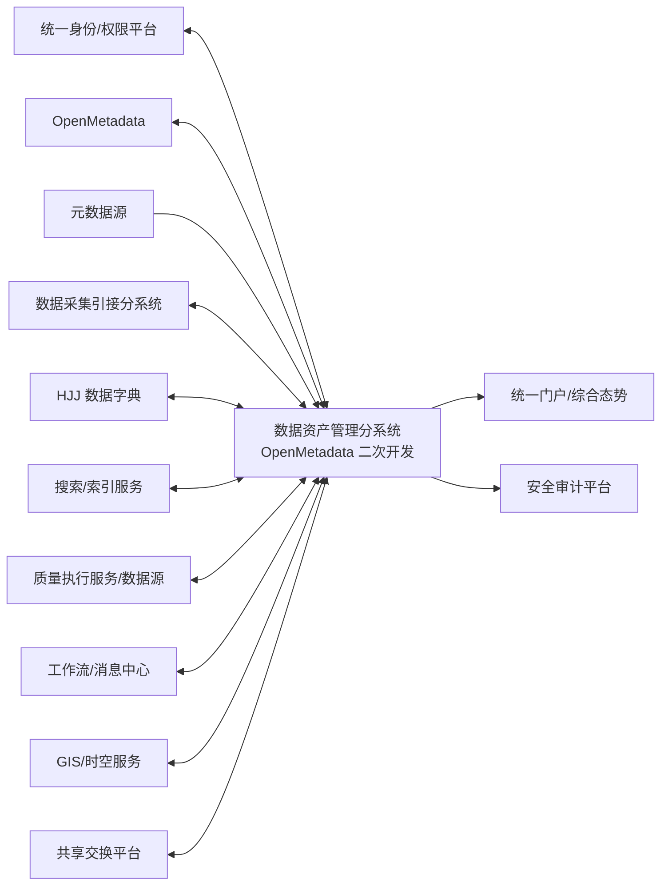

# 数据资产管理分系统接口需求规格说明（IRS）

| 项目 | 内容 |
|---|---|
| 文档标识 | ZCGL-IRS-001 |
| 软件/分系统标识 | ZCGL-CSCI |
| 版本 | V0.2 |
| 状态 | 需求分析阶段初稿 |
| 密级 | 按项目保密规定确定（TBC） |
| 编制/审核/批准 | 待签署 |
| 日期 | 2026-07-19 |

## 修改页

| 版本 | 日期 | 修改章节 | 修改说明 | 修改人 | 审核人 |
|---|---|---|---|---|---|
| V0.1 | 2026-07-19 | 全文 | 依据合同指标、功能拆解和 GJB 438C 附录 G 建立接口需求基线初稿 | 待定 | 待定 |
| V0.2 | 2026-07-19 | 第 3、5、6 章及附录 | 补充接口性能/可用性假设、跨分系统对偶标识、OpenMetadata 边界和审计完整性要求 | 待定 | 待定 |

## 目录

- [1 范围](#1-范围)
- [2 引用文档](#2-引用文档)
- [3 需求](#3-需求)
- [4 合格性规定](#4-合格性规定)
- [5 需求可追踪性](#5-需求可追踪性)
- [6 注释](#6-注释)

# 1 范围

## 1.1 标识

本文档适用于数据资产管理分系统（软件配置项标识：`ZCGL-CSCI`），文档标识为 `ZCGL-IRS-001`，当前版本为 V0.2。本文档经正式评审、问题闭环和配置控制后形成受控接口需求基线。

## 1.2 系统概述

数据资产管理分系统以 OpenMetadata 为元数据能力基础，完成元数据、主数据、资源目录、标签、标准、质量、资产检索与分析等职责，并与数据采集引接、统一身份、外部数据字典、搜索、质量执行、工作流消息、GIS、总体门户和安全审计等外部实体交互。

本文档规定上述接口对数据资产管理分系统的行为要求。字段长度、枚举、URL、端口、证书、部署参数和产品特定调用流程在设计阶段通过接口设计说明或接口控制文件（ICD）固化。

## 1.3 文档概述

本文档依据 GJB 438C 附录 G 的 IRS 结构编制，供接口责任双方确认及设计、集成和测试使用。尚未明确的外部平台、协议版本、数据口径和安全参数以 `TBC` 标识，并在第 6 章统一跟踪。

# 2 引用文档

| 序号 | 文档 | 版本/日期 | 用途 |
|---|---|---|---|
| 1 | GJB 438C《军用软件开发文档通用要求》 | 项目适用版本 | IRS 内容和格式依据 |
| 2 | GJB 2786A《军用软件开发通用要求》 | 项目适用版本 | 生命周期和评审管理依据 |
| 3 | 项目合同及技术协议 | 当前受控版 | 接口相关合同需求来源 |
| 4 | 数据资产管理分系统规格说明（SSS） | ZCGL-SSS-001 V0.2 | 上层需求和接口边界 |
| 5 | 数据资产管理功能与性能指标拆解材料 | 当前工作版 | 功能和性能需求来源 |
| 6 | OpenMetadata 项目基线说明 | 选型版本待定 | 元数据平台接口约束 |

# 3 需求

除非另有说明，本章带唯一标识的陈述均为可验证的强制需求。“应”表示强制，“宜”表示建议，“可”表示允许。

## 3.1 接口标识和接口图

| 接口标识 | 接口名称 | 对端 | 方向 | 主要用途 |
|---|---|---|---|---|
| ZCGL-IF-001 | 统一身份、组织与授权接口 | 统一身份认证/权限平台 | 双向 | 登录、组织角色同步、授权校验 |
| ZCGL-IF-002 | OpenMetadata 受控组件接口 | ZCGL-CSCI 内的 OpenMetadata 受控组件 | 双向 | 元数据实体、关系、血缘、分类、术语和事件 |
| ZCGL-IF-003 | 元数据源采集接口 | 数据库、文件、接口、消息、报表等数据源 | 输入/双向 | 元数据探查和增量同步 |
| ZCGL-IF-004 | 数据采集引接协同接口 | 数据采集引接分系统 | 双向 | 数据源、任务、运行和血缘关系同步 |
| ZCGL-IF-005 | 外部数据字典接口 | HJJ 数据字典服务 | 输入/双向 | 字典目录、条目和版本集成 |
| ZCGL-IF-006 | 检索与索引接口 | 搜索引擎/索引服务 | 双向 | 建索引、查询、重建和状态检查 |
| ZCGL-IF-007 | 数据质量执行接口 | 数据源/质量执行服务 | 双向 | 规则下发、执行和结果回传 |
| ZCGL-IF-008 | 工作流与消息接口 | 审批流/消息中心 | 双向 | 审批、待办、告警和通知 |
| ZCGL-IF-009 | GIS 与时空服务接口 | GIS/时空数据服务 | 双向 | 时空摘要、范围、底图和预览 |
| ZCGL-IF-010 | 统一门户与态势接口 | 总体门户/综合态势平台 | 双向/输出 | 组件集成、指标和下钻 |
| ZCGL-IF-011 | 安全审计与行为接口 | 安全审计/日志平台 | 输出 | 安全事件和用户行为审计 |
| ZCGL-IF-012 | 资产共享交换接口 | 数据共享交换/服务发布平台 | 双向 | 资产目录、申请、授权和发布状态 |

- **ZCGL-IRS-GEN-001**：每个接口应具有唯一标识、责任方、受控版本、兼容范围和变更记录。【优先级：高；关键性：关键】
- **ZCGL-IRS-GEN-002**：同步请求应至少包含接口版本、请求标识、调用方、时间戳和业务载荷；响应应包含请求标识、结果码、错误描述和服务端时间。【优先级：高；关键性：关键】
- **ZCGL-IRS-GEN-003**：实体交换应使用稳定唯一标识，并携带实体类型、版本、来源、更新时间和有效状态；跨系统标识映射应可追溯。【优先级：高；关键性：关键】
- **ZCGL-IRS-GEN-004**：接口应采用项目批准的身份鉴别、授权、完整性和传输保密机制，口令、令牌及密钥不得明文传输、存储或记录。【优先级：高；关键性：关键】
- **ZCGL-IRS-GEN-005**：接口应根据业务特性支持超时、限流、分页、幂等/去重、重试、熔断和死信处置，不得采用无界查询或无限重试。【优先级：高；关键性：关键】
- **ZCGL-IRS-GEN-006**：接口数据格式、字符集、时间、数值精度、空值、分类分级和删除语义应在 ICD 中明确。【优先级：高；关键性：关键】
- **ZCGL-IRS-GEN-007**：接口调用、变更、同步失败、人工补偿和冲突处置应记录统一追踪标识并形成审计证据。【优先级：高；关键性：关键】
- **ZCGL-IRS-GEN-008**：接口版本不兼容、映射冲突或数据校验失败时应拒绝错误数据进入有效资产基线，并返回可处置原因。【优先级：高；关键性：关键】
- **ZCGL-IRS-GEN-009**：每个接口在进入基线前应确定预期调用/数据量级、可用性目标、连接与请求超时、重试上限、断连容忍时间和降级语义；附录 B 数值仅为容量设计起始假设，未经责任双方批准不得作为合同验收值。【优先级：高；关键性：关键】

## 3.2 ZCGL-IF-001 统一身份、组织与授权接口

接口类型为软件服务接口，采用统一认证协议或受控 REST 接口；具体协议和版本为 TBC。

- **ZCGL-IRS-IAM-001**：分系统应使用统一身份接口进行用户和服务主体鉴别，不得保存可逆用户口令。【追踪：ZCGL-SSS-SEC-001】
- **ZCGL-IRS-IAM-002**：分系统应同步或查询用户、组织、岗位、角色、状态和唯一标识，并及时处理停用、撤权和组织变更。
- **ZCGL-IRS-IAM-003**：授权校验应至少支持主体、资源、动作和环境条件；客户端传入的角色信息不得作为最终授权依据。
- **ZCGL-IRS-IAM-004**：身份或授权服务不可用时，分系统应阻止新增高风险写操作，并按批准策略提供只读降级和审计。

## 3.3 ZCGL-IF-002 OpenMetadata 平台接口

接口类型包括 OpenMetadata 公开 API、事件和经批准的插件扩展点，具体受控版本为 TBC。

- **ZCGL-IRS-OMD-001**：适配层应通过公开 API 或批准扩展点创建、查询、更新、版本化和停用元数据实体，不得跨边界直接修改 OpenMetadata 内部数据库。【追踪：ZCGL-SSS-CNST-001～003】
- **ZCGL-IRS-OMD-002**：分系统应维护合同资产对象与 OpenMetadata 实体、关系、分类、术语、测试和血缘对象之间的稳定映射。
- **ZCGL-IRS-OMD-003**：实体更新应使用版本或等价并发控制；发现版本冲突时应中止覆盖并进入冲突处置流程。
- **ZCGL-IRS-OMD-004**：事件消费应支持幂等、检查点、重放和死信处理，并保存事件标识、实体版本和处理结果。
- **ZCGL-IRS-OMD-005**：删除默认使用停用或软删除语义；物理删除须经审批且验证引用关系与备份。
- **ZCGL-IRS-OMD-006**：OpenMetadata 升级后，接口适配器应通过兼容性回归、数据迁移和回退测试后方可进入受控环境。

## 3.4 ZCGL-IF-003 元数据源采集接口

接口类型包括数据库、文件、接口、消息、报表、任务编排和其他批准数据源的元数据连接器。

- **ZCGL-IRS-SRC-001**：连接器应声明支持的源类型、版本、认证方式、采集对象、增量能力和所需最小权限。【追踪：ZCGL-SSS-CAP-001～003】
- **ZCGL-IRS-SRC-002**：连接配置应使用受控凭据引用，保存前执行连通性和权限检查，并返回规范化结果。
- **ZCGL-IRS-SRC-003**：采集数据应包含源实体标识、名称、类型、结构、关系、来源时间和采集时间；缺失关键标识的数据不得写入有效基线。
- **ZCGL-IRS-SRC-004**：增量采集应保存可恢复检查点，能识别新增、修改、重命名和删除/失效，并避免重复产生实体。
- **ZCGL-IRS-SRC-005**：结构冲突、类型不支持、权限不足和源端不可用应使用可区分错误码，并支持隔离、重试和人工补偿。
- **ZCGL-IRS-SRC-006**：采集应支持范围、频率、并发和读取速率限制，避免对业务源造成不可接受影响。

## 3.5 ZCGL-IF-004 数据采集引接协同接口

接口类型为软件服务或事件接口，对端为 `CJYJ-CSCI`。

- **ZCGL-IRS-CJYJ-001**：数据采集引接分系统应向本分系统提供数据源、数据集、字段、采集任务、引擎作业、运行批次和技术责任方的稳定标识及关系。【追踪：ZCGL-SSS-CAP-001～003】
- **ZCGL-IRS-CJYJ-002**：已发布数据流应同步源—任务—目标血缘及有效时间；未发布或失败任务不得标记为有效生产血缘。
- **ZCGL-IRS-CJYJ-003**：运行状态事件应包含任务、作业、批次、状态、开始/结束时间、记录统计、错误摘要和幂等键。
- **ZCGL-IRS-CJYJ-004**：双方标识、状态或版本发生冲突时，应保留原始事件并进入人工可见的冲突队列，不得静默覆盖。
- **ZCGL-IRS-CJYJ-005**：本分系统向采集引接分系统反馈的资产标识、分类分级和治理状态应限定用途，采集侧不得据此绕过自身授权。

本接口与采集侧 `CJYJ-IF-007` 为同一逻辑接口的对偶视图；`ZCGL-IRS-CJYJ-001～005` 分别约束资产侧接收、校验和反馈责任，采集侧发送、重放和补偿责任见 `CJYJ-IRS-META-001～005`。任一侧变更均应同步更新跨分系统接口责任矩阵并开展双向影响分析。

## 3.6 ZCGL-IF-005 外部数据字典接口

接口类型为 HJJ 数据字典查询、同步或文件交换接口，具体规范为 TBC。

- **ZCGL-IRS-DICT-001**：分系统应获取字典目录、字典标识、条目代码、名称、含义、层级、版本、生效/失效时间和状态。【追踪：ZCGL-SSS-CAP-020】
- **ZCGL-IRS-DICT-002**：字典同步应支持全量初始化和增量更新，使用版本或变更序号检测遗漏与乱序。
- **ZCGL-IRS-DICT-003**：外部字典不可用时，应使用最后一次成功且在批准有效期内的缓存，并显示来源版本和更新时间。【追踪：ZCGL-SSS-CAP-021】
- **ZCGL-IRS-DICT-004**：本地标准与外部字典冲突时，不得自动覆盖已发布标准，应生成差异并进入审核流程。

## 3.7 ZCGL-IF-006 检索与索引接口

接口类型为搜索引擎或索引服务接口，具体产品和版本为 TBC。

- **ZCGL-IRS-SRCH-001**：分系统应按资产实体版本创建、更新、停用和删除索引文档，并保存权威实体与索引文档的映射。【追踪：ZCGL-SSS-CAP-025～027】
- **ZCGL-IRS-SRCH-002**：索引文档应包含实施权限过滤所需的主体范围、组织范围、分类分级和可见状态，不得仅依赖前端隐藏。
- **ZCGL-IRS-SRCH-003**：查询应支持关键字、过滤、排序、分页和高亮，单次返回数量和查询复杂度应受限。
- **ZCGL-IRS-SRCH-004**：索引延迟、失败或版本不一致应可监控；必要时应降级到权威库查询或明确提示数据时效。
- **ZCGL-IRS-SRCH-005**：分系统应支持全量重建和增量修复索引，重建期间不得把不完整索引误报为完整结果。

## 3.8 ZCGL-IF-007 数据质量执行接口

接口类型为质量任务下发、数据读取和结果回传接口。

- **ZCGL-IRS-QLT-001**：分系统应向执行端下发规则标识、版本、对象、参数、执行范围、触发方式和结果回调信息。【追踪：ZCGL-SSS-CAP-017～019】
- **ZCGL-IRS-QLT-002**：执行端应返回任务标识、规则版本、对象版本、数据规模、开始/结束时间、通过/失败数、错误和运行状态。
- **ZCGL-IRS-QLT-003**：质量执行应使用只读或批准的最小权限访问数据源，抽样明细和问题数据应按分类分级保护。
- **ZCGL-IRS-QLT-004**：任务超时、取消或连接中断时，应保留可判定状态；未知状态不得计入成功报告。
- **ZCGL-IRS-QLT-005**：结果重复回传应按任务和规则版本幂等处理；迟到结果应标记而不得覆盖较新有效结果。
- **ZCGL-IRS-QLT-006**：性能验证接口应提供记录规模、规则复杂度、并发、资源和计时边界，以支撑 `ZCGL-XN-04` 判定。

## 3.9 ZCGL-IF-008 工作流与消息接口

接口类型为审批流程、待办和消息通知接口。

- **ZCGL-IRS-FLOW-001**：分系统应发起包含业务类型、对象标识/版本、申请人、审批策略、摘要和回调信息的审批实例。【追踪：ZCGL-SSS-CAP-005、008、011、022】
- **ZCGL-IRS-FLOW-002**：审批回调应验证来源和实例状态，并包含审批人、动作、意见和时间；重复或过期回调应幂等拒绝。
- **ZCGL-IRS-FLOW-003**：审批通过前，受控对象不得进入有效发布状态；撤回、驳回和终止应保持本地与流程端一致。
- **ZCGL-IRS-MSG-001**：通知应包含消息标识、级别、对象、摘要、接收范围、发生时间和处置入口，不得包含未脱敏敏感内容。
- **ZCGL-IRS-MSG-002**：消息发送失败不得回滚已正确提交的核心治理事务，应进入可监控重试或补偿队列。

## 3.10 ZCGL-IF-009 GIS 与时空服务接口

接口类型为 GIS 服务、时空查询或预览服务接口。

- **ZCGL-IRS-GIS-001**：时空资产请求应携带资产标识、授权上下文、时间范围、空间范围、坐标参考、分页/抽样和显示精度。【追踪：ZCGL-SSS-CAP-028～029】
- **ZCGL-IRS-GIS-002**：响应应返回坐标参考、时间范围、空间范围、数据时间、抽样/聚合说明和结果状态。
- **ZCGL-IRS-GIS-003**：分系统不得把未知坐标参考的数据直接叠加到地图；转换失败或精度不足时应明确提示。
- **ZCGL-IRS-GIS-004**：地图预览应执行与资产一致的访问控制和脱敏/聚合策略，不得通过瓦片、要素属性或缓存泄露无权数据。

## 3.11 ZCGL-IF-010 统一门户与态势接口

接口类型为门户集成、组件配置和指标服务接口。

- **ZCGL-IRS-PORT-001**：门户集成应使用统一身份和受控跳转/嵌入机制，禁止在 URL 中传递长期凭据。【追踪：ZCGL-SSS-CAP-023～024、030～031】
- **ZCGL-IRS-PORT-002**：态势指标应包含指标标识、名称、数值、单位、统计口径、数据来源、统计时间和权限范围。
- **ZCGL-IRS-PORT-003**：下钻请求应重新执行本分系统权限校验，不得因用户已看到汇总值而自动授予明细权限。
- **ZCGL-IRS-PORT-004**：门户组件不可用或数据过期时，应显示明确状态和最后更新时间，不得以零值替代未知值。

## 3.12 ZCGL-IF-011 安全审计与行为接口

接口类型为安全审计日志和用户行为事件上报接口。

- **ZCGL-IRS-AUD-001**：分系统应上报登录、授权失败、查询、维护、审批、导入导出、规则执行、权限变更和接口异常等审计事件。【追踪：ZCGL-SSS-SEC-002】
- **ZCGL-IRS-AUD-002**：审计事件应包含事件标识、主体、客体、动作、时间、来源、结果、追踪标识和适用安全标记。
- **ZCGL-IRS-AUD-003**：审计平台不可用时，应在受保护缓冲区暂存并告警，恢复后按幂等和时序要求补传。
- **ZCGL-IRS-AUD-004**：审计事件在本地缓冲和传输过程中应具有项目批准的完整性保护与破坏检测机制；检测失败时应隔离、告警并保留核查证据，具体算法由安全设计确定。
- **ZCGL-IRS-BEH-001**：用于行为分析的事件应包含经批准的用户/组织标识或匿名标识、资产、行为、时间、结果和渠道。【追踪：ZCGL-SSS-CAP-035～037】
- **ZCGL-IRS-BEH-002**：行为事件的采集范围、保留期、匿名化和使用目的应可配置并经批准，不得采集与资产管理无关的内容。

## 3.13 ZCGL-IF-012 资产共享交换接口

接口类型为资产目录发布、服务申请、授权和状态同步接口；是否建设及对端范围为 TBC。

- **ZCGL-IRS-SHARE-001**：向共享交换平台发布的目录应包含资产标识、名称、描述、责任方、分类分级、申请条件、服务方式、版本和有效状态。【追踪：ZCGL-SSS-CAP-006～008、022～024】
- **ZCGL-IRS-SHARE-002**：发布前应执行权限、审批、完整性和敏感信息检查；不合格目录不得进入有效发布状态。
- **ZCGL-IRS-SHARE-003**：申请、审批、授权、撤权和服务状态应保持双方可追溯，重复回调应幂等处理。
- **ZCGL-IRS-SHARE-004**：资产停用、版本变化或权限收回时，应通知对端并跟踪处置结果；通知失败应告警和补偿。

## 3.14 需求优先顺序和关键性

本文件需求默认优先级为“高”、关键性为“关键”，除非需求后另有标注。身份鉴别、授权、保密、安全审计、数据完整性、版本冲突和防止错误发布的需求优先级最高；辅助展示和便利性需求不得削弱这些需求。冲突由接口责任双方分析，经需求评审和配置控制批准后处理。

# 4 合格性规定

合格性方法代码：`D` 演示，`T` 测试，`A` 分析，`I` 检查，`S` 特殊方法。验证在批准的模拟、集成或实际对端环境进行。

| 需求组 | 主要方法 | 合格判据摘要 |
|---|---|---|
| ZCGL-IRS-GEN-* | I、A、T | ICD、版本、安全、报文、异常和审计要求完整且测试通过 |
| ZCGL-IRS-IAM-* | T、I | 身份、组织、授权、撤权和降级正确 |
| ZCGL-IRS-OMD-* | T、I、A | 实体映射、版本、事件、删除及升级兼容正确 |
| ZCGL-IRS-SRC-* | T、A | 采集、增量、类型、限流和异常处置正确 |
| ZCGL-IRS-CJYJ-* | T、I | 任务、运行、血缘和冲突处理正确 |
| ZCGL-IRS-DICT-* | T、I | 全量/增量、缓存、版本及标准冲突处理正确 |
| ZCGL-IRS-SRCH-* | T、A | 权限过滤、查询、索引一致性及重建正确，并满足性能指标 |
| ZCGL-IRS-QLT-* | T、A | 规则下发、执行、结果、幂等及计时信息正确 |
| ZCGL-IRS-FLOW/MSG-* | T、D | 审批状态、回调幂等和消息补偿正确 |
| ZCGL-IRS-GIS/PORT-* | T、D、I | 时空语义、权限、指标和下钻正确 |
| ZCGL-IRS-AUD/BEH-* | T、I、S | 审计、行为范围、缓冲补传和隐私保护正确 |
| ZCGL-IRS-SHARE-* | T、I | 发布、申请、授权、撤权和状态同步正确 |

详细测试用例应明确接口模拟桩/真实对端、数据、版本、前置条件、步骤、预期结果和判定准则，并与本文件需求标识双向追踪。

# 5 需求可追踪性

| IRS 需求组 | 上层 SSS/合同来源 | 下游分配对象 |
|---|---|---|
| ZCGL-IRS-GEN-* | ZCGL-SSS-IF-*、SEC-*、DATA-* | 通用接口、安全、审计与数据模型设计 |
| ZCGL-IRS-IAM-* | ZCGL-SSS-SEC-001 | 身份与权限适配模块 |
| ZCGL-IRS-OMD-* | ZCGL-GN-01、03～07、09；ZCGL-SSS-CNST-* | OpenMetadata 适配层 |
| ZCGL-IRS-SRC-* | ZCGL-GN-01；CAP-001～003 | 元数据采集连接器 |
| ZCGL-IRS-CJYJ-* | ZCGL-GN-01、07、09；CAP-001～003、017～019、022～024 | 采集协同与血缘模块 |
| ZCGL-IRS-DICT-* | ZCGL-GN-08；CAP-020～021 | 外部字典适配模块 |
| ZCGL-IRS-SRCH-* | ZCGL-GN-10；ZCGL-XN-03 | 检索与索引模块 |
| ZCGL-IRS-QLT-* | ZCGL-GN-07；ZCGL-XN-02、04 | 质量规则和执行模块 |
| ZCGL-IRS-FLOW/MSG-* | ZCGL-GN-02、03、05、09 | 工作流和消息模块 |
| ZCGL-IRS-GIS-* | ZCGL-GN-11 | 时空资产查看模块 |
| ZCGL-IRS-PORT-* | ZCGL-GN-09、12 | 门户和态势模块 |
| ZCGL-IRS-AUD/BEH-* | ZCGL-GN-14；ZCGL-SSS-SEC-002 | 审计与行为分析模块 |
| ZCGL-IRS-SHARE-* | ZCGL-GN-03、09 | 资产共享交换适配模块 |

正式需求管理库应建立“合同—SSS—IRS—设计—代码—测试—问题/变更”的双向追踪，本表为初始人工映射。

# 6 注释

## 6.1 缩略语

| 缩略语 | 含义 |
|---|---|
| API | Application Programming Interface |
| GIS | Geographic Information System |
| ICD | Interface Control Document，接口控制文件 |
| IRS | Interface Requirements Specification，接口需求规格说明 |
| REST | Representational State Transfer |
| SSS | System/Subsystem Specification，系统/子系统规格说明 |
| TBC | To Be Confirmed，待确认 |

## 6.2 待确认项

| 编号 | 等级 | 待确认内容 | 责任方/关闭点 |
|---|---|---|---|
| ZCGL-IRS-TBC-001 | 红/SRR 阻塞 | 统一身份/权限协议、令牌和组织同步规范 | 总体/安全组/SRR 前 |
| ZCGL-IRS-TBC-002 | 红/SRR 阻塞 | OpenMetadata 受控版本、API/事件版本、扩展点和实体映射 | 软件/配置组/SRR 前 |
| ZCGL-IRS-TBC-003 | 红/SRR 阻塞 | 元数据源类型、版本、数量、采集周期和最小权限 | 需方/总体组/SRR 前 |
| ZCGL-IRS-TBC-004 | 红/SRR 阻塞 | 与数据采集引接分系统的状态、血缘和错误码映射 | 两软件责任组/SRR 前 |
| ZCGL-IRS-TBC-005 | 红/SRR 阻塞 | HJJ 数据字典接口、数据模型、版本和可用性 | 需方/对端组/SRR 前 |
| ZCGL-IRS-TBC-006 | 黄/PDR 前关闭 | 搜索引擎产品、版本、分词、权限过滤和性能测试口径 | 总体/软件/测试组/PDR 前 |
| ZCGL-IRS-TBC-007 | 红/SRR 阻塞 | 质量执行位置、访问方式、规则语言和结果明细保护 | 需方/质量组/SRR 前 |
| ZCGL-IRS-TBC-008 | 红/SRR 阻塞 | 工作流、消息、GIS、门户和安全审计平台接口规范 | 总体/各对端组/SRR 前 |
| ZCGL-IRS-TBC-009 | 红/SRR 阻塞 | 共享交换平台是否属于本期范围及其接口责任边界 | 总体/合同组/SRR 前 |
| ZCGL-IRS-TBC-010 | 红/SRR 阻塞 | 分类分级、密码、证书、审计保留和行为匿名化要求 | 保密/安全组/SRR 前 |
| ZCGL-IRS-TBC-011 | 红/SRR 阻塞 | 附录 B 各接口调用量、可用性、超时、断连和降级假设 | 接口责任双方/测试组/SRR 前 |

## 附录 A（资料性）接口实体最小属性建议

| 实体/事件 | 最小属性 |
|---|---|
| 元数据实体 | entityId、entityType、name、version、source、status、owner、classification、updateTime |
| 血缘关系 | lineageId、sourceEntityId、processId、targetEntityId、validFrom/To、status |
| 质量结果 | taskId、ruleId/version、assetId/version、recordCount、pass/failCount、status、start/endTime |
| 行为事件 | eventId、approvedSubjectId、assetId、action、time、result、channel、securityLabel |
| 通用审计 | eventId、subject、object、action、time、source、result、traceId |

> 本附录用于统一需求理解，不替代经双方批准的 ICD 和详细设计。

## 附录 B（规范性）接口性能与可用性假设清单

| 接口 | 预期量级需固化项 | 初始超时/可用性假设 | 断连与降级语义 |
|---|---|---|---|
| ZCGL-IF-001 | 登录峰值、鉴权 QPS、组织规模 | 交互调用秒级；目标值 TBC | 不确定授权时拒绝高风险写操作 |
| ZCGL-IF-002 | 实体/关系/版本量、事件峰值 | API 与事件延迟 TBC | 适配层缓冲、重放和冲突隔离 |
| ZCGL-IF-003 | 数据源数、对象数、采集频率 | 连接/采集超时按源类型 TBC | 检查点恢复、限流和错误源隔离 |
| ZCGL-IF-004 | 任务/批次/血缘事件量 | 同步延迟与可用性 TBC | 持久队列、幂等重放和冲突处置 |
| ZCGL-IF-005 | 字典/条目数、变更频率 | 查询/同步超时 TBC | 使用带版本缓存并明确时效 |
| ZCGL-IF-006 | 索引文档量、查询 QPS、重建规模 | 查询须支撑 PERF-003；可用性 TBC | 标明索引时效或降级至权威查询 |
| ZCGL-IF-007 | 规则数、扫描记录数、并发任务 | 执行须支撑 PERF-004；控制超时 TBC | 保留可判定状态，未知不计成功 |
| ZCGL-IF-008 | 流程实例、待办和消息峰值 | 交互秒级；可用性 TBC | 核心事务不回滚，回调幂等补偿 |
| ZCGL-IF-009 | 时空资产数、要素/瓦片量 | 预览/查询超时 TBC | 拒绝语义不明数据并明确降级 |
| ZCGL-IF-010 | 组件数、指标数、刷新/下钻 QPS | 展示与刷新目标 TBC | 显示过期状态，不以零值代未知 |
| ZCGL-IF-011 | 审计/行为事件率与缓冲量 | 传输延迟与可用性 TBC | 受保护缓冲、告警、恢复后补传 |
| ZCGL-IF-012 | 发布目录数、申请/授权峰值 | 是否本期建设及目标均 TBC | 保留待同步状态并跟踪撤权 |

所有 TBC 数值应在 SRR 前由接口责任双方和测试组批准；不能获得外部服务承诺时，应把外部假设与本分系统可验证的超时、缓冲和降级行为分开基线化。
