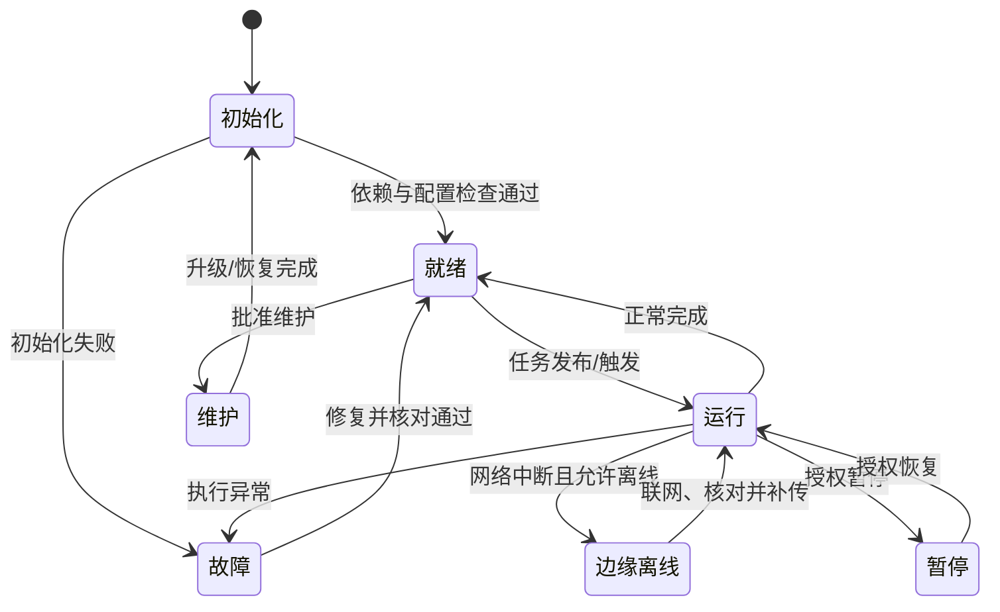
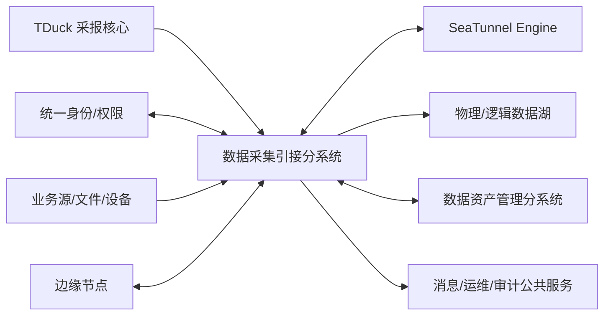

# 数据采集引接分系统规格说明（SSS）

| 项目 | 内容 |
| --- | --- |
| 文档号 | `CJYJ-SSS-001` |
| 版本/修订号 | V0.2 |
| 文档状态 | 需求分析稿，未建立需求基线 |
| 适用系统/软件 | 数据资源支撑系统 / 数据采集引接分系统（`CJYJ-CSCI`） |
| 密级 | 按项目密级标识，待总体单位确认（`TBC-COM-001`） |
| 编制单位 | 待项目确认 |
| 编写/审核/会签/批准 | 待项目任命后填写 |
| 编制日期 | 2026-07-19 |

## 修改页

| 版本 | 日期 | 修改原因 | 修改内容 | 修改人 |
| --- | --- | --- | --- | --- |
| V0.1 | 2026-07-19 | 正式进入需求分析阶段 | 按 GJB 438C-2021 附录 F 建立初版 SSS，分配合同功能、性能及总体约束 | 待签署 |
| V0.2 | 2026-07-19 | 文档评审意见处置、技术路线确认 | 纳入 TDuck 采报核心组件，补齐接口概要、状态转换、性能假设、公共服务和待确认项分级 | 待签署 |

## 目录

- 1 范围
- 2 引用文档
- 3 需求
- 4 合格性规定
- 5 需求可追踪性
- 6 注释
- 附录 A 合同需求追踪摘要
- 附录 B 待确认事项

# 1 范围

## 1.1 标识

本文档适用于数据资源支撑系统中的数据采集引接分系统，配置项标识为 `CJYJ-CSCI`，当前规格说明版本为 V0.2。正式发布号、产品名称和构建版标识在建立需求基线前由配置控制委员会确定。

## 1.2 系统概述

数据采集引接分系统用于对多源异构数据进行采报、在线引接、任务配置、数据探查、入湖、云边同步、协议适配和运行监控，为数据资源支撑系统提供统一的数据进入通道。

分系统具有采报与在线引接并存、批处理与实时处理并存、云边端协同、数据源和协议类型多、吞吐与时效约束强、安全保密要求高等特点。数据采报功能以 TDuck 受控版本为核心组件；数据在线引接、任务编排与执行基于 SeaTunnel-Web 与 Apache SeaTunnel 受控基线二次开发；元数据探查、拓扑和血缘信息通过接口与数据资产管理分系统的 OpenMetadata 能力协同。三类组件通过受控 API/事件和稳定标识映射集成，不直接互写内部数据库。

需方、用户、开发方、保障机构、当前及计划运行现场尚未在现有材料中完整标识，作为 `TBC-COM-002` 在需求评审前确认。

## 1.3 文档概述

本文档规定数据采集引接分系统的状态和方式、系统能力、外部与内部接口、内部数据、适应性、保密性、安全性、环境、质量、计算机资源、设计约束、人员、训练、保障、包装及其他需求，并给出合格性方法和双向追踪关系。

本文档按项目保密制度受控。未经授权不得复制、外传或在非受控环境处理；正文中的接口、地址、账号、证书和真实业务数据不得以明文方式补充。

## 1.4 与其他计划之间的关系

本文档受《数据采集引接与数据资产管理软件开发计划》约束，是 SDP、STP、STD、SSDD、SDD、IDD、DBDD、SPS 和 SVD 的需求输入。接口细节由《数据采集引接接口需求规格说明》补充；本文档与总体 SSS 的需求分配关系在第 5 章维护。

# 2 引用文档

| 编号/标识 | 文档名称 | 版本/日期 | 来源 |
| --- | --- | --- | --- |
| GJB 2786A-2009 | 军用软件开发通用要求 | 受控版待取得 | 项目标准库 |
| GJB 438C-2021 | 军用软件开发文档通用要求 | 2021 | `docs/rocket` |
| `BL-CONTRACT` | 合同技术要求分解 | 当前工作簿版本 | `docs/rocket/功能分解.xlsx` Sheet1 |
| `CJYJ-DECOMP` | 数据采集引接分系统功能分解 | 当前工作簿版本 | `docs/rocket/功能分解.xlsx` Sheet2 |
| `CJYJ-INDEX` | 数据采集引接软件指标 | 当前版本 | `docs/rocket/数据采集引接软件指标.md` |
| `SDP-INPUT` | 数据采集引接与数据资产管理软件开发计划 | V0.2 | `docs/1_数据采集引接与数据资产管理软件开发计划.md` |
| `CJYJ-IRS-001` | 数据采集引接接口需求规格说明 | V0.2 | 本阶段配套文档 |
| `TDUCK-OFFICIAL` | TDuck 官方仓库及功能/部署文档 | 在线资料，访问日期 2026-07-19 | 复用能力与产品形态分析输入，不作为验收证据 |

# 3 需求

需求标记格式为“需求标识、合格性方法、优先级/关键性、上级来源”。合格性方法代码见第 4 章。除明确标记为 P1/P2 的需求外，合同直接要求均为 P0。

## 3.1 要求的状态和方式

| 状态/方式 | 定义 | 允许的主要行为 |
| --- | --- | --- |
| 初始化 | 分系统启动、配置和依赖检查阶段 | 加载受控配置、校验依赖、恢复任务状态，不接收生产任务 |
| 就绪 | 依赖正常且可接受任务 | 创建、配置、发布、调度和查询任务 |
| 运行 | 一个或多个采集/引接任务执行 | 传输、转换、监控、告警、审计和指标采集 |
| 暂停 | 指定任务被授权暂停 | 保留检查点和上下文，不继续产生目标端写入 |
| 边缘离线 | 边缘节点与云端失联 | 本地采集、受控缓存、容量保护和恢复后补传 |
| 降级 | 部分非关键依赖不可用 | 保持可用主链路，标识受影响能力并告警 |
| 故障/恢复 | 发生不可继续执行的异常 | 停止受影响链路、保护数据、定位故障并执行恢复 |
| 维护 | 升级、迁移、备份或检修 | 限制新任务进入，保持审计和回退能力 |

**CJYJ-SSS-STATE-001 [I/T，P0，源：ZTYQ-GN-01-09]** 分系统应识别当前状态和方式，并保证任务操作、接口行为、告警和审计记录与状态一致。

**CJYJ-SSS-STATE-002 [T，P0，源：CCYJ-GN-08]** 分系统从边缘离线恢复到联网状态时，应按受控策略补传缓存数据，避免未授权丢弃、重复写入和顺序破坏。

**CJYJ-SSS-STATE-003 [T/I，P0，源：系统实现]** 分系统应拒绝未在批准状态转换规则中定义的转换，记录当前状态、请求状态、触发主体、原因和拒绝结果；维护态、故障态或已终止任务不得绕过校验直接进入运行态。

## 3.2 系统能力需求

### 3.2.1 数据采报任务管理

**CJYJ-SSS-CAP-001 [D/T，P0，源：CCYJ-GN-01]** 分系统应支持采集表单模板的创建、版本维护、发布、停用和复用，并对字段、类型、约束和样式进行配置。

**CJYJ-SSS-CAP-002 [T，P0，源：CCYJ-GN-01]** 分系统应对单字段及多字段关联规则执行数据校验，拒绝或标识不符合规则的数据并给出可理解原因。

**CJYJ-SSS-CAP-003 [T/A，P0，源：CCYJ-GN-01]** 分系统应识别潜在语义错误，给出纠正建议；自动纠正时应保留原值、规则/模型版本、纠正值和确认记录。

**CJYJ-SSS-CAP-004 [D/T，P0，源：CCYJ-GN-01]** 分系统应支持本地单条录入和批量填报，并支持数据导入、导出和上报全过程状态追踪。

**CJYJ-SSS-CAP-005 [T，P0，源：CCYJ-GN-01]** 分系统应按预设规则分配采集任务，支持人工调整、冲突提示、状态跟踪和分配结果审计。

**CJYJ-SSS-CAP-006 [D/T，P0，源：CCYJ-GN-01]** 分系统应支持典型采集场景工作模式和流程模板的配置、复用与版本控制。

**CJYJ-SSS-CAP-040 [I/T，P0，源：CCYJ-GN-01、复用决策]** 数据采报功能应以项目批准的 TDuck 受控版本为核心组件，复用其表单设计、发布、填写、数据收集、结果查询/导出以及经验证可用的 API、Webhook 和统计能力；每项复用能力仍应按本规格逐条验证，不得以产品说明替代合格性证据。

**CJYJ-SSS-CAP-041 [T/I，P0，源：CCYJ-GN-01、系统实现]** 分系统应维护项目采报任务、表单、表单版本、字段、填报批次、填报主体和结果与 TDuck 内部对象之间的稳定标识映射，并将发布、提交、修改、撤回、导入导出和失败补偿纳入统一鉴权、状态追踪与审计。

### 3.2.2 数据在线引接

**CJYJ-SSS-CAP-007 [T，P0，源：CCYJ-GN-02]** 分系统应支持数据库及适用数据源的全量在线引接和增量在线引接，并明确每个任务的增量位点和恢复点。

**CJYJ-SSS-CAP-008 [T，P0，源：CCYJ-GN-02]** 分系统应监测指定文件夹及子文件夹中文件的新增、修改和删除，并按策略执行实时或周期增量同步。

**CJYJ-SSS-CAP-009 [D/T，P0，源：CCYJ-GN-02、CCYJ-GN-13]** 分系统应对多数据源表执行结构、字段特征、数据分布和适用质量规则探查，并输出可追踪的探查结果。

### 3.2.3 引接任务配置管理

**CJYJ-SSS-CAP-010 [D/T，P0，源：CCYJ-GN-03、ZTYQ-GN-03-01]** 分系统应支持通过图形化或脚本方式配置引接模式、源端、转换、目标端、规则和运行参数，并对配置进行版本化校验。

**CJYJ-SSS-CAP-011 [D/T，P0，源：CCYJ-GN-03]** 分系统应支持实时触发和自定义频率的周期调度，并支持启用、停用、修改和冲突检查。

**CJYJ-SSS-CAP-012 [T，P0，源：CCYJ-GN-03]** 分系统应支持批量创建作业，以及在一个 ETL 任务中管理多张表的数据同步。

**CJYJ-SSS-CAP-013 [D/T，P0，源：CCYJ-GN-03]** 分系统应实时显示任务运行状态、汇总统计、错误告警和错误日志，并支持授权人员执行启动、暂停、终止、重试和恢复。

**CJYJ-SSS-CAP-014 [T，P0，源：ZTYQ-GN-03-02]** 分系统应按批准的采集引接规则自动执行处理流程，规则变更不得影响已运行实例的可追溯性。

### 3.2.4 数据湖管理

**CJYJ-SSS-CAP-015 [D/T，P0，源：CCYJ-GN-04]** 分系统应对源业务系统进行清查摸底，统计数据底数、分布和变化情况，并展示清查结果。

**CJYJ-SSS-CAP-016 [D/T，P0，源：CCYJ-GN-04]** 分系统应维护数据源单位、数据模型、数据库和数据源信息，支持启用、停用和注销等生命周期操作。

### 3.2.5 采集报告管理

**CJYJ-SSS-CAP-017 [D/T，P0，源：CCYJ-GN-05]** 分系统应支持采集报告模板设计、版本管理和按业务场景复用。

**CJYJ-SSS-CAP-018 [T，P0，源：CCYJ-GN-05]** 分系统应支持单篇、批量和周期性报告生成，并支持在线预览、批量导出和打包分发。

**CJYJ-SSS-CAP-019 [T，P0，源：CCYJ-GN-05]** 分系统应至少支持合同确认的 Excel、Word、PDF、CSV 输出格式，并对报告生成和分发操作进行鉴权和审计。

### 3.2.6 入湖管理

**CJYJ-SSS-CAP-020 [D/T，P0，源：CCYJ-GN-06]** 分系统应支持把数据复制、转换并持久化至数据湖的物理入湖方式。

**CJYJ-SSS-CAP-021 [D/T，P0，源：CCYJ-GN-06]** 分系统应支持不移动源数据、通过受控映射或虚拟化访问实现的逻辑入湖方式，并明确可用性、权限和源端依赖状态。

### 3.2.7 数据引接安全加密

**CJYJ-SSS-CAP-022 [T/I，P0/保密关键，源：CCYJ-GN-07]** 分系统应对采集端、边缘节点、云端及目标端之间的传输链路提供身份鉴别、完整性保护和加密保护。

**CJYJ-SSS-CAP-023 [T/I，P0/保密关键，源：CCYJ-GN-07]** 分系统不得在界面、接口、日志、报告或配置库中暴露明文口令、令牌、证书私钥或密钥材料。

### 3.2.8 云边协同与边缘离线缓存

**CJYJ-SSS-CAP-024 [T，P0，源：CCYJ-GN-08]** 分系统应支持云端与边缘节点之间的全量和增量数据同步、任务指令下发及执行状态回传。

**CJYJ-SSS-CAP-025 [T/A，P0，源：CCYJ-GN-08]** 边缘节点应支持本地持久化缓存、离线暂存、优先级排序、容量阈值和恢复补传；缓存溢出策略须可配置、可告警和可审计。

### 3.2.9 数据采集引接态势

**CJYJ-SSS-CAP-026 [D/T，P0，源：CCYJ-GN-09]** 分系统应汇聚采集任务、引接链路、数据源状态、流向、流量、质量和设备健康等运行数据并提供态势展示。

**CJYJ-SSS-CAP-027 [D/A，P0，源：CCYJ-GN-09]** 分系统应统计采集成功率、处理时延、任务完成率等效率指标，支持按时间、单位、数据源、链路和任务筛选。

### 3.2.10 协议解析与转换

**CJYJ-SSS-CAP-028 [T，P0，源：CCYJ-GN-10]** 分系统应支持合同确认的多源异构协议和数据格式解析、合法性校验、转换及版本兼容。

**CJYJ-SSS-CAP-029 [D/T，P0，源：CCYJ-GN-10]** 分系统应对协议规则和版本进行受控配置，未知或不合法报文不得未经处置直接进入目标数据域。

### 3.2.11 操作回放与故障定位

**CJYJ-SSS-CAP-030 [D/T，P0，源：CCYJ-GN-11]** 分系统应记录全链路操作行为、数据读取快照引用、执行流程、时序、任务和数据轨迹。

**CJYJ-SSS-CAP-031 [D/T/A，P0，源：CCYJ-GN-11]** 分系统应按时间轴重构授权操作和任务执行过程，并能区分采集端、链路、数据源和系统组件等故障域。

### 3.2.12 采集引接链路统一管理

**CJYJ-SSS-CAP-032 [D/T，P0，源：CCYJ-GN-12]** 分系统应统一配置物理路由、逻辑关系、带宽配额和传输优先级，并展示链路健康和负载。

**CJYJ-SSS-CAP-033 [T/A，P0，源：CCYJ-GN-12]** 分系统应根据批准策略执行链路动态调度、故障切换和性能优化，且保留调度原因和结果。

### 3.2.13 数据拓扑智能感知

**CJYJ-SSS-CAP-034 [D/T，P0，源：CCYJ-GN-13]** 分系统应自动扫描多源数据资产，形成数据源、任务、链路和目标之间的拓扑关系并可视化展示。

**CJYJ-SSS-CAP-035 [T/I，P0，源：CCYJ-GN-13、ZCGL-GN-01]** 分系统应向数据资产管理分系统发布可追踪的任务、表级和可获得的字段级血缘信息。

### 3.2.14 边缘终端低功耗接入

**CJYJ-SSS-CAP-036 [T/A，P0，源：CCYJ-GN-14]** 分系统应支持合同确认的低功耗边缘终端接入、轻量通信、数据预处理和安全验证。

**CJYJ-SSS-CAP-037 [T，P0，源：CCYJ-GN-14]** 边缘端应支持异常值、空值和重复数据的受控预处理，并记录处理规则版本和统计结果。

### 3.2.15 有效期校验与暂存周期

**CJYJ-SSS-CAP-038 [D/T，P0，源：CCYJ-GN-15]** 分系统应按数据源、数据类型、业务部门及合同确认维度配置数据有效期和暂存周期规则。

**CJYJ-SSS-CAP-039 [T/A，P0，源：CCYJ-GN-15]** 分系统应在采集引接过程中校验数据时效性，对过期、临期和规则缺失数据执行批准的接收、隔离、告警或拒绝策略。

### 3.2.16 性能和容量

**CJYJ-SSS-PERF-001 [T，P0，源：CJYJ-XN-01]** 在批准的测试环境和“不包括大字段”的数据集上，全量在线引接速度应不低于 1000 条/s，增量在线引接速度应不低于 500 条/s；内部设计目标分别为 1500 条/s 和 700 条/s。

**CJYJ-SSS-PERF-002 [T，P0，源：CJYJ-XN-02]** 对不大于 100MB 的 Excel、DMP、Word 文件，离线导入时间应不超过 90s；对不大于 100MB 的 SQL 文件应不超过 150s。130MB/60s/100s 为内部设计目标，不能替代合同判据。

**CJYJ-SSS-PERF-003 [T，P0，源：CJYJ-XN-03]** 单个在线引接任务启动时间应不超过 5s，分系统应管理不少于 1000 个在线引接任务；内部设计目标为不超过 3s、管理不少于 1500 个任务。

**CJYJ-SSS-PERF-004 [T，P0，源：CJYJ-XN-04]** 低实时数据增量发现时间应不超过 10min，高实时数据增量发现时间应不超过 5s；内部设计目标分别为 6min 和 3s。

**CJYJ-SSS-PERF-005 [T，P0，源：CJYJ-XN-05]** 从异常事件被监测点确认发生到告警服务发出告警的时间应不超过 5s；内部设计目标为不超过 3.5s。

**CJYJ-SSS-PERF-006 [T/A，P0，源：CJYJ-XN-06]** 在批准的典型有线网络条件下，对单行 200B 的结构化小数据，至少一种关系型数据库间的有效传输速度应不低于 100MB/s；内部设计目标为不低于 200MB/s。有效载荷、落盘边界、并发、批量、事务及压缩口径须在 STP/STD 中经需方确认。

**CJYJ-SSS-PERF-007 [I/A，P0，源：性能可测试性]** SRR 前应批准下表中的默认测试假设或其替代值；未关闭的红色性能假设不得进入需求基线。STP/STD 可细化但不得改变合同计量边界，变更须履行需求变更程序。

| 指标 | SRR 默认测试假设（待需方确认） |
| --- | --- |
| PERF-001 | 记录口径按成功提交至目标端的非大字段业务记录计；源、目标、并发任务数、批大小和事务策略固定并记录 |
| PERF-002 | 文件大小按原始文件字节数计；从服务端确认接收完整文件开始，到数据完成校验并形成可查询导入结果结束；不含人工上传网络时间 |
| PERF-003 | “启动时间”从服务端接受有效启动请求到执行引擎进入运行/可处理状态；1000 个任务指可登记并受控管理的有效任务总数，另行记录同时运行数 |
| PERF-004 | 从源端产生可识别增量到分系统发现并记录该增量；源端时钟与系统时钟同步，轮询/CDC 模式分别记录 |
| PERF-005 | 从监测点生成带时间戳的异常事件到告警服务确认发出；不含外部短信、邮件运营商送达时间 |
| PERF-006 | 单行有效载荷 200B；从源端成功读取到目标端持久化提交确认，统计净业务载荷；网络带宽、时延、压缩、批量、并发和事务策略固定并记录 |

## 3.3 系统外部接口需求

### 3.3.1 接口标识和接口图

外部接口概要如下，接口详细行为、异常和合格性要求见 `CJYJ-IRS-001`。

| SSS 接口 | 对端与方向 | 关键数据流 | 本分系统责任边界 |
| --- | --- | --- | --- |
| CJYJ-IF-001 | 统一身份/权限平台，双向 | 身份令牌、用户组织、授权结果 | 发起鉴权、执行服务端权限控制；不负责外部身份生命周期 |
| CJYJ-IF-002 | SeaTunnel Engine，双向 | 作业定义、控制、状态、日志、指标 | 转换和提交受控配置、核对结果；不修改引擎内部状态库 |
| CJYJ-IF-003 | 业务数据库/消息/API/日志源，输入或双向 | 数据记录、结构、CDC 位点、错误 | 最小权限读取、位点恢复和类型转换；不负责源系统数据质量修复 |
| CJYJ-IF-004 | 文件/对象存储/TDuck，输入或双向 | 表单结果、文件、摘要、解析结果 | 校验、导入、批次追踪；TDuck 对象经适配层映射，不直连其内部库 |
| CJYJ-IF-005 | 物理数据湖，输出 | 数据批次、分区、提交结果 | 写入并确认提交；目标湖负责持久化服务能力 |
| CJYJ-IF-006 | 逻辑湖/虚拟化平台，双向 | 数据源引用、逻辑对象、状态 | 注册、映射和失效通知；不复制无须物化的数据 |
| CJYJ-IF-007 | 数据资产管理分系统，双向 | 元数据、任务、运行、血缘 | 采集侧发布事实并处理回执；OpenMetadata 是资产侧内部实现，不作为本接口直接对端 |
| CJYJ-IF-008 | 边缘采集节点，双向 | 任务、配置、心跳、状态、批次 | 下发受控任务、接收并去重补传数据 |
| CJYJ-IF-009 | 设备/网关，输入或双向 | 设备报文、时间、质量标记 | 通过批准适配器采集；设备控制默认不在范围内 |
| CJYJ-IF-010 | 消息告警平台，输出 | 告警、恢复、处置链接 | 生成并可靠投递消息；外部平台负责最终通道送达 |
| CJYJ-IF-011 | 统一运维/综合态势，输出 | 健康、资源、作业和告警指标 | 提供真实、带口径指标；总体平台负责跨系统汇总 |
| CJYJ-IF-012 | 安全审计平台，输出 | 安全事件、管理操作、访问审计 | 生成、缓冲和补传审计事件；审计平台负责集中留存 |

### 3.3.2～3.3.13 外部接口详细需求

本条按接口编号引用《数据采集引接接口需求规格说明》3.2～3.13。SSS 概要规定责任边界，IRS 规定可验证的交互行为；任一文档变更均应执行双向影响分析。接口实体未最终确定的特性以受控假设或“当外部实体……时，本分系统应……”形式表达，不对范围外实体施加未经确认的需求。

## 3.4 系统内部接口需求

**CJYJ-SSS-INT-001 [I/T，P1，源：系统实现]** 采集门户、任务管理、执行适配、边缘协同、报告、审计和 OpenMetadata 适配软件单元之间应使用版本化接口，并能关联同一追踪号、用户、任务、配置版本和运行实例。

**CJYJ-SSS-INT-002 [T，P0，源：CCYJ-GN-03、CCYJ-GN-11]** 内部异步接口应具备幂等、顺序、重试、超时、重复检测和失败转储要求；不得因消息重复导致未授权重复写入。

## 3.5 系统内部数据需求

**CJYJ-SSS-DATA-001 [I/T，P0，源：CCYJ-GN-03]** 分系统应保存数据源、任务定义、任务版本、调度、实例、检查点、状态、指标、告警和日志之间的关联关系。

**CJYJ-SSS-DATA-002 [I/T，P0/保密关键，源：CCYJ-GN-07、CCYJ-GN-11]** 审计数据应包含主体、时间、来源、对象、操作、结果、前后值摘要和追踪号，并具备完整性保护、访问控制和保留策略。

**CJYJ-SSS-DATA-003 [I/T，P0，源：CCYJ-GN-08、CCYJ-GN-15]** 边缘缓存和暂存数据应记录来源、采集时间、有效期、优先级、校验状态、同步状态和完整性校验值。

## 3.6 适应性需求

**CJYJ-SSS-ADP-001 [D/T，P0，源：ZTYQ-GN-01-09]** 分系统应支持云、边、端三种部署环境；云侧支持容器化部署，边/端侧支持服务裸部署。

**CJYJ-SSS-ADP-002 [D/T，P1，源：CCYJ-GN-03、CCYJ-GN-15]** 数据源、调度、缓存、有效期、告警、报告和接口参数应通过受控配置适配现场，不得要求修改产品基线代码。

## 3.7 保密性需求

**CJYJ-SSS-SEC-001 [I/T，P0/保密关键，源：CCYJ-GN-07]** 分系统应执行统一身份鉴别、最小权限、会话控制和服务身份鉴别；所有权限限制必须在服务端强制实施。

**CJYJ-SSS-SEC-002 [I/T，P0/保密关键，源：CCYJ-GN-07]** 数据传输、敏感数据存储、密钥管理和密码算法应采用需方批准的安全/密码方案；具体算法和设备列入 `TBC-CJYJ-SEC-001`。

**CJYJ-SSS-SEC-003 [I/T，P0/保密关键，源：CCYJ-GN-11]** 安全相关操作、权限变更、密钥引用、任务发布、数据导出和删除应产生可查询、可校验的审计记录。

**CJYJ-SSS-SEC-004 [T/I/A，P0/保密关键，源：安全审计完整性]** 审计记录应采用项目批准的防未授权修改、删除和插入机制实施完整性保护，并能够检测完整性破坏、告警和保留核查证据；具体密码算法或链式结构由安全设计在 `TBC-CJYJ-SEC-001` 关闭后确定。

## 3.8 安全性需求

本分系统为软件系统，不直接控制危险物品或高能设备。为防止软件异常造成数据或设备风险：

**CJYJ-SSS-SAFE-001 [T，P0，源：系统实现]** 异常终止、超限、存储耗尽或网络抖动时，分系统应进入可判定的安全状态，不得继续执行状态不明的写入。

**CJYJ-SSS-SAFE-002 [D/T，P1，源：系统实现]** 对删除源/目标数据、覆盖写入、清空缓存和终止关键任务等高影响操作，应提供二次确认、授权、审计和恢复/补偿措施。

## 3.9 系统环境适应性需求

**CJYJ-SSS-ENV-001 [D/T，P0，源：XMGS-01-10、ZTYQ-GN-01-02]** 分系统应适配需方批准的国产自主可控计算机、操作系统、数据库和基础软件环境。

**CJYJ-SSS-ENV-002 [T，P0，源：ZTYQ-GN-01-09]** 分系统应在批准的云、边、端目标环境完成安装、启动、运行、升级、回滚和恢复验证。

## 3.10 其他质量特性需求

**CJYJ-SSS-QUAL-001 [T/A，P0，源：CCYJ-GN-12]** 单个非共享故障不应导致全部无关采集链路失效；故障域应可隔离、定位和恢复。

**CJYJ-SSS-QUAL-002 [I/A，P1，源：系统实现]** 软件应采用模块化、可扩展接口和受控插件机制，企业能力不得无边界散布修改 SeaTunnel-Web 上游核心。

**CJYJ-SSS-QUAL-003 [T，P1，源：系统实现]** 关键处理应支持可重复测试、故障注入、监控观测和版本回溯。

## 3.11 计算机资源需求

### 3.11.1 计算机硬件需求

目标硬件型号、处理器架构、内存、磁盘、网卡和边缘终端规格尚待总体单位提供，列为 `TBC-CJYJ-HW-001`。在确认前，B0 原型必须记录实际硬件并禁止把原型结果直接替代目标环境结论。

### 3.11.2 计算机硬件资源利用需求

**CJYJ-SSS-RES-001 [T/A，P1，源：系统实现]** 在性能合格性测试中应采集 CPU、内存、磁盘、网络、连接、线程和队列使用率，并证明达到合同指标时无持续资源耗尽、失控增长或不可恢复拥塞。

### 3.11.3 计算机软件需求

**CJYJ-SSS-RES-002 [I/T，P0，源：XMGS-01-10、复用决策]** 分系统应使用受控版本的 TDuck、SeaTunnel-Web、Apache SeaTunnel、Java、Node.js、数据库、消息/缓存、OpenMetadata 适配客户端和操作系统；名称、版本、哈希、许可证和漏洞状态应纳入兼容矩阵与 SBOM。

### 3.11.4 计算机通信需求

**CJYJ-SSS-RES-003 [T/A，P0，源：CJYJ-XN-04～06]** 通信环境应支持在线引接、云边同步、告警和小数据传输的时效/吞吐要求；网络拓扑、带宽、时延、丢包、峰值和诊断条件在 STP/STD 中固化。

## 3.12 设计和构造的约束

**CJYJ-SSS-CON-001 [I，P0，源：复用决策]** 数据在线引接、任务编排与执行管理应基于 SeaTunnel-Web 企业 Fork 和 Apache SeaTunnel 受控基线二次开发。

**CJYJ-SSS-CON-002 [I，P0，源：项目治理]** 扩展优先采用外部集成、独立模块、既有 SPI 或通用扩展点；直接修改上游核心时必须登记补丁、删除条件和回归测试。

**CJYJ-SSS-CON-003 [I/T，P0，源：ZTYQ-GN-01-09]** 云侧采用容器化部署，边/端侧支持裸部署；两类交付物均应可离线、可重复构建和校验。

**CJYJ-SSS-CON-004 [I/T/A，P0，源：复用决策]** 数据采报功能应基于项目批准的 TDuck 受控版本二次开发；优先采用公开 API、Webhook、插件或独立适配服务，确需修改上游核心时应登记补丁、许可证影响、升级合并策略和回归测试。TDuck 不得绕过统一身份、权限、保密和审计控制。

## 3.13 人员相关需求

**CJYJ-SSS-HUM-001 [D，P1，源：CCYJ-GN-03]** 分系统应至少支持系统管理员、数据源管理员、任务设计人员、任务审批/发布人员、运维人员、审计人员和只读用户等职责分离角色。

**CJYJ-SSS-HUM-002 [D/T，P1，源：系统实现]** 界面应提供清晰状态、错误原因、恢复建议和高影响操作提示，避免仅以内部异常栈作为用户反馈。

## 3.14 训练相关需求

**CJYJ-SSS-TRN-001 [D/I，P1，源：软件使用准备]** 交付时应提供管理员、任务设计人员、运维人员和普通用户分角色培训材料、样例任务和操作演示。

## 3.15 综合保障需求

**CJYJ-SSS-SUP-001 [I/T，P0，源：软件移交准备]** 应提供安装、升级、回滚、备份恢复、监控告警、故障处理、依赖与许可证、已知问题和保障资源说明。

**CJYJ-SSS-SUP-002 [T，P1，源：系统实现]** 产品应支持从上一批准版本升级，并能在批准的恢复点回退应用和恢复数据。

## 3.16 包装需求

**CJYJ-SSS-PKG-001 [I，P0，源：软件移交准备]** 交付包应包含受控源代码、构建脚本、依赖、安装包/镜像、数据库迁移、配置模板、SBOM、许可证、校验和及适用文档，并按密级和介质管理规定标识。

## 3.17 其他需求

**CJYJ-SSS-OTH-001 [I，P0，源：GJB 438C]** 本分系统研制文档应按批准的 GJB 438C 文档剪裁表编制、评审、修改和基线化。

**CJYJ-SSS-OTH-002 [I，P0，源：GJB 2786A]** 需求、设计、代码、测试、问题/更改和版本交付物之间应保持双向追踪。

### 3.17.1 公共服务依赖清单

| 公共服务 | 使用责任 | 故障时最低行为 | 详细接口 |
| --- | --- | --- | --- |
| 统一身份、组织与权限 | 统一鉴权、最小权限、撤权 | 高风险写操作拒绝，只读降级须批准 | CJYJ-IF-001 |
| 消息通知 | 告警和恢复通知 | 主流程不回滚，进入可监控补偿队列 | CJYJ-IF-010 |
| 统一运维与可观测性 | 健康、指标和追踪汇聚 | 本地保留必要指标并告警 | CJYJ-IF-011 |
| 安全审计 | 集中审计留存 | 受保护缓冲、告警、恢复后补传 | CJYJ-IF-012 |
| 文件/对象存储 | 采报附件、离线文件和报告制品 | 拒绝不完整提交，支持续传/补偿 | CJYJ-IF-004 |
| 搜索服务（如采用） | 任务、报告和日志检索 | 明示索引时效或降级至权威查询 | 设计阶段分配 |

公共服务是否作为独立软件单元由总体架构批准；在此之前两个 CSCI 不得各自复制实现同名平台能力。

## 3.18 需求的优先顺序和关键性

- P0：合同直接要求、总体约束、性能、部署、保密、安全和交付要求，V1.0 验收前必须满足。
- P1：为满足合同而导出的质量、维护、可测试和人员要求，原则上随 V1.0 交付；剪裁需 CCB 批准。
- P2：增强和优化需求，不得占用 P0/P1 的合格性资源。
- 标记“保密关键”的需求必须进行专项安全分析、独立测试和质量保证检查。

# 4 合格性规定

| 代码 | 方法 | 定义 |
| --- | --- | --- |
| D | 演示 | 通过可见功能操作直接证明需求 |
| T | 测试 | 使用测试环境、仪器或专用工具采集结果 |
| A | 分析 | 对测试、日志、监控或统计数据处理并判定 |
| I | 审查 | 审查代码、配置、文档、制品或现场状态 |
| S | 特殊方法 | 第三方测评、密码检测、国产化适配等经批准方法 |

每个第 3 章需求的合格性方法已在需求标识后注明。正式 STP/STD 应为每项需求指定测试层级、环境、前置条件、输入、步骤、期望结果、原始记录和判定规则。合同性能要求必须使用 T，必要时辅以 A；仅靠审查或演示不得判定性能合格。

# 5 需求可追踪性

本文件为子系统规格说明，本章适用。

## 5.1 子系统需求到上级需求

第 3 章每项需求通过“源”字段追踪到合同标识、总体需求或经批准的系统实现决策。接口需求追踪到 `CJYJ-IRS-001`；复用和派生需求应在需求评审时关联批准的架构/复用决策。

## 5.2 上级需求到子系统需求

合同 `CCYJ-GN-01`～`CCYJ-GN-15`、`CJYJ-XN-01`～`CJYJ-XN-06`、`XMGS-01-10`、`ZTYQ-GN-01-02`、`ZTYQ-GN-01-09`、`ZTYQ-GN-03-01` 和 `ZTYQ-GN-03-02` 均已在第 3 章获得分配。正式需求基线前应由需求工具生成双向追踪报告，不能只依赖本文档人工表格。

# 6 注释

## 6.1 术语和缩略语

| 缩略语 | 含义 |
| --- | --- |
| CSCI | 计算机软件配置项 |
| CDC | 变更数据捕获 |
| ETL | 抽取、转换、加载 |
| SSS | 系统/子系统规格说明 |
| IRS | 接口需求规格说明 |
| SDP/STP/STD/STR | 软件开发计划/软件测试计划/软件测试说明/软件测试报告 |
| SBOM | 软件物料清单 |
| CCB | 配置控制委员会 |

## 6.2 需求表述约定

“应”表示必须满足的可验证需求；“内部设计目标”用于形成性能裕量，不改变合同最低判据；“待确认”事项不得进入批准基线，必须在附录 B 所列关闭条件满足后转为确定内容。

# 附录 A 合同需求追踪摘要

| 上级标识 | 本文主要需求范围 |
| --- | --- |
| `CCYJ-GN-01`～`CCYJ-GN-06` | `CAP-001`～`CAP-021`、`CAP-040`～`CAP-041` |
| `CCYJ-GN-07`～`CCYJ-GN-10` | `CAP-022`～`CAP-029` |
| `CCYJ-GN-11`～`CCYJ-GN-15` | `CAP-030`～`CAP-039` |
| `CJYJ-XN-01`～`CJYJ-XN-06` | `PERF-001`～`PERF-006` |
| 国产化与云边端总体要求 | `ADP-001`、`ENV-001`～`ENV-002`、`CON-003` |
| 数据处理自动化总体要求 | `CAP-010`、`CAP-014` |

# 附录 B 待确认事项

| 标识 | 等级 | 待确认内容 | 责任方/关闭点 |
| --- | --- | --- | --- |
| `TBC-COM-001` | 红/SRR 阻塞 | 文档及软件密级、标识和载体要求 | 总体单位/SRR 前 |
| `TBC-COM-002` | 红/SRR 阻塞 | 需方、用户、开发方、保障机构和运行现场 | 项目负责人/SRR 前 |
| `TBC-CJYJ-SEC-001` | 红/SRR 阻塞 | 批准的密码应用边界、算法选择责任、设备、证书和检测要求 | 安全保密负责人/SRR 前 |
| `TBC-CJYJ-TDUCK-001` | 红/SRR 阻塞 | TDuck 产品形态、受控版本、源代码/构建可得性、许可证、离线部署和安全适用性 | 软件/配置/质量组/SRR 前 |
| `TBC-CJYJ-HW-001` | 黄/PDR 前关闭 | 云、边、端目标硬件和国产基础软件清单 | 总体单位/PDR 前 |
| `TBC-CJYJ-IF-001` | 红/SRR 阻塞 | 外部数据源、专用协议、字典、消息和地图接口清单 | 接口协调组/SRR 前 |
| `TBC-CJYJ-PERF-001` | 红/SRR 阻塞 | PERF-001～006 默认测试假设及 200B 小数据传输计量边界 | 需方与测试负责人/SRR 前 |
| `TBC-CJYJ-SHEET1-001` | 红/SRR 阻塞 | Sheet1 第 239～240 行“综合态势展示≤3秒、系统日志100万条≤5秒”的配置项归属、标识和对 CJYJ-CSCI 的影响 | 合同/总体/需求组/SRR 前 |

# 附录 C 来源标识字典

| 来源标识 | 来源与含义 | 基线要求 |
| --- | --- | --- |
| `CCYJ-GN-*`、`CJYJ-XN-*` | 合同 Sheet1/Sheet2 中数据采集引接功能和性能指标 | 合同受控基线 |
| `ZCGL-GN-*` | 合同中数据资产管理功能指标；仅用于跨分系统协同追踪 | 合同受控基线 |
| `ZTYQ-GN-*` | Sheet1 总体要求中分配到本分系统的功能/部署约束 | SRR 前由总体需求库确认标题和版本 |
| `XMGS-01-10` | Sheet1 项目概述/总体国产化与软件环境约束 | SRR 前由总体需求库确认标题和版本 |
| `系统实现`、`复用决策` | 为满足上级需求派生的软件实现或 COTS/OSS 复用约束 | 关联批准的架构/复用分析记录 |
