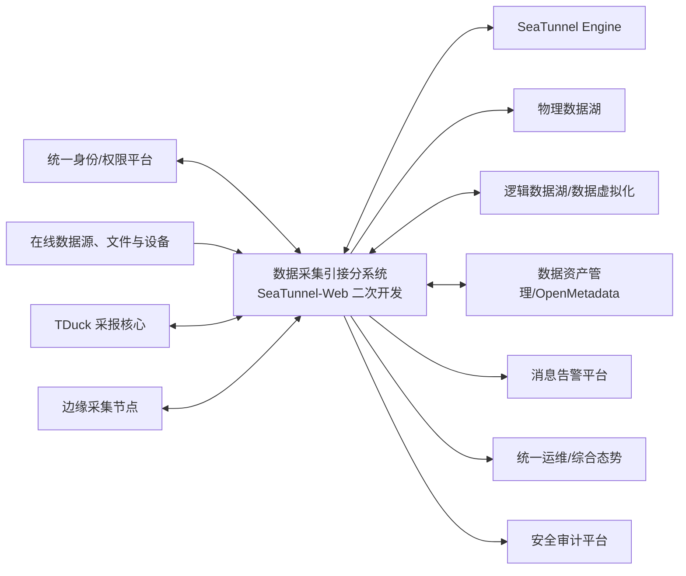

# 数据采集引接分系统接口需求规格说明（IRS）

| 项目 | 内容 |
|---|---|
| 文档标识 | CJYJ-IRS-001 |
| 软件/分系统标识 | CJYJ-CSCI |
| 版本 | V0.2 |
| 状态 | 需求分析阶段初稿 |
| 密级 | 按项目保密规定确定（TBC） |
| 编制/审核/批准 | 待签署 |
| 日期 | 2026-07-19 |

## 修改页

| 版本 | 日期 | 修改章节 | 修改说明 | 修改人 | 审核人 |
|---|---|---|---|---|---|
| V0.1 | 2026-07-19 | 全文 | 依据合同指标、功能拆解和 GJB 438C 附录 G 建立接口需求基线初稿 | 待定 | 待定 |
| V0.2 | 2026-07-19 | 第 1、3、5、6 章及附录 | 纳入 TDuck 采报接口，修正需求追踪，增加接口性能/可用性假设和跨分系统责任引用 | 待定 | 待定 |

## 目录

- [1 范围](#1-范围)
- [2 引用文档](#2-引用文档)
- [3 需求](#3-需求)
- [4 合格性规定](#4-合格性规定)
- [5 需求可追踪性](#5-需求可追踪性)
- [6 注释](#6-注释)

# 1 范围

## 1.1 标识

本文档适用于数据采集引接分系统（软件配置项标识：`CJYJ-CSCI`），文档标识为 `CJYJ-IRS-001`。本文档当前版本为 V0.2，作为需求分析阶段接口需求基线的评审输入；经评审、问题闭环和配置控制后形成受控版本。

## 1.2 系统概述

数据采集引接分系统负责表单采报以及关系型数据库、文件、消息、接口、日志和边缘设备等数据的批量、实时、离线与云边协同采集，并将数据写入物理数据湖、逻辑数据湖或约定目标端。数据采报功能以 TDuck 受控版本为核心组件；在线引接和执行管理基于 SeaTunnel-Web/Apache SeaTunnel 二次开发；两者通过项目适配层接入统一身份、审计、任务标识和数据资产管理能力。

本文档规定该分系统与外部系统、设备及相邻软件之间的接口需求。接口的详细字段长度、枚举、地址、证书、端口和部署参数在设计阶段通过接口设计说明或接口控制文件（ICD）固化。

## 1.3 文档概述

本文档依据 GJB 438C《军用软件开发文档通用要求》附录 G 的 IRS 结构编制，供需方确认、系统设计、软件设计、集成和合格性测试使用。本文档对尚未明确的外部系统型号、协议版本和安全参数以 `TBC` 标识，并在第 6 章集中管理。

# 2 引用文档

| 序号 | 文档 | 版本/日期 | 用途 |
|---|---|---|---|
| 1 | GJB 438C《军用软件开发文档通用要求》 | 项目适用版本 | IRS 内容和格式依据 |
| 2 | GJB 2786A《军用软件开发通用要求》 | 项目适用版本 | 软件生命周期及评审管理依据 |
| 3 | 项目合同及技术协议 | 当前受控版 | 接口相关合同需求来源 |
| 4 | 数据采集引接分系统规格说明（SSS） | CJYJ-SSS-001 V0.2 | 上层需求和接口边界 |
| 5 | 数据采集引接软件功能与性能指标拆解材料 | 当前工作版 | 功能和性能需求来源 |
| 6 | SeaTunnel-Web/SeaTunnel 项目基线说明 | 选型版本待定 | 二次开发接口约束 |
| 7 | TDuck 官方仓库及功能/部署文档 | 在线资料，访问日期 2026-07-19 | TDuck 产品形态、API/Webhook 和集成能力分析输入 |

当引用文件存在版本冲突时，按合同、经批准的项目基线和变更控制结论执行。

# 3 需求

除非另有说明，本章每项带唯一标识的陈述均为可验证需求。“应”表示强制要求；“宜”表示建议；“可”表示允许。

## 3.1 接口标识和接口图

| 接口标识 | 接口名称 | 对端 | 方向 | 主要用途 |
|---|---|---|---|---|
| CJYJ-IF-001 | 统一身份、组织与授权接口 | 统一身份认证/权限平台 | 双向 | 登录认证、用户组织同步、授权校验 |
| CJYJ-IF-002 | SeaTunnel Engine 接口 | SeaTunnel Engine | 双向 | 作业提交、控制、状态、日志和指标获取 |
| CJYJ-IF-003 | 在线数据源与 CDC 接口 | 业务数据库、消息、API、日志源 | 双向/输入 | 批量、实时和增量采集 |
| CJYJ-IF-004 | TDuck 采报、文件与对象存储接口 | TDuck、文件系统、对象存储、离线介质导入服务 | 双向/输入 | 表单/采报结果同步、文件探查、上传、解析和导入 |
| CJYJ-IF-005 | 物理数据湖接口 | 数据湖存储与目录服务 | 输出 | 物理写入、分区和提交结果 |
| CJYJ-IF-006 | 逻辑数据湖接口 | 数据虚拟化/联邦查询平台 | 双向 | 注册逻辑数据源、目录映射和连通性检查 |
| CJYJ-IF-007 | 数据资产管理接口 | 数据资产管理分系统（ZCGL-CSCI） | 双向 | 元数据、血缘、技术状态和任务关系同步 |
| CJYJ-IF-008 | 云边协同节点接口 | 边缘采集节点/边缘管理服务 | 双向 | 任务下发、配置同步、状态和结果回传 |
| CJYJ-IF-009 | 边缘设备协议接口 | 传感器、装备、网关等 | 输入/双向 | 设备数据采集与连接状态管理 |
| CJYJ-IF-010 | 消息告警接口 | 消息中心/通知服务 | 输出 | 异常、超时、失败和恢复通知 |
| CJYJ-IF-011 | 总体运维与态势接口 | 统一运维/综合态势平台 | 输出 | 服务健康、资源、作业和告警指标上报 |
| CJYJ-IF-012 | 安全审计接口 | 安全审计/日志平台 | 输出 | 安全事件、管理操作和访问审计上报 |

- **CJYJ-IRS-GEN-001**：所有对外接口应具有唯一接口标识、受控版本和责任方，并维护兼容性说明。【优先级：高；关键性：关键】
- **CJYJ-IRS-GEN-002**：同步服务接口请求应至少携带接口版本、请求标识、调用方标识、时间戳和业务载荷；涉及敏感数据时应携带或关联安全标记。【优先级：高；关键性：关键】
- **CJYJ-IRS-GEN-003**：接口响应应至少包含请求标识、处理结果、规范化错误码、错误描述和服务端时间戳。【优先级：高；关键性：关键】
- **CJYJ-IRS-GEN-004**：跨系统调用应支持超时、限流、幂等或去重、失败重试及熔断降级中的适用机制，且不得因无限重试造成数据重复或资源耗尽。【优先级：高；关键性：关键】
- **CJYJ-IRS-GEN-005**：接口传输应采用项目批准的身份鉴别、访问控制、完整性保护和传输保密机制，口令、令牌及密钥不得以明文记录。【优先级：高；关键性：关键】
- **CJYJ-IRS-GEN-006**：接口调用、配置变更、失败重试和人工补偿应形成可关联的日志和审计记录，统一关联标识应贯穿任务、作业和数据批次。【优先级：高；关键性：关键】
- **CJYJ-IRS-GEN-007**：接口时间字段应采用项目统一时区和精度，分布式节点时钟偏差超过批准阈值时应告警。【优先级：中；关键性：一般】
- **CJYJ-IRS-GEN-008**：接口数据格式、字符集、数值精度、空值语义和安全分级规则应在 ICD 中明确，并经双方评审确认。【优先级：高；关键性：关键】
- **CJYJ-IRS-GEN-009**：每个接口在进入基线前应确定预期调用/数据量级、可用性目标、连接与请求超时、重试上限、断连容忍时间和降级语义；附录 B 的数值仅为容量设计起始假设，未经责任双方批准不得作为合同验收值。【优先级：高；关键性：关键】

## 3.2 CJYJ-IF-001 统一身份、组织与授权接口

接口类型为软件服务接口，采用项目统一认证协议或受控 REST 接口；具体协议版本为 TBC。

- **CJYJ-IRS-IAM-001**：分系统应通过统一身份接口完成用户身份鉴别，不得在业务模块中保存可逆用户口令。【追踪：CJYJ-SSS-SEC-001】
- **CJYJ-IRS-IAM-002**：分系统应接收或按需查询用户、组织、岗位和角色的唯一标识及有效状态，并处理停用和删除状态。【追踪：CJYJ-SSS-SEC-001、HUM-001】
- **CJYJ-IRS-IAM-003**：授权接口不可用时，分系统应拒绝新增高风险操作；对已登录用户仅允许执行经批准的降级操作，并记录审计日志。【追踪：CJYJ-SSS-SEC-001、SEC-003】
- **CJYJ-IRS-IAM-004**：身份令牌过期、撤销或校验失败时，分系统应终止相应会话并返回统一鉴权错误码。

## 3.3 CJYJ-IF-002 SeaTunnel Engine 接口

接口类型为软件服务及运行控制接口，承载作业配置、提交、停止、状态查询、日志与指标获取。

- **CJYJ-IRS-ENG-001**：分系统应将经校验的作业定义转换为所选 SeaTunnel 基线支持的受控配置，并记录平台任务标识与引擎作业标识的映射。【追踪：CJYJ-SSS-CAP-010、CAP-012、CAP-014】
- **CJYJ-IRS-ENG-002**：作业提交接口应支持提交幂等控制，重复请求不得产生未被识别的重复作业。
- **CJYJ-IRS-ENG-003**：分系统应查询或接收作业排队、运行、成功、失败、取消和未知状态，并将未知或冲突状态标记为异常待核查。【追踪：CJYJ-SSS-CAP-013】
- **CJYJ-IRS-ENG-004**：停止、暂停、恢复等控制请求应校验操作者权限和当前状态，并记录请求、引擎响应及最终结果。
- **CJYJ-IRS-ENG-005**：引擎日志和指标接口应支持按作业标识、时间范围和分页参数查询，避免单次无界返回。
- **CJYJ-IRS-ENG-006**：引擎连接中断时，分系统应保留控制请求状态，恢复后执行状态核对，不得直接把“连接失败”等同于“作业失败”。

## 3.4 CJYJ-IF-003 在线数据源与 CDC 接口

接口类型包括数据库连接、消息接口、HTTP/API、日志和 CDC 协议。支持类型与版本以适配器清单为准。

- **CJYJ-IRS-SRC-001**：数据源连接配置应包含类型、地址、认证引用、连接参数和有效范围；敏感凭据应加密保存或引用统一密钥服务。【追踪：CJYJ-SSS-CAP-007、CAP-016】
- **CJYJ-IRS-SRC-002**：分系统应在保存或启用数据源前执行连通性和最小权限检查，并以规范化结果返回成功、失败原因和建议处置。
- **CJYJ-IRS-SRC-003**：CDC 接口应保存可恢复的增量位点或等价检查点，并在重启后按配置的交付语义恢复采集。【追踪：CJYJ-SSS-CAP-007、CAP-011】
- **CJYJ-IRS-SRC-004**：源端字段类型应按受控映射规则转换；存在精度损失、截断或不支持类型时，应阻止发布或显式告警并要求确认。【追踪：CJYJ-SSS-CAP-010、CAP-028】
- **CJYJ-IRS-SRC-005**：源端不可用、认证失败、结构变化或位点失效时，应产生可区分的错误码和告警，不得静默丢弃数据。
- **CJYJ-IRS-SRC-006**：对可能影响源系统的全表扫描、高并发读取和日志保留操作，应支持速率限制和时间窗口配置。

## 3.5 CJYJ-IF-004 TDuck 采报、文件与对象存储接口

接口类型包括 TDuck 公开 API/Webhook、文件上传下载、共享文件系统或对象存储服务接口；TDuck 产品形态、受控版本和具体开放接口为 TBC。

- **CJYJ-IRS-TDUCK-001**：分系统应通过批准的 API、Webhook、插件或独立适配服务访问 TDuck，不得绕过其服务边界直接读写内部数据库。【追踪：CJYJ-SSS-CAP-040、CON-004】
- **CJYJ-IRS-TDUCK-002**：接口应同步表单、表单版本、字段定义、发布状态、填报主体、提交批次、提交时间、结果状态和附件引用，并维护项目标识与 TDuck 标识映射。【追踪：CJYJ-SSS-CAP-041】
- **CJYJ-IRS-TDUCK-003**：TDuck 的表单发布、提交、修改、撤回和删除事件应携带事件标识、对象版本、主体、时间和幂等键；乱序、重复或版本冲突不得静默覆盖。
- **CJYJ-IRS-TDUCK-004**：TDuck 接口应接入项目统一身份与授权上下文；公开填报场景应执行经批准的访问范围、时限、次数、防滥用、数据分类分级和知情提示策略。
- **CJYJ-IRS-TDUCK-005**：TDuck 不可用或同步失败时，应保留可恢复的待同步记录，明确表单是否继续开放及本地结果处置策略，并在恢复后核对、去重和补传。
- **CJYJ-IRS-TDUCK-006**：TDuck 数据导出或 Webhook 载荷不得包含无权字段、明文凭据或未批准的敏感附件地址；接口调用和人工补偿应形成统一审计记录。

- **CJYJ-IRS-FILE-001**：文件导入应校验文件名、类型、大小、完整性摘要和恶意内容检查结果；不合格文件不得进入正式处理区。【追踪：CJYJ-SSS-CAP-004、PERF-002】
- **CJYJ-IRS-FILE-002**：结构化文件解析应支持字符集、分隔符、表头、空值和日期格式配置，并在预览阶段报告解析错误。
- **CJYJ-IRS-FILE-003**：大文件应采用分片、流式或断点续传中的适用机制，接口失败后不得遗留无法识别的正式数据对象。
- **CJYJ-IRS-FILE-004**：离线介质导入应记录介质或交接批次、导入人、校验值、导入时间和处理结果，满足审计追溯要求。

## 3.6 CJYJ-IF-005 物理数据湖接口

接口类型为数据写入及目录/提交服务接口，具体存储产品、表格式和事务协议为 TBC。

- **CJYJ-IRS-PHY-001**：分系统应按目标数据集、分区、写入模式和数据格式向物理数据湖写入数据。【追踪：CJYJ-SSS-CAP-020】
- **CJYJ-IRS-PHY-002**：写入接口应返回可验证的批次标识、记录数、成功/失败数、目标位置或数据集版本及提交状态。
- **CJYJ-IRS-PHY-003**：分系统应支持追加、覆盖或合并中的批准模式，并防止未授权覆盖已发布数据。
- **CJYJ-IRS-PHY-004**：写入失败时应区分可重试与不可重试错误；重试和补偿不得造成未被识别的重复批次。
- **CJYJ-IRS-PHY-005**：源端读取成功但目标提交未确认时，任务状态不得标记为成功。

## 3.7 CJYJ-IF-006 逻辑数据湖接口

接口类型为数据虚拟化或联邦查询平台的注册、目录和连通性接口。

- **CJYJ-IRS-LOG-001**：分系统应向逻辑数据湖提交经授权的数据源引用、数据对象描述、访问方式和有效范围，不得复制不要求物化的数据。【追踪：CJYJ-SSS-CAP-021】
- **CJYJ-IRS-LOG-002**：逻辑注册接口应返回逻辑对象唯一标识和发布状态，并维护其与源端对象的映射。
- **CJYJ-IRS-LOG-003**：源端连接或结构发生变化时，分系统应向逻辑数据湖发送更新或失效通知，或触发受控重同步。
- **CJYJ-IRS-LOG-004**：逻辑数据访问凭据应采用引用或委托方式传递，不得在接口载荷和日志中输出明文。

## 3.8 CJYJ-IF-007 数据资产管理接口

接口类型为软件服务或事件接口，对端为数据资产管理分系统（`ZCGL-CSCI`）；OpenMetadata 是对端内部受控实现，对本接口应保持透明，采集侧不得直接访问其内部数据库。

- **CJYJ-IRS-META-001**：分系统应向数据资产管理分系统同步数据源、数据集、字段、采集任务、作业运行和技术责任方的唯一标识及关系。【追踪：CJYJ-SSS-CAP-035】
- **CJYJ-IRS-META-002**：成功发布的数据流应同步源—任务—目标血缘；失败或未发布任务不得被标记为有效生产血缘。
- **CJYJ-IRS-META-003**：元数据事件应包含事件类型、实体标识、实体版本、发生时间、来源系统、关联任务及幂等键。
- **CJYJ-IRS-META-004**：对端拒绝、超时或版本冲突时，分系统应保留待同步记录并支持重放、人工补偿和死信处置。
- **CJYJ-IRS-META-005**：删除接口应优先采用失效或软删除语义；物理删除须经审批且保留审计证据。

## 3.9 CJYJ-IF-008 云边协同节点接口

接口类型为云边管理和数据传输接口，具体消息中间件、传输协议及断网策略为 TBC。

- **CJYJ-IRS-EDGE-001**：中心端应向已注册且通过身份鉴别的边缘节点下发版本化任务、调度策略和数据路由配置。【追踪：CJYJ-SSS-CAP-024】
- **CJYJ-IRS-EDGE-002**：边缘节点应回传节点标识、软件版本、心跳、资源使用、任务状态、检查点和数据批次结果。
- **CJYJ-IRS-EDGE-003**：接口应支持断点续传或存储转发；网络恢复后按批次标识去重并恢复传输。
- **CJYJ-IRS-EDGE-004**：任务配置应具有签名或等价完整性校验，节点不得执行校验失败、过期或被撤销的配置。
- **CJYJ-IRS-EDGE-005**：中心与边缘的软件和协议版本不兼容时，应拒绝任务下发并报告明确原因。

## 3.10 CJYJ-IF-009 边缘设备协议接口

接口类型包括设备通信协议、网关接口或厂商 SDK；具体设备清单和协议版本为 TBC。

- **CJYJ-IRS-DEV-001**：分系统应通过适配器隔离设备协议差异，适配器应声明支持的协议、版本、数据模型和运行环境。【追踪：CJYJ-SSS-CAP-028、CAP-036】
- **CJYJ-IRS-DEV-002**：设备数据应至少关联设备唯一标识、采集时间、数据项标识、数值/状态、质量标记和来源节点。
- **CJYJ-IRS-DEV-003**：设备时间异常、重复报文、校验失败和超量程值应被识别并按配置丢弃、隔离或标记，不得静默写入正常数据集。
- **CJYJ-IRS-DEV-004**：涉及设备控制的双向接口默认不在本软件范围；确需启用时须单独开展安全分析、授权和接口评审。

## 3.11 CJYJ-IF-010 消息告警接口

接口类型为消息中心、邮件、短信或项目批准的通知服务接口。

- **CJYJ-IRS-ALM-001**：分系统应发送包含告警唯一标识、级别、对象、发生时间、摘要、关联任务和处置入口的告警消息。【追踪：CJYJ-SSS-CAP-013、PERF-005】
- **CJYJ-IRS-ALM-002**：同一根因的重复告警应支持聚合和抑制，恢复后应发送恢复通知。
- **CJYJ-IRS-ALM-003**：告警接口失败不得阻塞数据任务主流程；失败消息应进入可监控的重试或补偿队列。
- **CJYJ-IRS-ALM-004**：通知内容不得包含口令、令牌、完整连接串或未经批准的敏感数据样例。

## 3.12 CJYJ-IF-011 总体运维与态势接口

接口类型为监控指标、健康检查和事件上报接口。

- **CJYJ-IRS-OPS-001**：分系统应上报服务健康、节点资源、作业数量、成功率、延迟、吞吐、积压和告警数量等可用指标。【追踪：CJYJ-SSS-CAP-026～027】
- **CJYJ-IRS-OPS-002**：每项指标应具有名称、含义、单位、采样时间、标签维度和数据有效性说明。
- **CJYJ-IRS-OPS-003**：健康检查应区分进程存活、服务就绪和依赖可用状态，避免把依赖故障误报为服务完全不可用。
- **CJYJ-IRS-OPS-004**：指标接口应限制高基数标签和查询范围，防止监控接口影响生产采集任务。

## 3.13 CJYJ-IF-012 安全审计接口

接口类型为安全日志或审计事件上报接口。

- **CJYJ-IRS-AUD-001**：分系统应上报登录、授权失败、数据源配置、任务发布、运行控制、凭据使用、导入导出和权限变更等审计事件。【追踪：CJYJ-SSS-SEC-003】
- **CJYJ-IRS-AUD-002**：审计事件应至少包含事件标识、操作者/主体、客体、动作、时间、来源地址、结果和关联标识。
- **CJYJ-IRS-AUD-003**：审计接口不可用时，分系统应在受保护的本地缓冲区暂存并告警；恢复后按顺序和幂等要求补传。
- **CJYJ-IRS-AUD-004**：普通业务管理员不得修改或删除审计记录；审计保留期和脱敏规则为 TBC。

## 3.14 需求优先顺序和关键性

本文件需求默认优先级为“高”、关键性为“关键”，除非需求后另有标注。排序规则如下：

1. 身份鉴别、访问控制、数据完整性、审计和防止数据丢失的需求优先级最高；
2. 影响合同功能、采集链路可用性和数据可追溯性的需求为关键需求；
3. 运维展示、便利性和可配置增强需求为一般需求，但不得影响关键需求实现；
4. 需求冲突由技术负责人提出分析，经需求评审和配置控制批准后处理。

# 4 合格性规定

合格性方法代码：`D` 演示，`T` 测试，`A` 分析，`I` 检查，`S` 特殊方法。验证应在经批准的接口模拟环境、集成环境或实际对端环境中进行。

| 需求组 | 主要合格性方法 | 合格判据摘要 |
|---|---|---|
| CJYJ-IRS-GEN-* | I、A、T | ICD 完整；通用报文、安全、异常和审计机制符合要求 |
| CJYJ-IRS-IAM-* | T、I | 身份、组织、权限及失效场景结果正确 |
| CJYJ-IRS-ENG-* | T、D | 作业提交控制、状态映射、日志指标和断连恢复正确 |
| CJYJ-IRS-SRC-* | T、A | 数据源、CDC、类型映射、限流及异常处理正确 |
| CJYJ-IRS-FILE-* | T、I | 文件校验、解析、大文件和离线审计正确 |
| CJYJ-IRS-PHY-* | T、A | 物理写入、提交、幂等和失败补偿正确 |
| CJYJ-IRS-LOG-* | T、I | 逻辑注册、映射、变更和凭据保护正确 |
| CJYJ-IRS-META-* | T、I | 元数据、血缘、事件重放及删除语义正确 |
| CJYJ-IRS-EDGE-* | T、S | 云边任务、断网续传、完整性和兼容性正确 |
| CJYJ-IRS-DEV-* | T、S | 设备数据模型、异常数据和协议隔离正确 |
| CJYJ-IRS-ALM/OPS/AUD-* | T、I | 告警、监控、审计内容及故障恢复正确 |

详细测试用例、数据、环境、通过准则和见证要求在系统/分系统测试计划与说明中定义，并保持对本文件需求标识的双向追踪。

# 5 需求可追踪性

| IRS 需求组 | 上层 SSS/合同来源 | 下游分配对象 |
|---|---|---|
| CJYJ-IRS-GEN-* | CJYJ-SSS 第 3.3 条、INT-*、SEC-*、SAFE-*、QUAL-* | 通用接口框架、网关、安全与审计设计 |
| CJYJ-IRS-IAM-* | CJYJ-SSS-SEC-001、HUM-001；公共身份服务派生需求 | 身份认证与权限适配模块 |
| CJYJ-IRS-ENG-* | CCYJ-GN-02～03、06、09；CJYJ-SSS-CAP-007～014、020～021、026～027 | SeaTunnel Engine 适配模块 |
| CJYJ-IRS-SRC-* | CCYJ-GN-02～04、10、13 | 数据源、CDC 与连接器模块 |
| CJYJ-IRS-TDUCK/FILE-* | CCYJ-GN-01、05；CJYJ-SSS-CAP-001～006、017～019、040～041 | TDuck 采报与文件导入模块 |
| CJYJ-IRS-PHY-* | CCYJ-GN-05；CJYJ-SSS-CAP-009 | 物理入湖模块 |
| CJYJ-IRS-LOG-* | CCYJ-GN-06；CJYJ-SSS-CAP-010 | 逻辑入湖模块 |
| CJYJ-IRS-META-* | CCYJ-GN-01、04、07；CJYJ-SSS-CAP-007 | 元数据与血缘同步模块 |
| CJYJ-IRS-EDGE-* | CCYJ-GN-12～13；CJYJ-SSS-CAP-013 | 云边协同模块 |
| CJYJ-IRS-DEV-* | CCYJ-GN-14；CJYJ-SSS-CAP-014 | 边缘协议适配模块 |
| CJYJ-IRS-ALM/OPS/AUD-* | CCYJ-GN-07、09、11；CJYJ-SSS-SEC-003～004 | 告警、监控和审计模块 |

需求管理工具导入后，应建立“合同条目—SSS—IRS—设计—代码—测试”双向追踪矩阵。本表为初始人工基线，不替代配置库中的正式追踪记录。

# 6 注释

## 6.1 缩略语

| 缩略语 | 含义 |
|---|---|
| CDC | Change Data Capture，变更数据捕获 |
| ICD | Interface Control Document，接口控制文件 |
| IRS | Interface Requirements Specification，接口需求规格说明 |
| SSS | System/Subsystem Specification，系统/子系统规格说明 |
| REST | Representational State Transfer |
| TBC | To Be Confirmed，待确认 |

## 6.2 待确认项

| 编号 | 等级 | 待确认内容 | 责任方/关闭点 |
|---|---|---|---|
| CJYJ-IRS-TBC-001 | 红/SRR 阻塞 | 统一身份认证、组织和授权平台的协议及版本 | 总体/安全组/SRR 前 |
| CJYJ-IRS-TBC-002 | 黄/PDR 前关闭 | SeaTunnel-Web 与 SeaTunnel Engine 的受控版本及兼容矩阵 | 软件组/PDR 前 |
| CJYJ-IRS-TBC-003 | 红/SRR 阻塞 | 支持的数据源、消息、文件、对象存储和 CDC 连接器清单 | 需方/软件组/SRR 前 |
| CJYJ-IRS-TBC-004 | 红/SRR 阻塞 | 物理数据湖产品、表格式、事务和分区规范 | 总体/数据湖组/SRR 前 |
| CJYJ-IRS-TBC-005 | 红/SRR 阻塞 | 逻辑数据湖或数据虚拟化平台接口规范 | 总体/对端组/SRR 前 |
| CJYJ-IRS-TBC-006 | 黄/PDR 前关闭 | OpenMetadata 受控版本、实体映射和事件机制 | 数据资产组/PDR 前 |
| CJYJ-IRS-TBC-007 | 红/SRR 阻塞 | 边缘节点部署环境、网络条件、协议和断网缓存指标 | 总体/边缘组/SRR 前 |
| CJYJ-IRS-TBC-008 | 红/SRR 阻塞 | 设备型号、协议、采样频率和数据字典 | 需方/设备组/SRR 前 |
| CJYJ-IRS-TBC-009 | 红/SRR 阻塞 | 消息、运维和安全审计平台接口规范 | 总体/对端组/SRR 前 |
| CJYJ-IRS-TBC-010 | 红/SRR 阻塞 | 密级、密码应用、数据标记、日志保留和脱敏要求 | 保密/安全组/SRR 前 |
| CJYJ-IRS-TBC-011 | 红/SRR 阻塞 | TDuck 产品形态、版本、开放 API/Webhook、统一身份集成、并发与故障策略 | 软件/配置/接口组/SRR 前 |
| CJYJ-IRS-TBC-012 | 红/SRR 阻塞 | 附录 B 各接口调用量、可用性、超时、断连和降级假设 | 接口责任双方/测试组/SRR 前 |

## 附录 A（资料性）接口数据项最小集合建议

| 类别 | 最小数据项 |
|---|---|
| 通用请求 | interfaceVersion、requestId、callerId、timestamp、payload、securityLabel（适用时） |
| 通用响应 | requestId、resultCode、message、serverTimestamp、data（适用时） |
| 数据批次 | batchId、taskId、sourceId、targetId、recordCount、checksum、start/endTime、status |
| 作业状态 | platformTaskId、engineJobId、state、checkpoint、progress、errorCode、updateTime |
| 审计事件 | eventId、subject、object、action、time、source、result、traceId |

> 本附录仅用于需求理解，不替代经双方批准的 ICD 和详细设计。

## 附录 B（规范性）接口性能与可用性假设清单

| 接口 | 预期量级需固化项 | 初始超时/可用性假设 | 断连与降级语义 |
|---|---|---|---|
| CJYJ-IF-001 | 登录峰值、鉴权 QPS、组织规模 | 交互调用秒级；目标值 TBC | 不确定授权时拒绝高风险写操作 |
| CJYJ-IF-002 | 并发提交、运行作业、日志/指标量 | 控制请求秒级；可用性 TBC | 保存请求并核对引擎真实状态 |
| CJYJ-IF-003 | 源数量、表数、记录/字节吞吐、CDC 峰值 | 连接/读取超时按源类型 TBC | 检查点恢复、限流、隔离错误源 |
| CJYJ-IF-004 | 表单数、并发填报、附件/离线文件大小 | 交互秒级、上传按大小；可用性 TBC | 待同步队列、续传、去重补传 |
| CJYJ-IF-005 | 批次、记录/字节吞吐、分区数 | 提交确认上限 TBC | 未确认提交不得判成功，幂等补偿 |
| CJYJ-IF-006 | 逻辑对象数、注册/变更频率 | 注册与查询超时 TBC | 标记失效/待同步，不暴露过期凭据 |
| CJYJ-IF-007 | 实体/字段/血缘量、事件峰值 | 同步延迟与可用性 TBC | 持久队列、重放、死信与冲突处置 |
| CJYJ-IF-008 | 节点数、任务数、缓存量、补传峰值 | 心跳、失联阈值 TBC | 离线缓存、容量保护、恢复补传 |
| CJYJ-IF-009 | 设备数、报文频率、单报文大小 | 采样/失联阈值 TBC | 标记质量、缓冲或隔离，不静默丢弃 |
| CJYJ-IF-010 | 告警峰值、接收人数、通道数 | 告警发出须满足 PERF-005 | 主流程不阻塞，聚合并补偿发送 |
| CJYJ-IF-011 | 指标数、采样周期、标签基数 | 采样/查询阈值 TBC | 本地保留并标记数据时效 |
| CJYJ-IF-012 | 审计事件率、峰值、保留/缓冲量 | 传输延迟与可用性 TBC | 受保护缓冲、告警、恢复后补传 |

所有 TBC 数值应在 SRR 前由接口责任双方和测试组批准；不能获得外部服务承诺时，应把外部假设与本分系统可验证的超时、缓冲和降级行为分开基线化。
