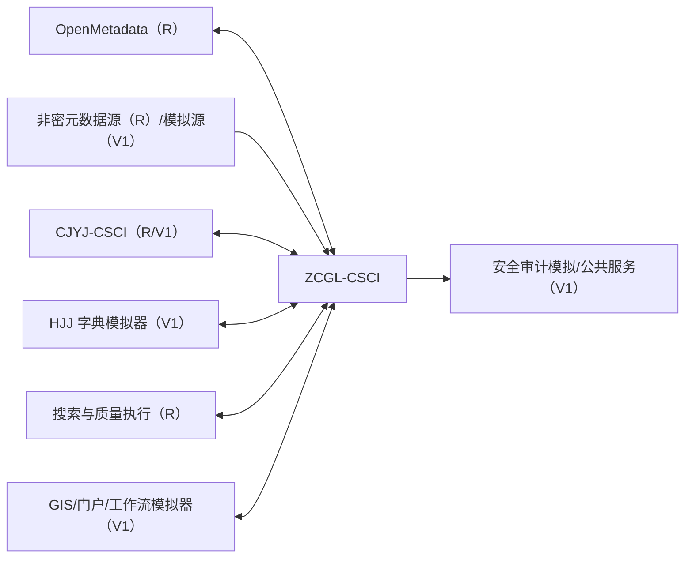

# 数据资产管理软件需求规格说明（SRS）

| 项目 | 内容 |
|---|---|
| 文档标识 | ZCGL-SRS-001 |
| CSCI 标识 | ZCGL-CSCI |
| 版本 | V0.1 |
| 状态 | 软件需求分析初稿，未建立需求基线 |
| 适用构建 | 外网非密开发验证构建 |
| 密级 | 非密验证文档；正式项目密级待总体确认 |
| 编制/审核/批准 | 待签署 |
| 日期 | 2026-07-19 |

## 修改页

| 版本 | 日期 | 修改章节 | 修改说明 | 修改人 | 审核人 |
|---|---|---|---|---|---|
| V0.1 | 2026-07-19 | 全文 | 按 GJB 438C-2021 附录 J 建立初版 SRS，并引入实装、仿真和占位三级实现策略 | 待定 | 待定 |

## 目录

- [1 范围](#1-范围)
- [2 引用文档](#2-引用文档)
- [3 需求](#3-需求)
- [4 合格性规定](#4-合格性规定)
- [5 需求可追踪性](#5-需求可追踪性)
- [6 注释](#6-注释)

# 1 范围

## 1.1 标识

本文档适用于数据资产管理软件配置项 `ZCGL-CSCI`，文档标识为 `ZCGL-SRS-001`，版本 V0.1。本文档描述外网非密开发验证构建的软件需求，不代表涉密目标环境产品已经完成合格性测试。

## 1.2 系统概述

`ZCGL-CSCI` 负责元数据、主数据、资源目录、标签、标准、数据维护、质量、外部字典、资产登记与检索、时空查看、态势、价值评估和用户行为分析。软件以 OpenMetadata 受控版本为元数据核心组件，通过适配层和项目扩展满足合同需求。

本阶段使用已完成且非密项目的环境、公开或脱敏元数据、合成质量数据和模拟外部服务开展验证。能够真实闭环的治理功能进行实装验证；依赖 HJJ 字典、总体门户、GIS、正式工作流或安全平台的功能采用仿真；依赖未定义业务模型、真实时空数据或用户行为基线且当前验证价值低的功能采用设计占位。本分级不删除上级需求，也不把仿真或占位结论表述为正式项目验收通过。

## 1.3 文档概述

本文档按 GJB 438C-2021 附录 J 组织，规定 `ZCGL-CSCI` 的状态、能力、接口、数据、适应性、保密、安全、环境、质量、资源、设计实现约束和合格性方法，并建立对 SSS/IRS 的追踪。

本文档只能使用非密信息。正式项目转入内网或目标现场前，应对所有 V1/V2 需求进行转实评审，不得沿用外网模拟地址、样本、账号、证书和测试结论。

# 2 引用文档

| 标识 | 文档 | 版本/状态 | 用途 |
|---|---|---|---|
| GJB438C | GJB 438C-2021《军用软件开发文档通用要求》 | 项目本地参考副本 | SRS 结构依据，附录 J |
| GJB2786A | GJB 2786A-2009《军用软件开发通用要求》 | 受控副本待取得 | 生命周期和软件需求活动依据 |
| SDP | 数据采集引接与数据资产管理软件开发计划 | V0.2 | 开发和验证策略 |
| ZCGL-SSS | 数据资产管理分系统规格说明 | ZCGL-SSS-001 V0.2 | 上级需求来源 |
| ZCGL-IRS | 数据资产管理接口需求规格说明 | ZCGL-IRS-001 V0.2 | 外部接口需求 |
| COM-IRM | 跨分系统接口与公共服务责任矩阵 | COM-IRM-001 V0.1 | 接口责任边界 |
| OM | OpenMetadata 项目基线及官方文档 | 受控版本待定 | 元数据组件复用分析 |

# 3 需求

每条需求包含实现深度、优先级、合格性方法和上级来源。

| 标记 | 中文简称 | 含义 | 本阶段允许形成的证据 | 禁止表述 |
|---|---|---|---|---|
| `R` | 实装验证 | 在非密环境部署真实软件，使用公开/脱敏数据完成端到端闭环 | 构建、运行、数据、日志、自动化测试和可重复结果 | 不得外推为目标现场合格 |
| `V1` | 仿真验证 | 本 CSCI 业务逻辑真实实现，缺失的外部系统或数据用模拟器/合成数据替代 | 模拟器版本、契约测试、仿真输入和结果 | 不得宣称真实对端已联调 |
| `V2` | 设计占位 | 仅形成接口、数据模型、配置入口、算法壳或原型，不实现完整效果 | 设计、接口桩、样例和转实条件 | 不得判定功能或性能满足 |

**ZCGL-SRS-GEN-001 [R，P0，I/T，源：项目验证策略]** 软件应明确显示“外网非密开发验证”环境标识，并在导出、报告、截图水印或版本信息中标注数据为公开、脱敏或合成数据。

**ZCGL-SRS-GEN-002 [R，P0，I/T，源：项目验证策略]** 每项 V1/V2 需求应记录缺失条件、模拟/占位边界、验证证据、不可证明事项、风险和转实准则；不得用预置成功数据伪装真实联调。

## 3.1 要求的状态和方式

| 状态 | 允许行为 | 禁止行为 |
|---|---|---|
| 初始化 | 加载配置、检查 OpenMetadata/数据库/搜索等依赖、执行迁移检查 | 接收治理写操作 |
| 就绪 | 查询、维护、审批、发布和分析 | 绕过权限修改核心对象 |
| 元数据采集 | 获取、转换、校验和提交元数据 | 把校验失败实体写入有效基线 |
| 治理作业 | 执行标准、质量、价值和行为分析任务 | 以未知状态生成正式结果 |
| 降级 | 只读查询、带时效缓存或批准的有限操作 | 执行可能造成关系不一致的写操作 |
| 维护 | 升级、备份恢复、索引重建和规则迁移 | 普通用户写入 |

**ZCGL-SRS-STATE-001 [R，P0，T，源：ZCGL-SSS-STATE-001～002]** 软件应维护全局及采集/治理任务状态，显示状态、进入时间、原因和依赖状态，并拒绝非法转换、记录审计。

**ZCGL-SRS-STATE-002 [R/V1，P0，T，源：ZCGL-SSS-STATE-003]** 数据库、搜索、消息或外部字典不可用时，软件应进入对应降级状态；真实依赖采用 R，缺失公共服务采用模拟器 V1，并分别记录。

## 3.2 CSCI 能力需求

### 3.2.1 元数据管理

**ZCGL-SRS-F-001 [R，P0，D/T，源：ZCGL-SSS-CAP-001～002]** 软件应基于 OpenMetadata 管理非密验证环境的数据源、库、表、字段、文件、接口、任务和报表等适用实体及关系，支持采集、登记、查询和维护。

**ZCGL-SRS-F-002 [R，P0，T/I，源：ZCGL-SSS-CAP-003]** 软件应展示实体版本、变更记录、责任主体、状态、分类分级和上下游血缘，并保持版本和关系可追踪。

**ZCGL-SRS-F-003 [R/V1，P0，T，源：ZCGL-IRS-OMD-*、SRC-*]** 至少一种真实非密数据库元数据源采用 R 完成采集；其他缺失类型使用契约模拟器 V1，测试报告应分别统计。

### 3.2.2 主数据管理

**ZCGL-SRS-F-004 [R，P0，D/T，源：ZCGL-SSS-CAP-004]** 软件应支持主数据模型、编码规则、属性、层级和参照关系的创建、版本和状态维护。

**ZCGL-SRS-F-005 [V1，P0，T/D，源：ZCGL-SSS-CAP-005]** 软件应使用本地工作流或流程模拟器完成主数据申请、校验、审核、发布、停用和变更通知闭环；未与正式工作流联调时标记为 V1。

### 3.2.3 资源目录管理

**ZCGL-SRS-F-006 [R，P0，D/T，源：ZCGL-SSS-CAP-006～007]** 软件应按领域、业务对象和主题建立多级资源目录，关联资产、责任主体、状态、分类分级和可见范围。

**ZCGL-SRS-F-007 [R，P0，T，源：ZCGL-SSS-CAP-008]** 目录发布、移动、合并、停用和删除应执行权限、引用影响和审批/确认检查，并保留历史关系。

### 3.2.4 标签管理

**ZCGL-SRS-F-008 [R，P0，D/T，源：ZCGL-SSS-CAP-009～010]** 软件应管理标签体系、分组、定义、适用范围、责任人、生命周期和打标规则，并支持人工、规则和接口打标。

**ZCGL-SRS-F-009 [R，P0，D/T，源：ZCGL-SSS-CAP-038～040]** 软件应分析已打标、未打标、冲突、失效和覆盖情况，支持分类层级深度查询及受控导入导出。

**ZCGL-SRS-F-010 [V1，P0，T/A，源：ZCGL-SSS-CAP-041]** 软件应使用规则或可解释的轻量模型和合成资产生成候选标签，显示依据、置信信息和版本，授权确认后方可生效；本阶段不声称具备目标业务语义智能。

**ZCGL-SRS-F-011 [V1，P0，T/I，源：ZCGL-SSS-CAP-042]** 软件应通过共享服务模拟器验证标签定义、版本、适用规则、来源和安全范围传递；真实跨域共享不在本阶段判定。

### 3.2.5 数据标准管理

**ZCGL-SRS-F-012 [R，P0，D/T，源：ZCGL-SSS-CAP-011～013]** 软件应管理数据元、术语、代码集、命名、格式、值域和口径标准，支持分类、版本、映射、差异和影响查询。

**ZCGL-SRS-F-013 [R/V1，P0，T/D，源：ZCGL-SSS-CAP-043～045]** 标准编制、复核、审批、发布、导入导出、下架和废止应形成完整状态和审计；使用本地流程为 R，使用外部工作流模拟器为 V1。

### 3.2.6 数据维护管理

**ZCGL-SRS-F-014 [R，P0，D/T，源：ZCGL-SSS-CAP-014～015]** 软件应支持授权维护资产属性、关系、责任人和状态，保存变更前后值、版本和历史比较。

**ZCGL-SRS-F-015 [R，P0，T，源：ZCGL-SSS-CAP-016]** 批量维护应提供预校验、影响预览和逐项结果，不得产生不可识别的部分成功。

### 3.2.7 数据质量管理

**ZCGL-SRS-F-016 [R，P0，D/T，源：ZCGL-SSS-CAP-017]** 软件应定义、组合、版本化和启停完整性、唯一性、准确性、一致性、及时性和有效性规则。

**ZCGL-SRS-F-017 [R，P0，T，源：ZCGL-SSS-CAP-018～019]** 软件应调度并执行非密数据质量任务，汇总规则、对象、规模、通过率、问题和趋势，生成可追踪报告。

**ZCGL-SRS-F-018 [R/V1，P0，T/D，源：ZCGL-SSS-CAP-046～047]** 软件应形成质量问题、整改工单、责任人、期限、证据、复核、退回和关闭历史；本地闭环为 R，外部工单系统接口为 V1。

### 3.2.8 外部数据字典

**ZCGL-SRS-F-019 [V1，P0，T，源：ZCGL-SSS-CAP-020～021]** 软件应通过 HJJ 字典模拟器完成目录、条目、层级、版本、增量和失效同步，显示缓存版本和更新时间；未取得真实接口前不得标记为真实联调。

### 3.2.9 资产登记、总览与检索

**ZCGL-SRS-F-020 [R，P0，D/T，源：ZCGL-SSS-CAP-022～024]** 软件应支持资产登记、审核、发布、分类分级、责任认领、上下架和注销，并按目录、类型、领域、责任和状态汇总。

**ZCGL-SRS-F-021 [R，P0，D/T，源：ZCGL-SSS-CAP-025～027]** 软件应按关键字检索有权访问的资产、字段、标签、标准和目录，支持过滤、排序、分页和权限裁剪，不得通过摘要泄露无权资产。

### 3.2.10 时空数据快速查看

**ZCGL-SRS-F-022 [V1，P1，D/T，源：ZCGL-SSS-CAP-028～029]** 软件应使用公开地图和合成时空资产验证时间范围、空间范围、坐标参考、抽样和预览；不得宣称已适配正式底图、坐标体系或涉密时空数据。

### 3.2.11 可定制资产态势

**ZCGL-SRS-F-023 [R，P1，D/T，源：ZCGL-SSS-CAP-030～031]** 软件应支持在本软件内配置资产态势组件、指标、筛选、布局和刷新周期，显示统计口径、来源、时间和权限范围。

**ZCGL-SRS-F-024 [V1，P1，T/D，源：ZCGL-IRS-PORT-*]** 向总体门户嵌入、统一指标上报和跨系统下钻应使用门户模拟器验证；本地态势页面通过不等于总体门户联调通过。

### 3.2.12 数据资产价值评估

**ZCGL-SRS-F-025 [V1，P1，D/T，源：ZCGL-SSS-CAP-032～034]** 软件应使用可配置维度、指标、权重和合成资产计算价值评分，保存模型版本、输入快照、过程和人工复核；业务模型未获批准前仅作为方法仿真。

### 3.2.13 用户行为分析

**ZCGL-SRS-F-026 [V1，P0/保密关键，T/A，源：ZCGL-SSS-CAP-035～037]** 软件应使用合成行为事件验证搜索、查看、申请和使用统计、热点与趋势，并实施最小必要、匿名化和权限控制；不得采集真实人员的非授权行为数据。

**ZCGL-SRS-F-027 [V2，P1，I/D，源：ZCGL-SSS-CAP-037]** 未定义业务基线的异常行为识别和个性化偏好推断仅形成事件模型、算法接口、阈值配置和样例，不声称具备实际识别准确率。

### 3.2.14 性能和容量

**ZCGL-SRS-P-001 [R，P0，T/A，源：ZCGL-SSS-PERF-001]** 软件应使用可重复生成的非密元数据验证不少于 100 万条实体管理能力，并记录实体类型、关系、版本和索引规模。

**ZCGL-SRS-P-002 [R，P0，T/A，源：ZCGL-SSS-PERF-002]** 软件应验证不少于 5000 条唯一质量规则版本的登记、查询、启停和管理能力。

**ZCGL-SRS-P-003 [R，P0，T/A，源：ZCGL-SSS-PERF-003、PERF-006]** 软件应在固定硬件、并发、结果页和冷/热缓存条件下验证元数据检索不大于 2 s、标准和字典检索不大于 0.5 s，并报告约定百分位。

**ZCGL-SRS-P-004 [R，P0，T/A，源：ZCGL-SSS-PERF-004、PERF-006]** 软件应对实际扫描不超过 10 万条的非密数据执行批准规则，从任务接受到报告持久化可查询不超过 2 min；不得用预生成报告替代规则执行。

## 3.3 CSCI 外部接口需求

### 3.3.1 接口标识和接口图

外部接口及详细需求引用 `ZCGL-IRS-001 V0.2`，本 SRS 规定验证构建的实现深度。

### 3.3.2～3.3.13 各外部接口

**ZCGL-SRS-IF-001 [R/V1，P0，T/I，源：ZCGL-IRS-001]** `ZCGL-IF-001～012` 应实现真实接口或契约桩。每项测试应标明对端、版本、真实/模拟属性、数据性质、超时和降级结果。

**ZCGL-SRS-IF-002 [R，P0，T/I，源：ZCGL-IRS-OMD-*]** OpenMetadata 适配接口应真实验证实体、关系、血缘、分类、术语、版本冲突、事件重放和软删除，不得直接修改其内部数据库。

**ZCGL-SRS-IF-003 [R/V1，P0，T，源：ZCGL-IRS-CJYJ-*]** 与采集软件的元数据和血缘接口应优先使用两 CSCI 实例联调；无法同时部署时使用版本化模拟器，并保持与 `CJYJ-IF-007` 的对偶标识。

## 3.4 CSCI 内部接口需求

**ZCGL-SRS-IIF-001 [R，P0，T/I，源：ZCGL-SSS-IIF-001～004]** 门户、领域服务、OpenMetadata 适配、检索、质量、流程、评估和行为模块应通过版本化契约交互，传递主体、追踪标识、安全上下文和实体版本。

**ZCGL-SRS-IIF-002 [R，P0，T，源：ZCGL-SSS-IIF-003]** 异步事件应具有幂等键、检查点、版本、重放和死信处置，重复或乱序不得静默覆盖较新实体。

## 3.5 CSCI 内部数据需求

**ZCGL-SRS-DATA-001 [R，P0，T/I，源：ZCGL-SSS-DATA-001～003]** 资产、实体、目录、标签、标准、主数据、字典、质量规则/结果、价值模型和行为事件应具有稳定标识、版本、状态、来源、主体和时间。

**ZCGL-SRS-DATA-002 [R，P0，T，源：ZCGL-SSS-DATA-004～005]** 索引、缓存和汇总应可由权威数据重建；备份恢复应覆盖核心对象、关系、配置、规则和审计关联。

**ZCGL-SRS-DATA-003 [R，P0，T/I，源：项目验证策略]** 验证数据应为公开、合成或经确认脱敏的数据，具有生成/导入脚本、版本、预期规模和销毁规则。

## 3.6 适应性需求

**ZCGL-SRS-ADP-001 [R，P1，T/I，源：ZCGL-SSS-ADAPT-001～003]** 软件应通过连接器、适配器和环境配置扩展数据源、资产类型、规则和外部服务，并支持开发、测试环境隔离及 OpenMetadata 升级回退。

## 3.7 保密性需求

**ZCGL-SRS-SEC-001 [R，P0/保密关键，T/I，源：ZCGL-SSS-CONF-001～003、SEC-001～006]** 外网构建应实施身份鉴别、最小权限、分类分级占位、敏感字段脱敏、凭据保护、导入导出控制、审计和完整性检测，禁止使用真实涉密数据。

**ZCGL-SRS-SEC-002 [V1，P0/保密关键，S/I，源：ZCGL-SSS-CONF-*]** 正式分类分级体系、密码设备、跨域交换和集中审计仅验证接口契约与失败流程，最终结论待批准环境验证。

## 3.8 安全性需求

**ZCGL-SRS-SAFE-001 [R，P0，T，源：ZCGL-SSS-DATA-003、QUAL-001]** 批量更新、物理删除、索引重建和规则执行异常时，应保护已发布资产，提供影响预览、二次确认、回滚或可识别补偿。

## 3.9 CSCI 环境适应性需求

**ZCGL-SRS-ENV-001 [R，P0，T/I，源：ZCGL-SSS-ENV-001～003]** 软件应在批准的非密容器或服务器环境完成部署、升级、回滚、依赖中断恢复和离线安装包校验；国产目标环境须另行复测。

## 3.10 其他质量特性

**ZCGL-SRS-QUAL-001 [R，P0，T/A，源：ZCGL-SSS-QUAL-001～005]** 单个采集、索引或质量任务失败不得破坏已发布资产；关键服务应具备健康、指标、日志和追踪，支持自动化回归和兼容矩阵验证。

## 3.11 计算机资源需求

### 3.11.1 计算机硬件需求

**ZCGL-SRS-RES-001 [R，P1，I/A，源：ZCGL-SSS-RES-001]** 每次容量和性能验证应记录处理器、内存、磁盘、网络和虚拟化配置，并预留索引重建和质量任务峰值资源。

### 3.11.2 计算机硬件资源使用需求

**ZCGL-SRS-RES-002 [R，P1，T/A，源：ZCGL-SSS-RES-002]** 软件应采集 CPU、内存、磁盘、网络、数据库连接、搜索队列和任务队列，超过验证阈值时告警。

### 3.11.3 计算机软件需求

**ZCGL-SRS-RES-003 [R，P0，I/T，源：ZCGL-SSS-RES-003]** OpenMetadata、数据库、搜索、消息、运行时和第三方依赖应固定名称、版本、来源和哈希，并形成 SBOM、许可证和漏洞记录。

### 3.11.4 计算机通信需求

**ZCGL-SRS-RES-004 [R/V1，P0，T/A，源：ZCGL-SSS-RES-004]** 真实接口和模拟接口应分别记录拓扑、带宽、时延、超时、数据峰值和诊断条件，不得混合判定。

## 3.12 设计和实现约束

**ZCGL-SRS-CNST-001 [R，P0，I/T，源：ZCGL-SSS-CNST-001～003]** 元数据能力应基于批准的 OpenMetadata 版本，优先使用公开 API、事件和插件；业务扩展不得直接修改其内部数据库。

**ZCGL-SRS-CNST-002 [R，P0，I/T，源：ZCGL-SSS-CNST-004～005]** 需求、设计、代码、测试和问题应双向追踪，所有依赖及补丁纳入配置管理。

**ZCGL-SRS-CNST-003 [R，P0，I，源：项目验证策略]** 软件不得通过硬编码成功数据、预置分析结论、伪造日志或手工修改测试结果完成 V1/V2；模拟和占位必须在界面及证据中明确标识。

## 3.13 人员相关需求

**ZCGL-SRS-HUM-001 [R，P1，D/T，源：ZCGL-SSS-PERS-001～002]** 软件应支持系统、目录、标准、质量管理员，数据责任人、审核人、审计员和普通用户职责分离，高风险操作须授权和审计。

## 3.14 训练相关需求

**ZCGL-SRS-TRAIN-001 [R，P1，D/I，源：ZCGL-SSS-TRAIN-001]** 应提供非密环境的元数据、目录、标签、标准、质量、检索、模拟器和故障处置培训材料，并说明与目标环境差异。

## 3.15 软件保障需求

**ZCGL-SRS-SUP-001 [R，P0，I/T，源：ZCGL-SSS-SUP-001～003]** 应提供安装、初始化、升级回退、备份恢复、索引重建、插件/模型迁移、监控和开源组件保障说明。

## 3.16 包装需求

**ZCGL-SRS-PKG-001 [R，P0，I，源：ZCGL-SSS-PKG-001～002]** 验证构建包应包含源码、构建脚本、依赖、镜像/安装包、初始化、配置、模拟器、合成数据脚本、SBOM、许可证和校验和，并标记“非密开发验证”。

## 3.17 其他需求

**ZCGL-SRS-OTH-001 [R，P0，I，源：ZCGL-SSS-OTH-001～003]** 术语、时间、编码、坐标和数据格式应遵循项目统一规范；实现深度变化须通过需求变更受控处理。

## 3.18 需求的优先顺序和关键性

优先级与实现深度独立：P0 表示高重要性，V2 只表示当前验证条件不足，不能据此降低需求。

| 实现深度 | 当前分配 | 转实准则 |
|---|---|---|
| R | OpenMetadata 元数据、目录、标签基础、标准、维护、质量基础、资产登记检索、本地态势和容量性能 | 在目标数据、正式身份/审计和国产环境重新合格性测试 |
| V1 | 主数据/标准/质量外部流程、标签推荐共享、HJJ 字典、GIS、总体门户、价值评估、行为统计、部分跨 CSCI 接口 | 获得正式业务规则、对端和 ICD，替换模拟器并通过真实联调 |
| V2 | 异常行为识别、个性化偏好等缺少业务基线和真实样本的高级分析 | 批准算法目标、样本、评价指标和数据合规方案后实现并测试 |

任何 P0-V2 需求仍属于高优先级遗留，不得从正式项目需求基线中删除。

# 4 合格性规定

方法代码：`D` 演示、`T` 测试、`A` 分析、`I` 审查、`S` 特殊方法。

| 实现深度 | 合格性判定 |
|---|---|
| R | 在受控非密环境执行并保留可重复证据；结论限定为“外网验证环境通过” |
| V1 | 真实业务逻辑与模拟对端契约测试通过；结论为“仿真验证通过，真实联调未完成” |
| V2 | 只检查占位设计、接口桩、配置和转实条件；结论为“占位完整”，不得写“功能通过” |

性能测试必须使用运行生成的原始结果，明确数据是公开、脱敏或合成，并记录环境和统计口径。预生成页面、固定返回值或模拟时钟不得作为性能通过证据。

# 5 需求可追踪性

## 5.1 SRS 到上级需求

第 3 章通过“源”字段追踪到 `ZCGL-SSS-001`、`ZCGL-IRS-001`、系统实现或验证策略。接口字段和协议细节由 IRS/后续 IDD 承载。

## 5.2 上级需求到 SRS

| 上级范围 | SRS 分配 |
|---|---|
| ZCGL-GN-01 | F-001～003 |
| ZCGL-GN-02 | F-004～005 |
| ZCGL-GN-03 | F-006～007 |
| ZCGL-GN-04 | F-008～011 |
| ZCGL-GN-05 | F-012～013 |
| ZCGL-GN-06 | F-014～015 |
| ZCGL-GN-07 | F-016～018 |
| ZCGL-GN-08 | F-019 |
| ZCGL-GN-09 | F-020 |
| ZCGL-GN-10 | F-021 |
| ZCGL-GN-11 | F-022 |
| ZCGL-GN-12 | F-023～024 |
| ZCGL-GN-13 | F-025 |
| ZCGL-GN-14 | F-026～027 |
| ZCGL-XN-01 | P-001 |
| ZCGL-XN-02 | P-002 |
| ZCGL-XN-03 | P-003 |
| ZCGL-XN-04 | P-004 |
| ZCGL-IRS-001 | IF-001～003及第 3.3 条引用 |

需求工具中应建立 SRS 到软件单元、代码、测试用例、结果和问题单的双向追踪，并将 R/V1/V2 作为受控属性。

# 6 注释

## 6.1 缩略语

| 缩略语 | 含义 |
|---|---|
| CSCI | Computer Software Configuration Item |
| SRS | Software Requirements Specification |
| R | Real implementation verification，实装验证 |
| V1 | Simulation verification，仿真验证 |
| V2 | Design placeholder，设计占位 |

## 6.2 待确认项

| 标识 | 等级 | 内容 | 关闭点 |
|---|---|---|---|
| ZCGL-SRS-TBC-001 | 红 | OpenMetadata 受控版本、许可证、插件和允许修改范围 | SRS 评审前 |
| ZCGL-SRS-TBC-002 | 红 | R/V1/V2 分级是否获得需方/总体书面认可 | SRS 评审前 |
| ZCGL-SRS-TBC-003 | 红 | 外网非密数据集、百万规模生成方式和使用范围 | SRS 评审前 |
| ZCGL-SRS-TBC-004 | 红 | HJJ、GIS、门户、工作流、审计和共享交换模拟器契约 | 详细设计前 |
| ZCGL-SRS-TBC-005 | 红 | 价值评估和行为分析的业务目标、样本与评价准则 | 详细设计前 |
| ZCGL-SRS-TBC-006 | 黄 | 真实目标环境转实计划、接口提供时间和复测范围 | 系统联调前 |

## 附录 A（规范性）实现深度登记最小字段

每条 V1/V2 需求的需求库记录至少包含：需求标识、实现深度、缺失条件、模拟/占位对象、当前软件行为、验证方法、证据位置、不可证明事项、风险、责任人、目标版本、转实输入和关闭准则。
