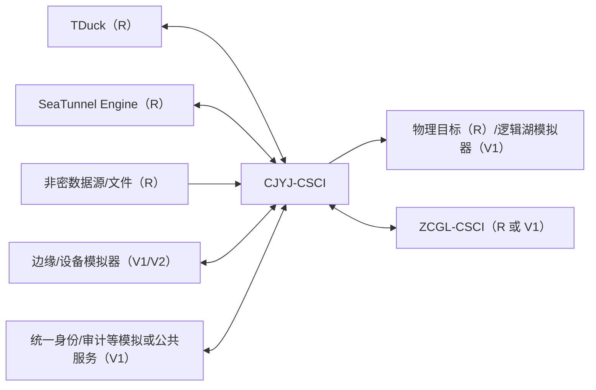

# 数据采集引接软件需求规格说明（SRS）

| 项目 | 内容 |
|---|---|
| 文档标识 | CJYJ-SRS-001 |
| CSCI 标识 | CJYJ-CSCI |
| 版本 | V0.1 |
| 状态 | 软件需求分析初稿，未建立需求基线 |
| 适用构建 | 外网非密开发验证构建 |
| 密级 | 非密验证文档；正式项目密级待总体确认 |
| 编制/审核/批准 | 待签署 |
| 日期 | 2026-07-19 |

## 修改页

| 版本 | 日期 | 修改章节 | 修改说明 | 修改人 | 审核人 |
|---|---|---|---|---|---|
| V0.1 | 2026-07-19 | 全文 | 按 GJB 438C-2021 附录 J 建立初版 SRS，并引入实装、仿真和占位三级实现策略 | 待定 | 待定 |

## 目录

- [1 范围](#1-范围)
- [2 引用文档](#2-引用文档)
- [3 需求](#3-需求)
- [4 合格性规定](#4-合格性规定)
- [5 需求可追踪性](#5-需求可追踪性)
- [6 注释](#6-注释)

# 1 范围

## 1.1 标识

本文档适用于数据资源支撑系统数据采集引接软件配置项 `CJYJ-CSCI`，文档标识为 `CJYJ-SRS-001`，版本 V0.1。本文档描述外网非密开发验证构建的软件需求，不代表涉密目标环境产品已经完成合格性测试。

## 1.2 系统概述

`CJYJ-CSCI` 为数据采报、在线引接、任务配置、数据探查、入湖、云边同步、协议适配和运行监控提供软件能力。数据采报以 TDuck 受控版本为核心组件；在线引接、编排与执行以 SeaTunnel-Web 企业 Fork 和 Apache SeaTunnel 为核心组件；元数据与血缘通过接口同步到数据资产管理软件。

本阶段使用已完成且非密项目的环境、公开或脱敏数据、模拟设备和模拟外部系统开展开发验证。能够在该环境真实闭环的能力进行实装验证；依赖涉密现场、专用装备或尚未提供的总体系统时采用仿真；当前验证价值低且依赖条件完全缺失的能力仅形成受控占位。本分级不删除上级需求，也不把仿真或占位结论表述为正式项目验收通过。

## 1.3 文档概述

本文档按 GJB 438C-2021 附录 J 组织，规定 `CJYJ-CSCI` 的状态、能力、接口、数据、适应性、保密、安全、环境、质量、资源、设计实现约束及合格性方法，并建立对 SSS/IRS 的追踪。

本文档为非密开发验证使用，不得写入真实涉密系统地址、账号、密钥、数据样本或设备参数。正式项目转入内网或目标现场前，应对所有“虚”需求重新评估并形成转实计划。

# 2 引用文档

| 标识 | 文档 | 版本/状态 | 用途 |
|---|---|---|---|
| GJB438C | GJB 438C-2021《军用软件开发文档通用要求》 | 项目本地参考副本 | SRS 结构依据，附录 J |
| GJB2786A | GJB 2786A-2009《军用软件开发通用要求》 | 受控副本待取得 | 生命周期和软件需求活动依据 |
| SDP | 数据采集引接与数据资产管理软件开发计划 | V0.2 | 开发和验证策略 |
| CJYJ-SSS | 数据采集引接分系统规格说明 | CJYJ-SSS-001 V0.2 | 上级需求来源 |
| CJYJ-IRS | 数据采集引接接口需求规格说明 | CJYJ-IRS-001 V0.2 | 外部接口需求 |
| COM-IRM | 跨分系统接口与公共服务责任矩阵 | COM-IRM-001 V0.1 | 接口责任边界 |
| TDUCK | TDuck 官方仓库及功能/部署文档 | 受控版本待定 | 采报组件复用分析 |
| STWEB | SeaTunnel-Web/Apache SeaTunnel 项目基线 | 受控版本待定 | 引接组件复用分析 |

# 3 需求

每条需求均采用项目唯一标识，并包含实现深度、优先级、合格性方法和上级来源。实现深度定义如下：

| 标记 | 中文简称 | 含义 | 本阶段允许形成的证据 | 禁止表述 |
|---|---|---|---|---|
| `R` | 实装验证 | 在外网非密环境部署真实软件组件，使用公开/脱敏数据完成端到端闭环 | 可重复构建、运行记录、测试数据、日志、截图、自动化测试 | 不得外推为涉密目标现场合格 |
| `V1` | 仿真验证 | 本 CSCI 业务逻辑真实实现，对缺失外部系统、设备或网络用模拟器/桩替代 | 模拟器版本、仿真输入、契约测试、故障注入记录 | 不得宣称真实外部系统已联调 |
| `V2` | 设计占位 | 仅形成接口、数据模型、配置入口、状态机或原型壳，不实现完整业务效果 | 设计说明、接口桩、配置样例、待办与转实准则 | 不得判定功能或性能满足 |

**CJYJ-SRS-GEN-001 [R，P0，I/T，源：项目验证策略]** 软件应在界面、接口、日志、测试报告和版本说明中记录当前运行环境为“外网非密开发验证”，并标识数据来源为公开、脱敏或合成数据。

**CJYJ-SRS-GEN-002 [R，P0，I/T，源：项目验证策略]** 每项 V1/V2 需求应关联模拟对象或缺失条件、当前实现边界、验证证据、遗留风险、责任人和转实准则；没有这些信息不得以“已实现”关闭需求。

## 3.1 要求的状态和方式

| 状态 | 允许行为 | 禁止行为 |
|---|---|---|
| 初始化 | 加载受控配置、检查 TDuck/SeaTunnel/数据库等依赖、恢复任务状态 | 接收生产任务 |
| 就绪 | 创建、配置、发布、查询和调度任务 | 绕过审批执行高风险任务 |
| 运行 | 采报、读取、转换、写入、监控和审计 | 修改已运行实例的历史配置 |
| 暂停 | 保留检查点和上下文 | 继续产生未经批准的目标写入 |
| 边缘离线 | 本地采集、缓存、容量保护 | 把未确认数据标记为云端接收成功 |
| 降级 | 保持已批准主链路并标识受影响能力 | 隐瞒依赖故障或返回虚假成功 |
| 故障/恢复 | 隔离故障、保护数据、执行核对和恢复 | 未核对状态直接恢复写入 |
| 维护 | 升级、迁移、备份、恢复 | 接收新的普通运行任务 |

**CJYJ-SRS-STATE-001 [R，P0，T，源：CJYJ-SSS-STATE-001]** 软件应维护全局服务状态及每个采报/引接任务状态，并向授权用户显示状态、进入时间、原因和关键依赖状态。

**CJYJ-SRS-STATE-002 [R，P0，T，源：CJYJ-SSS-STATE-003]** 软件应按批准状态机校验转换，拒绝非法转换并记录请求主体、当前状态、目标状态、原因和结果。

**CJYJ-SRS-STATE-003 [V1，P0，T，源：CJYJ-SSS-STATE-002]** 软件应通过边缘节点模拟器验证离线、缓存、联网核对、去重和补传状态转换；模拟器边界应在测试记录中明确。

## 3.2 CSCI 能力需求

### 3.2.1 数据采报任务管理

**CJYJ-SRS-F-001 [R，P0，D/T，源：CJYJ-SSS-CAP-001、CAP-040]** 软件应基于 TDuck 支持表单模板创建、复制、版本维护、预览、发布、停用和复用，并配置字段类型、必填、格式、取值范围、显示逻辑和样式。

**CJYJ-SRS-F-002 [R，P0，T，源：CJYJ-SSS-CAP-002]** 表单提交时应执行单字段和跨字段规则校验，阻止不合格提交或按规则标记异常，并返回字段级可理解原因。

**CJYJ-SRS-F-003 [V1，P1，T/A，源：CJYJ-SSS-CAP-003]** 软件应使用规则库和合成错误样本验证日期、编码、单位、值域及跨字段语义错误提示；自动纠正仅作为仿真功能，必须保留原值、建议值、规则版本和人工确认结果。

**CJYJ-SRS-F-004 [R，P0，D/T，源：CJYJ-SSS-CAP-004]** 软件应支持单条填报、批量导入、结果查询和受控导出，并对提交、退回、修改、撤回和上报过程进行状态追踪。

**CJYJ-SRS-F-005 [R，P0，T，源：CJYJ-SSS-CAP-005]** 软件应按组织、角色、数据范围和工作量规则分配采报任务，支持授权调整、冲突提示和分配审计。

**CJYJ-SRS-F-006 [R，P0，I/T，源：CJYJ-SSS-CAP-041]** 软件应维护项目任务、表单、表单版本、字段、填报主体、填报批次和结果与 TDuck 对象的稳定标识映射，不得直接修改 TDuck 内部数据库。

### 3.2.2 数据在线引接

**CJYJ-SRS-F-007 [R，P0，T，源：CJYJ-SSS-CAP-007]** 软件应至少对项目批准的一种关系型数据库完成全量和 CDC/增量引接闭环，保存源端位点、检查点和恢复结果。

**CJYJ-SRS-F-008 [R，P0，T，源：CJYJ-SSS-CAP-008]** 软件应监测指定测试目录及子目录的新增、修改和删除，并按策略执行实时或周期同步、重复检测和失败重试。

**CJYJ-SRS-F-009 [R，P0，D/T，源：CJYJ-SSS-CAP-009]** 软件应探查数据表结构、字段类型、空值率、唯一值、值域和适用质量规则，并保存与数据源版本关联的结果。

### 3.2.3 引接任务配置与执行

**CJYJ-SRS-F-010 [R，P0，D/T，源：CJYJ-SSS-CAP-010]** 软件应通过可视化 DAG 或受控脚本配置源、转换、目标、字段映射、运行参数和错误策略，并在发布前校验完整性。

**CJYJ-SRS-F-011 [R，P0，T，源：CJYJ-SSS-CAP-011]** 软件应支持立即、周期和表达式调度，检测同一目标的调度冲突并支持启停和修改。

**CJYJ-SRS-F-012 [R，P0，T，源：CJYJ-SSS-CAP-012]** 软件应支持批量创建作业及一个任务内多表同步，并逐项返回成功、失败和可重试状态。

**CJYJ-SRS-F-013 [R，P0，D/T，源：CJYJ-SSS-CAP-013～014]** 软件应显示排队、运行、暂停、成功、失败、取消和未知状态，支持授权启动、暂停、终止、重试和恢复，并保持运行实例对配置版本的引用。

### 3.2.4 数据湖资源与入湖管理

**CJYJ-SRS-F-014 [R，P0，D/T，源：CJYJ-SSS-CAP-015～016]** 软件应登记非密验证环境的数据源单位、数据模型、数据库和数据源，支持清查统计、启用、停用和注销。

**CJYJ-SRS-F-015 [R，P0，T，源：CJYJ-SSS-CAP-020]** 软件应对批准的对象存储、文件存储或关系型目标完成物理入湖闭环，记录批次、记录数、目标位置、校验和与提交状态。

**CJYJ-SRS-F-016 [V1，P0，T，源：CJYJ-SSS-CAP-021]** 软件应通过逻辑湖模拟服务验证数据源引用注册、逻辑对象映射、权限传递、失效通知和源端不可用处理；本阶段不声明已与正式数据虚拟化产品联调。

### 3.2.5 采集报告管理

**CJYJ-SRS-F-017 [R，P0，D/T，源：CJYJ-SSS-CAP-017]** 软件应支持采集报告模板创建、版本、预览、发布、停用和场景复用。

**CJYJ-SRS-F-018 [R，P0，T，源：CJYJ-SSS-CAP-018]** 软件应根据非密采集数据生成单篇、批量和周期报告，支持在线预览、任务状态及失败重试。

**CJYJ-SRS-F-019 [V1，P0，T/I，源：CJYJ-SSS-CAP-019]** 软件应至少真实验证 CSV/Excel 导出，并用格式适配器验证 Word/PDF 生成接口、鉴权、审计和打包流程；未实际生成的格式必须明确标为模拟或未支持。

### 3.2.6 引接安全保护

**CJYJ-SRS-F-020 [R，P0/保密关键，T/I，源：CJYJ-SSS-CAP-022～023]** 外网验证环境应真实启用标准 TLS、凭据加密存储或密钥引用、日志脱敏和服务身份鉴别，禁止提交真实涉密凭据。

**CJYJ-SRS-F-021 [V1，P0/保密关键，T/S，源：CJYJ-SSS-SEC-002]** 国密设备、正式证书体系和目标安全域隔离应使用接口桩或软件模拟器验证调用、失败和审计流程，不得宣称通过正式密码应用或保密测评。

### 3.2.7 云边协同与低功耗设备

**CJYJ-SRS-F-022 [V1，P0，T，源：CJYJ-SSS-CAP-024～025]** 软件应使用边缘节点模拟器完成任务下发、心跳、配置版本、离线缓存、容量阈值、联网核对、去重和补传验证。

**CJYJ-SRS-F-023 [V2，P1，I/D，源：CJYJ-SSS-CAP-036]** 对尚未提供的低功耗终端，软件仅形成设备适配器 SPI、设备数据模型、认证入口、采样/休眠参数和模拟终端；真实功耗和硬件兼容性不在本阶段判定。

**CJYJ-SRS-F-024 [V1，P1，T，源：CJYJ-SSS-CAP-037]** 软件应使用合成设备数据验证空值、重复、越界和时间异常的边缘预处理，并记录规则版本和统计结果。

### 3.2.8 采集态势、链路和拓扑

**CJYJ-SRS-F-025 [R，P0，D/T，源：CJYJ-SSS-CAP-026～027]** 软件应基于真实任务运行记录展示任务、数据源、流向、流量、状态、成功率、时延和告警，并按时间、数据源和任务筛选。

**CJYJ-SRS-F-026 [V1，P0，T/D，源：CJYJ-SSS-CAP-032～033]** 软件应在模拟多链路环境中验证逻辑路由、带宽配额、优先级、故障切换和调度理由；不判定真实跨域网络性能。

**CJYJ-SRS-F-027 [V1，P0，T/D，源：CJYJ-SSS-CAP-034～035]** 软件应使用非密数据源、任务和目标生成拓扑及表级/可获得字段级血缘，并通过 `ZCGL-CSCI` 接口模拟或实测同步。

### 3.2.9 协议解析、回放和故障定位

**CJYJ-SRS-F-028 [V1，P0，T，源：CJYJ-SSS-CAP-028～029]** 软件应至少对一种公开协议和两种合成专用报文格式实现解析、校验、转换、版本选择和错误隔离；未获得真实协议的适配器标记为模拟。

**CJYJ-SRS-F-029 [R，P0，D/T，源：CJYJ-SSS-CAP-030～031]** 软件应基于真实任务日志和追踪标识重构任务配置、操作、状态、错误和数据批次时间线，并区分源端、引擎、目标和平台故障域。

**CJYJ-SRS-F-030 [V2，P1，I/D，源：CJYJ-SSS-CAP-031]** 需要源数据快照或专用链路报文才能完成的全量操作回放，本阶段仅形成快照引用模型、回放接口和受控样例，不声称能够复现目标现场全部行为。

### 3.2.10 有效期与暂存周期

**CJYJ-SRS-F-031 [R，P0，D/T，源：CJYJ-SSS-CAP-038]** 软件应按数据源、数据类型、业务部门和任务配置有效期、临期阈值与暂存周期，并进行规则版本管理。

**CJYJ-SRS-F-032 [R，P0，T，源：CJYJ-SSS-CAP-039]** 软件应使用可控时间和合成数据验证有效、临期、过期和规则缺失场景，执行接收、隔离、告警或拒绝策略并审计。

### 3.2.11 性能和容量

**CJYJ-SRS-P-001 [R，P0，T/A，源：CJYJ-SSS-PERF-001]** 在批准的外网基准环境中，应使用非大字段合成数据验证全量不低于 1000 条/s、增量不低于 500 条/s；结果仅证明该软硬件配置下的实验室能力。

**CJYJ-SRS-P-002 [R，P0，T，源：CJYJ-SSS-PERF-002]** 应使用无敏感内容的 Excel、DMP、Word、SQL 样例验证合同文件规模和导入时间；若某格式仅完成模拟适配，必须判为未验证而非通过。

**CJYJ-SRS-P-003 [R，P0，T，源：CJYJ-SSS-PERF-003]** 应验证单任务启动不超过 5 s及不少于 1000 个有效任务的登记、查询和控制能力，并单独记录同时运行任务数。

**CJYJ-SRS-P-004 [R/V1，P0，T/A，源：CJYJ-SSS-PERF-004]** 文件增量发现使用真实本地目录验证，CDC 高实时发现可使用真实非密数据库或等价模拟源验证；报告必须分别标明输入性质。

**CJYJ-SRS-P-005 [R，P0，T，源：CJYJ-SSS-PERF-005]** 应通过故障注入验证从监测点确认异常到告警服务确认发出不超过 5 s，不包含外部运营商最终送达时间。

**CJYJ-SRS-P-006 [R，P0，T/A，源：CJYJ-SSS-PERF-006～007]** 应在固定网络、数据库、批量、事务和压缩条件下，使用 200B 合成记录验证至少一种关系库间净有效载荷传输不低于 100MB/s；目标现场外推须重新测试。

## 3.3 CSCI 外部接口需求

### 3.3.1 接口标识和接口图

外部接口及详细需求引用 `CJYJ-IRS-001 V0.2`。本 SRS 不重复定义数据字段，但规定本验证构建的实现深度。

### 3.3.2～3.3.13 各外部接口

**CJYJ-SRS-IF-001 [R/V1，P0，T/I，源：CJYJ-IRS-001]** `CJYJ-IF-001～012` 均应实现受控接口或契约桩；实际对端可用时采用 R，不可用时采用 V1。每个接口测试记录应标明对端名称、版本、真实/模拟属性、数据性质、超时和降级结果。

**CJYJ-SRS-IF-002 [R，P0，T/I，源：CJYJ-IRS-TDUCK-001～006]** TDuck 接口应真实验证表单/结果对象映射、事件幂等、失败补偿、统一鉴权适配和敏感字段控制。

**CJYJ-SRS-IF-003 [V1，P0，T，源：CJYJ-IRS-EDGE-*、DEV-*]** 边缘及设备接口应由版本化模拟器提供可重复的正常、断连、乱序、重复、超量和非法输入。

## 3.4 CSCI 内部接口需求

**CJYJ-SRS-IIF-001 [R，P0，T/I，源：CJYJ-SSS-INT-001]** 采报适配、任务管理、引擎适配、边缘协同、报告、审计和元数据适配模块应使用版本化契约，并传递主体、追踪号、任务、配置版本和运行实例。

**CJYJ-SRS-IIF-002 [R，P0，T，源：CJYJ-SSS-INT-002]** 内部异步消息应具备幂等键、顺序或版本控制、重试上限、超时、重复检测和死信处置。

## 3.5 CSCI 内部数据需求

**CJYJ-SRS-DATA-001 [R，P0，T/I，源：CJYJ-SSS-DATA-001～003]** 软件应维护数据源、表单、任务、配置版本、运行实例、批次、检查点、血缘、报告和审计事件的稳定唯一标识及关联关系。

**CJYJ-SRS-DATA-002 [R，P0，T/I，源：CJYJ-SSS-DATA-002]** 审计事件应至少记录主体、来源、对象、操作、结果、时间、追踪号和适用的前后值摘要，并防止普通管理员修改或删除。

**CJYJ-SRS-DATA-003 [R，P0，T，源：项目验证策略]** 验证数据库应只包含公开、合成或经确认脱敏的数据；测试数据集应有来源、生成脚本、版本和销毁规则。

## 3.6 适应性需求

**CJYJ-SRS-ADP-001 [R，P1，D/T，源：CJYJ-SSS-ADP-001～002]** 数据源、TDuck、SeaTunnel、调度、缓存、有效期、告警和接口参数应通过环境化配置切换，不得把真实地址和凭据写入代码。

## 3.7 保密性需求

**CJYJ-SRS-SEC-001 [R，P0/保密关键，T/I，源：CJYJ-SSS-SEC-001～004]** 外网验证构建应实施统一或本地受控身份鉴别、最小权限、敏感配置保护、日志脱敏、审计和审计完整性检测，不得使用真实涉密数据和密钥。

**CJYJ-SRS-SEC-002 [V1，P0/保密关键，S/I，源：CJYJ-SSS-SEC-002]** 正式密码设备、密级标记和跨安全域交换仅验证调用契约与失败流程，最终算法、设备和认证结论待转入批准环境后验证。

## 3.8 安全性需求

**CJYJ-SRS-SAFE-001 [R，P0，T，源：CJYJ-SSS-SAFE-001～002]** 存储耗尽、网络中断、依赖故障和异常终止时，软件应停止状态不明的写入并保护已确认数据；删除、覆盖和清空操作应二次确认、授权和审计。

## 3.9 CSCI 环境适应性需求

**CJYJ-SRS-ENV-001 [R，P0，T/I，源：CJYJ-SSS-ENV-001～002]** 外网验证构建应在批准的非密服务器或容器环境完成安装、启动、升级、回滚和恢复；国产目标环境兼容性属于后续重新验证项。

## 3.10 其他质量特性

**CJYJ-SRS-QUAL-001 [R，P0，T/A，源：CJYJ-SSS-QUAL-001]** 单一数据源、任务或非共享适配器故障不得导致无关任务失效，故障应可隔离和恢复。

**CJYJ-SRS-QUAL-002 [R，P1，I/T，源：CJYJ-SSS-QUAL-002～003]** TDuck、SeaTunnel 和项目扩展应通过适配层或扩展点隔离，关键处理应支持自动化回归、故障注入、日志和指标观测。

## 3.11 计算机资源需求

### 3.11.1 计算机硬件需求

**CJYJ-SRS-RES-001 [R，P1，I/A，源：CJYJ-SSS 第 3.11.1 条]** 每次性能验证应记录处理器、内存、磁盘、网络和虚拟化配置；该配置不替代目标硬件基线。

### 3.11.2 计算机硬件资源使用需求

**CJYJ-SRS-RES-002 [R，P1，T/A，源：CJYJ-SSS-RES-001]** 性能测试应采集 CPU、内存、磁盘、网络、线程、连接和队列指标，并识别持续耗尽或不可恢复拥塞。

### 3.11.3 计算机软件需求

**CJYJ-SRS-RES-003 [R，P0，I/T，源：CJYJ-SSS-RES-002]** TDuck、SeaTunnel-Web、Apache SeaTunnel、运行时、数据库及依赖应固定名称、版本、来源和哈希，形成 SBOM、许可证和漏洞记录。

### 3.11.4 计算机通信需求

**CJYJ-SRS-RES-004 [R/V1，P0，T/A，源：CJYJ-SSS-RES-003]** 真实网络测试与网络仿真测试应分别记录带宽、时延、丢包、抖动、拓扑和峰值，不得混合形成一个“实测”结论。

## 3.12 设计和实现约束

**CJYJ-SRS-CNST-001 [R，P0，I/T，源：CJYJ-SSS-CON-001～002]** 在线引接应基于受控 SeaTunnel-Web/Apache SeaTunnel，优先使用独立模块、SPI、插件或适配器；核心补丁应登记和回归。

**CJYJ-SRS-CNST-002 [R，P0，I/T，源：CJYJ-SSS-CON-004]** 数据采报应基于受控 TDuck，优先使用公开 API、Webhook、插件或适配服务，不得绕过服务边界直接访问内部数据库。

**CJYJ-SRS-CNST-003 [R，P0，I，源：项目验证策略]** 软件不得以硬编码成功响应、伪造日志、伪造性能数据或手工修改测试结果实现“做虚”；V1/V2 需求必须在产品界面和证据中明确标识。

## 3.13 人员相关需求

**CJYJ-SRS-HUM-001 [R，P1，D/T，源：CJYJ-SSS-HUM-001～002]** 软件应支持管理员、采报设计、引接设计、审批发布、运维、审计和只读等职责，并提供可理解错误与恢复建议。

## 3.14 训练相关需求

**CJYJ-SRS-TRAIN-001 [R，P1，D/I，源：CJYJ-SSS-TRN-001]** 应提供外网验证环境的安装、表单、任务、监控、故障和模拟器使用说明，并标出与目标环境的差异。

## 3.15 软件保障需求

**CJYJ-SRS-SUP-001 [R，P0，I/T，源：CJYJ-SSS-SUP-001～002]** 应提供可重复构建、部署、升级、回滚、备份恢复、监控、故障处置、依赖与许可证说明。

## 3.16 包装需求

**CJYJ-SRS-PKG-001 [R，P0，I，源：CJYJ-SSS-PKG-001]** 验证构建包应包含源码、构建脚本、依赖、镜像/安装包、迁移、配置模板、模拟器、测试数据生成脚本、SBOM、许可证和校验和，并标记“非密开发验证”。

## 3.17 其他需求

**CJYJ-SRS-OTH-001 [R，P0，I，源：GJB 438C]** 需求、设计、代码、测试和问题/变更应保持双向追踪；实现深度变化须作为需求属性变更受控记录。

## 3.18 需求的优先顺序和关键性

优先级 `P0/P1/P2` 表示需求的重要性；实现深度 `R/V1/V2` 表示当前外网验证构建的实现与证据方式，两者互不替代。

| 实现深度 | 当前分配 | 转实准则 |
|---|---|---|
| R | TDuck 采报主链路、数据库/文件引接、任务编排监控、物理目标、基础报告、态势、有效期、实验室性能 | 在目标软硬件、真实接口和批准数据上重新执行合格性测试 |
| V1 | 语义纠错、逻辑湖、云边协同、专用协议、链路调度、国密/公共服务、部分跨 CSCI 接口 | 获得正式对端/协议/设备和 ICD，替换模拟器并通过联调与回归 |
| V2 | 低功耗真实硬件、全量现场操作回放等缺少关键条件的能力 | 获得硬件/现场数据和批准设计，完成实现、测试和安全评审 |

任何 P0-V2 需求仍是高优先级遗留需求，不得因当前“做虚”而删除或降级为可选功能。

# 4 合格性规定

方法代码：`D` 演示、`T` 测试、`A` 分析、`I` 审查、`S` 特殊方法。

| 实现深度 | 合格性判定 |
|---|---|
| R | 在受控非密环境按测试说明执行，证据可重复；结论限定为“外网验证环境通过” |
| V1 | 本 CSCI 逻辑和契约测试通过，必须注明模拟器；结论为“仿真验证通过，真实联调未完成” |
| V2 | 仅检查设计占位、接口桩、配置、追踪和转实条件；结论为“占位完整”，不得写“功能通过” |

每个测试用例必须标明输入是真实、脱敏、合成还是模拟。性能需求只有在对应 R 环境中执行才能形成实验室实测值；模拟结果不得替代合同验收数据。

# 5 需求可追踪性

## 5.1 SRS 到上级需求

第 3 章每条需求的“源”字段追踪到 `CJYJ-SSS-001`、`CJYJ-IRS-001`、系统实现决策或验证策略。接口需求的字段和协议细节由 IRS/后续 IDD 承载。

## 5.2 上级需求到 SRS

| 上级范围 | SRS 分配 |
|---|---|
| CCYJ-GN-01 | F-001～006 |
| CCYJ-GN-02 | F-007～009 |
| CCYJ-GN-03 | F-010～013 |
| CCYJ-GN-04 | F-014 |
| CCYJ-GN-05 | F-017～019 |
| CCYJ-GN-06 | F-015～016 |
| CCYJ-GN-07 | F-020～021、SEC-001～002 |
| CCYJ-GN-08 | STATE-003、F-022 |
| CCYJ-GN-09 | F-025 |
| CCYJ-GN-10 | F-028 |
| CCYJ-GN-11 | F-029～030、IIF-002 |
| CCYJ-GN-12 | F-026、QUAL-001 |
| CCYJ-GN-13 | F-009、F-027 |
| CCYJ-GN-14 | F-023～024 |
| CCYJ-GN-15 | F-031～032 |
| CJYJ-XN-01 | P-001 |
| CJYJ-XN-02 | P-002 |
| CJYJ-XN-03 | P-003 |
| CJYJ-XN-04 | P-004 |
| CJYJ-XN-05 | P-005 |
| CJYJ-XN-06 | P-006 |
| CJYJ-IRS-001 | IF-001～003及第 3.3 条引用 |

需求工具中应继续建立 SRS 到软件单元、代码提交、测试用例、结果和问题单的双向追踪，并将 R/V1/V2 作为受控属性导出。

# 6 注释

## 6.1 缩略语

| 缩略语 | 含义 |
|---|---|
| CSCI | Computer Software Configuration Item |
| CDC | Change Data Capture |
| SRS | Software Requirements Specification |
| R | Real implementation verification，实装验证 |
| V1 | Simulation verification，仿真验证 |
| V2 | Design placeholder，设计占位 |

## 6.2 待确认项

| 标识 | 等级 | 内容 | 关闭点 |
|---|---|---|---|
| CJYJ-SRS-TBC-001 | 红 | TDuck 产品形态、版本、授权、源码和离线交付条件 | SRS 评审前 |
| CJYJ-SRS-TBC-002 | 红 | R/V1/V2 分级是否获得需方/总体书面认可 | SRS 评审前 |
| CJYJ-SRS-TBC-003 | 红 | 外网验证环境硬件、数据来源和允许使用范围 | SRS 评审前 |
| CJYJ-SRS-TBC-004 | 红 | 逻辑湖、边缘、设备、国密和公共服务模拟器契约 | 详细设计前 |
| CJYJ-SRS-TBC-005 | 黄 | 真实目标环境转实计划、接口提供时间和复测范围 | 系统联调前 |

## 附录 A（规范性）实现深度登记最小字段

每条 V1/V2 需求的需求库记录至少包含：需求标识、实现深度、缺失条件、模拟/占位对象、当前软件行为、验证方法、证据位置、不可证明事项、风险、责任人、目标版本、转实输入和关闭准则。
