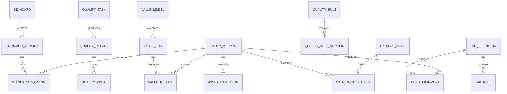

# 数据资产管理数据库设计说明（DBDD）

| 项目 | 内容 |
|---|---|
| 文档标识 | ZCGL-DBDD-001 |
| CSCI 标识 | ZCGL-CSCI |
| 数据库标识 | ZCGL-EXT-DB |
| 版本 | V0.1 |
| 状态 | 设计阶段草案 |
| 密级 | 非密（外网开发验证） |
| 编制依据 | GJB 438C-2021 附录 L、ZCGL-SRS-001 V0.1 |

## 修改页

| 版本 | 日期 | 修改内容 | 修改人 | 批准人 |
|---|---|---|---|---|
| V0.1 | 2026-07-19 | 按设计阶段基线首次编制 | 项目组 | 待定 |

# 1 范围

## 1.1 标识

本文档适用于数据资产管理软件 `ZCGL-CSCI` 的项目扩展数据库 `ZCGL-EXT-DB`，文档标识 `ZCGL-DBDD-001`，版本 V0.1。

OpenMetadata 自有数据库由受控 OpenMetadata 组件独占管理，不属于本文件的物理表设计范围；项目软件禁止直接读写其内部表。搜索索引、缓存和统计物化结果均为可重建派生存储，不是权威数据库。

## 1.2 数据库概述

`ZCGL-EXT-DB` 保存 OpenMetadata 实体映射、项目扩展属性、目录发布物、标签规则与候选、标准流程、主数据、质量规则与结果、问题闭环、外部字典缓存索引、资产登记、价值模型与运行、匿名行为事件与汇总、工作流引用、可靠事件、审计和实现深度证据。

数据库只处理公开、合成或经确认脱敏的数据。DBMS 产品、版本和部署拓扑为 TBC；逻辑设计采用标准关系模型、事务、唯一约束、JSON 扩展、时间分区和全文/派生索引接口。

## 1.3 文档概述

本文档按 GJB 438C-2021 附录 L 描述数据库级设计决策、概念/逻辑/物理设计、访问单元和需求追踪。软件设计见 `ZCGL-SDD-001`，外部接口见 `ZCGL-IRS-001`。

R/V1/V2 状态必须写入运行、模型和证据记录。V1 数据与 R 数据在来源、场景和统计口径上可区分；V2 不允许生成业务“成功”或算法“准确”结论。

# 2 引用文档

| 标识 | 文档名称 | 版本/日期 | 用途 |
|---|---|---|---|
| GJB 438C-2021 | 军用软件开发文档通用要求 | 2021 | DBDD 正文格式 |
| GJB 2786A | 军用软件开发通用要求 | 现行受控版 | 开发与质量要求 |
| ZCGL-SRS-001 | 数据资产管理软件需求规格说明 | V0.1 | 数据和能力需求 |
| ZCGL-IRS-001 | 数据资产管理接口需求规格说明 | V0.2 | 接口数据组合体 |
| ZCGL-SDD-001 | 数据资产管理软件设计说明 | V0.1 | 软件单元和数据边界 |

# 3 数据库级设计决策

| 决策标识 | 设计决策 | 理由及约束 |
|---|---|---|
| ZCGL-DBD-001 | OpenMetadata 是通用元数据实体、关系、血缘、分类和术语的权威源；项目通过公开 API/事件访问 | 保持产品完整性、升级能力和明确所有权 |
| ZCGL-DBD-002 | 项目扩展库是合同特有属性、流程、质量扩展、评估和行为数据的权威源 | 避免把项目专用结构侵入 OpenMetadata 内核 |
| ZCGL-DBD-003 | `entity_mapping` 维护项目标识、OpenMetadata 标识、FQN、实体类型和双方版本 | 支持幂等、冲突、重放、迁移和软删除 |
| ZCGL-DBD-004 | OpenMetadata 与扩展库之间不做跨库事务；项目事务用发件箱投递，状态以显式同步水位和冲突记录表示 | 避免虚假的分布式原子性承诺 |
| ZCGL-DBD-005 | 搜索索引、字典缓存、态势及行为汇总可从权威数据重建，保存来源版本和生成水位 | 支持恢复、权限变化和一致性核对 |
| ZCGL-DBD-006 | 标准、规则、主数据模型、价值模型和发布物采用不可变版本；草稿修改与发布版本分离 | 保证执行、审批和报告可复现 |
| ZCGL-DBD-007 | 批量维护逐项记录预校验、结果和补偿，不把部分成功表示成整体成功 | 保护已发布资产并支持恢复 |
| ZCGL-DBD-008 | 行为数据最小化、匿名化并按短周期保留；安全审计与行为分析物理/逻辑分离 | 降低个人信息和权限滥用风险 |
| ZCGL-DBD-009 | 审计仅追加并生成周期完整性清单；普通管理员无更新删除权 | 满足职责分离和完整性检查 |
| ZCGL-DBD-010 | V1 保存模拟器、场景、固定种子和输入快照；V2 只保存算法接口登记，运行状态不得为成功 | 防止虚做需求混入真实验证结论 |

数据库运行方式包括 `NORMAL`、`DEGRADED_EXTERNAL`、`READ_ONLY_PROTECT`、`RECOVERING`。OpenMetadata、搜索或消息不可用时，扩展库保留明确的待同步/索引过期状态；容量或完整性风险进入只读保护，停止发布和批量变更。

一致性以“权威源内强一致、跨权威源最终一致并可核对”为原则。实体映射冲突不得静默合并；索引文档版本不得领先于权威数据；已发布版本不可更新；权限撤销事件优先于普通索引更新；未知值不以零或空串替代。

# 4 数据库详细设计

## 4.1 概念设计

| 数据域 | 权威数据及边界 | 主要使用者 |
|---|---|---|
| 实体映射域 | 项目—OpenMetadata 标识、版本和同步状态；实体通用内容仍以 OpenMetadata 为准 | OMADAPTER、METADATA |
| 目录登记域 | 项目多级目录、资产发布物、责任和特有扩展属性 | CATALOG、PORTAL |
| 标签标准域 | 项目标签规则/候选、标准版本/映射；可映射定义同步到 OpenMetadata | TAG、STANDARD |
| 主数据域 | 项目主数据模型、版本、编码和发布过程 | MDM、WORKFLOW |
| 质量域 | 规则版本、任务、结果、问题和整改 | QUALITY |
| 分析域 | 态势定义、价值模型/运行/结果、最小化行为事件/汇总 | ANALYTICS |
| 外部协同域 | 字典缓存索引、流程引用、发件箱、死信和同步水位 | EXTERNAL、WORKFLOW |
| 治理审计域 | 审计、数据集、实现深度和验证制品索引 | AUDIT、质量保证 |

## 4.2 逻辑设计

### 4.2.1 通用数据元素

| 元素 | 技术名/类型 | 约束、范围和来源 |
|---|---|---|
| 稳定标识 | `id UUID` | 项目生成主键，不随产品升级改变 |
| 项目 | `project_id UUID` | 非空，来自安全上下文 |
| 实体引用 | `entity_mapping_id UUID` | 指向项目映射，不保存裸产品 ID 替代关系 |
| 版本 | `version BIGINT` | 从 1 单调递增，发布版本不可变 |
| 状态 | `status VARCHAR(32)` | 受控枚举及状态机校验 |
| 实现深度 | `evidence_level VARCHAR(4)` | `R`、`V1`、`V2`、`R/V1` |
| 模拟场景 | `scenario_id VARCHAR(128)` | V1/V2 必填，R 为空 |
| 数据分类 | `data_class VARCHAR(32)` | 外网只允许批准的非密枚举 |
| 主体 | `created_by/updated_by VARCHAR(128)` | 经鉴别的稳定主体标识 |
| 时间 | `created_at/updated_at TIMESTAMP_TZ` | UTC 存储；ISO 8601 交换 |
| 追踪号 | `trace_id VARCHAR(64)` | 跨接口、流程、任务和审计关联 |
| 扩展 | `extension JSON` | schema 版本化；禁止任意敏感数据和明文凭据 |

计数和容量使用非负 `BIGINT`；评分使用 `DECIMAL(p,s)` 并保存量纲/归一化规则；布尔值不得用含糊字符串；未知值用 `NULL` 并记录原因。所有字符串为 UTF-8，时间必须带时区语义。

### 4.2.2 实体映射、扩展和目录表

| 表标识/技术名 | 关键字段 | 关系、约束和保密性 |
|---|---|---|
| ZCGL-T-001 `entity_mapping` | `id,entity_type,project_key,om_entity_id,om_fqn,project_version,om_version,sync_status,last_synced_at` | `entity_type+project_key` 唯一；产品 ID/FQN 按有效期唯一；冲突显式 |
| ZCGL-T-002 `asset_extension` | `id,entity_mapping_id,owner_id,classification,visibility_scope,lifecycle_status,extension_schema,extension_json,version` | 每实体当前版本唯一；分类和可见范围受控 |
| ZCGL-T-003 `catalog_node` | `id,parent_id,node_code,name,domain,level,path,status,version` | 同父编码唯一；禁止环；路径为派生加速字段 |
| ZCGL-T-004 `catalog_asset_rel` | `id,catalog_id,entity_mapping_id,relation_status,valid_from,valid_to,version` | 有效期内关系唯一；移动保留历史 |
| ZCGL-T-005 `asset_publication` | `id,entity_mapping_id,catalog_snapshot,owner_snapshot,classification_snapshot,workflow_ref,status,version,published_at` | 发布物版本不可变；快照字段脱敏 |
| ZCGL-T-006 `bulk_change_item` | `id,batch_id,object_type,object_id,expected_version,validation_result,apply_result,error_code,compensation_status` | 每项结果独立，整体不得掩盖部分失败 |

### 4.2.3 标签、标准和主数据表

| 表标识/技术名 | 关键字段 | 关系、约束和保密性 |
|---|---|---|
| ZCGL-T-010 `tag_definition` | `id,tag_code,name,group_code,scope_rule,owner_id,status,version,om_tag_ref` | 标签编码版本内唯一；产品引用经映射 |
| ZCGL-T-011 `tag_rule` | `id,tag_id,version_no,condition_json,priority,evaluator_code,status` | 发布后只读；条件 schema 版本化 |
| ZCGL-T-012 `tag_assignment` | `id,entity_mapping_id,tag_id,source,rule_version,confirmed_by,valid_from,valid_to,status` | 同实体/标签有效期内唯一；推荐未经确认不生效 |
| ZCGL-T-013 `tag_recommendation` | `id,entity_mapping_id,tag_id,model_ref,input_snapshot_ref,rationale,confidence,status,evidence_level` | V1；保存依据，禁止自动发布 |
| ZCGL-T-014 `standard` | `id,standard_code,name,standard_type,owner_id,current_version,status` | 编码唯一；当前版本必须已发布 |
| ZCGL-T-015 `standard_version` | `id,standard_id,version_no,definition_json,definition_hash,workflow_ref,status,published_at` | `(standard_id,version_no)` 唯一，发布后只读 |
| ZCGL-T-016 `standard_mapping` | `id,standard_version_id,entity_mapping_id,field_ref,mapping_type,status,version` | 映射目标可追踪，字段引用需验证 |
| ZCGL-T-017 `master_model` | `id,model_code,name,current_version,status,owner_id` | 模型编码唯一 |
| ZCGL-T-018 `master_model_version` | `id,model_id,version_no,attributes_json,code_rule_json,hierarchy_json,definition_hash,status` | 发布后不可变；参照关系无环 |
| ZCGL-T-019 `master_change` | `id,model_version_id,change_type,payload_ref,workflow_ref,status,requested_by,decided_at` | 载荷受控存储；流程模式显式 R/V1 |

### 4.2.4 质量与问题闭环表

| 表标识/技术名 | 关键字段 | 关系、约束和保密性 |
|---|---|---|
| ZCGL-T-020 `quality_rule` | `id,rule_code,name,dimension,current_version,status,owner_id` | 规则编码唯一；维度为受控枚举 |
| ZCGL-T-021 `quality_rule_version` | `id,rule_id,version_no,evaluator_code,parameter_json,target_selector,threshold_json,definition_hash,status` | 发布后只读；参数 schema 校验 |
| ZCGL-T-022 `quality_task` | `id,name,source_ref,rule_set_snapshot,schedule_ref,status,current_version,evidence_level` | 数据源仅存受控引用；规则快照不可变 |
| ZCGL-T-023 `quality_run` | `id,task_id,task_version,trigger_key,status,started_at,ended_at,scanned_count,trace_id` | `trigger_key` 唯一；未知状态与成功分离 |
| ZCGL-T-024 `quality_result` | `id,run_id,rule_version_id,object_ref,total_count,passed_count,failed_count,duration_ms,status,sample_ref` | 计数非负且总数关系合法；样本受控/脱敏 |
| ZCGL-T-025 `quality_issue` | `id,result_id,severity,owner_id,due_at,status,current_workorder_id` | 每问题有来源结果；状态机受控 |
| ZCGL-T-026 `rectification_history` | `id,issue_id,action,actor_id,evidence_ref,comment_masked,from_status,to_status,acted_at` | 仅追加；证据引用有校验和 |

### 4.2.5 外部字典、搜索投影和流程表

| 表标识/技术名 | 关键字段 | 关系、约束和保密性 |
|---|---|---|
| ZCGL-T-030 `dictionary_source` | `id,source_code,adapter_mode,current_version,last_sync_at,valid_until,status` | V1 来源显式；过期不得伪装最新 |
| ZCGL-T-031 `dictionary_entry_cache` | `id,source_id,external_key,parent_key,name,value_json,source_version,valid_from,valid_to` | 来源+外部键+版本唯一；缓存可重建 |
| ZCGL-T-032 `search_projection_state` | `entity_mapping_id,authority_version,index_version,indexed_at,index_name,status` | 一实体一当前水位；索引版本不得超权威版本 |
| ZCGL-T-033 `workflow_instance_ref` | `id,business_type,business_id,adapter_mode,external_instance_id,current_step,status,version` | 业务对象+有效流程唯一；回调版本单调 |
| ZCGL-T-034 `workflow_event` | `id,workflow_ref,external_event_id,event_type,step,decision,actor_ref,event_time,payload_hash` | 外部事件标识唯一；V1 不伪造真实审批主体 |
| ZCGL-T-035 `integration_checkpoint` | `endpoint_code,partition_key,position,schema_version,updated_at` | 组合主键；位置单调前进 |

### 4.2.6 态势、价值与行为表

| 表标识/技术名 | 关键字段 | 关系、约束和保密性 |
|---|---|---|
| ZCGL-T-040 `dashboard_definition` | `id,name,owner_id,layout_json,metric_set_json,filter_json,refresh_seconds,status,version` | 指标口径、来源和权限范围必填 |
| ZCGL-T-041 `value_model` | `id,model_code,name,current_version,status,owner_id,evidence_level` | 当前为 V1；编码唯一 |
| ZCGL-T-042 `value_model_version` | `id,model_id,version_no,dimensions_json,normalization_json,weights_json,definition_hash,status` | 权重规则校验；发布后只读 |
| ZCGL-T-043 `value_run` | `id,model_version_id,input_snapshot_ref,scenario_id,status,started_at,ended_at,review_status` | V1 场景必填；不得标为目标业务实测 |
| ZCGL-T-044 `value_result` | `id,run_id,entity_mapping_id,dimension_scores_json,total_score,calculation_trace_ref,reviewed_by` | 分值精度固定；过程可追踪 |
| ZCGL-T-045 `behavior_event` | `id,anonymous_subject,event_type,entity_mapping_id,time_bucket,session_hash,minimal_context,event_time,evidence_level` | 不存真实姓名/原始 IP；短期分区保留 |
| ZCGL-T-046 `behavior_aggregate` | `id,period,scope_hash,event_type,event_count,subject_count,generated_at,source_watermark` | 低于最小群体阈值不展示；可重建 |
| ZCGL-T-047 `algorithm_port_registry` | `id,capability_code,input_schema,output_schema,threshold_schema,enabled,evidence_level,artifact_ref` | V2 默认 `enabled=false`；无成功运行表 |

### 4.2.7 可靠事件、审计和验证表

| 表标识/技术名 | 关键字段 | 关系、约束和保密性 |
|---|---|---|
| ZCGL-T-050 `interface_outbox` | `id,aggregate_type,aggregate_id,event_type,schema_version,idempotency_key,payload_ref,status,next_retry_at` | 幂等键唯一，与业务变更同事务 |
| ZCGL-T-051 `interface_receipt` | `id,outbox_id,endpoint_code,external_id,external_version,result,received_at` | 事件/端点有效回执唯一 |
| ZCGL-T-052 `dead_letter` | `id,outbox_id,error_code,error_summary,attempts,resolution_status,last_failed_at` | 处置受权并审计，摘要脱敏 |
| ZCGL-T-053 `sync_conflict` | `id,entity_mapping_id,project_version,om_version,conflict_type,project_hash,om_hash,status,resolution` | 不保存敏感正文；解决产生新版本 |
| ZCGL-T-054 `audit_event` | `id,event_time,subject_id,source,object_type,object_id,action,result,before_hash,after_hash,trace_id` | 仅追加；普通管理员不可更新删除 |
| ZCGL-T-055 `audit_integrity_manifest` | `period_start,period_end,event_count,first_hash,last_hash,manifest_hash,created_at` | 周期唯一；写后只读 |
| ZCGL-T-056 `test_dataset` | `id,name,source_class,generator_version,dataset_hash,entity_count,retention_until,status` | 公开/合成/确认脱敏三类之一 |
| ZCGL-T-057 `implementation_evidence` | `id,requirement_id,evidence_level,adapter_mode,scenario_id,artifact_ref,artifact_hash,result,review_status` | V2 不允许 PASS；V1 边界和模拟器必填 |

### 4.2.8 关系与业务规则

- `entity_mapping` 不级联删除；OpenMetadata 软删除后保留映射、扩展、历史发布物和审计。
- `asset_publication`、标准/规则/模型版本只有在引用对象均有效且权限检查通过后发布。
- `tag_recommendation` 未确认不得创建有效 `tag_assignment`；确认必须记录主体和输入版本。
- `quality_result` 的 `passed_count + failed_count` 不得大于 `total_count`，未评估数需由状态和原因解释。
- `search_projection_state.index_version` 不得大于 `authority_version`；权限撤销进入高优先级发件箱。
- `value_result` 必须引用真实执行产生的 `value_run` 和输入快照；不得插入孤立预置评分。
- `behavior_event` 超过保留期按批准任务清理，聚合须保存来源水位且满足最小群体阈值。
- `implementation_evidence.result=PASS` 必须有关联制品校验和与评审；`evidence_level=V2` 只能为 `DESIGN_ONLY/NOT_RUN`。

## 4.3 物理设计

| 项目 | 设计 |
|---|---|
| 模式 | `zcgl_mapping`、`zcgl_domain`、`zcgl_quality`、`zcgl_analytics`、`zcgl_integration`、`zcgl_audit` |
| 产品边界 | OpenMetadata DB 使用产品官方迁移和备份；项目账户无内部表 DML 权限；扩展库独立账户/模式 |
| 主键 | 原生 UUID 或固定等价映射；产品标识作为业务字段，不作为项目聚合主键 |
| 索引 | 外键、项目键/FQN、状态+更新时间、对象+版本、工作流、追踪号、幂等键和权限范围摘要 |
| 分区 | 质量运行/结果、行为事件、审计、发件箱按月/日分区；周期由容量试验决定 |
| JSON | 仅用于版本化扩展/快照；高频过滤字段提升为受约束列，建立 schema 校验 |
| 大对象 | 报告、样本、输入快照、证据和大 payload 存受控对象存储，仅保存引用、大小和校验和 |
| 事务 | 单领域聚合强事务；OpenMetadata/搜索/外部服务使用发件箱、回执、冲突和补偿 |
| 备份 | 扩展库一致性备份；OpenMetadata 官方备份；搜索索引不作为唯一备份，恢复时重建 |
| 恢复顺序 | 恢复 OpenMetadata 与扩展库→核对映射版本→重放发件箱→重建搜索/汇总→核查外部流程 |

权限按应用读写、只读查询、迁移、审计追加、审计查询和备份恢复分离。数据库连接必须使用 TLS/批准保护方式和密钥引用。保留期限由合同、总体数据管理和非密验证数据销毁规则批准；物理清理使用版本化脚本、影响清单、双人复核和审计。

# 5 用于数据库访问或操纵的软件单元的详细设计

## 5.1 ZCGL-DBU-MAPPING 映射与同步单元

输入项目规范实体、期望项目版本和 OpenMetadata 响应，输出稳定映射或显式冲突。写入使用项目键唯一约束及乐观锁。OpenMetadata 响应不确定时先按项目键/FQN查询核对；不得直接查询产品内部表。同步成功在同一事务更新映射水位并写出索引投影事件。

## 5.2 ZCGL-DBU-DOMAIN 领域仓储单元

为目录、标签、标准、主数据、质量和分析聚合提供仓储端口。写入前校验项目、权限上下文、状态、版本、数据分类和引用有效性。批量变更先写逐项预检，提交时按 `expected_version` 条件更新；冲突项失败但不掩盖其他项结果。

## 5.3 ZCGL-DBU-QUALITY 质量结果单元

质量任务启动时固定规则和数据源快照，逐规则批量写结果并校验计数关系。报告查询从结果表聚合，不读预置报告。任务异常时保留已写明细和 `UNKNOWN/FAILED` 状态，恢复过程按触发键和执行器回执核对，不重复制造成功结果。

## 5.4 ZCGL-DBU-ANALYTICS 分析数据单元

价值运行在事务内登记模型版本、输入快照和 V1 场景，计算结果逐资产写入并保存过程引用。行为写入先去除非必要字段并生成匿名主体；汇总作业记录来源水位，可安全重跑。V2 算法端口只读注册表，默认不创建运行记录。

## 5.5 ZCGL-DBU-OUTBOX 可靠事件单元

业务变化与 `interface_outbox` 同事务提交。后台使用租约领取、上限退避、回执唯一约束和死信；旧实体版本事件不覆盖新版本。权限撤销、软删除和安全审计具有更高队列优先级。payload 可能敏感时仅保存受控对象引用。

## 5.6 ZCGL-DBU-AUDIT 审计单元

只提供追加和授权检索。业务、安全和匿名行为审计按类型分流；安全审计生成规范摘要和周期完整性清单。普通管理员不具备更新/删除权限，导出、归档、特权维护和销毁都产生审计记录。

## 5.7 ZCGL-DBU-MIGRATION 迁移、重建与恢复单元

扩展库迁移脚本按序号、版本和校验和不可变管理，执行前验证 schema 和备份，执行后检查约束、索引、权限和字典。OpenMetadata 只使用其受控升级工具。搜索重建从权威 API/扩展库投影到新索引，经数量、版本水位和权限抽查后原子切换。迁移不得插入伪造测试通过、评分或审计数据。

# 6 需求可追踪性

省略前缀均为 `ZCGL-SRS-`；连续范围包含首尾之间每项需求。

## 6.1 数据库/软件单元到需求

| 数据库对象/单元 | SRS 需求 |
|---|---|
| T-001～006 映射目录 | F-001～003、006～007、014～015、020，IF-002～003，DATA-001 |
| T-010～019 标签标准主数据 | F-004～013，DATA-001 |
| T-020～026 质量 | F-016～018，P-002、004，SAFE-001 |
| T-030～035 外部/流程/索引 | F-005、011、013、018～024，P-001、003，IF-001～003，DATA-002 |
| T-040～047 分析 | F-023、025～027，DATA-001、003，SEC-001～002 |
| T-050～057 可靠性审计验证 | GEN-001～002，IIF-001～002，DATA-002～003，CNST-003 |
| DBU-MAPPING/DOMAIN | CNST-001～002，ADP-001，QUAL-001 |
| DBU-QUALITY/ANALYTICS | P-001～004，SAFE-001 |
| DBU-OUTBOX/AUDIT/MIGRATION | SEC-001，ENV-001，SUP-001，PKG-001 |

## 6.2 需求到数据库/软件单元

| 需求集合 | 数据库对象/单元 |
|---|---|
| GEN、STATE | T-001、023、032、050～057及各状态字段 |
| F-001～007 | T-001～006、017～019，DBU-MAPPING/DOMAIN |
| F-008～015 | T-010～019，DBU-DOMAIN |
| F-016～021 | T-020～035，DBU-QUALITY/DOMAIN |
| F-022～027 | T-040～047、030～035，DBU-ANALYTICS |
| P-001～004 | 实体映射、搜索水位、质量表、物理索引/分区 |
| IF、IIF | T-030～035、050～053，DBU-MAPPING/OUTBOX |
| DATA、ADP、SEC、SAFE、ENV、QUAL | 全部 schema、审计、备份、恢复和访问单元 |
| RES、CNST、SUP、PKG | 产品边界、物理设计、迁移、重建和配置管理 |

# 7 注释

| 术语 | 含义 |
|---|---|
| 扩展库 | 保存项目特有业务数据、与 OpenMetadata 分离的关系数据库 |
| FQN | OpenMetadata 实体完全限定名，用于定位但不替代项目稳定标识 |
| 权威源 | 对一类事实承担最终修改和冲突裁决责任的数据源 |
| 水位 | 已同步、已索引或已汇总到的单调版本/位置 |
| 派生数据 | 可从权威数据按受控规则重新生成的数据 |

待确认项包括 OpenMetadata、DBMS、搜索和消息产品版本，实体映射规则，百万实体生成方案，权限范围表达，HJJ/GIS/工作流/门户/共享交换接口，数据保留期限及备份 RPO/RTO。选型后应补充精确 SQL 类型、表空间、分区周期、索引参数、账户权限矩阵、官方升级/备份步骤和容量试验结果；不得通过物理实现改变本文件规定的数据所有权。
