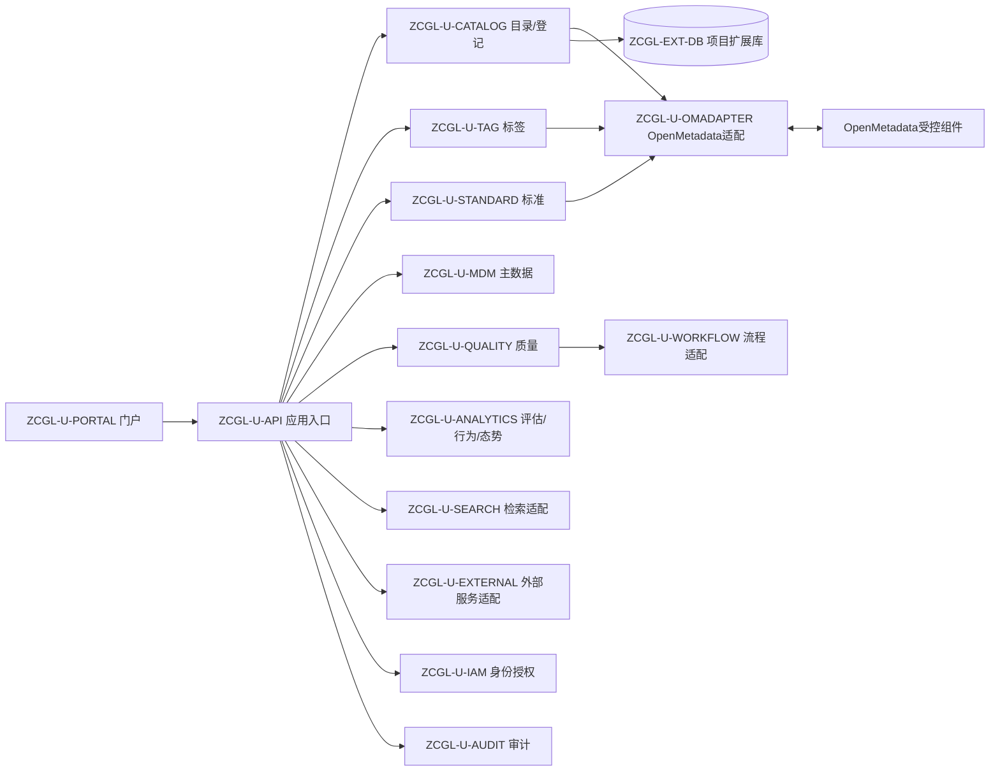
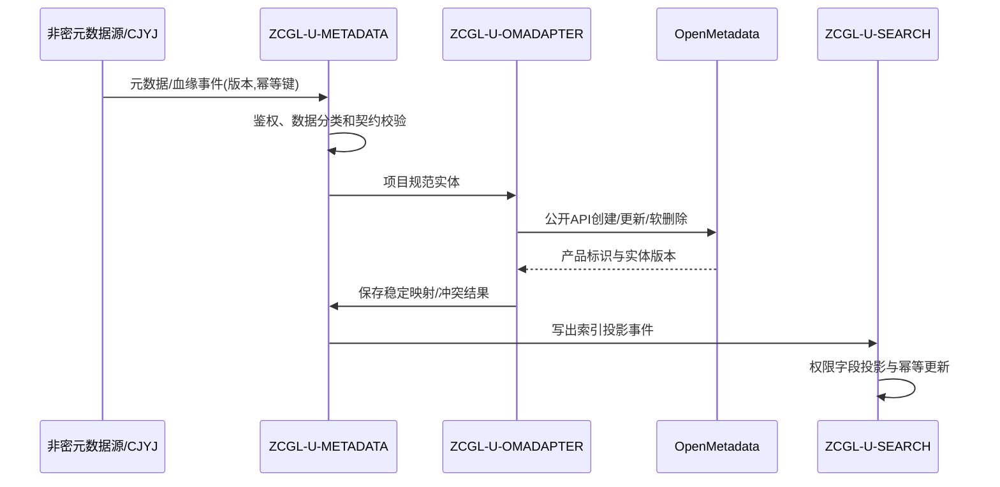
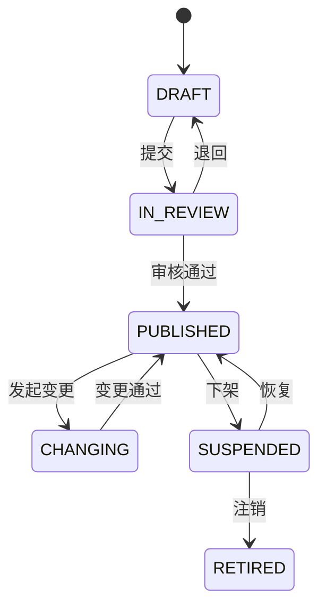
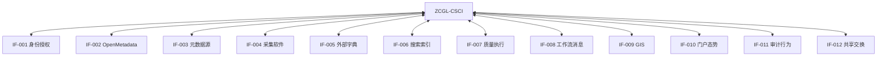

# 数据资产管理软件设计说明（SDD）

| 项目 | 内容 |
|---|---|
| 文档标识 | ZCGL-SDD-001 |
| CSCI 标识 | ZCGL-CSCI |
| 版本 | V0.1 |
| 状态 | 设计阶段草案 |
| 密级 | 非密（外网开发验证） |
| 编制依据 | GJB 438C-2021 附录 K、ZCGL-SRS-001 V0.1 |

## 修改页

| 版本 | 日期 | 修改内容 | 修改人 | 批准人 |
|---|---|---|---|---|
| V0.1 | 2026-07-19 | 按设计阶段基线首次编制 | 项目组 | 待定 |

# 1 范围

## 1.1 标识

本文档适用于数据资源支撑系统的数据资产管理软件配置项 `ZCGL-CSCI`，文档标识 `ZCGL-SDD-001`，版本 V0.1。软件以受控版本 OpenMetadata 为元数据核心，通过公开 API、事件和插件映射合同指标，项目扩展不得直接修改 OpenMetadata 内部数据库。

## 1.2 系统概述

`ZCGL-CSCI` 面向公开、合成或经确认脱敏的数据，提供元数据、主数据、目录、标签、数据标准、维护、质量、外部字典、资产登记与检索、时空预览、资产态势、价值评估和行为分析能力。软件在外网非密环境验证架构、真实基础能力和受控模拟流程，不形成目标涉密环境、真实业务模型或外部平台联调结论。

软件采用门户/领域服务/OpenMetadata 适配/搜索与数据库基础设施分层部署。当前运行现场为批准的外网非密开发验证环境，目标现场、需方、用户、开发方和保障机构以项目总体受控文件为准。

## 1.3 文档概述

本文档按 GJB 438C-2021 附录 K 给出 CSCI 级设计决策、体系结构、接口和软件单元详细设计，并对 `ZCGL-SRS-001` 建立双向追踪。数据库详细设计见 `ZCGL-DBDD-001`，外部接口需求见 `ZCGL-IRS-001`。

实现深度沿用 SRS：`R` 运行真实业务逻辑与非密数据闭环；`V1` 运行真实项目逻辑但外部对端由版本化模拟器替代；`V2` 只形成关闭状态的模型、算法接口、阈值和样例。所有模拟/占位状态均应在界面、日志、接口和证据中标识，禁止用预置结论伪装执行结果。

# 2 引用文档

| 标识 | 文档名称 | 版本/日期 | 用途 |
|---|---|---|---|
| GJB 438C-2021 | 军用软件开发文档通用要求 | 2021 | SDD 正文格式和内容要求 |
| GJB 2786A | 军用软件开发通用要求 | 现行受控版 | 软件工程和质量保证约束 |
| ZCGL-SSS-001 | 数据资产管理分系统规格说明 | V0.2 | 上级需求与边界 |
| ZCGL-IRS-001 | 数据资产管理接口需求规格说明 | V0.2 | 外部接口需求 |
| ZCGL-SRS-001 | 数据资产管理软件需求规格说明 | V0.1 | 软件需求基线 |
| ZCGL-DBDD-001 | 数据资产管理数据库设计说明 | V0.1 | 数据库详细设计 |
| SDP-001 | 软件开发计划 | 当前受控版 | 生命周期和配置管理 |

# 3 CSCI 级设计决策

| 决策标识 | 设计决策 | 理由及约束 |
|---|---|---|
| ZCGL-DD-001 | OpenMetadata 是通用元数据权威源，项目通过公开 API、事件和插件访问，不直连其内部表 | 隔离产品升级，避免破坏产品完整性和支持边界 |
| ZCGL-DD-002 | 目录、标签/术语等可映射能力优先映射到 OpenMetadata；项目特有审批、价值、行为和扩展属性保存在扩展库 | 减少重复权威数据，同时保留合同特有语义 |
| ZCGL-DD-003 | 每个 OpenMetadata 实体建立稳定的项目标识—产品标识—完全限定名映射，并进行乐观版本控制 | 支持升级、冲突检测、重放和软删除 |
| ZCGL-DD-004 | 搜索索引、缓存和统计汇总均为可重建派生数据，不作为权威源 | 满足一致性、恢复和权限变更要求 |
| ZCGL-DD-005 | 领域服务只依赖项目规范模型和端口，OpenMetadata、搜索、工作流、GIS、字典等由适配器实现 | 支持真实与模拟对端切换和契约测试 |
| ZCGL-DD-006 | 业务事务与异步事件通过事务发件箱衔接；消费端按幂等键、实体版本和检查点处理 | 防止重复、乱序和静默覆盖 |
| ZCGL-DD-007 | 规则、标准、模型、目录发布物采用不可变版本和显式生命周期状态 | 保证审批、执行、报告和审计可复现 |
| ZCGL-DD-008 | 检索先做主体与数据范围约束，再返回摘要；无权资产不出现在命中总数、聚合和联想中 | 防止通过索引侧信道泄露 |
| ZCGL-DD-009 | 价值评估和标签推荐保存输入快照、规则/模型版本、过程和人工确认，当前均按 V1 | 保持可解释性，不宣称目标业务语义或模型准确率 |
| ZCGL-DD-010 | 异常行为识别与个性化偏好仅提供默认关闭的 V2 算法端口和样例 | 缺少真实授权数据、业务基线和评价准则 |
| ZCGL-DD-011 | R/V1/V2 由功能开关、适配器登记和证据登记共同控制，模拟数据与真实非密数据分区标识 | 防止测试口径混淆和虚假通过 |

安全关键设计：仅接收标识为公开、合成或已确认脱敏的数据；凭据使用密钥引用；分类分级字段在外网只使用非密验证枚举；批量变更、发布、撤权和物理删除需权限、影响预览、确认及审计；行为事件最小化并匿名化；正式密码、跨域交换和集中审计只做 V1 契约验证。

CSCI 具有 `NORMAL`、`DEGRADED_SEARCH`、`DEGRADED_EXTERNAL`、`MAINTENANCE` 状态。依赖不可用时不得把未知值替换成零或空成功；页面和接口返回权威源/索引时效及降级原因。

# 4 CSCI 体系结构设计

## 4.1 CSCI 部件

| 软件单元 | 用途 | 状态/类型 | 实现深度 | 计划库位 |
|---|---|---|---|---|
| ZCGL-U-PORTAL | 元数据、目录、标签、标准、质量、检索和态势界面 | 新开发/集成 | R/V1 | 项目前端库 |
| ZCGL-U-API | API 聚合、校验、安全上下文和事务边界 | 新开发 | R | 应用服务模块 |
| ZCGL-U-OMADAPTER | OpenMetadata 规范模型转换、版本冲突和事件处理 | 新开发适配器，复用 OpenMetadata | R | 元数据适配模块 |
| ZCGL-U-METADATA | 元数据登记、采集、关系、血缘和版本编排 | 新开发/集成 | R/V1 | 元数据领域模块 |
| ZCGL-U-CATALOG | 资源目录、资产登记、维护、责任和生命周期 | 新开发 | R | 资产领域模块 |
| ZCGL-U-TAG | 标签体系、规则、赋标、覆盖分析和推荐 | 新开发 | R/V1 | 标签领域模块 |
| ZCGL-U-STANDARD | 数据元、术语、代码、值域、映射及生命周期 | 新开发 | R/V1 | 标准领域模块 |
| ZCGL-U-MDM | 主数据模型、编码、层级、发布和变更 | 新开发 | R/V1 | 主数据领域模块 |
| ZCGL-U-QUALITY | 质量规则、任务、结果、问题和整改闭环 | 新开发 | R/V1 | 质量领域模块 |
| ZCGL-U-SEARCH | 权限裁剪检索、索引投影、重建和时效管理 | 新开发适配器 | R | 检索模块 |
| ZCGL-U-WORKFLOW | 本地流程、外部工作流和消息适配 | 新开发 | R/V1 | 流程模块 |
| ZCGL-U-EXTERNAL | 字典、GIS、门户、采集软件和共享交换适配 | 新开发 | R/V1 | 外部适配模块 |
| ZCGL-U-ANALYTICS | 态势、价值评估、行为统计及算法端口 | 新开发 | R/V1/V2 | 分析模块 |
| ZCGL-U-IAM | 统一/本地身份、组织、角色和数据范围适配 | 新开发 | R/V1 | 安全适配模块 |
| ZCGL-U-AUDIT | 业务审计、安全审计和行为审计分流 | 新开发 | R/V1 | 审计模块 |
| ZCGL-U-SIM | HJJ、GIS、门户、工作流、共享交换等模拟器 | 新开发验证保障软件 | V1/V2 | 独立 `simulators` 库 |

OpenMetadata 及其数据库、搜索引擎、消息服务属于受控基础软件；项目扩展库属于 `ZCGL-CSCI` 数据单元。所有第三方版本、镜像、补丁、许可证和哈希进入 SBOM。模拟器与真实适配器分别构建，目标部署包不得默认装载 V2 算法实现。

验证资源按门户/API、领域服务、OpenMetadata、扩展数据库、搜索引擎和消息服务可独立部署设计。百万实体和十万记录质量执行必须在固定软硬件、数据生成版本、索引规模及冷/热缓存条件下测试，建议资源不构成性能合格结论。

## 4.2 执行方案

### 4.2.1 元数据采集、映射和索引

旧版本事件不得覆盖新版本。OpenMetadata 响应不确定时通过项目标识、完全限定名和请求号查询核对。索引失败不回滚已确认权威变更，而进入可重放队列并显示索引时效。

### 4.2.2 资产发布和变更状态机

每次发布固定引用实体、目录、标签、标准和责任关系版本。工作流为本地实现时按 R 验证；使用模拟或缺失外部流程时按 V1，流程实例必须记录适配器模式。

### 4.2.3 质量闭环

质量规则版本发布后才能进入任务。执行流程为取任务快照→校验数据源权限→分片/规则执行→逐规则持久化结果→汇总报告→生成问题→分派整改→复核关闭。未知执行状态不计成功；外部工单不可用时本地闭环继续并保存待同步状态。

### 4.2.4 价值和行为分析

价值评估读取已授权的资产快照和模型版本，逐维计算并保存中间值、总分与人工复核；当前结论标记 `SIMULATED_MODEL`。行为统计只接收最小化匿名事件并按授权范围聚合。异常识别端口 V2 默认关闭，调用时返回明确的 `CAPABILITY_DISABLED`，不能返回预置风险分。

### 4.2.5 并发、降级和恢复

- 对实体更新使用项目版本与 OpenMetadata 版本双重乐观锁；冲突进入人工/规则化合并。
- 发件箱、检查点和死信均持久化；恢复后按版本和幂等键重放。
- 搜索不可用时可降级到受限权威查询，并显示能力和时效差异。
- 批量维护先预校验和影响预览，逐项提交；部分成功必须返回可识别清单。
- 数据库、搜索或消息容量超过阈值时停止高风险批量任务，保护已发布资产并告警。

## 4.3 接口设计

### 4.3.1 接口标识和接口图

外部接口沿用 `ZCGL-IF-001～012`；接口实体、字段、频率、安全和异常约束以 `ZCGL-IRS-001` 为准。内部接口使用 `ZCGL-IIF-{提供单元}-{序号}`。

### 4.3.2 ZCGL-IF-001～012 外部接口

| 接口 | 主要组合体 | 通信/控制 | 实现深度与失效处理 |
|---|---|---|---|
| IF-001 身份授权 | 主体、组织、角色、权限和数据范围 | HTTPS/OIDC 或批准协议 | R/V1；不确定授权拒绝高风险操作 |
| IF-002 OpenMetadata | 实体、关系、血缘、分类、术语、版本和事件 | 公开 REST/事件/插件 | R；不直连内部数据库，冲突隔离 |
| IF-003 元数据源 | 连接引用、对象、模式、关系和检查点 | 受控连接器 | 至少一种 R，其余 V1；错误源隔离 |
| IF-004 采集软件 | 数据源、任务、运行、批次、血缘和状态 | REST/事件 | R/V1；与 `CJYJ-IF-007` 对偶，支持重放 |
| IF-005 外部字典 | 目录、条目、层级、版本和失效 | REST/增量事件 | V1；带版本缓存并显示更新时间 |
| IF-006 搜索索引 | 索引文档、权限投影、查询和重建状态 | 搜索引擎 API | R；索引为派生数据，可重建 |
| IF-007 质量执行 | 规则快照、任务、进度、结果和样本摘要 | JDBC/任务 API/插件 | R/V1；未知状态不计成功 |
| IF-008 工作流消息 | 流程、待办、决定、回调、通知 | REST/消息 | R/V1；回调幂等，核心事务不伪回滚 |
| IF-009 GIS | 坐标参考、范围、摘要、底图和预览 | GIS API | V1；公开底图与合成数据，语义不明拒绝 |
| IF-010 门户态势 | 组件、指标、筛选、刷新和下钻 | 组件协议/REST | 本地 R、总体门户 V1；过期不显示零值 |
| IF-011 审计行为 | 审计/匿名行为事件、追踪号和时间 | 受保护异步上报 | R/V1；本地缓冲并恢复补传 |
| IF-012 共享交换 | 目录、发布、申请、授权、撤权和状态 | REST/事件 | V1；保留待同步和撤权跟踪 |

所有数据组合体使用稳定标识、UTF-8、ISO 8601 含时区时间和显式 schema 版本。请求必须传递主体、追踪标识、数据分类、幂等键或游标；响应必须区分空结果、无权限、未知和外部不可用。接口超时、配额、批量大小和兼容版本环境化配置。

### 4.3.3 内部接口

| 标识 | 提供方→使用方 | 类型 | 输入/输出及约束 |
|---|---|---|---|
| ZCGL-IIF-META-001 | METADATA→OMADAPTER | 命令/查询 | 规范实体、期望版本、幂等键；返回映射和产品版本 |
| ZCGL-IIF-META-002 | METADATA→SEARCH | 事件 | 索引投影、权限摘要、实体版本；事务发件箱投递 |
| ZCGL-IIF-CAT-001 | CATALOG→WORKFLOW | 命令/回调 | 发布物快照、流程类型、决定和回调版本 |
| ZCGL-IIF-QUAL-001 | QUALITY→EXTERNAL | 任务/结果 | 规则快照、数据源引用、进度和结果摘要 |
| ZCGL-IIF-ANA-001 | ANALYTICS→领域单元 | 查询 | 经权限裁剪的版本化快照，不访问产品内部表 |
| ZCGL-IIF-AUD-001 | 各单元→AUDIT | 事件 | 业务、安全、行为事件分流；行为事件匿名化 |

# 5 CSCI 详细设计

## 5.1 ZCGL-U-PORTAL、ZCGL-U-API

门户按角色提供元数据、目录、标签、标准、主数据、质量、检索和分析工作台。搜索结果、聚合数和联想均应用同一权限裁剪；V1/V2 页面和导出显式标注验证深度、数据性质、模型/模拟器版本。API 层负责 DTO 校验、安全上下文、幂等头、事务入口和错误映射，领域状态机不放在控制器中。

## 5.2 ZCGL-U-OMADAPTER、ZCGL-U-METADATA

适配器维护项目规范实体与 OpenMetadata 实体的映射。写入步骤为规范化→分类/权限检查→映射定位→带期望版本调用公开 API→保存产品版本→产生投影事件。重复请求返回原结果；版本冲突保存双方摘要并进入冲突状态。软删除事件保留映射和历史，不物理清理项目审计。

元数据采集器保存源、采集配置版本和检查点；至少一种真实非密数据库完成 R 闭环。缺失源类型由同契约模拟器产生版本化样例，记录 `simulationScenarioId`。任何采集器不得把凭据或样本数据写入普通元数据字段。

## 5.3 ZCGL-U-CATALOG、ZCGL-U-TAG、ZCGL-U-STANDARD

目录树采用稳定节点标识和显式父子关系；移动、合并、停用和删除先计算引用影响。资产登记将 OpenMetadata 实体、目录、责任人、分类分级、可见范围和生命周期组合成版本化发布物。

标签定义、规则和赋值分别版本化。规则运行生成候选赋值，人工确认后方可成为有效标签；推荐 V1 保存依据、置信信息和输入版本。标准单元管理数据元、术语、代码集、格式、值域和映射，发布后版本不可变；流程适配器模式决定 R/V1 证据属性。

## 5.4 ZCGL-U-MDM、ZCGL-U-QUALITY

主数据模型包含编码规则、属性、层级和参照关系。申请、审核、发布、停用和通知均引用模型版本；外部流程缺失时由本地流程或 V1 模拟器执行，不伪造审批人。

质量规则由类型、参数、对象选择器、阈值和执行器组成。任务固定引用规则和数据源快照；执行结果逐规则保存总数、通过数、失败数、耗时和错误，报告由结果实时汇总，不使用预生成通过数据。问题闭环保存责任、期限、证据、复核和每次退回历史。

## 5.5 ZCGL-U-SEARCH

索引文档由权威实体和项目扩展投影生成，包含实体版本、可见主体/范围摘要和索引时间。查询先构造权限过滤再执行全文、过滤、排序和聚合。索引事件按实体标识与版本幂等更新，旧版本丢弃并计数；全量重建写入新索引，通过数量与版本水位校验后原子切换。无法确定权限时不返回结果。

## 5.6 ZCGL-U-WORKFLOW、ZCGL-U-EXTERNAL

工作流端口提供发起、查询、决定、撤销和回调。回调使用流程实例、步骤和事件标识去重。外部字典缓存携带来源版本和有效期；过期时显示时效，不以本地编辑冒充外部数据。GIS 只处理公开底图与合成时空摘要。总体门户和共享交换使用 V1 模拟器时，所有返回均携带模拟标识且不得改变为“联调通过”。

采集软件接口优先由两个 CSCI 实例真实联调；无法同时部署时模拟器严格复用对偶契约和错误场景。

## 5.7 ZCGL-U-ANALYTICS

态势组件保存指标定义、过滤、布局、刷新周期、口径、来源和权限范围。价值模型由维度、指标、归一化方式、权重和版本组成，运行时保存输入快照、逐项分值、总分和复核；当前为 V1 方法仿真。

行为事件仅保留匿名主体、事件类型、对象、时间桶、会话和必要上下文，原始 IP、真实姓名等不进入分析库。统计聚合按最小人数/次数阈值显示。异常识别和偏好推断 V2 端口默认关闭，只提供输入输出模型、阈值和样例，不输出预置准确率。

## 5.8 ZCGL-U-IAM、ZCGL-U-AUDIT、ZCGL-U-SIM

身份适配器将外部角色映射为项目角色和数据范围，并保留映射版本。审计单元将业务管理、安全和匿名行为事件分流存储；普通管理员不能修改或删除安全审计。模拟器支持固定种子、虚拟时间、故障注入和期望契约，必须调用真实领域端口，不能绕过校验直接写“成功”状态。

# 6 需求可追踪性

下表中的连续范围包含首尾之间每一项需求；省略前缀均为 `ZCGL-SRS-`。

## 6.1 软件单元到 CSCI 需求

| 软件单元 | 分配的 SRS 需求 |
|---|---|
| PORTAL、API | GEN-001～002，STATE-001～002，F-020～024，IF-001，HUM-001，OTH-001 |
| OMADAPTER、METADATA | F-001～003，IF-002～003，IIF-001～002，DATA-001，CNST-001 |
| CATALOG | F-006～007、014～015、020，DATA-001 |
| TAG | F-008～011，DATA-001 |
| STANDARD | F-012～013，DATA-001 |
| MDM | F-004～005，DATA-001 |
| QUALITY | F-016～018，P-002、004，SAFE-001 |
| SEARCH | F-021，P-001、003，DATA-002 |
| WORKFLOW、EXTERNAL、SIM | F-005、011、013、018～019、022、024，IF-001、003，SEC-002，RES-004，CNST-003 |
| ANALYTICS | F-023、025～027，P-001，DATA-001 |
| IAM、AUDIT | F-026，SEC-001～002，SAFE-001 |
| 全部及构建部署 | ADP-001，ENV-001，QUAL-001，RES-001～004，CNST-001～003，TRAIN-001，SUP-001，PKG-001 |

## 6.2 CSCI 需求到软件单元

| 需求集合 | 软件单元 |
|---|---|
| GEN、STATE | PORTAL、API、METADATA、SEARCH、EXTERNAL |
| F-001～003 | METADATA、OMADAPTER、EXTERNAL |
| F-004～007 | MDM、CATALOG、WORKFLOW |
| F-008～013 | TAG、STANDARD、WORKFLOW、SIM |
| F-014～021 | CATALOG、QUALITY、SEARCH、EXTERNAL、WORKFLOW |
| F-022～024 | PORTAL、EXTERNAL、ANALYTICS、SIM |
| F-025～027 | ANALYTICS、IAM、AUDIT、SIM |
| P-001～004 | METADATA、SEARCH、QUALITY、基础设施 |
| IF-001～003、IIF-001～002 | OMADAPTER、METADATA、EXTERNAL、SEARCH、SIM |
| DATA-001～003 | 各领域单元、数据库单元、AUDIT |
| ADP、SEC、SAFE、ENV、QUAL | API、适配器、IAM、AUDIT、部署单元 |
| RES、CNST、HUM、TRAIN、SUP、PKG、OTH | 全部软件单元及配置/质量保证活动 |

TBC-001～006 是待确认设计输入，关闭时应记录对 OpenMetadata 版本、模拟器、数据模型、接口、测试和转实计划的影响。

# 7 注释

| 缩略语 | 含义 |
|---|---|
| CSCI | 计算机软件配置项 |
| SDD | 软件设计说明 |
| DBDD | 数据库设计说明 |
| FQN | 完全限定名 |
| SPI | 服务提供者接口/插件扩展接口 |
| R/V1/V2 | 真实实现/受控模拟/设计占位 |

设计待确认项：OpenMetadata 受控版本、许可证与允许修改范围，真实元数据源及百万数据集生成方式，HJJ/GIS/门户/工作流/审计/共享交换契约，搜索与消息产品，价值评估业务模型和行为分析评价准则。任何确认结果导致产品内核修改、数据所有权变化或 V1/V2 转实时，均需受控变更并同步修订 SRS、SDD、DBDD、接口和测试文档。
