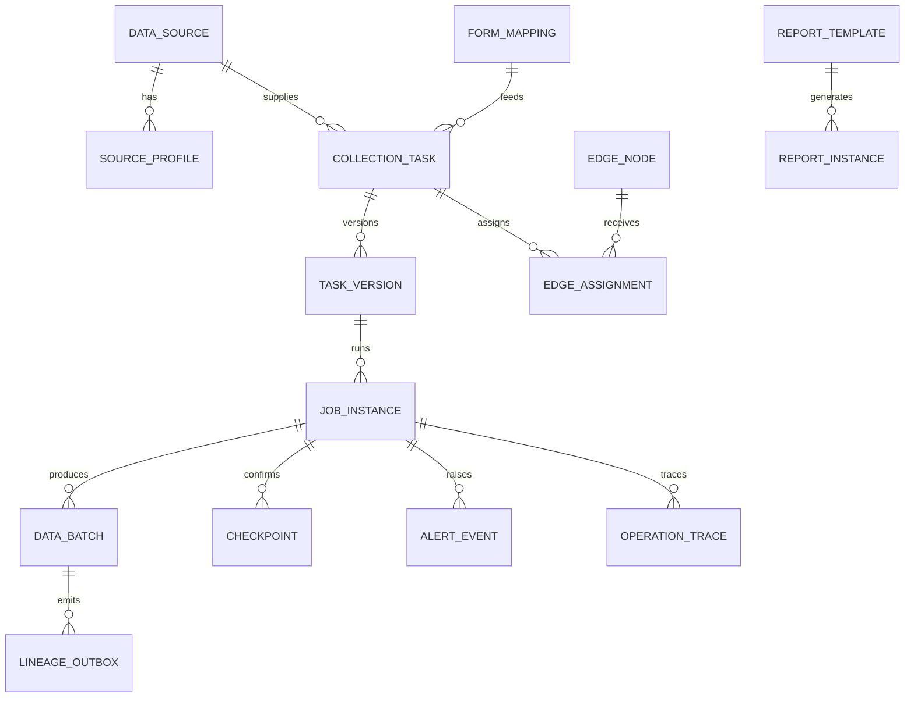

# 数据采集引接数据库设计说明（DBDD）

| 项目 | 内容 |
|---|---|
| 文档标识 | CJYJ-DBDD-001 |
| CSCI 标识 | CJYJ-CSCI |
| 数据库标识 | CJYJ-DB |
| 版本 | V0.1 |
| 状态 | 设计阶段草案 |
| 密级 | 非密（外网开发验证） |
| 编制依据 | GJB 438C-2021 附录 L、CJYJ-SRS-001 V0.1 |

## 修改页

| 版本 | 日期 | 修改内容 | 修改人 | 批准人 |
|---|---|---|---|---|
| V0.1 | 2026-07-19 | 按设计阶段基线首次编制 | 项目组 | 待定 |

# 1 范围

## 1.1 标识

本文档适用于数据采集引接软件 `CJYJ-CSCI` 的项目数据库 `CJYJ-DB`，文档标识 `CJYJ-DBDD-001`，版本 V0.1。`CJYJ-DB` 由配置与运行、接口可靠投递、审计及验证登记等逻辑模式组成。

TDuck、SeaTunnel Engine 及外部数据源/目标的自有数据库不属于 `CJYJ-DB`。项目软件只通过批准的 API、连接器或适配器访问这些配置项，不直接读写其内部业务表。

## 1.2 数据库概述

`CJYJ-DB` 保存数据源登记、TDuck 对象映射、采报/引接任务、不可变配置版本、运行实例、批次、检查点、文件导入、报告、边缘节点、协议插件、告警、追踪、发件箱、死信、审计和实现深度证据索引。数据库只允许保存公开、合成或经确认脱敏的数据及凭据引用，不保存真实涉密数据和明文凭据。

数据库管理系统的最终产品和版本为 TBC。本设计使用关系模型、事务、唯一约束、JSON 扩展字段和时间分区等通用能力，物理类型在产品选型后通过受控映射确定。

## 1.3 文档概述

本文档按 GJB 438C-2021 附录 L 描述数据库级决策、概念/逻辑/物理设计、访问软件单元及需求追踪。软件体系结构见 `CJYJ-SDD-001`，外部接口见 `CJYJ-IRS-001`。

字段级示例不含真实地址、密钥或数据样本。R/V1/V2 记录必须显式保存实现深度和模拟场景；数据库不得通过预置成功记录制造验证通过证据。

# 2 引用文档

| 标识 | 文档名称 | 版本/日期 | 用途 |
|---|---|---|---|
| GJB 438C-2021 | 军用软件开发文档通用要求 | 2021 | DBDD 正文格式 |
| GJB 2786A | 军用软件开发通用要求 | 现行受控版 | 开发与质量要求 |
| CJYJ-SRS-001 | 数据采集引接软件需求规格说明 | V0.1 | 数据和能力需求 |
| CJYJ-IRS-001 | 数据采集引接接口需求规格说明 | V0.2 | 接口数据组合体 |
| CJYJ-SDD-001 | 数据采集引接软件设计说明 | V0.1 | 软件单元和访问边界 |

# 3 数据库级设计决策

| 决策标识 | 设计决策 | 理由及约束 |
|---|---|---|
| CJYJ-DBD-001 | 项目库、TDuck 库、SeaTunnel/调度内部库及业务源/目标库分别拥有数据，禁止跨产品直连内部表 | 避免升级耦合和绕过产品规则 |
| CJYJ-DBD-002 | 所有业务主键使用项目生成的稳定 UUID/等价全局标识，外部标识存于映射表 | 支持环境迁移、重放和多产品标识关联 |
| CJYJ-DBD-003 | 任务配置、表单映射、报告模板和规则发布后形成不可变版本 | 保证运行、重试和证据可复现 |
| CJYJ-DBD-004 | 运行状态采用受控枚举和乐观版本；终态必须同时满足状态机及外部提交确认 | 防止并发覆盖和假成功 |
| CJYJ-DBD-005 | 业务事务与外部事件通过同库事务发件箱提交，消费者以幂等键和版本处理 | 保证至少一次投递下的业务一致性 |
| CJYJ-DBD-006 | 凭据只保存 `credential_ref`，敏感扩展字段列级加密或脱敏，普通日志不保存连接串 | 满足非密验证和最小暴露要求 |
| CJYJ-DBD-007 | 审计表仅追加写入，按日链式摘要/签名清单检测完整性；普通管理员无更新删除权 | 支持审计完整性和职责分离 |
| CJYJ-DBD-008 | 运行、事件、告警和审计按时间分区；配置/主数据逻辑删除，物理清理由批准保留策略驱动 | 控制容量并保留追踪关系 |
| CJYJ-DBD-009 | 备份以项目库一致性快照为单位，恢复后重放发件箱并核对外部状态；不声称备份外部产品内部库 | 明确恢复边界和外部协调责任 |
| CJYJ-DBD-010 | V1 模拟数据设置 `evidence_level=V1` 和 `scenario_id`；V2 仅保存设计登记，不写运行成功记录 | 防止实测与模拟证据混用 |

数据库在 `NORMAL`、`READ_ONLY_PROTECT`、`RECOVERING` 三种方式下运行。容量或完整性异常进入只读保护，停止新任务和高风险写入；恢复期间禁止自动把未知运行实例改为成功。

一致性规则：同一任务版本号唯一；同一触发键只生成一个运行实例；同一数据源分片只保留单调前进的已确认检查点；批次只有获得目标提交确认才进入 `COMMITTED`；发件箱成功、重试、死信状态互斥；所有外键删除默认限制或逻辑失效。

# 4 数据库详细设计

## 4.1 概念设计

| 数据域 | 权威数据及边界 | 主要使用者 |
|---|---|---|
| 接入资源域 | 项目数据源登记和凭据引用；真实连接内容由密钥服务/环境配置持有 | SOURCE、FILE、JOB |
| 采报映射域 | 项目标识与 TDuck 对象标识的稳定映射；TDuck 对象内容仍以 TDuck 为准 | FORM、TDUCK |
| 任务运行域 | 任务、不可变配置、运行、批次、检查点和控制命令 | JOB、SCHED、STENG、LAKE |
| 边缘协议域 | 节点、任务分配、序号、缓存摘要和插件登记 | EDGE、PROTOCOL、SIM |
| 报告观测域 | 模板引用、报告实例、告警、追踪和指标摘要 | REPORT、OBS |
| 可靠接口域 | 发件箱、消费检查点、死信和对端回执 | META、AUDIT、各适配器 |
| 治理审计域 | 安全审计、测试数据集和实现深度证据索引 | AUDIT、质量保证 |

## 4.2 逻辑设计

### 4.2.1 通用数据元素

| 元素 | 技术名/类型 | 约束、范围和来源 |
|---|---|---|
| 稳定标识 | `id UUID` | 主键，项目生成，不复用 |
| 租户/项目 | `project_id UUID` | 非空；来源于项目上下文 |
| 版本 | `version BIGINT` | 从 1 单调递增，用于乐观锁 |
| 生命周期状态 | `status VARCHAR(32)` | 受控枚举，不接受任意字符串 |
| 实现深度 | `evidence_level VARCHAR(4)` | `R`、`V1`、`V2`、`R/V1` |
| 模拟场景 | `scenario_id VARCHAR(128)` | V1/V2 必填，R 为空 |
| 数据分类 | `data_class VARCHAR(32)` | 外网仅允许批准的非密枚举 |
| 主体 | `created_by/updated_by VARCHAR(128)` | 经鉴别主体标识，不存展示名替代标识 |
| 时间 | `created_at/updated_at TIMESTAMP_TZ` | UTC 存储，显示时转换时区 |
| 追踪号 | `trace_id VARCHAR(64)` | 请求/任务全链路关联 |
| 扩展属性 | `extension JSON` | schema 版本化；禁止明文凭据和无控制敏感数据 |

字符串统一 UTF-8。计数使用非负 `BIGINT`；持续时间使用毫秒 `BIGINT`；字节量使用 `BIGINT`；校验和保存算法和十六进制值；精度数据按来源保存并携带单位。未给出的值用 `NULL` 表示未知，不以零或空串冒充。

### 4.2.2 接入资源与采报映射表

| 表标识/技术名 | 关键字段 | 关系、约束和保密性 |
|---|---|---|
| CJYJ-T-001 `data_source` | `id,name,source_type,owner_org,credential_ref,endpoint_masked,status,data_class,version` | 名称在项目内唯一；只存脱敏端点和凭据引用 |
| CJYJ-T-002 `source_profile` | `id,source_id,source_version,schema_hash,profile_json,profiled_at` | 关联 T-001；探查结果不可覆盖，按源版本新增 |
| CJYJ-T-003 `form_mapping` | `id,project_id,tduck_project_id,tduck_form_id,tduck_form_version,field_map_json,status,version` | 项目对象与 TDuck 对象组合唯一；不保存 TDuck 内部表主键假设 |
| CJYJ-T-004 `submission_batch` | `id,form_mapping_id,external_event_id,submission_ref,record_count,checksum,status,evidence_level` | `external_event_id` 唯一去重；表单原始敏感值不落本表 |
| CJYJ-T-005 `file_import` | `id,source_id,file_name,size_bytes,checksum,media_type,stage,status,batch_id` | 校验和+来源可配置去重；文件内容存受控对象区，只保留引用 |

### 4.2.3 任务、运行与入湖表

| 表标识/技术名 | 关键字段 | 关系、约束和保密性 |
|---|---|---|
| CJYJ-T-010 `collection_task` | `id,name,task_type,source_id,target_ref,status,current_version,owner_id` | 项目内名称可配置唯一；引用 T-001，不级联删除 |
| CJYJ-T-011 `task_version` | `id,task_id,version_no,definition_json,definition_hash,engine_version,published_at` | `(task_id,version_no)` 与 hash 唯一；发布后只读 |
| CJYJ-T-012 `schedule_definition` | `id,task_id,task_version_id,schedule_type,expression,timezone,enabled,version` | 表达式发布前校验；时区显式 |
| CJYJ-T-013 `job_instance` | `id,task_id,task_version_id,trigger_key,engine_job_id,status,status_version,started_at,ended_at` | `trigger_key` 唯一；状态版本乐观锁；未知与成功分离 |
| CJYJ-T-014 `job_command` | `id,run_id,command_type,request_id,requested_by,requested_at,result_status,result_at` | `(run_id,request_id)` 唯一；保存明确回执或未知 |
| CJYJ-T-015 `checkpoint` | `id,run_id,source_partition,position_json,position_hash,confirmed_at,version` | 同分区只允许已确认位置单调前进 |
| CJYJ-T-016 `data_batch` | `id,run_id,batch_no,target_ref,record_count,size_bytes,checksum,stage,status,committed_at` | `(run_id,batch_no)` 唯一；`COMMITTED` 必须有回执和时间 |
| CJYJ-T-017 `target_commit_receipt` | `id,batch_id,external_commit_id,commit_hash,received_at,response_summary` | 每批次至多一个有效提交回执；响应脱敏 |
| CJYJ-T-018 `validity_policy` | `id,scope_type,scope_id,valid_from,valid_to,warning_before,retention_duration,action,version` | 时间区间合法；规则版本化 |

### 4.2.4 边缘、协议、报告与观测表

| 表标识/技术名 | 关键字段 | 关系、约束和保密性 |
|---|---|---|
| CJYJ-T-020 `edge_node` | `id,node_code,adapter_version,last_heartbeat,status,capacity_summary,evidence_level` | `node_code` 唯一；V1 节点显式标识 |
| CJYJ-T-021 `edge_assignment` | `id,node_id,task_id,task_version_id,assignment_version,issued_at,ack_seq,status` | 节点+任务+版本唯一；确认序号单调 |
| CJYJ-T-022 `edge_checkpoint` | `id,node_id,task_id,partition_key,last_seq,checksum,confirmed_at` | 用于离线补传去重；不保存设备秘密 |
| CJYJ-T-023 `protocol_adapter` | `id,protocol_code,adapter_version,mode,schema_version,enabled,checksum` | 版本和制品校验和唯一；V2 默认禁用 |
| CJYJ-T-024 `report_template` | `id,name,version_no,definition_ref,definition_hash,status,evidence_level` | 发布版本只读；定义存受控制品/对象区 |
| CJYJ-T-025 `report_instance` | `id,template_id,template_version,run_id,batch_id,format,status,artifact_ref,checksum` | 未真实生成时状态为 `NOT_VERIFIED`，不得登记伪制品 |
| CJYJ-T-026 `alert_event` | `id,rule_code,object_type,object_id,severity,confirmed_at,status,recovery_of,trace_id` | 告警与恢复关联；按对象/窗口去重 |
| CJYJ-T-027 `operation_trace` | `id,trace_id,event_type,object_id,domain,event_time,summary_json,evidence_level` | 只存脱敏摘要；按时间分区 |

### 4.2.5 可靠接口、审计与验证表

| 表标识/技术名 | 关键字段 | 关系、约束和保密性 |
|---|---|---|
| CJYJ-T-030 `interface_outbox` | `id,aggregate_type,aggregate_id,event_type,schema_version,idempotency_key,payload_ref,status,next_retry_at` | `idempotency_key` 唯一；与业务变更同事务写入 |
| CJYJ-T-031 `interface_receipt` | `id,outbox_id,endpoint_code,external_id,external_version,received_at,result` | 同事件/端点只保留一个有效回执 |
| CJYJ-T-032 `dead_letter` | `id,outbox_id,error_code,error_summary,attempts,first_failed_at,last_failed_at,resolution_status` | 错误摘要脱敏；处置必须审计 |
| CJYJ-T-033 `consumer_checkpoint` | `consumer_code,partition_key,position,updated_at` | 组合主键；位置单调前进 |
| CJYJ-T-034 `audit_event` | `id,event_time,subject_id,source,object_type,object_id,action,result,before_hash,after_hash,trace_id` | 仅追加；按日分区；普通管理员不可更新删除 |
| CJYJ-T-035 `audit_integrity_manifest` | `period_start,period_end,event_count,first_hash,last_hash,manifest_hash,created_at` | 周期唯一；写入后只读 |
| CJYJ-T-036 `test_dataset` | `id,name,source_class,generator_version,dataset_hash,record_count,retention_until,status` | 只允许公开/合成/已确认脱敏 |
| CJYJ-T-037 `implementation_evidence` | `id,requirement_id,evidence_level,adapter_mode,scenario_id,artifact_ref,artifact_hash,result,review_status` | V1/V2 必填边界；不能由运行表自动生成“通过” |

### 4.2.6 关系与业务规则

- `collection_task.current_version` 必须指向同一任务的已发布 `task_version`。
- `job_instance`、`data_batch`、`checkpoint` 一经归档不得物理修改；纠正通过补偿事件实现。
- `data_batch.status=COMMITTED` 时必须存在有效 `target_commit_receipt`，且记录数、目标和校验和一致。
- `implementation_evidence.result=PASS` 需要关联实际制品/日志/报告的校验和及评审状态；V2 不允许 `PASS`。
- `evidence_level=R` 的运行不得引用 V1/V2 节点、适配器或数据集；混合链路登记为 `R/V1`。
- 跨表时间满足创建≤启动≤结束、暂存≤提交；时间无法确认时保留空值并告警。

## 4.3 物理设计

| 项目 | 设计 |
|---|---|
| 模式 | `cjyj_config`、`cjyj_runtime`、`cjyj_integration`、`cjyj_audit`；可同实例分 schema，也可按安全/容量拆实例 |
| 主键 | 优先原生 UUID；无原生支持时使用 16 字节二进制或规范字符串，映射规则固定 |
| 索引 | 外键、状态+更新时间、任务+版本、运行+时间、追踪号、幂等键、检查点组合索引 |
| 分区 | `job_instance`、`operation_trace`、`alert_event`、`audit_event`、`interface_outbox` 按月/日分区，周期由容量测试确定 |
| 大对象 | 文件、原始报文、报告和大 payload 存对象/文件存储；数据库仅保存受控引用、大小和校验和 |
| 事务 | 单聚合强事务；跨外部系统采用发件箱和补偿，不使用无法核验的分布式“成功” |
| 隔离 | 配置发布和状态转换至少防止丢失更新；具体隔离级别随 DBMS 选型验证 |
| 备份 | 全量+日志/增量备份策略 TBC；备份加密、校验、保留和恢复演练纳入配置项 |
| 恢复 | 先恢复权威项目库，再重放发件箱，最后逐项核对 TDuck、SeaTunnel 和目标提交状态 |

建议保留策略：配置、版本、映射和审计随项目周期保留；运行明细、追踪、指标和死信的期限由合同/总体数据管理策略批准；清理前检查需求证据、审计和外键引用。任何物理删除均使用批准脚本、双人复核和删除清单。

# 5 用于数据库访问或操纵的软件单元的详细设计

## 5.1 CJYJ-DBU-REPOSITORY 领域仓储单元

提供数据源、任务、版本、运行、批次、报告和边缘聚合的仓储端口。输入为领域对象和期望版本，输出为持久化对象或明确冲突。写入前校验项目、状态、版本、数据分类和外键；并发冲突不自动覆盖。采用项目主语言和受控 ORM/SQL，禁止领域服务拼接 SQL。

## 5.2 CJYJ-DBU-RUNTIME 状态与检查点单元

以条件更新实现状态机：`UPDATE ... WHERE id=? AND status=? AND status_version=?`；更新行数为零即重新读取并判定冲突。检查点在外部处理确认后提交，只允许单调推进。服务恢复时扫描非终态和 `UNKNOWN` 实例，交由 SeaTunnel/目标适配器核对，不直接改为失败或成功。

## 5.3 CJYJ-DBU-OUTBOX 可靠事件单元

业务事务内写 `interface_outbox`，后台按状态、优先级和 `next_retry_at` 领取。发送后以回执唯一约束完成；超限进入死信。多工作进程领取使用数据库锁/跳过锁或等价租约，租约到期可恢复。payload 含敏感内容时写受控对象引用，表中不存明文。

## 5.4 CJYJ-DBU-AUDIT 审计单元

只开放追加和授权查询接口。每条记录计算规范摘要，周期作业生成完整性清单；失败立即告警。审计归档、导出和清理均产生新的审计事件。普通管理员账户不授予 `UPDATE/DELETE`，数据库特权操作由独立受控账户执行并留痕。

## 5.5 CJYJ-DBU-MIGRATION 迁移与初始化单元

迁移脚本按不可变序号、版本和校验和管理，执行前备份并检查当前 schema 版本，执行后校验表、约束、索引和种子字典。禁止在迁移中写伪造运行/审计/测试通过数据。回退不能安全自动完成时采用前向修复并在变更记录中说明。

# 6 需求可追踪性

省略前缀均为 `CJYJ-SRS-`；连续范围包含首尾间每项需求。

## 6.1 数据库/软件单元到需求

| 数据库对象/单元 | SRS 需求 |
|---|---|
| T-001～005 接入与采报 | F-001～009、014，IF-002，DATA-001、003，ADP-001 |
| T-010～018 任务运行 | STATE-001～002，F-010～016、031～032，P-001、003～006，IIF-001～002，SAFE-001 |
| T-020～023 边缘协议 | STATE-003，F-021～024、026、028、030，IF-003，SEC-002 |
| T-024～027 报告观测 | F-017～019、025～029，P-005，RES-002 |
| T-030～033 可靠接口 | IF-001～003，IIF-002，QUAL-001～002 |
| T-034～037 审计验证 | GEN-001～002，DATA-002～003，SEC-001～002，CNST-003 |
| DBU-REPOSITORY/RUNTIME | DATA-001，QUAL-001，CNST-001～002 |
| DBU-OUTBOX/AUDIT/MIGRATION | DATA-002，SEC-001，ENV-001，SUP-001，PKG-001 |

## 6.2 需求到数据库/软件单元

| 需求集合 | 数据库对象/单元 |
|---|---|
| GEN、STATE | T-013、020、037，DBU-RUNTIME |
| F-001～009 | T-001～005，DBU-REPOSITORY |
| F-010～019 | T-010～018、024～025，DBU-RUNTIME |
| F-020～030 | T-020～027、030～035，DBU-OUTBOX/AUDIT |
| F-031～032 | T-018、013、034 |
| P-001～006 | T-013～017、026～027及物理索引/分区 |
| IF、IIF | T-030～033，DBU-OUTBOX |
| DATA、ADP、SEC、SAFE、ENV、QUAL | 全部 schema、DBU-REPOSITORY/RUNTIME/AUDIT/MIGRATION |
| RES、CNST、SUP、PKG | 物理设计、备份恢复、迁移和配置管理 |

# 7 注释

| 术语 | 含义 |
|---|---|
| 权威数据 | 对某类事实具有最终修改和冲突裁决责任的数据 |
| 发件箱 | 与业务事务一并写入、由后台可靠投递的事件记录 |
| 检查点 | 外部处理确认后可用于恢复的单调位置 |
| 逻辑删除 | 保留记录和关系，以状态表示失效 |

待确认项包括 DBMS 产品与版本、实例/模式拆分、数据保留期限、备份 RPO/RTO、密钥服务、对象存储、TDuck/SeaTunnel 数据保留协调和目标容量。产品选型后应补充精确 SQL 类型、表空间、分区周期、索引参数、账户权限矩阵和实测容量，不得静默改变本文件的数据所有权与一致性规则。
