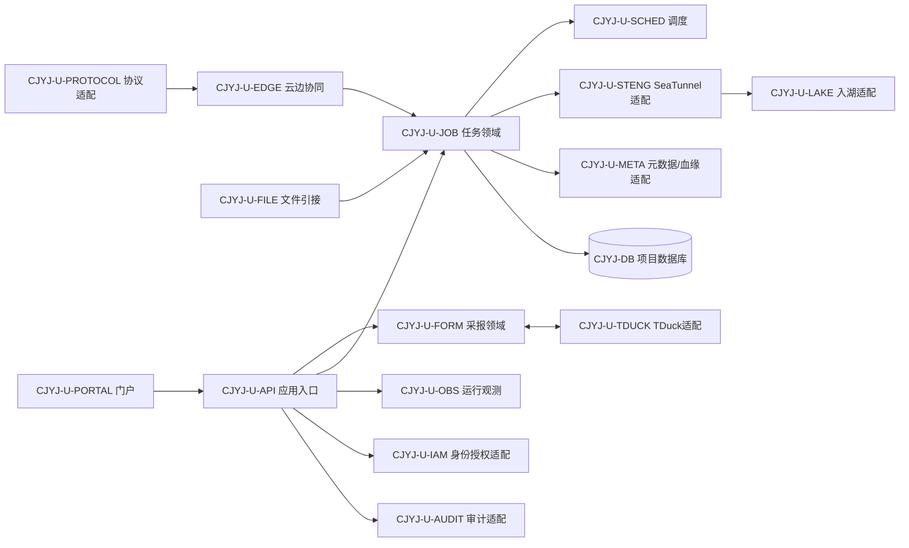
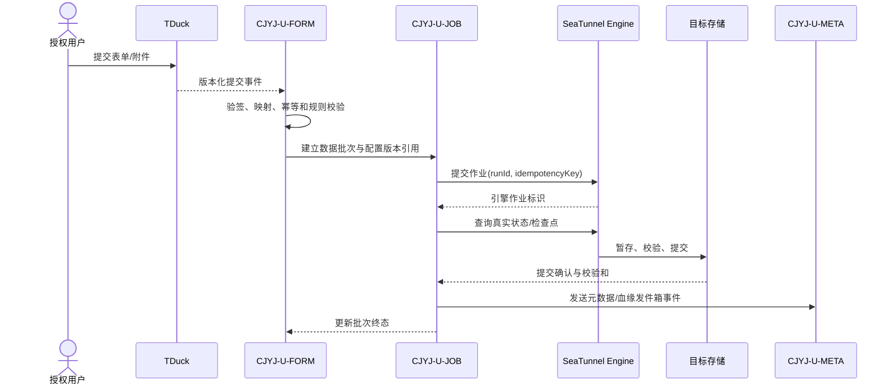
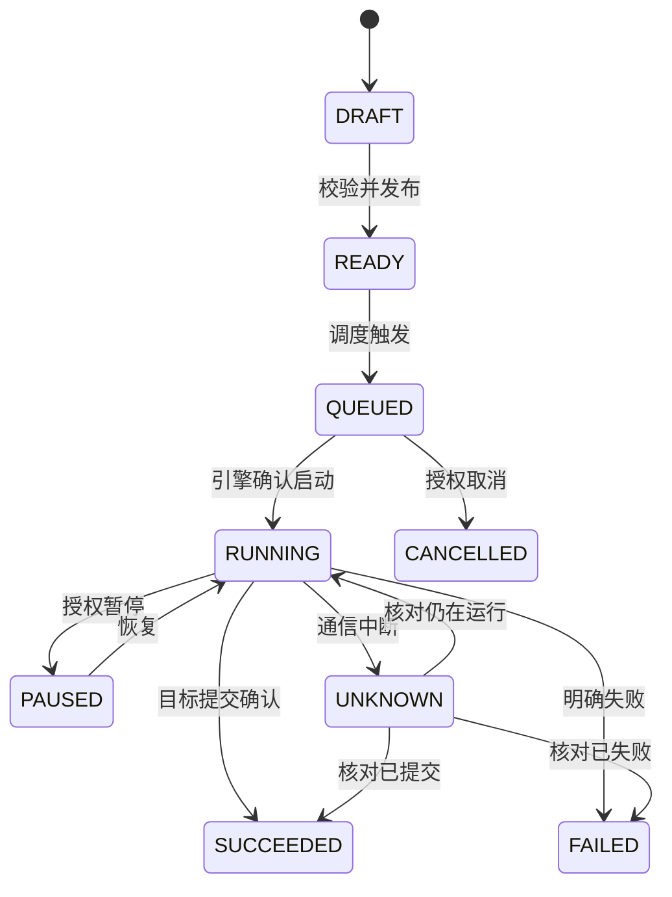
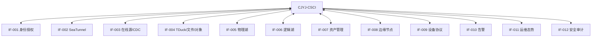

# 数据采集引接软件设计说明（SDD）

| 项目 | 内容 |
|---|---|
| 文档标识 | CJYJ-SDD-001 |
| CSCI 标识 | CJYJ-CSCI |
| 版本 | V0.1 |
| 状态 | 设计阶段草案 |
| 密级 | 非密（外网开发验证） |
| 编制依据 | GJB 438C-2021 附录 K、CJYJ-SRS-001 V0.1 |

## 修改页

| 版本 | 日期 | 修改内容 | 修改人 | 批准人 |
|---|---|---|---|---|
| V0.1 | 2026-07-19 | 按设计阶段基线首次编制 | 项目组 | 待定 |

# 1 范围

## 1.1 标识

本文档适用于数据资源支撑系统的数据采集引接软件配置项 `CJYJ-CSCI`，文档标识 `CJYJ-SDD-001`，版本 V0.1。软件以 TDuck 为数据采报核心组件，以 SeaTunnel-Web 企业 Fork 和 Apache SeaTunnel 为在线引接、编排及执行核心组件。

## 1.2 系统概述

`CJYJ-CSCI` 面向公开、合成或经确认脱敏的数据，提供表单采报、在线/文件引接、任务编排、入湖、边缘协同、协议适配、报告、态势、告警、审计以及元数据和血缘同步能力。本项目在外网非密环境验证一套已完成非密项目的技术路线，不代替目标涉密环境、专用硬件、国密设备或跨安全域联调结论。

软件采用浏览器/服务端/执行引擎分层部署。项目需方、用户、开发方和保障机构沿用项目总体文件；当前运行现场为批准的外网非密开发验证环境，目标运行现场待总体设计确定。

## 1.3 文档概述

本文档按 GJB 438C-2021 附录 K 规定 CSCI 级设计决策、体系结构、执行方案、接口和软件单元详细设计，并建立对 `CJYJ-SRS-001` 的双向追踪。数据库结构见 `CJYJ-DBDD-001`，外部接口需求见 `CJYJ-IRS-001`。

本文档不含真实涉密地址、账号、密钥、数据样例或部署拓扑。设计中的实现深度沿用 SRS：`R` 为真实闭环，`V1` 为真实软件逻辑加受控模拟对端，`V2` 仅形成接口、数据模型、配置和受控样例。模拟状态必须在界面、日志和证据中显式标识。

# 2 引用文档

| 标识 | 文档名称 | 版本/日期 | 用途 |
|---|---|---|---|
| GJB 438C-2021 | 军用软件开发文档通用要求 | 2021 | SDD 正文格式和内容要求 |
| GJB 2786A | 军用软件开发通用要求 | 现行受控版 | 软件工程和质量保证约束 |
| CJYJ-SSS-001 | 数据采集引接分系统规格说明 | V0.2 | 上级需求与分系统边界 |
| CJYJ-IRS-001 | 数据采集引接接口需求规格说明 | V0.2 | 外部接口需求 |
| CJYJ-SRS-001 | 数据采集引接软件需求规格说明 | V0.1 | 软件需求基线 |
| CJYJ-DBDD-001 | 数据采集引接数据库设计说明 | V0.1 | 数据库详细设计 |
| SDP-001 | 软件开发计划 | 当前受控版 | 生命周期、评审和配置管理 |

# 3 CSCI 级设计决策

| 决策标识 | 设计决策 | 理由及约束 |
|---|---|---|
| CJYJ-DD-001 | TDuck 作为采报核心，项目通过适配器调用其公开 API/事件，不直接修改或读取 TDuck 内部数据库 | 隔离开源组件升级，满足稳定对象映射、审计和回归要求 |
| CJYJ-DD-002 | SeaTunnel-Web 企业 Fork 负责任务配置与控制，Apache SeaTunnel 负责数据执行；引擎状态以查询核对结果为准 | 避免平台状态与引擎真实状态分叉，不以提交成功替代运行成功 |
| CJYJ-DD-003 | 采用门户层、领域服务层、适配层、执行层和基础设施层分层设计 | 控制产品耦合，支持连接器、模拟器和目标环境替换 |
| CJYJ-DD-004 | 每个外部依赖均通过版本化端口接入；V1 模拟器与真实适配器实现同一契约 | 使“实/虚”差异只发生在端口实现，并可执行契约测试 |
| CJYJ-DD-005 | V2 能力仅交付关闭状态的 SPI、数据模型、配置、样例和验证说明 | 防止低功耗终端、全量现场回放被误报为已经实现 |
| CJYJ-DD-006 | 同步事务使用幂等键、检查点和显式状态；跨服务事件采用事务发件箱、重试和死信 | 支持断点恢复、重复消息处理及可审计补偿 |
| CJYJ-DD-007 | 作业配置不可变版本化，运行实例固定引用配置版本 | 确保故障定位、重跑和证据可复现 |
| CJYJ-DD-008 | 目标写入采用暂存、校验、提交三阶段；提交确认前不得标记成功 | 保护已确认数据，避免部分写入形成假成功 |
| CJYJ-DD-009 | 统一传递 `subjectId`、`traceId`、`taskId`、`configVersion`、`runId` 和 `dataClass` | 满足权限、追踪、审计和非密数据约束 |
| CJYJ-DD-010 | 所有 R/V1/V2 结论由运行配置和证据登记共同约束，禁止硬编码成功结果、伪造日志或手工改测试结论 | 贯彻项目验证策略和 SRS 约束 |

安全关键决策如下：外网构建仅允许非密数据；凭据仅保存加密密文或密钥引用；高风险写操作在身份或权限不确定时拒绝；审计事件写入受保护存储并异步上报；正式密码设备、密级标记和安全域交换仅由 V1 契约模拟器验证。

CSCI 运行方式分为 `DEVELOPMENT`、`TEST` 和 `DEMONSTRATION`，均属于外网非密环境；端口模式分为 `REAL`、`SIMULATED`、`PLACEHOLDER_DISABLED`。生产目标方式不在本构建中启用。

# 4 CSCI 体系结构设计

## 4.1 CSCI 部件

| 软件单元 | 用途 | 状态/类型 | 实现深度 | 计划库位 |
|---|---|---|---|---|
| CJYJ-U-PORTAL | 采报、任务、运行、报告和态势界面 | 改造 SeaTunnel-Web 前端 | R | `seatunnel-ui` 项目扩展区 |
| CJYJ-U-API | API 聚合、参数校验、会话和安全上下文 | 新开发 | R | `seatunnel-server` 应用层 |
| CJYJ-U-FORM | 表单映射、采报任务、提交批次和报告编排 | 新开发 | R/V1 | 项目独立领域模块 |
| CJYJ-U-TDUCK | TDuck API、事件、对象映射和补偿适配 | 新开发适配器，复用 TDuck | R | 项目适配模块 |
| CJYJ-U-SOURCE | 数据源登记、凭据引用和数据探查 | 改造/新开发 | R | SeaTunnel-Web 扩展模块 |
| CJYJ-U-JOB | 作业配置、版本、状态机、批量任务和控制 | 改造 SeaTunnel-Web | R | `seatunnel-server` 服务层 |
| CJYJ-U-SCHED | 立即、周期和表达式调度及冲突检查 | 复用并改造既有调度 | R | 调度模块 |
| CJYJ-U-STENG | SeaTunnel 作业生成、提交、控制、状态核对 | 改造既有适配 | R | Engine 适配模块 |
| CJYJ-U-FILE | 文件上传、目录监测、解析、校验和续传 | 新开发 | R/V1 | 文件引接模块 |
| CJYJ-U-LAKE | 物理入湖与逻辑湖端口 | 新开发适配器 | R/V1 | 目标适配模块 |
| CJYJ-U-EDGE | 节点、心跳、任务、离线缓存和补传 | 新开发 | V1 | 云边协同模块及模拟器 |
| CJYJ-U-PROTOCOL | 协议 SPI、公开协议及合成报文解析 | 新开发 | V1/V2 | 协议插件模块 |
| CJYJ-U-REPORT | 报告模板、生成、预览和导出 | 新开发 | R/V1 | 报告模块 |
| CJYJ-U-OBS | 日志、指标、告警、拓扑、时间线和故障域 | 改造/新开发 | R/V1 | 可观测模块 |
| CJYJ-U-META | 元数据、血缘和任务关系同步 | 新开发适配器 | R/V1 | 资产协同适配模块 |
| CJYJ-U-IAM | 统一身份/本地受控身份、组织和权限端口 | 新开发适配器 | R/V1 | 安全适配模块 |
| CJYJ-U-AUDIT | 防篡改审计写入、查询和外部上报 | 新开发 | R/V1 | 审计模块 |
| CJYJ-U-SIM | 边缘、逻辑湖、设备、链路及外部服务模拟 | 新开发验证保障软件 | V1/V2 | 独立 `simulators` 库 |

静态依赖遵循“门户→应用→领域→端口→适配器”方向，领域单元不得依赖 TDuck、SeaTunnel 或外部产品内部数据结构。TDuck、SeaTunnel Engine、数据库、对象存储和消息服务作为外部/基础软件配置项管理，不计入项目自研代码，但其版本、来源、补丁、许可证和哈希纳入 SBOM。

验证基准资源暂按门户/API、作业服务、SeaTunnel Engine、关系数据库和对象/文件存储可独立部署设计。性能测试必须记录实际 CPU、内存、磁盘、网络、容器限制、连接池和并发参数；本文档不以建议资源替代容量测试结论。所有自研单元进入项目 Git 受控库，第三方二进制和镜像进入制品库，模拟器与正式适配器分目录、分制品发布。

## 4.2 执行方案

### 4.2.1 采报到引接主流程

事件只有在对象映射、版本和数据分类校验通过后进入任务队列。重复事件返回原处理结果；引擎响应未知时保持 `UNKNOWN` 并主动核对，不重建并行作业。目标提交失败时按幂等键重试或进入人工补偿，不删除已确认批次。

### 4.2.2 任务状态机

非法转换由领域状态机拒绝并审计。调度器只创建运行请求，最终状态由 `CJYJ-U-STENG` 与目标提交结果共同判定。每个运行实例固定引用不可变配置版本。

### 4.2.3 云边与模拟流程

边缘节点按任务版本确认下发，离线时把带序号和校验和的数据写入本地受限缓存；恢复后先核对检查点，再按序补传和去重。V1 模拟器可注入断连、乱序、重复、容量耗尽和非法报文。V2 低功耗设备端口默认关闭，只允许加载受控样例，不产生“真实功耗”或“设备兼容”结论。

### 4.2.4 并发、异常和恢复

- 同一 `taskId + configVersion` 的调度触发通过分布式互斥或数据库唯一约束去重。
- 数据源、适配器和运行实例分别设置并发配额；单个故障源使用隔离线程池/队列。
- 重试仅用于可判定的暂态错误，采用有上限退避；永久错误进入死信或人工处置。
- 服务重启后从数据库恢复待核对实例、发件箱事件和检查点，不依赖内存状态判定成功。
- 存储容量逼近阈值时停止新增写入、保留已确认数据并告警。

## 4.3 接口设计

### 4.3.1 接口标识和接口图

外部接口沿用 `CJYJ-IF-001～012`，字段、协议和保密约束以 `CJYJ-IRS-001` 为准。内部接口统一标识为 `CJYJ-IIF-{提供单元}-{序号}`，采用版本化 REST、事件或进程内端口。

### 4.3.2 CJYJ-IF-001～012 外部接口

| 接口 | 主要组合体 | 通信/控制 | 实现深度与失效处理 |
|---|---|---|---|
| IF-001 身份授权 | 主体、组织、角色、权限、数据范围 | HTTPS/OIDC 或批准协议；短时缓存 | R/V1；权限不确定时拒绝高风险写操作 |
| IF-002 SeaTunnel | 作业定义、控制命令、状态、日志、指标 | 受控 API；请求号和引擎作业号关联 | R；未知响应必须查询核对 |
| IF-003 在线源/CDC | 连接配置引用、模式、记录、位点、检查点 | SeaTunnel 连接器/插件 | R/V1；限流、断点恢复和错误源隔离 |
| IF-004 TDuck/文件 | 表单、版本、提交、附件、文件清单 | HTTPS 事件/查询、受控文件流 | TDuck 为 R；事件幂等，失败进入待同步队列 |
| IF-005 物理湖 | 批次、分区、记录数、校验和、提交状态 | JDBC/对象/文件协议 | R；提交未确认不得成功 |
| IF-006 逻辑湖 | 数据源引用、逻辑对象、权限和失效事件 | 版本化 REST/事件 | V1；明确显示模拟状态 |
| IF-007 资产管理 | 数据源、任务、运行、实体、血缘、技术状态 | REST/事件；发件箱和死信 | R/V1；与 `ZCGL-IF-004` 对偶，支持重放 |
| IF-008 边缘节点 | 节点、心跳、任务版本、检查点、批次 | HTTPS/消息；序号和确认 | V1；断连缓存、容量保护和补传 |
| IF-009 设备协议 | 设备标识、报文、时间、质量标志 | 插件 SPI/公开协议/合成报文 | V1/V2；非法报文隔离，不静默丢弃 |
| IF-010 告警 | 事件、级别、对象、时间、状态、追踪号 | 异步消息/HTTPS | R/V1；主流程不阻塞，聚合和补偿发送 |
| IF-011 运维态势 | 健康、资源、作业、链路和告警指标 | 指标拉取或批量上报 | R/V1；外部不可用时本地保留并标时效 |
| IF-012 安全审计 | 主体、对象、操作、结果、摘要、追踪号 | 受保护异步上报 | R/V1；本地先持久化，恢复后补传 |

接口数据统一使用 UTF-8、ISO 8601 含时区时间、稳定标识和显式版本。所有请求大小、频率、超时和配额环境化配置；敏感字段不进入普通日志。接口契约需包含错误码、可重试标志、幂等键、分页/游标、兼容版本和数据分类。

### 4.3.3 内部接口

| 标识 | 提供方→使用方 | 类型 | 输入/输出及约束 |
|---|---|---|---|
| CJYJ-IIF-FORM-001 | FORM→JOB | 命令/事件 | `SubmissionAccepted`，含对象映射、批次、表单版本和幂等键 |
| CJYJ-IIF-JOB-001 | JOB→STENG | 命令/查询 | 作业定义、运行控制、状态核对；不得传明文凭据 |
| CJYJ-IIF-JOB-002 | JOB→LAKE | 数据/提交 | 批次暂存、校验、提交、回滚和校验和 |
| CJYJ-IIF-JOB-003 | JOB→META | 事件 | 元数据、血缘、运行关系；事务发件箱投递 |
| CJYJ-IIF-EDGE-001 | EDGE→JOB | 命令/事件 | 节点状态、任务确认、检查点和补传批次 |
| CJYJ-IIF-OBS-001 | 各单元→OBS | 事件/指标 | 追踪、日志、指标和告警；高基数标签受控 |
| CJYJ-IIF-AUD-001 | 各单元→AUDIT | 事件 | 仅追加审计，普通管理员无修改删除权 |

# 5 CSCI 详细设计

## 5.1 CJYJ-U-PORTAL、CJYJ-U-API

门户按角色显示采报、数据源、任务、运行、报告和态势功能；所有 V1/V2 页面在标题、状态和导出中显示“模拟/占位”。API 层执行 DTO 校验、安全上下文装配、幂等头解析和错误转换，不承载领域状态机。输入为 HTTPS 请求，输出为版本化 JSON/文件流；异常统一映射为可追踪错误，不返回堆栈和敏感配置。

## 5.2 CJYJ-U-FORM、CJYJ-U-TDUCK

`CJYJ-U-TDUCK` 维护项目对象与 TDuck 项目、表单、版本、字段、提交和附件标识的映射。同步逻辑为：验签/鉴权→解析事件版本→以事件标识去重→查询必要对象→转换为项目规范模型→执行字段和跨字段校验→建立批次→写出业务事件。事件乱序时按对象版本拒绝旧覆盖并登记待核对项；TDuck 不可用时保持待同步状态并按上限重试。

`CJYJ-U-FORM` 负责采报任务分配、提交状态和报告触发。自动纠正属于 V1，仅生成建议值并保留原值、规则版本和人工确认。Word/PDF 格式适配器未真实生成时必须返回 `NOT_VERIFIED`，不得以样例文件代替执行结果。

## 5.3 CJYJ-U-SOURCE、CJYJ-U-FILE

数据源实体只保存连接参数和凭据引用；连接测试在受限执行器内完成，日志脱敏。探查结果固定关联源版本。文件处理采用接收区、隔离区、处理中和已提交区，步骤为大小/格式检查→恶意内容检查端口→校验和→解析→业务校验→批次提交；重复校验和按策略拒绝或关联。目录监听事件需经稳定窗口和重复检测，删除事件默认只记录而不级联删除目标数据。

## 5.4 CJYJ-U-JOB、CJYJ-U-SCHED、CJYJ-U-STENG

作业草稿经结构、连接、字段映射、目标和错误策略校验后生成不可变版本。调度器以唯一触发键创建运行实例；`CJYJ-U-STENG` 将规范作业模型转换为 SeaTunnel 配置并保存转换摘要和组件版本。运行控制采用命令记录，只有引擎确认或核对后改变运行状态。检查点按数据源/分片保存，恢复时校验任务版本及目标幂等能力；不兼容时停止自动恢复并要求授权处理。

批量创建返回逐项状态；任何部分成功均保留可识别清单。单个连接器采用独立资源配额和故障域，避免拖垮无关任务。

## 5.5 CJYJ-U-LAKE

物理湖端口实现 `prepare/write/validate/commit/abort/status`。暂存区按 `runId/batchId` 隔离，校验记录数、模式和校验和；只有原子提交或可证明的幂等提交完成后才写成功。逻辑湖端口实现注册、变更、失效和连通检查，当前由 V1 模拟器验证；响应中携带 `simulation=true` 和模拟器版本。

## 5.6 CJYJ-U-EDGE、CJYJ-U-PROTOCOL、CJYJ-U-SIM

边缘任务包包含任务版本、有效期、配置摘要、协议插件版本、配额和签名信息。节点状态以心跳和最后确认序号判定。补传使用节点、任务、分区和序号组成幂等键。协议插件按 `probe/decode/validate/normalize/health` SPI 执行，原始报文引用与规范记录分离保存。

模拟器必须支持固定种子、虚拟时钟、场景标识和期望结果，输出不能绕过真实领域逻辑。低功耗设备和全量操作回放的 V2 插件默认不装载；启用开发样例也只能形成接口证据。

## 5.7 CJYJ-U-REPORT、CJYJ-U-OBS

报告任务固定引用模板版本、数据批次和查询条件，生成结果记录格式适配器、校验和和生成状态。态势只使用真实运行记录或显式标注的模拟记录，二者不可混算为“实测”。故障时间线按统一追踪号聚合配置、命令、引擎状态、批次、目标提交和告警事件；故障域判定规则版本化。

告警从异常确认时间开始计时，去重键由规则、对象和时间窗构成；恢复告警与原告警关联。外部告警平台不可用不阻塞任务状态持久化。

## 5.8 CJYJ-U-META、CJYJ-U-IAM、CJYJ-U-AUDIT

元数据适配器把数据源、任务、配置版本、运行、目标和字段映射转换为 `ZCGL-CSCI` 契约。出站事件与业务事务一并写入发件箱，发送成功后保存对端版本；冲突进入隔离队列，不静默覆盖。

身份适配器提供统一身份和本地受控身份两种实现，同一请求只接受一个经验证主体。审计单元先本地追加写入，再向外部平台上报；审计记录包含主体、来源、对象、操作、结果、时间、追踪号和前后值摘要，普通管理员无修改和物理删除能力。

# 6 需求可追踪性

下表中的连续范围包含首尾之间的每一项需求；同一需求可分配给多个单元。

## 6.1 软件单元到 CSCI 需求

| 软件单元 | 分配的 SRS 需求 |
|---|---|
| PORTAL、API | GEN-001～002，STATE-001～002，F-004～005、013、025、029，IF-001，HUM-001，OTH-001 |
| FORM、TDUCK | F-001～006、017～019，IF-002，DATA-001，CNST-002 |
| SOURCE、FILE | F-007～009、014，P-002、004，ADP-001 |
| JOB、SCHED、STENG | F-010～013、031～032，P-001、003、006，IIF-001～002，QUAL-001～002，CNST-001 |
| LAKE | F-015～016，P-006，SAFE-001 |
| EDGE、PROTOCOL、SIM | STATE-003，F-003、021～024、026、028、030，IF-001、003，SEC-002，RES-004，CNST-003 |
| REPORT、OBS | F-017～019、025～029，P-005，RES-002 |
| META | F-027，IF-001，IIF-002，DATA-001 |
| IAM、AUDIT | F-020～021，DATA-002～003，SEC-001～002，SAFE-001 |
| 全部及构建部署 | ENV-001，RES-001～004，CNST-001～003，TRAIN-001，SUP-001，PKG-001 |

以上省略前缀均为 `CJYJ-SRS-`。

## 6.2 CSCI 需求到软件单元

| 需求集合 | 软件单元 |
|---|---|
| GEN、STATE | PORTAL、API、JOB；STATE-003 另分配 EDGE、SIM |
| F-001～006 | FORM、TDUCK、PORTAL |
| F-007～016 | SOURCE、FILE、JOB、SCHED、STENG、LAKE |
| F-017～021 | REPORT、FORM、IAM、AUDIT、SIM |
| F-022～024 | EDGE、PROTOCOL、SIM |
| F-025～030 | OBS、META、PROTOCOL、SIM |
| F-031～032 | JOB、SOURCE、AUDIT |
| P-001～006 | STENG、SOURCE、FILE、LAKE、OBS、基础设施 |
| IF-001～003、IIF-001～002 | 全部适配器、API、JOB、SIM |
| DATA-001～003 | JOB、FORM、META、AUDIT、数据库软件单元 |
| ADP、SEC、SAFE、ENV、QUAL | API、适配器、JOB、OBS、IAM、AUDIT、部署单元 |
| RES、CNST、HUM、TRAIN、SUP、PKG、OTH | 全部软件单元及配置/质量保证活动 |

TBC-001～005 为设计输入待确认项，不作为实现完成项；其关闭记录应回链到受影响的软件单元、接口和测试项。

# 7 注释

| 缩略语 | 含义 |
|---|---|
| CSCI | 计算机软件配置项 |
| SDD | 软件设计说明 |
| DBDD | 数据库设计说明 |
| CDC | 变更数据捕获 |
| SPI | 服务提供者接口/插件扩展接口 |
| DAG | 有向无环图 |
| R/V1/V2 | 真实实现/受控模拟/设计占位 |

设计待确认项：TDuck 和 SeaTunnel 的受控版本及许可边界、目标数据库与对象存储类型、真实 CDC 源、工作流/告警/审计对端契约、性能基准资源、目标身份体系和模拟器契约。待确认项改变接口或软件单元时，应执行影响分析并修订 SRS、SDD、DBDD、接口文档和测试设计。
