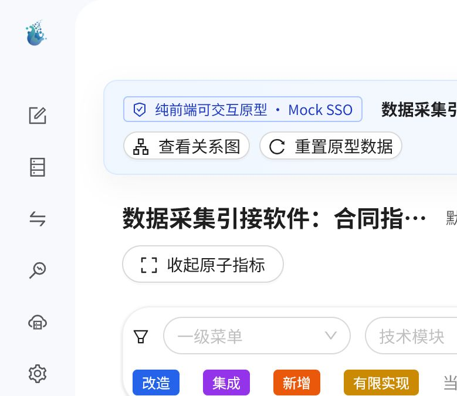
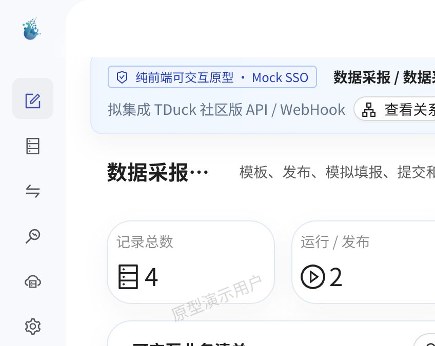
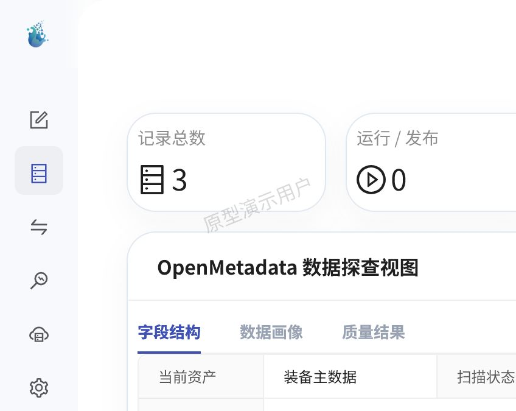
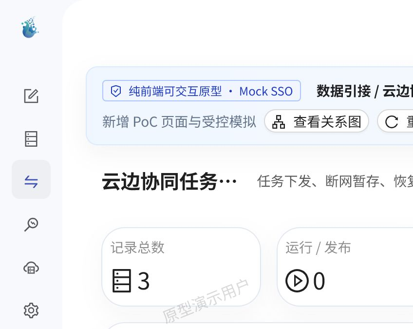
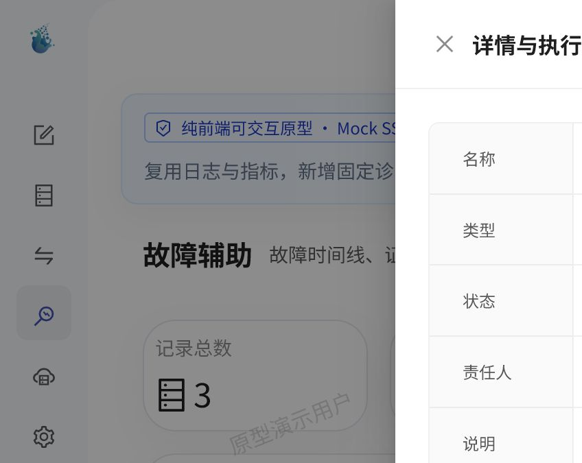
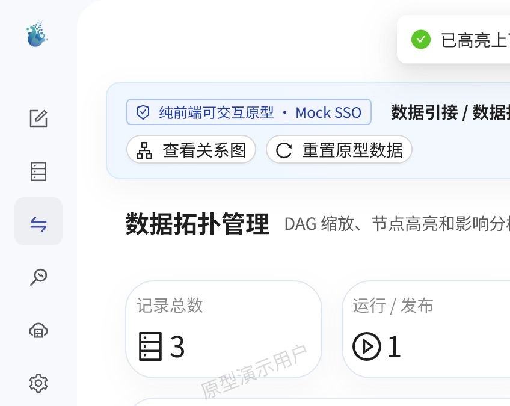

# 数据采集引接菜单原型使用说明

## 1. 原型定位

本原型基于现有 `seatunnel-web-ui` 实现，不重画 SeaTunnel Web 已有页面。原型模式通过纯前端 Mock 数据完成页面筛选、详情、新增、执行、状态切换和重置闭环，用于菜单、指标覆盖和交付范围评审。

本次不连接真实后端，也不进行以下外部系统联调：

- TDuck 社区版：展示数据采报模板、发布、填报和报告能力的拟集成边界。
- OpenMetadata：展示数据探查、资产画像、质量结果和血缘拓扑的拟集成边界。
- SSO：使用 Mock SSO 用户和菜单权限，不提供用户、角色或权限管理页面。

## 2. 启动方式

在项目根目录执行：

```powershell
cd seatunnel-web-ui
npm run prototype
```

打开终端提示的本地地址。原型模式默认进入：

```text
/prototype/traceability
```

正常开发启动方式保持不变：

```powershell
npm run start
```

原型数据保存在浏览器 `localStorage` 中。任一业务页面顶部的“重置原型数据”可恢复预置演示数据。

## 3. 推荐演示路径

1. 从“数据采集引接软件：合同指标—前端页面对应关系”查看 21 个父指标与 20 个二级菜单页面。
2. 点击 `F-01` 展开原子指标，点击“数据采报 / 数据采报管理”进入 TDuck 拟集成页面。
3. 创建并发布采报模板，执行“模拟填报并提交”，再进入采集报告管理预览报告。
4. 进入“引接资源 / 数据探查”，切换字段结构、数据画像和质量结果。
5. 进入离线、实时、云边和边缘任务页面，演示任务状态变化、断网暂存及恢复续传。
6. 进入引接链路与数据拓扑，查看健康详情、高亮影响链路并跳转任务页面。
7. 进入运行运维，演示监控、告警和故障证据闭环。
8. 进入入湖管理，演示资源测试、生命周期执行和逻辑查询预览。
9. 返回关系图，按一级菜单、技术模块或实现方式筛选，并高亮上下游连线。

## 4. 菜单与实现方式

| 一级菜单 | 二级菜单 | 路由 | 原型实现 | 复用或集成来源 |
|---|---|---|---|---|
| 数据采报 | 数据采报管理 | `/reporting/forms` | 集成 | TDuck 社区版 API / WebHook |
| 数据采报 | 采集报告管理 | `/reporting/reports` | 新增 | 复用 TDuck 答卷与统计数据 |
| 引接资源 | 数据源管理 | `/data-source` | 复用 | `src/pages/data-source` |
| 引接资源 | 引擎管理 | `/client` | 改造 | `src/pages/client` |
| 引接资源 | 数据探查 | `/resources/data-discovery` | 集成 | OpenMetadata API |
| 数据引接 | 离线引接任务管理 | `/sync/batch-link-up` | 复用 | `src/pages/batch-link-up` |
| 数据引接 | 实时引接任务管理 | `/sync/stream-link-up` | 改造 | `src/pages/stream-link-up` |
| 数据引接 | 云边协同任务管理 | `/sync/cloud-edge-tasks` | 有限实现 | 新增 PoC 与受控模拟 |
| 数据引接 | 边缘接入任务管理 | `/sync/edge-access-tasks` | 有限实现 | 新增协议接入 PoC |
| 数据引接 | 引接链路管理 | `/sync/links` | 新增 | 复用批流任务状态 |
| 数据引接 | 数据拓扑管理 | `/sync/topology` | 集成 | OpenMetadata 血缘 |
| 运行运维 | 引接态势 | `/bi` | 改造 | `src/pages/bi` |
| 运行运维 | 运行监控 | `/metrics` | 复用 | `src/pages/metrics` |
| 运行运维 | 告警管理 | `/alarm` | 复用 | `src/pages/alarm` |
| 运行运维 | 故障辅助 | `/operations/diagnostics` | 有限实现 | 日志、指标与固定诊断规则 |
| 入湖管理 | 入湖资源管理 | `/lake/resources` | 新增 | 复用数据源连接能力 |
| 入湖管理 | 数据生命周期管理 | `/lake/lifecycle` | 新增 | 固定生命周期策略 |
| 入湖管理 | 逻辑入湖管理 | `/lake/logical-access` | 有限实现 | 受控逻辑映射与查询预览 |
| 系统管理 | 参数与知识 | `/knowledge-management` | 复用 | `src/pages/knowledge-management` |
| 系统管理 | 开放接口 | `/open-api` | 复用 | `src/pages/open-api` |

详细菜单说明见 [menu-design.md](./menu-design.md)，完整指标映射见 [traceability.csv](./traceability.csv)。

## 5. 指标追踪机制

`seatunnel-web-ui/scripts/generate-prototype-traceability.mjs` 读取 `traceability.csv`，并与页面注册表进行连接和校验。执行：

```powershell
cd seatunnel-web-ui
npm run prototype:generate
```

生成器在以下情况直接失败：

- 原子指标不是 55 条；
- 页面注册表不是 20 个二级菜单；
- 存在遗漏指标或孤立页面；
- 页面使用未知技术模块；
- CSV 中的前端页面无法匹配页面注册表。

每个业务页面顶部标注一级/二级菜单、实现方式、指标数量、代码复用来源或拟集成组件，并可随时返回指标关系图。

## 6. 关键截图













## 7. Mock 边界

- 原型模式下 `HttpUtils` 请求由前端请求适配器处理，不发起业务后端请求。
- 数据创建、编辑、状态迁移和重置只影响当前浏览器的原型数据。
- TDuck、OpenMetadata 和 SSO 标签表示拟定实施边界，不表示已完成产品联调。
- 性能类指标只展示指标与承接页面关系，不在浏览器原型中证明真实性能。
- 正式开发仍需依据模块 Spec、接口设计、安全方案和验收测试实施。
