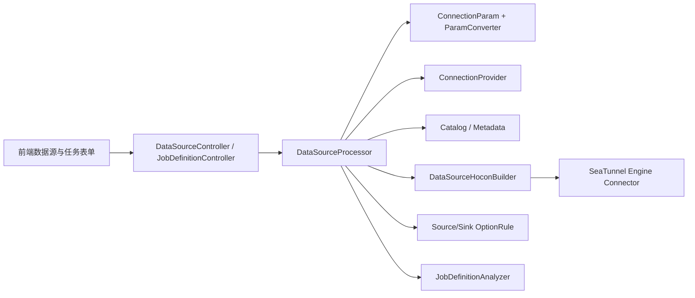

# SeaTunnel Web 新数据源开发规范

## 1. 目的和适用范围

本文固定 SeaTunnel Web 新数据源的设计、开发、测试和发布流程，适用于：

- 关系型数据库：JDBC、MySQL、PostgreSQL、Oracle 等；
- CDC Source：MySQL-CDC、PG-CDC 等；
- 文件与对象存储：sFTP、S3 等。

本规范以本仓库已落地的通用 JDBC Source/Sink 为首个样例。后续新增数据源必须先完成本文的设计清单，再进入编码。

“SeaTunnel Web 支持一个数据源”不等于只在页面上增加一个选项。完整能力至少包含：

1. 数据源连接参数、校验、密码保存和连接测试；
2. 库表/对象枚举、字段元数据、数据预览等目录能力；
3. Source/Sink 参数校验与 SeaTunnel HOCON 生成；
4. 已保存任务的反向解析和回显；
5. 前端创建数据源、选择 Source/Sink、配置任务；
6. Web 进程与 SeaTunnel Engine 两侧的插件和依赖部署；
7. 单元测试、集成测试、兼容性验证和发布说明。

## 2. 当前扩展链路



关键调用链如下：

- 应用启动时，`DataSourceProcessorProvider` 通过 `ServiceLoader` 注册数据源处理器；
- 数据源插件安装接口调用 `DataSourceProcessor.generateFormFields()`，从连接参数类的 `@FormField` 生成动态表单；
- 创建或测试数据源时，`JdbcParamConverter` 将前端 JSON 转换为连接参数，`JdbcConnectionProvider` 负责加载驱动和连接测试；
- 任务保存或预览时，`DataSourceSourceBuilder` / `DataSourceSinkBuilder` 根据 `dbType + pluginName` 取得 HOCON Builder；
- Builder 将数据源连接参数和节点参数合并为 SeaTunnel Connector HOCON，并用 OptionRule 校验；
- `JobDefinitionAnalyzer` 从已有 HOCON 或引导式任务中反向提取数据源 ID、类型和表信息。

## 3. 三个名称必须在设计阶段确定

| 名称 | 用途 | JDBC 样例 | 约束 |
| --- | --- | --- | --- |
| `dbType` | Web 侧数据源类型、数据库持久化、Processor 路由 | `JDBC` | 对应 `DbType` 枚举，稳定后不得随意改名 |
| `connectorType` | 最终 SeaTunnel HOCON 外层 Connector 名称 | `Jdbc` | 必须与 SeaTunnel Connector 的 `plugin_name` 一致 |
| `pluginName` | Web 内部 Builder/OptionRule 唯一键 | `JDBC-JDBC` | 当前 Factory 大小写敏感，前端、Builder、Rule 必须完全一致 |

JDBC 系列沿用 `JDBC-<DB_TYPE>` 规则，例如 `JDBC-MYSQL`、`JDBC-POSTGRESQL`、`JDBC-JDBC`。CDC 和非 JDBC Connector 使用 SeaTunnel 官方 Connector 名称，并在设计评审时固定唯一键。

禁止用 `dbType`、`connectorType`、`pluginName` 中的任意一个替代另外两个。新增数据源时必须先把三者写入设计表和测试用例。

## 4. 固定开发流程

### 4.1 阶段 0：确认 SeaTunnel 侧能力

编码前先形成一页能力矩阵，至少确认：

- SeaTunnel Connector 的准确名称和版本；
- 是否支持 Source、Sink、批任务、流任务；
- 单表、多表、SQL 模式、自动建表、Schema 演进、Exactly Once 等能力；
- 必填/可选参数、默认值、互斥参数、条件参数；
- Web 进程需要的 SDK/驱动，以及 Engine 节点需要的 Connector/驱动；
- 连接测试方式、权限要求、网络要求；
- 元数据层级是 catalog/schema/table、目录/文件，还是 bucket/object；
- 敏感字段和脱敏策略；
- 支持的 SeaTunnel 版本和第三方服务版本。

没有完成该矩阵，不进入开发。Web 表单字段应以当前项目锁定的 SeaTunnel 版本为准，不能直接复制其他版本文档。

### 4.2 阶段 1：选择扩展路线

| 类型 | 推荐路线 | 说明 |
| --- | --- | --- |
| JDBC 关系型数据库 | 复用 `AbstractJdbc*` 公共能力 | 实现参数、连接、Catalog、Builder 差异和 Analyzer |
| CDC Source | 复用 `AbstractCdcSourceBuilder` 和预检机制 | 默认 Source-only，不能伪造 Sink 能力 |
| sFTP/S3 等文件协议 | 先抽象通用数据源 SPI，再实现协议插件 | 当前 `DataSourceProcessor` 强依赖 JDBC 类型，不应把文件协议塞进 JDBC 接口 |

在实现 sFTP/S3 前，需先把当前 JDBC 偏置的接口拆为通用能力组合，例如：

- `ConnectionParamConverter`：参数反序列化和校验；
- `ConnectivityVerifier`：连接测试；
- `DataCatalog`：可选的层级浏览、Schema 和预览能力；
- `DataSourceHoconBuilder`：Source/Sink 配置生成；
- `OptionRule`：参数校验；
- `JobDefinitionAnalyzer`：任务反向解析；
- `supportsSource()` / `supportsSink()` / `supportsCatalog()` 等能力标记。

这样 PG-CDC、sFTP、S3 可以只实现自己具备的能力，避免返回无意义的 `JdbcConnectionProvider` 或 `JdbcCatalog`。

### 4.3 阶段 2：创建后端插件模块

JDBC 类插件的标准目录如下：

```text
seatunnel-web-datasource-plugins/seatunnel-web-datasource-<name>/
├── pom.xml
└── src
    ├── main/java/org/apache/seatunnel/plugin/datasource/<name>/
    │   ├── analysis/       # 任务反向解析
    │   ├── builder/        # Source/Sink HOCON
    │   ├── connection/     # 连接和驱动加载
    │   ├── metadata/       # 库表、字段、预览
    │   ├── option/         # Source/Sink OptionRule
    │   └── param/          # 参数类、转换器、Processor 入口
    └── test/java/...       # 单元测试和 ServiceLoader 测试
```

同时完成以下注册：

1. 在 `seatunnel-web-datasource-plugins/pom.xml` 增加 `<module>`；
2. 在根 `pom.xml` 的 `dependencyManagement` 增加模块版本；
3. 在 `seatunnel-web-datasource-all/pom.xml` 增加运行时依赖；
4. 在 `DbType` 增加稳定枚举值；
5. 使用 `@AutoService` 注册 Processor、HOCON Builder、OptionRule 等 SPI；
6. 增加 ServiceLoader 测试，防止“代码存在但运行时未注册”。

### 4.4 阶段 3：实现连接参数和动态表单

参数类负责“用户填写什么”，Converter 负责“最终保存和运行什么”。

参数类要求：

- 所有可见字段使用 `@FormField` 定义标签、类型、顺序、默认值和必填规则；
- 密码字段使用 `FieldType.PASSWORD`；
- 字段名与 JSON、HOCON 的映射必须明确；
- 表单默认值只能用于提升易用性，不能代替后端校验；
- 日志和 `toString()` 不得输出明文密码、Token、Secret Key；
- 编辑回显使用 `originalJson`，运行使用规范化后的 `connectionParams`。

Converter 要求：

- 反序列化后设置 `dbType`；
- 构造 URL、默认驱动、默认 Schema 等规范化值；
- 在 `checkDatasourceParam()` 中做非空、格式、范围和互斥校验；
- `createConnectionParams("{}")` 必须能返回参数对象，以便后端生成动态表单；
- 不在 Converter 中发起网络连接。

### 4.5 阶段 4：实现连接测试和依赖加载

连接测试必须使用与正式元数据访问相同的参数和驱动加载逻辑。

JDBC 插件复用 `AbstractJdbcConnectionProvider` 时，需要实现：

- 默认驱动类或要求用户显式填写驱动类；
- 驱动 Jar 文件位置；
- 必要时的密码解密、连接属性、驱动版本选择；
- URL 匹配规则。通用 JDBC 必须排在具体 MySQL/PostgreSQL 匹配之后，避免抢占类型识别。

必须覆盖以下异常：驱动不存在、驱动类错误、URL 错误、认证失败、网络超时、权限不足。接口不得只返回模糊的 `false` 而丢失服务端日志中的根因。

除了 `ConnectionProvider`，还必须完成 Web 服务端的连通性测试路由。该调用链如下：

```text
SeaTunnelClientDatasourceVerifyAppService
  -> DatasourceConnectivityVerificationStrategyFactory
  -> JdbcDatasourceConnectivityVerificationStrategy
  -> ConnectivityTestJobFactory
  -> JdbcConnectivityTestJobDefinitionBuilder
  -> ConnectivitySourceBuilderResolver / ConnectivitySourcePluginNameResolver
  -> SeaTunnel 测试任务
```

因此，新增 JDBC 类 `DbType` 时，至少同步检查以下显式映射点：

- `JdbcDatasourceConnectivityVerificationStrategy.SUPPORTED`：否则策略工厂会直接报“暂不支持该数据源测试类型”；
- `JdbcConnectivityTestJobDefinitionBuilder.SUPPORTED`：否则策略已选中，但无法生成测试任务；
- `ConnectivitySourceBuilderResolver`：映射到 Web 内部 Builder 键，例如通用 JDBC 为 `JDBC-JDBC`；
- `ConnectivitySourcePluginNameResolver`：映射到 SeaTunnel Connector 名称，例如通用 JDBC 为 `Jdbc`。

不要只验证数据源安装接口或 `ConnectionProvider`。必须调用一次 `/api/seatunnel-client/{clientId}/verify-datasource`（或对应前端“测试连接”动作），确保该请求能进入实际测试任务；同时为上述策略和映射增加单元测试。

### 4.6 阶段 5：实现目录和预览能力

按实际数据源能力实现：

- 关系型数据库：catalog/schema/table/column、主键、字段类型、数据预览、行数；
- CDC：可复用关系型元数据，但要增加日志配置和权限预检；
- sFTP：目录、文件、文件格式和样例 Schema；
- S3：bucket、prefix、object、文件格式和样例 Schema。

通用 JDBC 优先使用 `DatabaseMetaData`，数据库专用插件可以覆盖 SQL、标识符引用、类型映射和表路径规则。元数据失败不应静默返回空列表。

### 4.7 阶段 6：实现 Source/Sink HOCON

Builder 只接收两类输入：

- 数据源级连接配置：`HoconBuildContext.connectionConfig`；
- 任务节点级配置：`HoconBuildContext.nodeConfig`。

Builder 输出中必须移除 Web 内部字段，如 `datasourceId`、`dbType`、`pluginName`、`connectorType`，只保留 SeaTunnel Connector 能识别的参数。

每个方向分别完成：

1. `supportsSource()` / `supportsSink()` 能力声明；
2. 单表、SQL、多表等目标路由；
3. 公共和扩展参数合并；
4. 必填、可选、条件参数 OptionRule；
5. HOCON 快照或字段级断言测试；
6. 使用真实 SeaTunnel Engine 做最小读写验证。

Source-only 插件必须让 `supportsSink()` 返回 `false`，不允许生成一个运行时必然失败的空 Sink。

### 4.8 阶段 7：实现任务反向解析

实现 `JobDefinitionAnalyzer`，至少覆盖：

- Script、Guide Single、Guide Multi 三种任务模式；
- Source 和 Sink 两个角色；
- 数据源 ID、`dbType`、表/路径信息；
- SQL 模式无法可靠提取表名时的降级行为；
- 历史字段名和当前字段名的兼容。

缺少 Analyzer 会导致已保存任务的详情、编辑和数据源占用关系不完整。

### 4.9 阶段 8：接入前端

至少检查以下入口：

- `seatunnel-web-ui/src/pages/data-source/constants.tsx`：创建数据源的类型和分组；
- `seatunnel-web-ui/src/pages/data-source/icon/DatabaseIcons.tsx`：图标或通用回退图标；
- `seatunnel-web-ui/src/pages/batch-link-up/DataSourceSelect.tsx`：批/流任务 Source/Sink 类型；
- SourcePanel、SinkPanel：方向特有字段和交互；
- Script、Guide Single、Guide Multi：三种模式的选择、保存和回显；
- 中英文文案和错误提示。

连接表单由后端 `@FormField` 动态生成，不应再为每种 JDBC 数据库复制一套 React 表单。Source/Sink 节点参数如果能由 Connector 元数据驱动，也优先使用 `t_seatunnel_web_connector_param_meta`；新增元数据时同时增加 Flyway 脚本，不能只修改历史初始化 SQL。

### 4.10 阶段 9：准备双侧运行环境

必须分别检查：

| 运行位置 | 需要的依赖 | 用途 |
| --- | --- | --- |
| SeaTunnel Web | 数据源插件模块、JDBC 驱动或协议 SDK | 连接测试、元数据、预览、HOCON 生成 |
| SeaTunnel Engine 每个节点 | 对应 SeaTunnel Connector、驱动/SDK | 真正执行 Source/Sink |

Web 连接测试成功不能证明 Engine 一定能运行。发布检查必须在与生产一致的 Engine 节点上执行最小任务。

### 4.11 阶段 10：测试和验收门

合入前至少通过：

- 参数解析与必填/互斥校验测试；
- 动态表单字段测试；
- ServiceLoader 注册测试；
- Source HOCON 测试；
- Sink HOCON 测试；
- Analyzer 的三种任务模式测试；
- 服务端“测试连接”请求的策略选择、测试任务 Builder 和 Connector/Builder 键映射测试；
- 连接失败、权限失败、驱动缺失测试；
- 元数据、字段类型、预览测试；
- 前端创建、编辑、连接测试、任务保存和回显；
- 真实 Engine 的 Source 最小任务和 Sink 最小任务；
- 密码、日志、API 响应脱敏检查；
- 升级和回滚验证。

完成上述检查后，更新支持矩阵和发布说明。未验证的能力不得在 UI 中展示为可用。

## 5. JDBC Source/Sink 落地样例

### 5.1 已实现范围

通用 JDBC 数据源使用以下标识：

| 项目 | 值 |
| --- | --- |
| `dbType` | `JDBC` |
| `connectorType` | `Jdbc` |
| `pluginName` | `JDBC-JDBC` |
| Source | 支持 |
| Sink | 支持 |
| 驱动 | 用户上传或部署任意 JDBC Driver Jar，并填写驱动类 |
| 元数据 | 基于标准 `DatabaseMetaData` |

实现目录为：

```text
seatunnel-web-datasource-plugins/seatunnel-web-datasource-jdbc/
├── connection/JdbcConnectionProviderImpl.java
├── metadata/GenericJdbcCatalog.java
├── builder/JdbcBatchBuilder.java
├── option/JdbcSourceOptionRule.java
├── analysis/JdbcJobDefinitionAnalyzer.java
└── param/
    ├── JdbcConnectionParam.java
    ├── JdbcConnectionParamConverter.java
    └── JdbcDataSourceProcessor.java
```

### 5.2 连接参数

| 字段 | 必填 | 说明 |
| --- | --- | --- |
| `url` | 是 | 完整 JDBC URL，例如 `jdbc:vendor://host:1234/catalog` |
| `driver` | 是 | JDBC Driver 类，例如 `com.vendor.jdbc.Driver` |
| `driverLocation` | 是 | Driver Jar 文件名、绝对路径或逗号分隔的多个 Jar |
| `user` | 是 | 用户名 |
| `password` | 是 | 密码 |
| `database` | 否 | Catalog/Database，用于表路径和元数据过滤 |
| `schemaName` | 否 | Schema，用于表路径和元数据过滤 |

当前公共 JDBC 连接管理器要求用户名和密码。若后续需要支持无认证 JDBC 驱动，应先修改公共连接属性契约和测试，不能仅把前端字段改为可选。

### 5.3 驱动目录

JDBC Driver 查找优先级为：

1. JVM 参数 `-Dseatunnel.web.jdbc-driver-dir=<目录>`；
2. 环境变量 `SEATUNNEL_WEB_JDBC_DRIVER_DIR`；
3. `${SEATUNNEL_WEB_HOME}/jdbc-drivers`；
4. 开发目录 `seatunnel-web-dist/src/main/jdbc-drivers`；
5. 从当前工作目录向上查找 `jdbc-drivers`。

相对的 `driverLocation` 基于上述目录解析；绝对路径直接使用。驱动必须是存在的普通 `.jar` 文件。

前端上传 Driver 只解决 Web 侧连接和元数据访问。仍需按 SeaTunnel Connector 的部署要求把驱动同步到所有 Engine 节点。

### 5.4 连通性测试的服务端映射

通用 JDBC 的“测试连接”不能只依赖 `JdbcConnectionProviderImpl`。服务端还需完成以下映射，缺少任一项都会在测试接口报错或无法生成测试任务：

| 位置 | JDBC 配置 |
| --- | --- |
| 验证策略支持类型 | `JdbcDatasourceConnectivityVerificationStrategy.SUPPORTED` 包含 `DbType.JDBC` |
| 测试任务 Builder 支持类型 | `JdbcConnectivityTestJobDefinitionBuilder.SUPPORTED` 包含 `DbType.JDBC` |
| Web Builder 键 | `JDBC-JDBC` |
| SeaTunnel Source Connector 名称 | `Jdbc` |

本项目曾出现 `dbType=JDBC, pluginName=JDBC-JDBC, role=SOURCE` 被策略工厂拒绝的问题，原因就是前两层白名单和后两层解析映射未随 JDBC 插件同步。此类遗漏应通过单元测试和一次 API/页面测试连接回归防止。

### 5.5 Source 示例

Web 节点配置示例：

```hocon
dbType = "JDBC"
connectorType = "Jdbc"
pluginName = "JDBC-JDBC"
dataSourceId = "1001"
sql = "select id, name from orders where updated_at >= ${var:today_start}"
```

合并数据源连接信息后生成的 SeaTunnel Connector 配置核心字段如下：

```hocon
Jdbc {
  url = "jdbc:vendor://host:1234/catalog"
  driver = "com.vendor.jdbc.Driver"
  user = "sync_user"
  password = "***"
  query = "select id, name from orders where updated_at >= '2026-07-21 00:00:00'"
}
```

不使用 SQL 时可以配置 `table_path`；单表、多表、分区读取和扩展参数由公共 JDBC Builder/OptionRule 处理。

### 5.6 Sink 示例

Web 节点配置示例：

```hocon
dbType = "JDBC"
connectorType = "Jdbc"
pluginName = "JDBC-JDBC"
dataSourceId = "1002"
targetTableName = "orders_archive"
autoCreateTable = true
writeMode = "append"
batchSize = 1000
```

生成配置的核心字段如下：

```hocon
Jdbc {
  url = "jdbc:vendor://host:1234/catalog"
  driver = "com.vendor.jdbc.Driver"
  user = "sync_user"
  password = "***"
  database = "catalog"
  table = "catalog.public.orders_archive"
  generate_sink_sql = true
  schema_save_mode = "CREATE_SCHEMA_WHEN_NOT_EXIST"
  data_save_mode = "APPEND_DATA"
  batch_size = 1000
}
```

不同厂商对三段式表名、标识符引用、自动建表和 SQL 方言的支持可能不同。通用 JDBC 提供标准行为；需要厂商特殊行为时，应新增/完善专用数据库插件，并使用独立的 `JDBC-<DB_TYPE>` Builder。

### 5.7 JDBC 当前边界

- 通用 JDBC 负责任意驱动接入，不替代 MySQL/PostgreSQL 等专用插件；
- 元数据基于 JDBC 标准接口，结果质量取决于驱动实现；
- 数据预览使用 `PreparedStatement.setMaxRows()`，避免硬编码某个数据库的 `LIMIT/TOP` 方言；
- 自定义 SQL 的计数使用子查询，少数数据库可能需要专用方言覆盖；
- Web 只校验 Connector 配置，不自动下载闭源或受许可证限制的 Driver；
- 生产环境应固定并校验 Driver 版本和文件摘要，不允许随意覆盖。

### 5.8 Kafka Source/Sink（SeaTunnel 2.3.13）

Kafka 使用通用能力接口，不实现 JDBC 列、SQL、计数或消息预览能力。不支持的接口必须返回明确错误。固定标识为：

| 标识 | 值 |
| --- | --- |
| `dbType` | `KAFKA` |
| `connectorType` | `Kafka` |
| `pluginName` | `KAFKA` |

能力矩阵：

| 能力 | Source | Sink | 说明 |
| --- | --- | --- | --- |
| 数据源连接测试 | 是 | 是 | Web 使用 Kafka AdminClient；Engine 使用 Kafka Source 到 Console 的批任务 |
| Catalog | Topic 列表 | Topic 列表与自由输入 | 过滤内部 Topic 并按名称排序，不创建或删除 Topic |
| Script / Guide Single / Guide Multi | 是 | 是 | Guide Multi 不套用关系型表匹配 |
| SQL、列解析、计数、数据预览 | 否 | 否 | Kafka 首版不做消息抽样和 Schema 推断 |
| Topic 正则 | 是 | 不适用 | `topic` 与 `pattern` 互斥 |
| 动态 Topic | 不适用 | 是 | Sink `topic` 可包含 `${field}` |

连接配置合并顺序为“数据源结构化字段 → 数据源 `kafkaConfig` → 节点 `kafkaConfig` → 节点结构化字段”。`extraParams` 仅补充非保留字段，不能覆盖连接信息、Topic、消费位点、投递语义或 Web 内部字段。SASL 用户名和密码生成 JAAS 时必须转义反斜杠和双引号，且参数对象、日志和异常不能输出敏感值。

Web 打包固定使用 `org.apache.kafka:kafka-clients:3.4.0`。SeaTunnel 2.3.13 的每个 Engine 节点还必须单独安装对应版本的 `connector-kafka`，并把 SSL、Kerberos、AWS MSK IAM 等认证所需扩展 Jar 放到该节点可加载的插件目录。只在 Web 中加入 Kafka Client 不能替代 Engine Connector。

真实环境的最小验收包含：

1. Kafka → Console：使用 `start_mode = latest`、唯一 `consumer.group` 验证 Engine 到 Kafka 的网络和认证；
2. FakeSource → Kafka：验证固定 Topic、格式和所选投递语义；
3. Kafka → Kafka：验证 Source 位点、Schema/format 和 Sink Topic 的组合。

若开发环境没有可访问的 SeaTunnel 2.3.13 Engine 与 Kafka，以上三项只能标记为“未执行”。可复现配置需使用实际 `bootstrap.servers`、已有 Topic，并在每个 Engine 节点部署 Kafka Connector 后提交任务；不得把单元测试或 AdminClient 成功描述为真实运行时验收通过。

## 6. 后续数据源建议顺序

1. **PG-CDC Source**：复用 PostgreSQL 连接和元数据，新增 CDC Builder、启动位点、Slot、Publication、权限与 WAL 预检；明确 Source-only。
2. **通用数据源 SPI 解耦**：将 JDBC 专属接口拆为可组合能力，为文件协议做准备。
3. **sFTP Source/Sink**：实现主机密钥校验、认证、目录浏览、文件格式、断点和幂等策略。
4. **S3 Source/Sink**：实现 Endpoint/Region、Credential Provider、Bucket/Prefix 浏览、文件格式、分片上传和一致性策略。

PG-CDC、sFTP、S3 均需重新完成阶段 0 的能力矩阵，不能仅复制 JDBC 的字段和 Builder。

## 7. Pull Request 检查清单

复制以下清单到新数据源 PR：

```text
[ ] 已确认 SeaTunnel Connector 名称、版本和 Source/Sink 能力
[ ] 已固定 dbType / connectorType / pluginName
[ ] 已新增模块、根 POM、datasource-all 和 DbType 注册
[ ] 已实现参数类、Converter 和后端参数校验
[ ] 已实现连接测试，错误信息可定位
[ ] 已将新 `DbType` 加入服务端测试连接策略、测试任务 Builder 及 Connector/Builder 键映射
[ ] 已实现或明确不支持 Catalog/Schema/预览能力
[ ] 已实现 Source Builder 和 OptionRule，或明确 Source-only/Sink-only
[ ] 已实现 Sink Builder 和 OptionRule，或明确 Source-only/Sink-only
[ ] 已实现 JobDefinitionAnalyzer
[ ] 已完成前端数据源、批/流、三种任务模式接入
[ ] 已增加 Flyway 参数元数据脚本（如需要）
[ ] 已增加 ServiceLoader、Source、Sink、Analyzer 单元测试
[ ] 已完成 Web 侧真实连接测试
[ ] 已通过“测试连接”API 或页面动作验证请求已进入实际 SeaTunnel 测试任务
[ ] 已完成 SeaTunnel Engine 最小 Source/Sink 任务
[ ] 已验证敏感字段不出现在日志、错误响应和未脱敏 HOCON 中
[ ] 已更新支持矩阵、驱动/插件部署说明和回滚方案
```

## 8. Definition of Done

只有同时满足以下条件，才能宣称“支持该数据源”：

- UI 可创建、编辑、测试该数据源；
- 支持的 Source/Sink 方向均能生成合法 HOCON；
- 真实 SeaTunnel Engine 任务成功运行；
- 已保存任务可查看、编辑、复制和重新运行；
- 目录、Schema、预览等承诺能力可用；
- Web 和 Engine 的依赖部署说明完整；
- 自动化测试和兼容性矩阵通过；
- 不支持的方向或能力在 UI 和文档中明确禁用。
