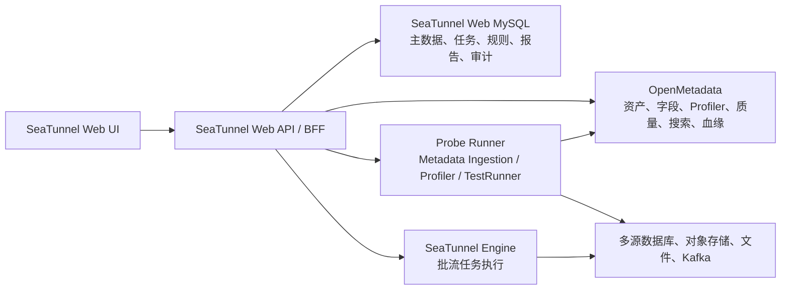

# OpenMetadata 数据探查、数据清查与数据拓扑实现方案

> 状态：评审稿
>
> 适用范围：多源数据表探查、源业务系统数据清查、数据湖资产管理、数据底数统计与数据拓扑智能感知。

## 1. 总体结论

方案可落地，但不建议把 OpenMetadata 当作普通 CRUD 后端。

建议采用：

> SeaTunnel Web 负责数据源管理、权限、任务编排、业务规则、结果聚合和报告导出；OpenMetadata 负责元数据目录、Profiler、质量结果、样例数据、搜索和血缘；独立探查 Runner 负责实际连接数据源并执行扫描、统计和质量检测。



不建议：

- 浏览器直接调用 OpenMetadata；
- 在 SeaTunnel Web 中复制一套完整元数据数据库；
- 直接访问 OpenMetadata 内部数据库；
- 将 OpenMetadata 的 Storage Service 当成物理数据湖运维引擎；
- 默认承诺所有数据源都同时支持结构、画像、质量、样例和血缘。

## 2. 当前项目基础

| 项目能力 | 当前实现 | 方案中的处理 |
|---|---|---|
| 数据源管理 | 已有数据源新增、编辑、删除、连接测试、分页查询 | 直接复用 |
| 数据源插件 | `DataSourceProcessor` 统一插件接口，支持 JDBC、Kafka、FTP、SFTP、S3、MinIO、HTTP 等类型 | 复用连接参数和能力注册机制 |
| 数据目录 | 已有表、文件、字段、Top 20 数据、行数统计接口 | 作为交互预览和兼容能力；不替代 OpenMetadata Profiler |
| 批流任务 | 已有任务定义、版本化任务内容、任务实例、日志、表级运行指标 | 用于生成 SeaTunnel 任务拓扑和运行证据 |
| 数据探查页 | `/resources/data-discovery` 当前仍是 OpenMetadata 集成占位 | 新增真实 BFF 和页面 |
| 拓扑页 | `/sync/topology` 当前仍是 OpenMetadata 血缘集成占位 | 新增任务流向与元数据血缘融合 |
| 数据湖页面 | `/lake/resources` 等页面已有原型/新增边界 | 需要区分资产目录与物理入湖管理 |
| 数据库迁移 | MySQL 迁移当前已到 `V1_0_10` | 新增表应从 `V1_0_11` 开始，不能复用历史版本 |

当前关键代码位置：

- [DataSourceController.java](../seatunnel-web-api/src/main/java/org/apache/seatunnel/web/api/controller/DataSourceController.java:33)
- [DataSourceCatalogController.java](../seatunnel-web-api/src/main/java/org/apache/seatunnel/web/api/controller/DataSourceCatalogController.java:26)
- [DataSourceCatalogServiceImpl.java](../seatunnel-web-api/src/main/java/org/apache/seatunnel/web/api/service/impl/DataSourceCatalogServiceImpl.java:58)
- [DataSourceProcessor.java](../seatunnel-web-datasource-plugins/seatunnel-web-datasource-api/src/main/java/org/apache/seatunnel/plugin/datasource/api/jdbc/DataSourceProcessor.java:20)
- [JobDefinitionEntity.java](../seatunnel-web-dao/src/main/java/org/apache/seatunnel/web/dao/entity/JobDefinitionEntity.java:15)
- [BatchJobDefinitionServiceImpl.java](../seatunnel-web-api/src/main/java/org/apache/seatunnel/web/api/service/impl/BatchJobDefinitionServiceImpl.java:95)
- [routes.ts](../seatunnel-web-ui/config/routes.ts:12)
- [dataSourceRegistry.ts](../seatunnel-web-ui/src/pages/data-source/dataSourceRegistry.ts:1)

## 3. 系统职责边界

### 3.1 SeaTunnel Web

负责：

- 数据源主数据、所属单位、环境、负责人和状态；
- 数据源连接测试及能力矩阵；
- OpenMetadata 服务绑定关系；
- 探查任务创建、调度、重试、取消和状态展示；
- 数据清查统计和跨源汇总；
- 质量标准、规则模板和整改闭环；
- 权限、脱敏、审计；
- 任务定义解析和引接拓扑；
- 统一报告生成与导出。

### 3.2 OpenMetadata

负责：

- Database Service、Storage Service、Container、Table、Column 等资产模型；
- 元数据采集结果；
- 表结构和字段属性；
- Profiler 结果；
- Sample Data；
- Data Quality Test Case 和 Test Result；
- 搜索索引；
- 元数据血缘。

### 3.3 Probe Runner

建议作为独立部署组件，不在 Spring Boot API 进程中直接启动 Python 子进程。

负责：

- 执行 OpenMetadata Metadata Ingestion；
- 执行 Profiler；
- 执行质量规则；
- 执行 SQL/查询日志血缘采集；
- 向 OpenMetadata 写入结果；
- 向 SeaTunnel Web 回报运行状态和统计信息。

### 3.4 SeaTunnel Engine

负责：

- 批量和实时数据引接；
- Source、Transform、Sink 任务执行；
- 运行状态、日志和表级传输指标。

SeaTunnel Engine 的任务流向与 OpenMetadata 的数据血缘需要合并展示，但两者不是同一个概念。

## 4. 指标实现映射

| 指标 | 实现方案 | 主要责任方 |
|---|---|---|
| 多源快速接入 | 复用现有数据源和插件 SPI，增加“数据源类型—OpenMetadata Connector—能力”映射表 | SeaTunnel Web + Runner |
| 自动扫描多源资产 | 创建异步探查任务，由 Runner 执行 Metadata Ingestion | Runner + OpenMetadata |
| 表结构解析 | 从 OpenMetadata 获取 Table、Column、Schema 等结构 | OpenMetadata |
| 字段特征统计 | 使用 Profiler 生成行数、空值率、唯一率、最值、分布等指标 | Runner + OpenMetadata |
| 质量合规校验 | SeaTunnel Web 管理质量标准和规则模板，转换为 OpenMetadata Test Case 或 Runner 规则执行 | SeaTunnel Web + OpenMetadata |
| 内容预览 | 优先使用 OpenMetadata Sample Data；当前 `DataSourceCatalog` 作为受控回退 | BFF |
| 集中展示 | BFF 聚合资产、字段、画像、质量、样例、血缘 | SeaTunnel Web |
| 规范化导出 | SeaTunnel Web 生成统一报告，组合元数据、Profiler、质量和血缘结果 | SeaTunnel Web |
| 数据湖资产清查 | 使用 OpenMetadata 管理服务、容器、文件和表资产 | OpenMetadata |
| 物理数据湖运维 | 文件上传、分区、生命周期、Compaction、Iceberg/Hudi/Delta 运维需单独实现 | SeaTunnel/湖存储平台 |
| 数据底数统计 | 基于 OpenMetadata 结果生成可重建的统计投影 | SeaTunnel Web |
| 数据分布分析 | 按单位、环境、数据源类型、库、Schema、表、质量状态等维度聚合 | SeaTunnel Web |
| 拓扑构建 | 融合 OpenMetadata 血缘、SeaTunnel 任务定义和运行指标 | SeaTunnel Web + OpenMetadata |

## 5. 建议的数据模型

不复制 OpenMetadata 全量实体，只保存绑定关系、任务状态、业务规则和可重建统计。

### 5.1 OpenMetadata 服务绑定

建议新增 `t_seatunnel_web_om_service_binding`，主要字段包括：

- `datasource_id`；
- `om_service_type`、`om_service_name`、`om_service_fqn`；
- `om_server_version`、`connector_type`；
- `capability_json`；
- `last_sync_time`、`sync_status`、`error_message`；
- `create_user_id`、`update_user_id`。

### 5.2 探查运行任务

建议新增 `t_seatunnel_web_discovery_run`，记录：

- `run_id`、`datasource_id`、`scope_config`；
- 元数据、Profiler、质量、血缘等 `run_type`；
- `runner_id`、`om_pipeline_id`；
- `status`、`stage`；
- 资产、字段、质量规则和错误数量；
- 开始/结束时间、请求幂等键和错误信息。

状态建议统一为：

```text
PENDING
RUNNING
SUCCEEDED
PARTIAL_FAILED
FAILED
CANCELED
```

### 5.3 质量规则

建议新增：

- `t_seatunnel_web_quality_rule`；
- `t_seatunnel_web_quality_rule_version`；
- `t_seatunnel_web_quality_binding`；
- `t_seatunnel_web_quality_run`。

SeaTunnel Web 管理规则编码、分类、适用数据源、字段类型、阈值、SQL/表达式、启用状态和版本；OpenMetadata 保存执行对象和结果，SeaTunnel Web 负责业务标准和综合评分。

### 5.4 报告与拓扑

建议新增：

- `t_seatunnel_web_discovery_report`；
- `t_seatunnel_web_discovery_report_item`；
- `t_seatunnel_web_topology_edge`。

拓扑边属于可重建数据，不作为唯一事实来源。每条边需要记录源节点、目标节点、边类型、证据来源、置信度、关联任务、任务版本和最后观测时间。

## 6. 后端接口规划

接口只暴露 SeaTunnel Web 的统一模型，不暴露 OpenMetadata Token、FQN 和版本差异。

### 6.1 数据源探查

```text
GET  /api/v1/discovery/sources
GET  /api/v1/discovery/sources/{datasourceId}/capabilities
POST /api/v1/discovery/scans
GET  /api/v1/discovery/scans/page
GET  /api/v1/discovery/scans/{runId}
POST /api/v1/discovery/scans/{runId}/retry
POST /api/v1/discovery/scans/{runId}/cancel
```

### 6.2 资产与探查结果

```text
GET /api/v1/discovery/assets
GET /api/v1/discovery/assets/tree
GET /api/v1/discovery/assets/{assetId}
GET /api/v1/discovery/assets/{assetId}/profile
GET /api/v1/discovery/assets/{assetId}/sample
GET /api/v1/discovery/assets/{assetId}/quality
GET /api/v1/discovery/assets/{assetId}/lineage
```

### 6.3 清查统计

```text
GET /api/v1/discovery/statistics/overview
GET /api/v1/discovery/statistics/distribution
GET /api/v1/discovery/statistics/trends
```

### 6.4 质量管理

```text
GET  /api/v1/discovery/quality/rules
POST /api/v1/discovery/quality/rules
PUT  /api/v1/discovery/quality/rules/{id}
POST /api/v1/discovery/quality/plans
POST /api/v1/discovery/quality/runs
GET  /api/v1/discovery/quality/runs/{runId}
```

### 6.5 报告和拓扑

```text
POST /api/v1/discovery/reports
GET  /api/v1/discovery/reports/page
GET  /api/v1/discovery/reports/{id}
POST /api/v1/discovery/reports/{id}/export

GET /api/v1/topology/graph
GET /api/v1/topology/nodes/{id}
GET /api/v1/topology/impact/{id}
```

所有扫描、Profiler、质量和报告接口均应采用异步任务模型。

## 7. OpenMetadata API 适配原则

附件中的分析使用了 OpenMetadata 1.13.x 文档路径；当前官方文档中部分质量 API 已出现 `/api/v1/quality/testCases` 等路径差异。

因此不应把具体端点直接写入前端或业务代码，建议增加：

```text
OpenMetadataClient
OpenMetadataVersionAdapter
OpenMetadataAssetMapper
OpenMetadataCapabilityResolver
```

适配器统一处理：

- API 根路径；
- JWT 或其他认证方式；
- FQN 与 UUID；
- 分页；
- 版本差异；
- 质量 API 差异；
- Profiler 结果结构差异；
- 错误码和重试。

需要覆盖的 API 能力包括：

| 能力 | OpenMetadata API 能力 |
|---|---|
| 表清单 | Tables List |
| 表结构 | Table Detail、Columns |
| 表画像 | Table Profile |
| 字段画像 | Column Profile |
| 样例数据 | Sample Data |
| 自定义指标 | Custom Metrics |
| 质量规则 | Test Cases |
| 质量结果 | Test Case Results |
| 资产搜索 | Search Query |
| 血缘 | Lineage API 或 Lineage Ingestion |

参考官方文档：

- [External Metadata Ingestion](https://docs.open-metadata.org/v2.0.x-SNAPSHOT/deployment/ingestion/external/examples)
- [List Tables](https://docs.open-metadata.org/v2.0.x-SNAPSHOT/api-reference/data-assets/tables/list)
- [Table Profiler](https://docs.open-metadata.org/v2.0.x-SNAPSHOT/api-reference/data-assets/tables)
- [Sample Data](https://docs.open-metadata.org/v2.0.x-SNAPSHOT/api-reference/data-assets/tables/sample-data)
- [Data Quality as Code](https://docs.open-metadata.org/v2.0.x-SNAPSHOT/how-to-guides/data-quality-observability/quality/data-quality-as-code)
- [Lineage Ingestion](https://docs.open-metadata.org/v2.0.x-SNAPSHOT/api-reference/sdk/python/ingestion/lineage)

## 8. 数据源能力矩阵

“SeaTunnel 已支持”不等于“OpenMetadata 也具备完整能力”，需要建立实际 POC 矩阵。

| 数据源 | 元数据 | Profiler | 样例 | 质量 | 血缘 | 说明 |
|---|---:|---:|---:|---:|---:|---|
| MySQL | 支持 | 优先 POC | 支持 | 支持 | 查询日志/视图需验证 | 第一批验证 |
| PostgreSQL | 支持 | 优先 POC | 支持 | 支持 | 查询日志/视图需验证 | 第一批验证 |
| Oracle | 待验证 | 待验证 | 待验证 | 待验证 | 待验证 | 重点验证方言 |
| JDBC 通用 | 部分支持 | 依赖具体数据库 | 依赖权限 | 需适配 | 通常有限 | 不能按 JDBC 一概而论 |
| Doris | 待验证 | 待验证 | 待验证 | 待验证 | 待验证 | 需要连接器 POC |
| Kingbase/达梦 | 待验证 | 待验证 | 待验证 | 待验证 | 待验证 | 可先复用 JDBC 结构解析 |
| S3/MinIO | Container、文件 | 仅结构化格式 | 依格式 | 需格式适配 | 通常有限 | 二进制文件不能做表级画像 |
| FTP/SFTP | 文件目录 | 需下载解析 | 受大小限制 | 需自研规则 | 不适用或有限 | 先做资产清查 |
| Kafka | Topic/Schema | 非传统表画像 | 需消费采样 | 需消息规则 | 依 Schema/任务 | 不直接承诺表级能力 |
| HTTP | Endpoint/响应结构 | 依响应 Schema | 需请求采样 | 需接口规则 | 通常有限 | 作为扩展能力 |

第一阶段建议选择：

> MySQL、PostgreSQL、MinIO/S3。

完成完整纵向验证后，再扩展 Oracle、Doris、Kingbase、达梦、Kafka、FTP/SFTP 和 HTTP。

## 9. 数据探查业务流程

```text
1. 用户登记数据源
   ↓
2. 连接测试并生成 OpenMetadata 服务绑定
   ↓
3. 用户配置扫描范围、表过滤、样例和画像策略
   ↓
4. SeaTunnel Web 创建 DiscoveryRun
   ↓
5. Probe Runner 执行 Metadata Ingestion
   ↓
6. OpenMetadata 保存服务、库、Schema、表、字段
   ↓
7. Runner 执行 Profiler 和质量检测
   ↓
8. 结果写入 OpenMetadata，运行状态回写 SeaTunnel Web
   ↓
9. BFF 聚合并生成统计投影
   ↓
10. UI 展示资产、结构、画像、质量、样例、血缘
   ↓
11. 报告服务生成 Excel、CSV、PDF、JSON
```

需要增加：

- 幂等键；
- 任务重试；
- Runner 心跳；
- 断点和阶段状态；
- OpenMetadata 运行 ID；
- 失败原因；
- 部分成功状态；
- 服务重启后的状态恢复。

## 10. 数据拓扑实现

拓扑不应只依赖 OpenMetadata 血缘，建议融合三类证据。

### 10.1 节点

- 数据源；
- Database；
- Schema；
- Table；
- Column；
- SeaTunnel 任务；
- Transform；
- Kafka Topic；
- 对象存储 Container；
- 湖表或目标表。

### 10.2 边

| 边类型 | 来源 |
|---|---|
| 元数据层级关系 | OpenMetadata |
| 数据库血缘 | OpenMetadata Lineage |
| 任务引接关系 | SeaTunnel Job Definition |
| 运行观测关系 | SeaTunnel Job Table Metrics |
| 人工确认关系 | SeaTunnel Web |
| 字段映射关系 | 任务配置解析或 OpenMetadata |

当前项目已有 `JobDefinitionAnalysisResult`，能够保存来源/目标数据源、来源/目标表摘要，但粒度偏粗。

建议新增独立的 `JobDefinitionTopologyAnalyzer`，不要直接扩大原有保存模型，避免影响现有任务保存逻辑。它负责：

- 解析 GUIDE_SINGLE；
- 解析 GUIDE_MULTI 多表配置；
- 解析 SCRIPT/HOCON；
- 识别 Source、Transform、Sink；
- 提取表、Topic、文件路径；
- 生成任务版本级拓扑证据；
- 在任务保存或上线后异步刷新拓扑。

拓扑展示时应显示：

- 边来源；
- 数据更新时间；
- 任务版本；
- 运行状态；
- 置信度；
- 是否为自动发现；
- 是否为人工确认。

“自动扫描资产”可以作为基础能力直接实现；“完整字段级、跨系统、跨任务血缘”必须按数据源和任务类型逐步验收。

## 11. 前端实现范围

### 11.1 数据源管理页

复用现有 `/data-source` 页面，增加：

- OpenMetadata 接入开关；
- 元数据扫描状态；
- Profiler 支持状态；
- 样例支持状态；
- 质量支持状态；
- 血缘支持状态；
- 最近扫描时间；
- 扫描失败原因；
- “开始探查”入口。

现有 `dataSourceRegistry.ts` 继续维护数据源分类、Source/Sink/实时任务资格；OpenMetadata 能力建议单独维护，避免混淆数据引接能力和数据探查能力。

### 11.2 数据探查页

将 `/resources/data-discovery` 从占位页面替换为真实页面：

- 左侧：单位、数据源、库、Schema、表/文件树；
- 中间：表结构和字段信息；
- Profiler：行数、空值率、唯一率、最值、分布；
- 质量：规则、结果、失败字段和整改建议；
- 样例：受控预览、字段脱敏；
- 血缘：上下游关系和影响分析；
- 统计：资产数量、字段数量、质量状态和分布；
- 报告：生成和导出。

### 11.3 拓扑页

将 `/sync/topology` 从占位页面替换为真实页面：

- 全局拓扑；
- 按数据源筛选；
- 按任务筛选；
- 按资产类型筛选；
- 节点详情；
- 上游/下游钻取；
- 影响分析；
- 异常链路高亮；
- 任务运行状态叠加。

### 11.4 报告页

复用或改造 `/reporting/reports`：

- 资产清查报告；
- 数据探查报告；
- 数据质量报告；
- 拓扑快照报告；
- 报告版本；
- 生成记录；
- Excel、CSV、PDF、JSON 导出。

## 12. 分阶段实施计划

### 阶段 0：版本和能力 POC

目标：

- 锁定 OpenMetadata Server、Python Ingestion SDK 和 Runner 版本；
- 验证 MySQL、PostgreSQL、MinIO/S3；
- 打通表结构、字段、Profiler、Sample、质量和血缘；
- 形成数据源能力矩阵；
- 固化 OpenMetadata API 契约测试。

输出：版本矩阵、API 适配器设计、数据源能力矩阵和 POC 验证报告。

### 阶段 1：元数据清查

目标：

- 新增 OpenMetadata 服务绑定；
- 新增异步探查任务；
- 部署 Probe Runner；
- 实现资产树和资产详情；
- 实现数据底数统计；
- 实现单位、环境、数据源分布分析。

### 阶段 2：Profiler、质量和预览

目标：

- 配置画像策略；
- 生成字段特征统计；
- 建立质量规则模板；
- 执行非空、唯一、范围、格式、代码集等规则；
- 处理样例脱敏和权限；
- 实现统一探查详情页；
- 实现报告生成和导出。

### 阶段 3：拓扑和血缘

目标：

- 解析批流任务定义；
- 生成任务级来源—目标边；
- 对接 OpenMetadata Lineage；
- 融合任务拓扑、运行指标和元数据血缘；
- 实现拓扑筛选、钻取和影响分析。

### 阶段 4：性能、安全和验收

目标：

- 大表抽样和分区策略；
- 并发和超时控制；
- 失败重试和断点恢复；
- Secret/Vault/KMS 接入；
- 字段级权限；
- 结果审计；
- 真实前后端和 Runner 联调验收。

## 13. 主要风险与必须确认的事项

### 13.1 OpenMetadata 版本

附件分析中的 API 与当前官方文档存在版本差异，必须先确定部署版本，所有 API 通过适配器封装。

### 13.2 凭据安全

当前 `DataSource` 中保存了 `connectionParams` 和 `originalJson`。生产实现不应将原始密码写入 OpenMetadata、日志、报告或前端。

建议：

- SeaTunnel Web 只保存密钥引用；
- Runner 临时获取凭据；
- OpenMetadata 只保存服务标识或受控连接配置；
- 样例数据和报告必须脱敏。

### 13.3 数据库负载

Profiler 和质量检测会真实执行统计 SQL，必须支持：

- 抽样；
- 分区过滤；
- 表白名单/黑名单；
- 并发限制；
- 查询超时；
- 执行窗口；
- 失败中止。

### 13.4 数据湖边界

如果“数据湖管理”只要求资产清查、目录、结构、质量和血缘，OpenMetadata 可以作为主要底座。

如果还要求文件迁移、分区维护、生命周期、Compaction、Iceberg/Hudi/Delta 运维，则必须配合对象存储或湖仓平台，不能仅依赖 OpenMetadata。

### 13.5 验收边界

建议将能力分为：

- **R：** MySQL/PostgreSQL/MinIO 等已完成真实验证的能力；
- **V1：** 受控 Runner、规则模板、任务级拓扑和统一报告；
- **V2：** 任意异构数据源、完整字段级血缘、AI 注释推断、物理数据湖运维。

## 14. 建议优先确认

正式开发前建议先确认四项：

1. OpenMetadata Server 和 Ingestion SDK 的目标版本；
2. 第一批验收数据源范围；
3. “数据湖管理”是否包含物理存储运维；
4. 质量规则由 SeaTunnel Web 主导、OpenMetadata 执行，还是由外部质量引擎执行。

## 15. 参考文档

- [项目数据采集引接软件指标](rocket/数据采集引接软件指标.md)
- [项目数据采集引接软件投标阶段模块划分](rocket/数据采集引接软件投标阶段模块划分.md)
- [External Metadata Ingestion](https://docs.open-metadata.org/v2.0.x-SNAPSHOT/deployment/ingestion/external/examples)
- [List Tables](https://docs.open-metadata.org/v2.0.x-SNAPSHOT/api-reference/data-assets/tables/list)
- [Table Profiler](https://docs.open-metadata.org/v2.0.x-SNAPSHOT/api-reference/data-assets/tables)
- [Sample Data](https://docs.open-metadata.org/v2.0.x-SNAPSHOT/api-reference/data-assets/tables/sample-data)
- [Data Quality as Code](https://docs.open-metadata.org/v2.0.x-SNAPSHOT/how-to-guides/data-quality-observability/quality/data-quality-as-code)
- [Lineage Ingestion](https://docs.open-metadata.org/v2.0.x-SNAPSHOT/api-reference/sdk/python/ingestion/lineage)
