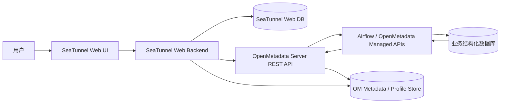
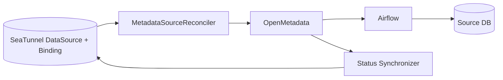
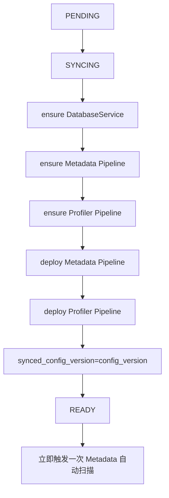
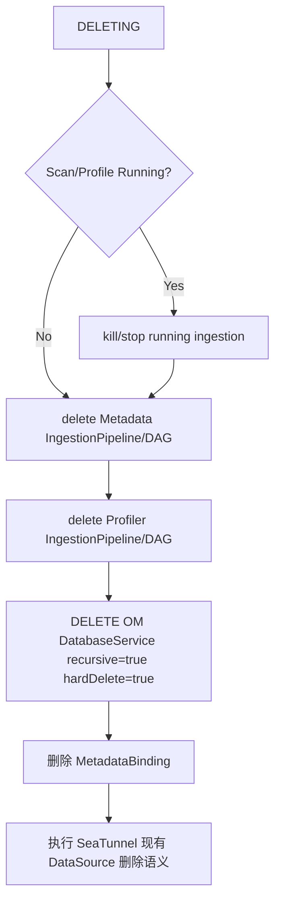
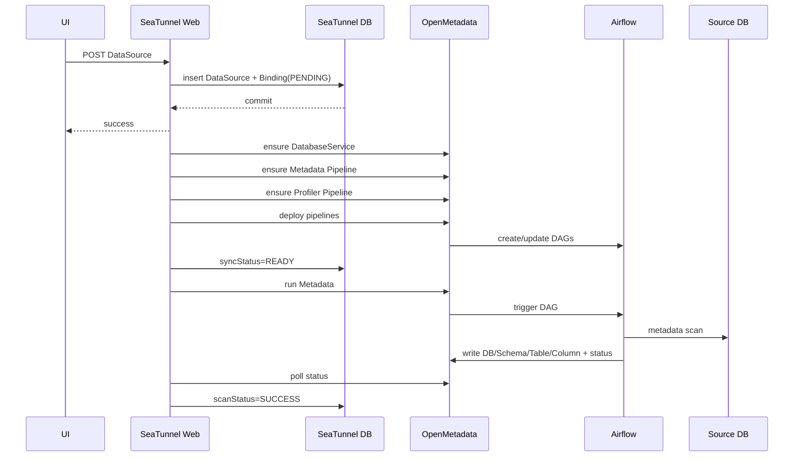
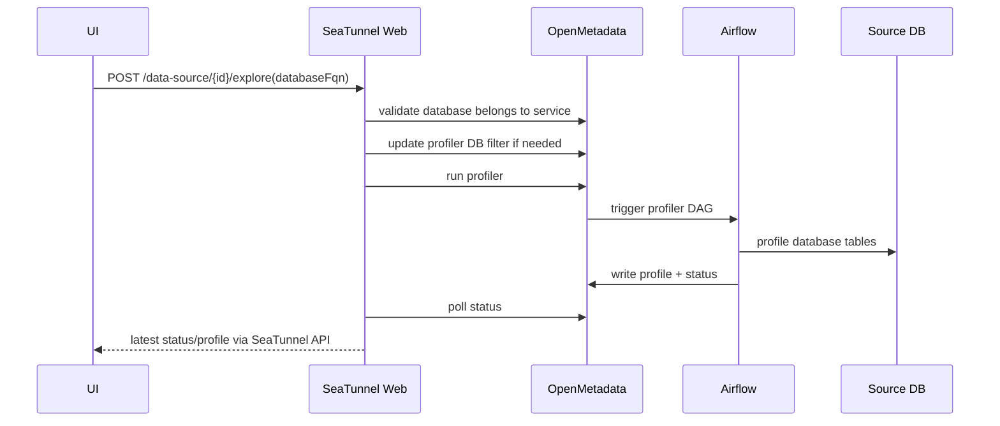

# SeaTunnel Web × OpenMetadata 数据源自动扫描与数据探查 MVP 详细设计（Codex 开发输入）

> 文档版本：V0.2  
> 日期：2026-08-25  
> 目标分支：`https://github.com/liuchang012463/seatunnel-web/tree/develop`  
> 使用方式：本文件作为 Codex 开发的需求与技术基线。除非后续明确变更，本文件中标记为 **MUST** 的内容不得自行扩大或缩减范围。
> OpenMetadata 固定版本：**1.12.10**（服务端）；Airflow ingestion/managed APIs：**1.12.10.x**，具体 patch build 由 Sprint 0 BOM 固定。

---

## 0. Codex 执行规则

Codex 开始编码前必须先完整阅读本文，并执行以下规则：

1. **先扫描现有代码，再修改。** 优先复用当前 `DataSourceController`、`DataSourceService`、`DataSourceCatalogController`、DAO、统一响应对象、异常体系、权限体系、MyBatis/MyBatis-Plus 约定、前端组件和国际化约定。
2. **不得再实现第二套数据源管理。** SeaTunnel Web `DataSource` 是唯一面向用户的数据源主数据；OpenMetadata DatabaseService 只是自动维护的技术镜像。
3. **不得调用或嵌入 OpenMetadata 原生页面。** 所有能力通过 OpenMetadata REST API / 固定版本 SDK API 由 SeaTunnel Web 后端封装。
4. **不得让前端直接调用 OpenMetadata 或 Airflow。**
5. **不得让 SeaTunnel Web 直接调用 Airflow。** SeaTunnel Web 只调用 OpenMetadata；OpenMetadata 的 PipelineServiceClient 再控制 Airflow。
6. **不得在 SeaTunnel Web 再复制一份 Database/Schema/Table/Column/Profile 明细表。** OpenMetadata 是扫描结果与 Profile 结果的事实存储；SeaTunnel Web 只存业务主数据、OM 绑定关系和运行状态缓存。
7. **不要在用户界面、SeaTunnel REST API 名称中使用“数据资产”作为产品术语。** 使用“数据源自动扫描”“扫描结果”“数据源探查”“探查结果”“数据清查”“数据源拓扑”等。
8. **状态机必须幂等、可恢复。** 禁止在一个 HTTP 事务中把 SeaTunnel DB、OpenMetadata 和 Airflow 当成分布式事务。
9. **OpenMetadata 版本固定为 1.12.10。** 本项目所有 OpenMetadata Server API、JSON Schema、IngestionPipeline、Profiler、Connector 扩展均以 **OpenMetadata 1.12.10** 为唯一服务端基线；不得使用 1.13.x/其他版本文档或源码替代。Airflow 侧 `openmetadata-ingestion` 与 `openmetadata-managed-apis` 必须保持在 `1.12.10.x` 版本线，并在项目 BOM 中固定具体 patch build。
10. **先完成 Sprint 0 技术 Gate，再大规模开发 UI。** 达梦与 Kingbase 的 Metadata + Profiler 全链路未验证通过前，不得认定 Connector 方案成立。
11. 对本文中“参考 DDL”与“参考包路径”，如果与仓库现有基类/命名规范冲突，**保持业务字段和语义不变，代码形式服从现有项目规范**。
12. 每个 Sprint 均需补测试；状态机核心分支必须有单元测试或集成测试。

---

# 1. 背景与合同指标

## 1.1 F-02.03

合同要求：

> 通过构建统一的数据探查分析框架与标准化检测机制，具备对多数据源的表进行数据探查功能。支持各类异构数据源的快速接入与全域探查，实现数据表结构解析、字段特征统计及数据质量合规性校验，支持数据内容可视化预览与探查结果集中展示，实现多维度数据探查分析与结果规范化导出。

MVP 对应能力：

- SeaTunnel Web 一套数据源统一管理；
- 多种结构化数据库统一接入 OpenMetadata；
- 数据源自动扫描 Database / Schema / Table / Column；
- 手动按 Database 触发 Profiler；
- 表结构、字段结构展示；
- 表级/字段级 Profile；
- 基于约束 + Profile 的轻量质量判定；
- 复用现有 Top20 数据预览；
- 探查结果集中展示；
- XLSX 规范化导出。

## 1.2 F-04.01

合同要求：

> ①提供数据湖管理功能，通过源业务系统数据清查模块实现全面梳理源业务系统数据资产。  
> ②具备源业务系统数据清查摸底统计能力，数据底数统计与汇总，并进行数据分布情况分析；可实现数据清查结果展示。

MVP 对应能力：

- Doris 作为数据湖结构化数据库底座纳入 P0；
- 单位、业务系统、数据源形成稳定业务层级；
- 对扫描结果做底数统计；
- 按单位、业务系统、数据库类型等维度统计分布；
- 展示 Database / Schema / Table / Column 数量；
- 展示已探查覆盖情况和可用数据量指标；
- 不扩展到 S3、Kafka、湖文件、湖表格式等非当前结构化数据库范围。

## 1.3 F-13.01

合同要求：

> 本系统设计数据拓扑智能感知构建子功能项，通过数据源接入探查，自动扫描多源数据资产。

MVP 对应能力：

- 新增/修改数据源后自动执行 Metadata 扫描；
- 自动发现 Database / Schema / Table / Column；
- 展示：
  `数据源单位 → 业务系统 → 数据源 → Database → Schema → Table`
- MVP **不实现血缘**，不实现表到表、字段到字段的数据流向关系。

---

# 2. MVP 范围基线

## 2.1 P0 数据源

MVP 必须完成以下结构化数据库完整闭环：

| 数据源 | SeaTunnel 管理 | OM Metadata | OM Profiler | 数据预览 | MVP |
|---|---:|---:|---:|---:|---:|
| MySQL | MUST | MUST | MUST | MUST | P0 |
| PostgreSQL | MUST | MUST | MUST | MUST | P0 |
| Oracle | MUST | MUST | MUST | MUST | P0 |
| 达梦 Dameng | MUST | MUST | MUST | MUST | P0 |
| KingbaseES | MUST | MUST | MUST | MUST | P0 |
| Doris | MUST | MUST | MUST | MUST | P0 |

当前 SeaTunnel Web `DbType` 已包含 MySQL、Oracle、PostgreSQL、Doris、Kingbase、Dameng 等类型，因此本次应在既有 DataSource 类型体系上增量实现。

## 2.2 MVP 明确不做

- Kafka；
- S3 / MinIO；
- 非结构化数据；
- 数据血缘；
- 字段血缘；
- OpenMetadata 原生 UI 嵌入；
- 第二套数据源录入页面；
- 用户配置 OpenMetadata Agent；
- 用户配置 Airflow；
- 用户自定义探查调度周期；
- Schema/Table 级探查范围选择；
- 自定义数据质量规则平台；
- 数据质量评分；
- 数据质量告警；
- Profile 历史趋势；
- 数据标准管理；
- 敏感数据识别；
- 全文数据目录/数据地图；
- 独立资产管理能力。

---

# 3. 术语与用户可见命名

## 3.1 用户可见术语

| 技术概念 | 用户界面名称 |
|---|---|
| OpenMetadata Metadata Ingestion Pipeline | 数据源自动扫描 |
| OpenMetadata Profiler Pipeline | 数据源探查 |
| OM Database/Schema/Table/Column | 扫描结果 |
| OM Profile | 探查结果 / 特征统计 |
| OM DatabaseService | 不展示 |
| Agent / IngestionPipeline | 不直接展示“Agent” |
| Metadata Catalog Asset | 不使用“数据资产”作为本系统产品名称 |
| Service→DB→Schema→Table | 数据源拓扑 |

合同原文中的“数据资产”只在合同映射说明中出现，不作为本系统前端功能名。

---

# 4. 总体架构



职责边界：

### SeaTunnel Web

- 数据源单位管理；
- 业务系统管理；
- 唯一的数据源用户管理入口；
- OM 技术对象的期望状态；
- OM 绑定关系；
- 状态机与失败恢复；
- 自动扫描/探查状态展示；
- 扫描结果、探查结果的统一 API；
- 数据源拓扑；
- 数据清查；
- Excel 导出；
- 数据预览。

### OpenMetadata

- DatabaseService 技术镜像；
- Metadata IngestionPipeline；
- Profiler IngestionPipeline；
- Database / Schema / Table / Column；
- Table/Column Profile；
- Pipeline 状态；
- Pipeline 历史运行记录；
- 源端对象删除识别。

### Airflow

- Pipeline DAG 动态部署；
- 定时 Metadata 扫描；
- 手工触发运行；
- 实际 Workflow 执行；
- 并发与 `maxActiveRuns` 控制。

---

# 5. 核心业务模型

## 5.1 关系模型

```text
数据源单位 1
   │
   └──── N 业务系统 1
                 │
                 └──── N 数据源 1
                               │
                               └──── 1 OM DatabaseService
                                           │
                                           ├──── 1 Metadata Pipeline
                                           └──── 1 Profiler Pipeline
```

一个单位可以包含多个业务系统；一个业务系统可以有多个数据源；一个业务系统中的数据源可以是不同数据库类型。

MVP 暂定：

> 数据源单位 = 业务系统所属单位。

未来如出现“系统归属单位”和“数据源提供单位”不一致，再扩展为两个单位维度，不在本次提前复杂化。

## 5.2 OpenMetadata 层级映射

```text
SeaTunnel DataSourceUnit
    ↓
SeaTunnel BusinessSystem
    ↓
SeaTunnel DataSource
    ↓ 1:1 技术镜像
OpenMetadata DatabaseService
    ↓
OpenMetadata Database
    ↓
OpenMetadata DatabaseSchema
    ↓
OpenMetadata Table
    ↓
OpenMetadata Column
```

OM DatabaseService 必须对用户隐藏。

---

# 6. 单位与业务系统是否独立建表：最终决策

## 6.1 结论

**MUST：单位和业务系统都独立建表。**

原因：

- 需要稳定统计口径；
- 避免自由字符串造成“公安局 / 市公安局 / XX市公安局”等重复；
- 支持单位改名而不批量修改数据源；
- 支持一个单位多个系统；
- 支持业务系统启停；
- 支持编码与唯一约束；
- F-04.01 的数据清查需要按业务系统、单位聚合；
- 独立建表不等于必须做重量级独立管理中心。

前端可只提供轻量 CRUD 页面或数据源编辑中的级联选择/新增弹窗。

## 6.2 不采用的方案

### 方案 A：DataSource 保留 `dataSourceUnit` 字符串 + 新增 `systemName` 字符串

缺点：无主数据约束、统计口径不稳定、改名困难、关系不可控。

### 方案 B：仅业务系统建表，单位仍为字符串

缺点：字符串问题只是从 DataSource 搬到 BusinessSystem。

### 方案 C：DataSource 同时保存 `unit_id` 和 `business_system_id`

MVP 不采用。因为 `business_system.unit_id` 已能唯一推导单位，再存一份会造成一致性风险。

---

# 7. 数据库设计

> 注意：以下为参考 DDL。ID 生成策略、审计字段必须优先复用当前仓库 `BaseEntity` / MyBatis 约定。若现有项目不是 AUTO_INCREMENT，不得自行改成 AUTO_INCREMENT。

## 7.1 数据源单位表

表名建议：

`t_seatunnel_web_data_source_unit`

```sql
CREATE TABLE t_seatunnel_web_data_source_unit (
    id              BIGINT       NOT NULL,
    unit_code       VARCHAR(128) NOT NULL,
    unit_name       VARCHAR(256) NOT NULL,
    status          TINYINT      NOT NULL DEFAULT 1,
    remark          VARCHAR(1024) NULL,
    create_user_id  BIGINT        NULL,
    update_user_id  BIGINT        NULL,
    create_time     DATETIME      NOT NULL,
    update_time     DATETIME      NOT NULL,
    PRIMARY KEY (id),
    UNIQUE KEY uk_ds_unit_code (unit_code),
    UNIQUE KEY uk_ds_unit_name (unit_name)
);
```

规则：

- `unit_code` MUST 唯一；
- `unit_name` MVP 建议唯一；
- `status=0` 后不可用于新建/修改 DataSource，但历史关联继续展示；
- 有 BusinessSystem 引用时禁止物理删除，优先停用。

## 7.2 业务系统表

表名建议：

`t_seatunnel_web_business_system`

```sql
CREATE TABLE t_seatunnel_web_business_system (
    id              BIGINT       NOT NULL,
    unit_id         BIGINT       NOT NULL,
    system_code     VARCHAR(128) NOT NULL,
    system_name     VARCHAR(256) NOT NULL,
    status          TINYINT      NOT NULL DEFAULT 1,
    remark          VARCHAR(1024) NULL,
    create_user_id  BIGINT        NULL,
    update_user_id  BIGINT        NULL,
    create_time     DATETIME      NOT NULL,
    update_time     DATETIME      NOT NULL,
    PRIMARY KEY (id),
    UNIQUE KEY uk_business_system_code (unit_id, system_code),
    UNIQUE KEY uk_business_system_name (unit_id, system_name),
    KEY idx_business_system_unit (unit_id)
);
```

规则：

- `unit_id` MUST 存在；
- 系统编码、名称在同一单位内唯一；
- 有 DataSource 引用时禁止删除，允许停用；
- 停用系统后不可作为新的 DataSource 归属选择。

## 7.3 修改 DataSource

现有 `t_seatunnel_web_datasource` 增加：

```sql
ALTER TABLE t_seatunnel_web_datasource
    ADD COLUMN business_system_id BIGINT NULL,
    ADD KEY idx_datasource_business_system (business_system_id);
```

旧 `data_source_unit` / `dataSourceUnit`：

- 第一阶段保留，标记 Deprecated；
- 新增/修改业务逻辑只写 `business_system_id`；
- 查询 DTO 中的 `dataSourceUnit` 如需兼容旧前端，改为通过：
  `DataSource → BusinessSystem → DataSourceUnit` 推导；
- 完成历史数据治理后再删除旧字段，MVP 不要求第一版立即 DROP。

## 7.4 历史数据迁移

建议分阶段：

### 阶段 1

- 建单位表、系统表；
- DataSource 新增 nullable `business_system_id`；
- 从现有 `dataSourceUnit` distinct 值导入 Unit；
- **不要自动伪造大量“默认业务系统”**，避免产生错误业务语义；
- 历史 DataSource 暂允许 `business_system_id IS NULL`，前端显示“待归属”。

### 阶段 2

- 管理员完成业务系统配置；
- 给历史 DataSource 绑定系统；
- 新建/修改 DataSource 时 `businessSystemId` MUST 非空。

### 阶段 3

- 所有历史数据补齐后，再考虑数据库层 `NOT NULL`；
- 删除/停止使用旧 `dataSourceUnit` 字段。

---

# 8. OpenMetadata 绑定表

表名：

`t_seatunnel_web_metadata_binding`

参考 DDL：

```sql
CREATE TABLE t_seatunnel_web_metadata_binding (
    id                          BIGINT       NOT NULL,
    datasource_id               BIGINT       NOT NULL,

    desired_state               VARCHAR(32)  NOT NULL,
    sync_status                 VARCHAR(32)  NOT NULL,

    config_version              BIGINT       NOT NULL DEFAULT 1,
    synced_config_version       BIGINT       NOT NULL DEFAULT 0,
    metadata_triggered_version  BIGINT       NOT NULL DEFAULT 0,

    om_service_id               VARCHAR(64)   NULL,
    om_service_fqn              VARCHAR(512)  NULL,

    om_metadata_pipeline_id     VARCHAR(64)   NULL,
    om_metadata_pipeline_fqn    VARCHAR(512)  NULL,

    om_profiler_pipeline_id     VARCHAR(64)   NULL,
    om_profiler_pipeline_fqn    VARCHAR(512)  NULL,

    scan_status                 VARCHAR(32)  NOT NULL DEFAULT 'NEVER',
    scan_last_run_time          DATETIME      NULL,
    scan_last_success_time      DATETIME      NULL,
    scan_last_error             VARCHAR(4096) NULL,

    profile_status              VARCHAR(32)  NOT NULL DEFAULT 'NEVER',
    profile_last_run_time       DATETIME      NULL,
    profile_last_success_time   DATETIME      NULL,
    profile_last_error          VARCHAR(4096) NULL,

    retry_count                 INT          NOT NULL DEFAULT 0,
    next_retry_time             DATETIME      NULL,
    last_sync_error_code        VARCHAR(64)   NULL,
    last_sync_error             VARCHAR(4096) NULL,

    last_status_refresh_time    DATETIME      NULL,
    status_refresh_error        VARCHAR(2048) NULL,

    version                     BIGINT       NOT NULL DEFAULT 0,

    create_time                 DATETIME     NOT NULL,
    update_time                 DATETIME     NOT NULL,

    PRIMARY KEY (id),
    UNIQUE KEY uk_metadata_binding_datasource (datasource_id),
    KEY idx_metadata_binding_reconcile (sync_status, next_retry_time),
    KEY idx_metadata_binding_desired (desired_state)
);
```

说明：

- OM UUID 用字符串保存，避免强行映射数据库 UUID 类型；
- 不保存 OM Database/Schema/Table/Column/Profile 明细；
- 不保存 Airflow 凭据；
- 不保存第三份业务数据库密码；
- 运行历史不完整复制，列表页只缓存最新状态；
- “最近 N 次运行”详情通过 OM Pipeline Status API 实时读取。

---

# 9. 稳定技术命名

OpenMetadata 技术对象 MUST 基于 SeaTunnel DataSource ID，而不是显示名称：

```text
DatabaseService name:
st_ds_{datasourceId}

Metadata pipeline name:
st_ds_{datasourceId}_metadata

Profiler pipeline name:
st_ds_{datasourceId}_profiler
```

例如：

```text
st_ds_1024
st_ds_1024_metadata
st_ds_1024_profiler
```

`displayName` 可同步 SeaTunnel DataSource 名称。

收益：

- 用户改数据源名称不会导致 FQN 变化；
- 业务系统调整不影响 OM identity；
- 应用崩溃后可按稳定名称重新发现并 adopt OM 对象；
- `ensureXxx` 天然幂等。

---

# 10. 状态机

## 10.1 三个正交状态，不设计大枚举

### 期望状态

```java
enum MetadataDesiredState {
    ACTIVE,
    DELETED
}
```

### OM 同步状态

```java
enum MetadataSyncStatus {
    PENDING,
    SYNCING,
    READY,
    WAITING,
    ERROR,
    DELETING
}
```

### 扫描/探查运行状态

```java
enum MetadataRunStatus {
    NEVER,
    QUEUED,
    RUNNING,
    SUCCESS,
    FAILED,
    UNKNOWN
}
```

`scanStatus` 与 `profileStatus` 复用同一枚举。

`UNKNOWN` 表示暂时无法从 OM/Airflow 获取状态，不表示任务失败。

## 10.2 状态机总体原则

采用：

> **Desired State + Reconciler + Actual State**



禁止把外部调用放进本地数据库事务做伪分布式事务。

---

# 11. 新增数据源状态机

## 11.1 本地事务

用户调用现有 `POST /api/v1/data-source`。

本地事务中：

1. 校验 `businessSystemId`；
2. 创建 DataSource；
3. 创建 MetadataBinding：
   - `desired_state=ACTIVE`
   - `sync_status=PENDING`
   - `config_version=1`
   - `synced_config_version=0`
   - `metadata_triggered_version=0`
   - `scan_status=NEVER`
   - `profile_status=NEVER`
4. COMMIT；
5. HTTP 返回新增成功。

**不要等待 OM Service、Pipeline、Airflow DAG 创建完成后才返回。**

## 11.2 Reconcile



任一步失败：

- DataSource 不回滚；
- 已创建的 OM 对象不回滚；
- `sync_status=ERROR`；
- 保存错误码和错误详情；
- Reconciler 后续幂等重试。

---

# 12. `ensureXxx` 幂等原则

业务层不得以“创建一次”为核心，应实现：

```java
ensureDatabaseService()
ensureMetadataPipeline()
ensureProfilerPipeline()
ensurePipelineDeployed()
```

示例：

```text
ensureDatabaseService(st_ds_1024)

1. binding 有 om_service_id → 按 ID 查询
2. ID 不存在/404 → 按稳定 FQN st_ds_1024 查询
3. FQN 存在 → adopt，回写 UUID
4. 不存在 → PUT/POST 创建
5. 已存在但配置不同 → 更新为 SeaTunnel 最新配置
```

应用在以下崩溃场景必须能恢复：

```text
OM Service 创建成功
→ SeaTunnel Web 宕机
→ binding.om_service_id 尚未落库
→ 重启后按 st_ds_{id} 查询并重新绑定
```

---

# 13. 修改数据源状态机

用户调用现有 `PUT /api/v1/data-source/{id}`：

本地事务：

```text
UPDATE datasource
config_version = config_version + 1
sync_status = PENDING
```

MVP 规则：

> DataSource 发生修改后必须自动重新扫描。

单位/业务系统“主数据自身改名”不算修改 DataSource；但若 DataSource 的 `businessSystemId` 被 PUT 修改，则仍按本规则执行一次扫描。

## 13.1 当前没有运行任务

```text
PENDING
→ SYNCING
→ 同步 OM Service
→ 同步/重新 Deploy 两个 Pipeline
→ synced_config_version = config_version
→ READY
→ 自动 Metadata Scan
```

## 13.2 当前 Scan/Profile 正在运行

不得在当前 Workflow 正在使用连接配置时直接修改 OM Service connection。

```text
PENDING
→ WAITING
→ 等 Scan/Profile 结束
→ SYNCING
→ 只同步最新 config_version
→ READY
→ 自动 Metadata Scan
```

连续修改示例：

```text
synced_config_version = 7
用户连续修改三次
config_version = 10
```

最终只同步 v10，只触发一次新扫描。

---

# 14. `metadata_triggered_version`

用途：保证“每个已同步配置版本至少触发一次 Metadata 扫描”，同时合并重复修改。

条件：

```text
metadata_triggered_version < synced_config_version
AND 当前同源没有 scan/profile running
```

满足后触发 Metadata。

触发后更新 `metadata_triggered_version`。

由于外部调用与本地更新仍存在极小的 crash window，真正触发前还必须查询 OM 最新状态：若已有该 Pipeline `QUEUED/RUNNING`，不得重复触发。

---

# 15. 数据源删除状态机

## 15.1 业务前置校验

进入 DELETING 前 MUST 复用现有 `isDataSourceUsed` / Job 引用校验。

若有 SeaTunnel Job 正引用，拒绝删除。

## 15.2 删除期望状态

本地先写：

```text
desired_state = DELETED
sync_status = DELETING
```

UI 立即禁用：

- 编辑；
- 扫描；
- 探查；
- 连接测试；
- 查看新结果。

## 15.3 Reconcile 删除顺序



SeaTunnel DataSource 本地删除最终仍应服从当前项目已有软删除/生命周期语义。

## 15.4 幂等删除

删除时所有 OM 404 MUST 当作“目标状态已经达到”，不能作为失败。

例如：

- Pipeline 已不存在 → 成功；
- DatabaseService 已不存在 → 成功。

若 OM 不可用：

- 保持 DELETING；
- `last_sync_error` 记录原因；
- 自动重试；
- 不提前删除本地 DataSource，避免 OM 遗留失去恢复入口。

---

# 16. 数据源自动扫描

## 16.1 定义

用户可见名称：

**数据源自动扫描**

底层：

OpenMetadata Metadata IngestionPipeline。

## 16.2 触发场景

MUST：

1. 新增 DataSource 后立即触发一次；
2. 修改 DataSource 后立即触发一次；
3. 每个 DataSource 每日自动扫描一次；
4. 提供“重新扫描”手工按钮用于失败恢复。

## 16.3 自动周期

MVP 推荐每日一次，自动错峰。

例如根据 `datasourceId` hash 将 cron 分散到：

```text
01:00 ~ 04:00
```

具体 cron 由系统生成，普通用户不可编辑。

## 16.4 Metadata Pipeline 系统默认模板

必须显式设置：

```text
pipelineType = metadata
markDeletedTables = true
markDeletedSchemas = true
markDeletedDatabases = true
includeTables = true
includeViews = false   # MVP 默认，不承诺 View；后续配置开关扩展
```

不要依赖 OM 默认值来决定删除识别。

`includeViews=false` 是 MVP 收缩决策：合同明确要求“表”，View 后续可作为系统级开关扩展。

## 16.5 源端对象删除

如果业务数据库删除了 Table / Schema / Database：

- 下次 Metadata Scan 由 OM soft-delete 对应对象；
- SeaTunnel Web 查询 OM 时统一 `include=non-deleted`；
- 用户扫描结果中不再展示；
- 不由 SeaTunnel Web 自己逐项 hard delete。

删除整个 SeaTunnel DataSource 时才执行 OM Service recursive hard delete。

---

# 17. 数据源探查（Profiler）

## 17.1 定义

用户可见名称：

**数据源探查**

底层：

OpenMetadata Profiler IngestionPipeline。

## 17.2 创建与触发

- DataSource 初始化时自动创建、部署 Profiler Pipeline；
- **不设置周期自动运行**；
- 仅用户点击“数据源探查”时触发；
- 用户不能编辑 Pipeline 参数。

## 17.3 执行范围

MVP 冻结为：

> **Database 是手动探查的最小范围。**

自动 Metadata Scan 必须扫描整个 DataSource/Service，以先发现 Database。

手动探查：

- 如果该 DataSource 下只发现一个 Database：点击后直接使用该 DB；
- 如果发现多个 Database：弹出 Database 选择器；
- 一次运行只选择一个 Database；
- 不提供 Schema/Table 进一步选择。

实现方式：

- 根据选中的 OM Database FQN 构建/更新 Profiler Pipeline 的 `databaseFilterPattern`（以固定版本 OM schema 为准）；
- 运行结束后保留 Pipeline，可下次更新 DB filter 再运行。

API request 推荐带：

```json
{
  "databaseFqn": "st_ds_1024.my_database"
}
```

## 17.4 Profile 结果语义

SeaTunnel Web 展示：

> **最近一次成功 Profile 作为当前有效探查结果。**

OM 可保留历史时间序列，但 MVP：

- 不展示趋势；
- 不展示历史曲线；
- 不清理 OM 历史 Profile；
- 新一次 Profile 失败时不清空上次成功结果。

---

# 18. Scan/Profile 并发与互斥

## 18.1 同一数据源

MUST：

```text
同一 DataSource 最大并发 = 1
```

即：

- Metadata Scan RUNNING/QUEUED → 禁止用户启动 Profile；
- Profile RUNNING/QUEUED → 新的 Metadata Scan 请求等待；
- Profile RUNNING → 再次点击探查返回业务冲突；
- 自动周期 Scan 到点但 Profile 正在运行 → 延后，不记 FAILED。

每个 OM/Airflow DAG：

```text
maxActiveRuns = 1
concurrency = 1
```

## 18.2 全局并发

MVP 推荐默认：

```properties
metadata.agent.max-concurrency=4
metadata.per-source.max-concurrency=1
```

全局 4 是系统级部署参数，不开放普通用户配置。

优先通过 Airflow pool / 全局 executor 限制真正执行并发；SeaTunnel Web 只做业务互斥和手工探查入口保护。

如果验收/生产数据库负载敏感，可将全局参数降至 2，无需修改业务逻辑。

---

# 19. Retry 策略

## 19.1 控制面错误

以下可自动重试：

- OM timeout；
- OM 503；
- Service 同步失败；
- Pipeline Deploy 暂时失败；
- Airflow Managed API 短时不可用。

建议：

```text
1 min → 5 min → 15 min → 30 min
```

设置最大 retry_count 后继续保留 ERROR，允许用户手动“重试同步”。

## 19.2 数据库扫描/探查执行失败

例如：

- 账号失效；
- 权限不足；
- SQL 错误；
- Driver 错误。

不无限自动重跑。

Metadata Scan：

- 标记 FAILED；
- 用户可手工“重新扫描”；
- 或等待下一次每日调度。

Profiler：

- 标记 FAILED；
- 用户手工重新探查。

---

# 20. 状态同步

OpenMetadata/Airflow 是 Workflow 运行状态事实来源；Binding 只缓存最新状态以保证列表性能。

实现：

`MetadataStatusSynchronizer`

建议轮询：

| 当前状态 | 建议刷新 |
|---|---:|
| QUEUED / RUNNING | 10~15 秒 |
| READY + SUCCESS/FAILED | 60 秒 |
| ERROR | 60 秒 |
| DELETING | 15 秒 |

若 OM 暂不可访问：

- 不把 RUNNING 错判为 FAILED；
- 将对应运行状态设为 `UNKNOWN`；
- 保留 `lastSuccessTime`；
- 记录 `status_refresh_error`；
- OM 恢复后回到真实状态。

前端不得因打开列表而逐数据源同步调用 OM；优先返回本地缓存。

---

# 21. 最近运行状态展示

数据源列表：

- 自动扫描最新状态；
- 最近扫描时间；
- 探查最新状态；
- 最近探查时间。

数据源详情/状态抽屉：

- Metadata Pipeline 最近 N 次运行；
- Profiler Pipeline 最近 N 次运行；
- 推荐默认 N=5；
- 直接查询 OM Pipeline Status API；
- 不把完整历史复制到 SeaTunnel DB。

SeaTunnel 用户界面仍使用：

“自动扫描运行记录”
“数据源探查运行记录”

而不是“Agent history”。

---

# 22. OpenMetadata 1.12.10 固定版本基线

## 22.1 服务端版本固定

本项目 OpenMetadata Server 版本 **MUST 固定为 1.12.10**：

```properties
openmetadata.base-url=...
openmetadata.token=...
openmetadata.version=1.12.10
```

Codex 不得自行升级到 1.12.11、1.12.13、1.13.x 或其他版本，也不得依据其他版本的 OpenAPI/源码实现 API Client。

查阅 OpenMetadata GitHub 源码时 MUST checkout/reference `1.12.10-release` tag；禁止直接以 `main` 分支作为接口或 Schema 依据。

项目中的以下内容全部以 **1.12.10** 为准：

- DatabaseService API/schema；
- Database / DatabaseSchema / Table API；
- IngestionPipeline API/schema；
- Metadata Pipeline schema；
- Profiler Pipeline schema；
- Table/Column Profile API；
- Connector ServiceSpec；
- DatabaseConnection JSON Schema；
- Airflow PipelineServiceClient/managed APIs 协议；
- 达梦、Kingbase 自定义 Connector 扩展点。

## 22.2 Airflow/Python 组件版本线

OpenMetadata 官方要求 Server 与 Airflow 中的 ingestion client 版本匹配。对于服务端 **1.12.10**：

- `openmetadata-ingestion` MUST 使用 `1.12.10.x`；
- `openmetadata-managed-apis` MUST 使用 `1.12.10.x`；
- Airflow ingestion 镜像/自定义镜像 MUST 基于与 1.12.10 对应的 ingestion image 或等价依赖集；
- 不允许将 1.13.x ingestion client 与 1.12.10 Server 混用。

公开 Python 包存在 `1.12.10.0` 与 `1.12.10.1` patch build。MVP 建议 Sprint 0 默认验证：

```text
OpenMetadata Server:          1.12.10
openmetadata-ingestion:       1.12.10.1
openmetadata-managed-apis:    1.12.10.1
```

如果实际部署的官方 1.12.10 ingestion 镜像内置的是另一个 `1.12.10.x` patch build，则以该镜像内置版本为准，但 **MUST 在部署 BOM 中记录并固定**，且 Metadata + Profiler smoke test 必须全部通过。

## 22.3 Sprint 0 固定版本回归 Gate

虽然版本已经确定为 1.12.10，Sprint 0 仍必须验证真实部署环境的 API 与执行闭环，防止 Connector/镜像/依赖组合问题：

```text
Create DatabaseService
→ Create/Deploy Metadata Pipeline
→ Run Metadata Pipeline
→ List Database
→ List Schema
→ List Table/Column
→ Create/Deploy Profiler Pipeline
→ Run Profiler Pipeline
→ GET latest Table Profile
→ GET latest Column Profile
→ Verify markDeleted behavior
→ Verify run/status/kill/delete lifecycle
```

Sprint 0 的目的不再是“选 OM 版本”，而是：

1. 验证 **1.12.10** 精确 API contract；
2. 固化 Server/Airflow/Python 组件 BOM；
3. 固化达梦/Kingbase Connector 对 1.12.10 的兼容实现；
4. 输出可复现 smoke test 与真实请求/响应样例。

只有上述闭环通过，才进入大规模功能开发。

---

# 23. OpenMetadata Client 设计

业务层不允许拼 OM URL。

```java
public interface OpenMetadataClient {

    OmDatabaseService getDatabaseServiceByName(String fqn);
    OmDatabaseService upsertDatabaseService(OmDatabaseServiceRequest request);
    void deleteDatabaseService(String id, boolean recursive, boolean hardDelete);

    OmIngestionPipeline getIngestionPipelineByName(String fqn);
    OmIngestionPipeline upsertIngestionPipeline(OmIngestionPipelineRequest request);
    void deployPipeline(String pipelineId);
    void runPipeline(String pipelineId, Map<String, Object> runtimeConfig);
    void killPipeline(String pipelineId);
    void deletePipeline(String pipelineId);
    List<OmPipelineRun> getPipelineRuns(String pipelineFqn, int limit);

    Page<OmDatabase> listDatabases(String serviceFqn, PageRequest page);
    Page<OmDatabaseSchema> listSchemas(String databaseFqn, PageRequest page);
    Page<OmTable> listTables(String schemaFqn, boolean includeColumns, PageRequest page);
    OmTable getTable(String tableId);

    OmTableProfile getLatestTableProfile(String tableId);
    List<OmColumnProfile> getLatestColumnProfiles(String tableId);
}
```

实现类：

`OpenMetadataRestClient`

要求：

- 使用统一 timeout；
- 统一认证 header；
- 统一 404/409/5xx 映射；
- 支持请求日志但 MUST 脱敏；
- 不记录数据库 password/token；
- Pipeline 控制 endpoint MUST 以 OpenMetadata 1.12.10 OpenAPI/源码为准；
- OM 升级差异限定在 client/integration 层。

---

# 24. OpenMetadata API 映射

以下 API 映射以 OpenMetadata **1.12.10** 为服务端基线；具体请求 DTO MUST 从 1.12.10 OpenAPI/JSON Schema/源码确认。

## 24.1 DatabaseService

| SeaTunnel 动作 | OM API |
|---|---|
| ensure service | `GET /api/v1/services/databaseServices/name/{fqn}` |
| create/update service | `PUT /api/v1/services/databaseServices` |
| delete service | `DELETE /api/v1/services/databaseServices/{id}?recursive=true&hardDelete=true` |

DatabaseService 是 OM 数据库层级根节点：

`DatabaseService → Database → DatabaseSchema → Table`

## 24.2 IngestionPipeline

已确认的稳定语义：

| 动作 | OM 语义 |
|---|---|
| 创建/更新 pipeline entity | `/api/v1/services/ingestionPipelines` |
| Deploy | `POST /api/v1/services/ingestionPipelines/deploy/{id}` |
| Run | IngestionPipelineResource 的 run/trigger 能力 |
| Status | IngestionPipelineResource / Pipeline Status 能力 |
| Kill | IngestionPipelineResource kill 能力 |
| Delete | 删除 IngestionPipeline entity，同时清理 orchestrator DAG |

**Codex MUST 从 OpenMetadata 1.12.10 OpenAPI/`IngestionPipelineResource` 源码生成/确认 Run、Status、Kill、Delete 精确 endpoint。禁止引用 1.13.x 实现，也禁止凭本文推测路径。**

SeaTunnel Web 不直接调用 Airflow `/trigger`、`/delete` 等 managed API。

## 24.3 Database

```http
GET /api/v1/databases?service={serviceFqn}&limit=...
```

## 24.4 Schema

```http
GET /api/v1/databaseSchemas?database={databaseFqn}&limit=...
```

## 24.5 Table

```http
GET /api/v1/tables?databaseSchema={schemaFqn}&fields=columns,tableConstraints&include=non-deleted
```

MVP 统一 `include=non-deleted`。

## 24.6 Profile

稳定能力：

```http
GET /api/v1/tables/{id}/tableProfile
GET /api/v1/tables/{id}/columnProfile
GET /api/v1/tables/{id}/profilerConfig
PUT /api/v1/tables/{id}/profilerConfig
```

“latest” 的精确查询方式 MUST 按 OpenMetadata 1.12.10 实际 API contract 实现；client 层统一提供 `getLatest...()`，业务层不感知 OM 路径细节。

---

# 25. Connector Adapter SPI

SeaTunnel Web 业务状态机不得出现大量：

```java
if (mysql) ...
else if (dameng) ...
```

定义：

```java
public interface MetadataConnectorAdapter {

    boolean supports(DbType dbType);

    OmDatabaseServiceRequest buildServiceRequest(
        DataSource dataSource,
        String stableServiceName);

    OmIngestionPipelineRequest buildMetadataPipeline(
        DataSource dataSource,
        OmDatabaseService service,
        String schedule);

    OmIngestionPipelineRequest buildProfilerPipeline(
        DataSource dataSource,
        OmDatabaseService service);

    default void validate(DataSource dataSource) {}
}
```

实现：

```text
MysqlMetadataConnectorAdapter
PostgreSqlMetadataConnectorAdapter
OracleMetadataConnectorAdapter
DorisMetadataConnectorAdapter
DamengMetadataConnectorAdapter
KingbaseMetadataConnectorAdapter
```

`MetadataConnectorRegistry` 按 `DbType` 选择。

未来新增结构化数据库：

> 新增 Adapter + 对应 OM Connector 能力，不修改状态机。

---

# 26. OpenMetadata 原生 Connector 与国产库方案

## 26.1 原生优先

MySQL、PostgreSQL、Oracle、Doris 使用 OM 官方 Connector。

Doris 作为 P0 必须验证：

- Metadata；
- Profiler；
- 所部署 Doris 版本与 OM Connector 的支持矩阵。

## 26.2 达梦 / Kingbase

OpenMetadata 当前官方标准数据库 Connector 清单并不天然覆盖达梦、Kingbase，因此 P0 必须扩展。

### 推荐方案

**维护受控 OpenMetadata Connector 扩展/分支，按 SQLAlchemy Database Connector 方式实现一等数据库 Connector。**

原因：

- 需要 Metadata；
- 需要 Profiler；
- 需要 OM Server 能接受对应 DatabaseService connection schema；
- 需要 Airflow Ingestion 环境能通过 service type 动态加载 Connector；
- `DefaultDatabaseSpec` 可复用数据库通用 Profiler/Sampler/TestSuite 能力。

达梦/Kingbase P0 不建议只依赖简单 `CustomDatabase` 配置，除非 Sprint 0 证明它同时稳定支持 Metadata + Profiler 全链路。

### OpenMetadata 扩展工作项

每个国产库至少检查/实现：

1. Connection JSON Schema；
2. Database Service type 注册；
3. generated Java/Python model；
4. secrets ClassConverter/connection converter（按 OpenMetadata 1.12.10 要求）；
5. Python SQLAlchemy connection；
6. metadata source；
7. `service_spec.py` 使用 `DefaultDatabaseSpec`；
8. 类型映射；
9. schema/table/column reflection；
10. profiler fetcher/sampler 兼容；
11. unit/integration tests；
12. Airflow ingestion 镜像安装数据库 driver 与 SQLAlchemy dialect。

### Airflow 镜像

达梦：

- `dmPython`
- 与 OpenMetadata 1.12.10 ingestion 依赖栈兼容的 `dmSQLAlchemy`

Kingbase：

- Kingbase 官方/项目验证通过的 Python driver；
- Kingbase SQLAlchemy dialect；
- 必须验证与 OpenMetadata 1.12.10 ingestion 实际 SQLAlchemy 版本兼容。

**“Kingbase 兼容 PostgreSQL”不得作为跳过 POC 的理由。**

必须验证：

- Database reflection；
- Schema reflection；
- Table/Column；
- datatype；
- quoted identifier；
- PK/NOT NULL；
- profiler SQL；
- null/distinct/min/max；
- 中文标识符（如验收环境存在）。

---

# 27. Sprint 0 国产数据库 Gate

在 UI 开发前完成。

每个 P0 数据源至少跑：

```text
SeaTunnel DataSource
→ 自动生成 OM Service
→ 自动生成 Metadata Pipeline
→ Deploy
→ Run
→ OM 得到 Database/Schema/Table/Column
→ 自动生成 Profiler Pipeline
→ Deploy
→ 手工 Run
→ OM 写入 Profile
→ SeaTunnel API 读取 Table Profile
→ SeaTunnel API 读取 Column Profile
```

达梦、Kingbase任一未通过，必须先解决 Connector，而不是在 SeaTunnel Web 用假数据补偿合同功能。

Gate 输出：

- OpenMetadata Server 固定 `1.12.10`，记录 Docker/Helm image tag；
- Airflow `openmetadata-ingestion` / `openmetadata-managed-apis` 固定到验证通过的 `1.12.10.x` patch build（默认优先验证 `1.12.10.1`）；
- 锁定 Python driver/dialect 版本；
- Connector compatibility matrix；
- 真实 Profile API 样例；
- Airflow 镜像 Dockerfile/BOM。

---

# 28. 数据探查指标

## 28.1 表级

MVP MUST：

- `rowCount`
- `columnCount`

OM 能稳定返回的额外表级指标可展示，但不作为硬性合同验收字段。

## 28.2 字段级

按字段类型适用时展示：

- `valuesCount`
- `nullCount`
- `nullProportion`
- `distinctCount`
- `distinctProportion`
- `uniqueCount`
- `uniqueProportion`
- `min`
- `max`
- `mean`
- `minLength`
- `maxLength`

不要对不适用类型伪造 0。

---

# 29. 轻量质量判定

Profile 指标本身不是“合格/不合格规则”。

MVP 不做规则平台，但为满足“质量合规性校验”，实现：

> **Schema Constraint + Profile Metric 的最薄判定层**

内部状态建议：

```java
enum ExplorationQualityStatus {
    NORMAL,
    ABNORMAL,
    NO_RULE,
    NO_PROFILE
}
```

用户展示：

- 正常；
- 异常；
- 无判定条件；
- 未探查。

## 29.1 NOT NULL

条件：

```text
Column constraint = NOT_NULL / PK
```

判定：

```text
nullCount == 0 → NORMAL
nullCount > 0  → ABNORMAL
无 Profile     → NO_PROFILE
```

## 29.2 UNIQUE / 单列主键

仅对能够明确识别为**单列** Unique / PK 的字段做判定。

Profile 指标语义在 Sprint 0 确认后使用：

```text
distinct/unique count 与有效值数一致 → NORMAL
否则 → ABNORMAL
```

复合主键/复合唯一约束：

- MVP 不做错误的字段级唯一性推断；
- 显示约束信息；
- 质量状态 `NO_RULE` 或专门说明“复合约束未自动判定”。

## 29.3 普通字段

不得自行规定：

“NULL率 > 20% 就失败”

因为没有甲方业务规则。

普通字段：

- 展示 null rate、distinct rate 等；
- `qualityStatus=NO_RULE`。

---

# 30. 数据预览

不使用 OM SampleData 作为 P0 数据预览。

复用当前 SeaTunnel Web `DataSourceCatalogController` 已有能力，例如：

- column；
- Top20；
- count。

建议新增 DataExploration facade API 时内部委托现有 Catalog Service，避免前端同时理解两套业务入口。

MUST：

- 预览最多 Top20；
- 不把预览数据长期写入 OM；
- 不在日志输出业务数据内容；
- 使用当前 DataSource 连接权限。

---

# 31. 后端模块建议

在现有项目结构中按实际模块位置创建，不要求机械照搬目录。

```text
metadata/
├── MetadataSourceReconciler
├── MetadataStatusSynchronizer
├── MetadataIntegrationService
├── MetadataScanService
├── DataProfileService
├── ExplorationResultService
├── DataInventoryService
├── DataSourceTopologyService
├── ExplorationExportService
│
├── client/
│   ├── OpenMetadataClient
│   └── OpenMetadataRestClient
│
├── adapter/
│   ├── MetadataConnectorAdapter
│   ├── MetadataConnectorRegistry
│   ├── MysqlMetadataConnectorAdapter
│   ├── PostgreSqlMetadataConnectorAdapter
│   ├── OracleMetadataConnectorAdapter
│   ├── DorisMetadataConnectorAdapter
│   ├── DamengMetadataConnectorAdapter
│   └── KingbaseMetadataConnectorAdapter
│
├── state/
│   ├── MetadataDesiredState
│   ├── MetadataSyncStatus
│   └── MetadataRunStatus
│
├── entity/
│   └── MetadataSourceBinding
│
└── dto/
    ├── DataSourceMetadataStatusDTO
    ├── ExplorationTreeNodeDTO
    ├── TableExplorationDTO
    ├── TableProfileDTO
    ├── ColumnProfileDTO
    └── PipelineRunDTO
```

主数据：

```text
datasourceunit/
businesssystem/
```

或按项目现有 domain/service/dao 分层规范落位。

---

# 32. Reconciler

核心类：

`MetadataSourceReconciler`

周期：

```properties
metadata.reconcile.interval=20s
```

处理条件：

```text
sync_status IN (PENDING, WAITING, ERROR, DELETING)
OR config_version != synced_config_version
OR metadata_triggered_version < synced_config_version
```

## 32.1 多实例安全

MUST 防止两个 SeaTunnel Web 实例同时 reconcile 同一个 DataSource。

优先顺序：

1. 复用项目现有分布式锁；
2. 否则 DB `SELECT ... FOR UPDATE SKIP LOCKED`；
3. Binding `version` 乐观锁作为第二层保护。

## 32.2 ERROR 重试

仅当：

```text
next_retry_time <= now()
```

再处理。

手工“重试同步”：

- `retry_count=0`
- `next_retry_time=now`
- `sync_status=PENDING`

---

# 33. 状态映射器

实现：

`OpenMetadataRunStatusMapper`

把 OM/Airflow 状态归一为：

- NEVER
- QUEUED
- RUNNING
- SUCCESS
- FAILED
- UNKNOWN

禁止前端依赖 Airflow 原始状态字段。

`partialSuccess` 等 OpenMetadata 1.12.10 实际返回状态必须在 Sprint 0 明确映射策略；若存在部分错误，建议：

- Pipeline 整体有明确 failure → FAILED；
- 仅 warning 且 workflow success → SUCCESS，并在详情保存 warningCount；
- 不要因为 warning 把合同结果全部判失败。

---

# 34. 错误分类

建议：

```java
enum MetadataErrorCode {
    OM_CONNECTION_ERROR,
    OM_SERVICE_SYNC_ERROR,
    OM_PIPELINE_DEPLOY_ERROR,
    OM_PIPELINE_TRIGGER_ERROR,
    OM_PIPELINE_STATUS_ERROR,
    SOURCE_CONNECTION_ERROR,
    PIPELINE_EXECUTION_ERROR,
    CONNECTOR_NOT_SUPPORTED,
    PROFILE_NOT_AVAILABLE
}
```

列表显示简洁文案；详情可展开技术错误。

日志 MUST 脱敏：

- password；
- token；
- JDBC URL 中敏感 query 参数；
- connectionParams secret；
- OM JWT。

---

# 35. SeaTunnel REST API 设计

所有返回结构复用现有项目统一响应包装，不另造 `Result<T>`。

## 35.1 数据源单位

```http
GET    /api/v1/data-source-unit/page
GET    /api/v1/data-source-unit/all
POST   /api/v1/data-source-unit
PUT    /api/v1/data-source-unit/{id}
DELETE /api/v1/data-source-unit/{id}
```

删除规则：存在业务系统则拒绝。

## 35.2 业务系统

```http
GET    /api/v1/business-system/page
GET    /api/v1/business-system/all?unitId={unitId}
POST   /api/v1/business-system
PUT    /api/v1/business-system/{id}
DELETE /api/v1/business-system/{id}
```

删除规则：存在 DataSource 则拒绝。

## 35.3 现有 DataSource API 增强

保持：

```http
POST   /api/v1/data-source
PUT    /api/v1/data-source/{id}
DELETE /api/v1/data-source/{id}
POST   /api/v1/data-source/page
...
```

新增请求字段：

```json
{
  "businessSystemId": 1001
}
```

列表/详情新增：

```json
{
  "businessSystemId": 1001,
  "businessSystemName": "人口管理系统",
  "dataSourceUnitId": 10,
  "dataSourceUnitName": "市公安局",

  "metadataSyncStatus": "READY",
  "scanStatus": "SUCCESS",
  "scanLastRunTime": "...",
  "scanLastSuccessTime": "...",
  "profileStatus": "SUCCESS",
  "profileLastRunTime": "...",
  "profileLastSuccessTime": "..."
}
```

如果 Binding 尚不存在（历史数据迁移过程）：

- metadataSyncStatus 可映射为 `NOT_INITIALIZED` 的 DTO 展示值；
- 不必修改核心 `MetadataSyncStatus` 枚举；
- 后台初始化任务创建 Binding。

## 35.4 手工重新扫描

```http
POST /api/v1/data-source/{id}/scan
```

语义：

- 用于手工重新触发 Metadata；
- 如果 sync != READY → 409；
- profile/scan 正运行 → 409 或返回“已在运行”；
- 不提供 schema/table filter。

## 35.5 手工数据源探查

```http
POST /api/v1/data-source/{id}/explore
Content-Type: application/json
```

Request：

```json
{
  "databaseFqn": "st_ds_1024.mydb"
}
```

规则：

- `syncStatus=READY`；
- Scan/Profile 不在 QUEUED/RUNNING；
- databaseFqn 必须属于该 DataSource 对应 OM Service；
- 触发 Profiler；
- 返回 accepted/triggered 结果。

## 35.6 状态

```http
GET /api/v1/data-source/{id}/metadata-status
```

返回：

```json
{
  "syncStatus": "READY",
  "scan": {
    "status": "SUCCESS",
    "lastRunTime": "...",
    "lastSuccessTime": "...",
    "lastError": null
  },
  "exploration": {
    "status": "FAILED",
    "lastRunTime": "...",
    "lastSuccessTime": "...",
    "lastError": "..."
  }
}
```

## 35.7 最近运行记录

```http
GET /api/v1/data-source/{id}/runs?type=SCAN&limit=5
GET /api/v1/data-source/{id}/runs?type=EXPLORATION&limit=5
```

不本地持久化完整历史。

## 35.8 重试 OM 同步

```http
POST /api/v1/data-source/{id}/metadata-sync/retry
```

仅 `syncStatus=ERROR` 时显示。

---

# 36. 扫描结果 / 探查结果 API

API 名称避免 asset。

## 36.1 Database

```http
GET /api/v1/data-exploration/databases?dataSourceId={id}
```

## 36.2 Schema

```http
GET /api/v1/data-exploration/schemas?dataSourceId={id}&databaseFqn={fqn}
```

## 36.3 Tables

```http
GET /api/v1/data-exploration/tables?dataSourceId={id}&databaseFqn={fqn}&schemaFqn={fqn}&pageNo=1&pageSize=20
```

返回：

- table id；
- FQN；
- name；
- tableType；
- description；
- columnCount；
- 是否已有 Profile；
- 最近成功探查时间（可从 profile timestamp 映射）。

## 36.4 Table 详情

```http
GET /api/v1/data-exploration/tables/{tableId}
```

返回：

- Database；
- Schema；
- 表名；
- 表类型；
- 表注释；
- Column；
- type；
- length/precision/scale（OM 有则映射）；
- nullable/constraint；
- column description。

## 36.5 Profile

```http
GET /api/v1/data-exploration/tables/{tableId}/profile
```

返回 DTO：

```json
{
  "profileTime": "...",
  "table": {
    "rowCount": 100000,
    "columnCount": 20
  },
  "columns": [
    {
      "name": "ID",
      "dataType": "BIGINT",
      "nullCount": 0,
      "nullProportion": 0,
      "distinctCount": 100000,
      "distinctProportion": 1,
      "uniqueCount": 100000,
      "uniqueProportion": 1,
      "min": "1",
      "max": "100000",
      "mean": 50000.5,
      "minLength": null,
      "maxLength": null,
      "qualityStatus": "NORMAL",
      "qualityReason": "PRIMARY_KEY/NOT_NULL constraints satisfied"
    }
  ]
}
```

## 36.6 数据预览

建议 facade：

```http
POST /api/v1/data-exploration/tables/{tableId}/preview
```

内部：

1. 从 OM table 取得 database/schema/table；
2. 验证其 service 对应当前 SeaTunnel DataSource；
3. 委托现有 DataSource Catalog/Channel；
4. 返回 Top20。

不得复制 OM SampleData。

---

# 37. 数据源拓扑 API

```http
GET /api/v1/data-source-topology/tree
```

支持可选过滤：

```text
unitId
businessSystemId
dataSourceId
```

节点类型：

```java
enum TopologyNodeType {
    UNIT,
    BUSINESS_SYSTEM,
    DATA_SOURCE,
    DATABASE,
    SCHEMA,
    TABLE
}
```

返回：

```json
{
  "id": "...",
  "nodeType": "UNIT",
  "name": "市公安局",
  "children": []
}
```

大规模数据时 MUST 按节点懒加载，避免一次把所有 Table 全部返回。

推荐：

```http
GET /api/v1/data-source-topology/children?nodeType=SCHEMA&nodeId=...
```

Column 不进入拓扑树，点击 Table 后在探查详情中查看。

---

# 38. 数据清查 API

用户可见名称：

**数据清查**

## 38.1 总览

```http
GET /api/v1/data-inventory/summary
```

至少：

```json
{
  "unitCount": 10,
  "businessSystemCount": 35,
  "dataSourceCount": 80,
  "databaseCount": 90,
  "schemaCount": 260,
  "tableCount": 12000,
  "columnCount": 160000,
  "profiledDatabaseCount": 55,
  "profiledTableCount": 8000,
  "knownRowCount": 1234567890
}
```

`knownRowCount` 仅汇总有最近成功 Profile 的表，UI 必须注明：

> “已探查数据量”

不得暗示未探查表也已统计精确行数。

## 38.2 分布

```http
GET /api/v1/data-inventory/distribution/source-type
GET /api/v1/data-inventory/distribution/unit
GET /api/v1/data-inventory/distribution/business-system
GET /api/v1/data-inventory/profile-coverage
```

## 38.3 统计实现

MVP 不新增 Table/Column 本地镜像表。

实现策略：

- Unit/System/DataSource 数来自 SeaTunnel DB；
- Database/Schema/Table 从 OM 分页 API 的 `paging.total` 聚合；
- Column 总量需分页读取 Table `fields=columns` 聚合；
- 结果使用 Caffeine/Redis（按项目现有技术栈）短缓存，建议 5~10 分钟；
- Metadata Scan SUCCESS 后主动 invalidate 对应数据源的清查缓存；
- Profile SUCCESS 后 invalidate Profile coverage / knownRowCount 缓存。

如果验收数据量使实时聚合明显过慢，再增加“清查汇总快照表”，但**不得演变成完整元数据明细复制表**。

---

# 39. 规范化导出

MVP 输出 XLSX。

推荐：

```http
POST /api/v1/data-exploration/export
```

Request：

```json
{
  "unitId": null,
  "businessSystemId": null,
  "dataSourceId": null,
  "databaseFqn": null
}
```

Sheet：

1. `数据源清查`
2. `数据表清查`
3. `字段探查`
4. `特征统计`

字段至少包括：

### 数据源清查

- 单位；
- 业务系统；
- 数据源名称；
- 数据源类型；
- 自动扫描状态；
- 最近扫描成功时间；
- 探查状态；
- 最近探查成功时间。

### 数据表清查

- 单位；
- 业务系统；
- 数据源；
- Database；
- Schema；
- Table；
- Table Type；
- Description；
- Column Count；
- Row Count（有 Profile 时）。

### 字段探查

- Database；
- Schema；
- Table；
- Column；
- Data Type；
- Nullable；
- Constraint；
- Description。

### 特征统计

- Table；
- Column；
- valuesCount；
- nullCount；
- nullProportion；
- distinctCount；
- distinctProportion；
- uniqueCount；
- uniqueProportion；
- min/max/mean；
- minLength/maxLength；
- qualityStatus；
- profileTime。

大文件使用流式 Excel 写出（如项目可用 Apache POI SXSSF），避免全部数据常驻内存。

---

# 40. 前端页面

## 40.1 单位/业务系统轻量管理

不需要复杂详情中心。

至少：

- 单位列表/新增/编辑/停用；
- 业务系统列表/新增/编辑/停用；
- 按单位过滤系统。

## 40.2 数据源管理增强

列表建议：

| 数据源 | 单位 | 业务系统 | 类型 | 连接状态 | 自动扫描 | 最近扫描 | 数据源探查 | 最近探查 | 操作 |
|---|---|---|---|---|---|---|---|---|---|

操作：

- 编辑；
- 连接测试；
- 重新扫描；
- 数据源探查；
- 查看扫描结果；
- 查看运行记录；
- 删除。

如果 `syncStatus != READY`，数据源名称或状态区展示：

- 待同步；
- 同步中；
- 等待同步；
- 同步异常；
- 删除中。

不要新增“OpenMetadata 状态”字段。

## 40.3 探查结果页

左侧：

```text
单位
└─ 业务系统
   └─ 数据源
      └─ Database
         └─ Schema
            └─ Table
```

右侧 Table tabs：

1. 基本信息；
2. 字段结构；
3. 特征统计；
4. 数据预览。

## 40.4 数据清查看板

MVP 四块：

1. 数据底数；
2. 数据源类型分布；
3. 单位/业务系统分布；
4. 探查覆盖情况与已探查数据量。

---

# 41. 按钮状态矩阵

| 状态 | 编辑 | 重新扫描 | 数据源探查 | 查看旧结果 | 删除 |
|---|---:|---:|---:|---:|---:|
| READY + idle | ✓ | ✓ | ✓ | ✓ | ✓ |
| SYNCING | ✓ | × | × | ✓ | ✓ |
| WAITING | ✓ | × | × | ✓ | ✓ |
| scan RUNNING | ✓ | × | × | ✓ | ✓ |
| profile RUNNING | ✓ | × | × | ✓ | ✓ |
| sync ERROR | ✓ | “重试同步” | × | ✓ | ✓ |
| DELETING | × | × | × | × | × |

编辑在运行中允许：只修改本地期望状态，Reconciler 等当前 Workflow 结束后再同步。

---

# 42. OM Pipeline 默认配置原则

## Metadata

- 自动创建；
- 自动 Deploy；
- 日调度；
- create/update 后立即 Run；
- mark deleted 全 true；
- no user config；
- `maxActiveRuns=1`；
- concurrency=1。

## Profiler

- 自动创建；
- 自动 Deploy；
- 不做周期调度；
- 仅 SeaTunnel 手工触发；
- 按选中的 Database filter；
- `maxActiveRuns=1`；
- concurrency=1。

## Sampling

Profiler 采样比例不开放给用户。

增加系统级配置：

```properties
metadata.profiler.sample-type=PERCENTAGE
metadata.profiler.sample-value=100
```

MVP/验收数据建议默认 100%，保证指标直观；生产上线前必须根据数据库规模做压测，可由部署配置降低，但不能改成用户随意设置。

如果 OpenMetadata 1.12.10 的实际 global/profile schema 与上述示意字段不同，Adapter MUST 依据 **1.12.10 schema** 生成，不得按其他版本字段猜测。

---

# 43. 数据源连接配置同步

SeaTunnel DataSource 是 Source of Truth。

```text
用户
→ SeaTunnel DataSource
→ MetadataConnectorAdapter
→ OM DatabaseService connection
```

OM 需要保存技术连接信息供 Airflow 内部 Profiler/Metadata Workflow 获取。

要求：

- 用户不进入 OM 修改；
- SeaTunnel 修改时覆盖 OM；
- Binding 不保存第三份 password；
- OM 使用其 secrets/encryption 能力；
- 日志、异常不得输出 secret；
- 如项目后续接 Secrets Manager，只修改 Integration/Adapter 层。

---

# 44. 安全与权限

MVP 至少：

1. OM 使用专用 service account / bot token；
2. token 仅后端配置；
3. Browser 不拿 OM token；
4. Airflow 管理端口不暴露给普通用户；
5. SeaTunnel API 沿用现有权限校验；
6. 新增单位/业务系统/探查相关权限点时遵循当前权限模型；
7. 数据预览权限至少不能低于查看该 DataSource 的权限；
8. 导出必须复用查询权限范围；
9. 错误详情对普通用户脱敏。

---

# 45. OpenMetadata/Airflow 健康检查

增加系统级健康能力，供运维，不要求普通用户配置。

建议：

```http
GET /api/v1/metadata-integration/health
```

返回：

```json
{
  "openMetadata": "UP",
  "orchestrator": "UP",
  "version": "1.12.10",
  "expectedVersion": "1.12.10",
  "ingestionVersion": "1.12.10.x(actual)",
  "expectedVersionLine": "1.12.10.x",
  "versionCompatible": true
}
```

检测：

- OM `/health`/version；
- OM PipelineServiceClient 对 Airflow 的 health（通过 OM 提供的状态或部署能力，不要求 SeaTunnel 直连 Airflow）；
- OM Server 版本必须等于 `1.12.10`；
- ingestion/managed APIs 必须属于 `1.12.10.x` 版本线；
- Server 与 ingestion/client version 的兼容校验结果。

---

# 46. 配置项

参考：

```yaml
metadata:
  enabled: true

  openmetadata:
    base-url: http://openmetadata:8585/api
    token: ${OPENMETADATA_TOKEN}
    # 固定值，Codex 不得改为 latest 或环境自动漂移
    version: 1.12.10
    connect-timeout: 5s
    read-timeout: 30s

  # 部署 BOM 中必须记录实际值；必须属于 1.12.10.x
  ingestion:
    version-line: 1.12.10.x
    preferred-patch-build: 1.12.10.1

  reconcile:
    interval: 20s
    max-retry: 4

  status:
    active-refresh: 15s
    idle-refresh: 60s

  scan:
    daily-window-start: "01:00"
    daily-window-end: "04:00"
    include-views: false

  profiler:
    sample-type: PERCENTAGE
    sample-value: 100

  concurrency:
    max-agents: 4
    per-source: 1
```

实际配置 key 按项目既有命名规范调整。

---

# 47. 数据源自动扫描/探查时序

## 47.1 新增



## 47.2 手工探查



---

# 48. 现有代码改造落点

Codex 开始前先在 `develop` 分支确认实际路径。

已知需要重点检查：

- `DataSourceController`
- `DataSourceService`
- `DataSource` entity（当前保存 `dataSourceUnit`）
- `DataSourceDTO`
- `DataSourceCatalogController`
- `DbType`
- datasource plugin modules
- 数据库初始化 SQL
- 前端 DataSource 管理页面/API 封装。

增量改造原则：

- 不删除现有 DataSource CRUD；
- 不删除现有 connection test；
- 不重写 Top20；
- 不重写 datasource plugins；
- 在 DataSource create/update/delete 生命周期挂接 Metadata Binding / desired state；
- 不在 Controller 直接调用 OM。

---

# 49. 推荐 Service 调用关系

```text
DataSourceController
    ↓
DataSourceService
    ├─ 数据源本地 CRUD
    └─ MetadataBindingCommandService
          ↓
      标记 Desired State

MetadataSourceReconciler
    ↓
MetadataIntegrationService
    ↓
MetadataConnectorRegistry
    ↓
MetadataConnectorAdapter
    ↓
OpenMetadataClient
```

查询：

```text
DataExplorationController
    ↓
ExplorationResultService
    ↓
OpenMetadataClient
```

预览：

```text
DataExplorationController
    ↓
ExplorationPreviewService
    ↓
现有 DataSourceCatalog Service
```

---

# 50. 事务边界

本地事务只包含 SeaTunnel DB。

## 新增

一个本地事务：

- DataSource；
- Binding。

OM 操作事务外。

## 修改

一个本地事务：

- DataSource update；
- Binding config_version++。

OM 操作事务外。

## 删除

第一事务：

- 校验引用；
- desired_state=DELETED；
- sync_status=DELETING。

OM 清理成功后：

第二事务：

- delete binding；
- 调用现有 DataSource 删除逻辑。

禁止：

```java
@Transactional
public void create() {
    insertDatasource();
    callOpenMetadata();
    callAirflow();
}
```

---

# 51. 数据一致性规则

1. SeaTunnel DataSource 是用户配置事实源；
2. OM Service 是技术镜像；
3. OM Database/Schema/Table/Column/Profile 是扫描事实源；
4. Airflow 是执行事实源；
5. Binding 运行状态只是缓存；
6. `config_version > synced_config_version` 表示 OM 配置落后；
7. `metadata_triggered_version < synced_config_version` 表示最新配置尚需扫描；
8. 删除时 OM 目标清理完成之前不彻底失去本地恢复入口。

---

# 52. 缓存策略

允许缓存：

- DataSource list 的 OM status；
- Data inventory aggregate；
- topology child list（短缓存）；
- table/profile 查询（极短缓存，可选）。

不得缓存：

- 数据源密码明文；
- 数据预览行；
- OM token 到浏览器。

Scan/Profile SUCCESS：

- invalidate 对应 service 的 topology/inventory/profile cache。

---

# 53. 性能边界

## Metadata Scan

- 每日错峰；
- 同源互斥；
- 全局并发 4；
- 不做 View；
- 不做 sample data。

## Profiler

- 用户手工；
- Database 粒度；
- 可系统级 sampling；
- 全局并发受 Airflow 控制；
- 同源禁止和 Metadata 并行。

## 数据清查

- 统计缓存 5~10 分钟；
- OM API 必须分页；
- 不使用 `limit=1000000` 一次把全部数据载入内存；
- Column count 聚合需要流式分页。

## 拓扑

- 懒加载；
- Table 层分页/按需；
- Column 不放拓扑树。

---

# 54. 状态机测试清单

Codex MUST 至少覆盖：

1. 新增正常 DataSource → Service + 2 Pipeline + Metadata Scan；
2. OM 不可用时新增 → 本地成功、sync ERROR，恢复后自动收敛；
3. OM Service 创建后应用崩溃 → 重启 adopt；
4. 修改 DataSource → configVersion++ → OM 更新 → 自动扫描；
5. Scan RUNNING 时修改 → WAITING → 结束后只同步最新版本；
6. Profile RUNNING 时修改 → WAITING；
7. 连续修改三次 → 仅 latest version；
8. Profile RUNNING 时重复探查 → 拒绝；
9. Scan RUNNING 时探查 → 拒绝；
10. Profile RUNNING 时每日 Scan 到期 → 延迟扫描；
11. 源端删除 Table → 下一次 scan 后 `include=non-deleted` 不再展示；
12. Scan FAILED → 保留上一次成功扫描结果；
13. Profile FAILED → 保留上一次成功 Profile；
14. 删除 DataSource → kill → delete pipelines → hard delete service → local delete；
15. OM delete 成功后应用崩溃 → 重启后 404 当成功继续；
16. 删除时 OM 不可用 → DELETING + retry；
17. OM 临时不可用 → status UNKNOWN，不错判 FAILED；
18. 数据源仅一个 DB → explore 一键执行；
19. 数据源多个 DB → 必须选择一个 databaseFqn；
20. databaseFqn 不属于当前 OM Service → 拒绝；
21. Unit 有 System 引用 → 禁止删除；
22. System 有 DataSource 引用 → 禁止删除。

---

# 55. Connector 验收矩阵

每个 P0 数据源都必须填实际结果：

| DB | Connect | Metadata Service | Database | Schema | Table | Column | Constraints | Table Profile | Column Profile | Top20 |
|---|---:|---:|---:|---:|---:|---:|---:|---:|---:|---:|
| MySQL | □ | □ | □ | □ | □ | □ | □ | □ | □ | □ |
| PostgreSQL | □ | □ | □ | □ | □ | □ | □ | □ | □ | □ |
| Oracle | □ | □ | □ | □ | □ | □ | □ | □ | □ | □ |
| Doris | □ | □ | □ | □ | □ | □ | □ | □ | □ | □ |
| Dameng | □ | □ | □ | □ | □ | □ | □ | □ | □ | □ |
| Kingbase | □ | □ | □ | □ | □ | □ | □ | □ | □ | □ |

P0 发布条件：所有 MUST 列完成。

---

# 56. 合同验收场景

## 56.1 F-02.03

### 场景：达梦探查

Given：
- 已配置单位“市公安局”；
- 已配置业务系统“人口管理系统”。

When：
- 新增达梦数据源；
- 系统自动扫描完成；
- 用户选择某 Database 并点击“数据源探查”。

Then：
- 不需要在 OM 再填写连接；
- 可看到 Database/Schema/Table/Column；
- 可看到表结构；
- 可看到 rowCount；
- 可看到适用字段 nullCount/nullProportion/distinct/min/max 等；
- PK/NOT NULL 可得到轻量质量判定；
- 可预览 Top20；
- 可导出 XLSX。

Kingbase、Doris 必须重复独立验收，不可只以 MySQL 证明“异构”。

## 56.2 F-04.01

Given 多个单位、业务系统与数据库源。

When 进入“数据清查”。

Then：

- 展示单位数、业务系统数、数据源数；
- 展示 Database/Schema/Table/Column 底数；
- 展示 MySQL/Oracle/Dameng/Kingbase/Doris 等类型分布；
- 展示各单位、业务系统数据分布；
- 展示已探查覆盖情况；
- 展示清查结果。

## 56.3 F-13.01

When 新增或修改 DataSource。

Then：

- 无需用户手配 OM Agent；
- Metadata Pipeline 自动创建/部署；
- 自动扫描；
- 数据源拓扑显示：
  `单位 → 系统 → 数据源 → Database → Schema → Table`；
- 不要求血缘。

---

# 57. Sprint 开发顺序

## Sprint 0：OpenMetadata 1.12.10 技术验证 / Gate

MUST FIRST：

- 部署并固定 OpenMetadata Server **1.12.10**；
- 固定并记录 Airflow 侧 `openmetadata-ingestion` / `openmetadata-managed-apis` 的 `1.12.10.x` 精确 patch build；
- 搭建 OM 1.12.10 + Airflow；
- 验证官方 4 类 DB；
- 完成 Dameng/Kingbase Connector POC；
- 验证 Metadata；
- 验证 Profiler；
- 验证 Profile Read API；
- 验证 markDeleted；
- 验证 deploy/run/status/kill/delete API；
- 输出 OM endpoint contract。

完成标准：

**六种 P0 DB 最少各有可重复 smoke test。**

## Sprint 1：主数据与 Binding

- Unit entity/DAO/service/controller；
- BusinessSystem；
- DataSource `businessSystemId`；
- 历史兼容；
- MetadataBinding；
- enums；
- config；
- stable naming。

## Sprint 2：OpenMetadata Integration + Reconciler

- OpenMetadataClient；
- Adapter registry；
- ensure Service；
- ensure 2 pipelines；
- deploy；
- desired-state reconciler；
- retry；
- create/update/delete lifecycle；
- multi-node lock。

## Sprint 3：自动扫描

- auto trigger after create/update；
- daily staggered schedule；
- scan status；
- status synchronizer；
- source deletion；
- recent runs；
- manual re-scan。

此时 F-13.01 基本闭环。

## Sprint 4：数据源探查

- database selection；
- profiler trigger；
- same-source mutual exclusion；
- table/column profile API；
- quality lightweight evaluator；
- current latest successful result；
- preview facade。

此时 F-02.03 主体闭环。

## Sprint 5：数据清查 + 拓扑 + 导出

- inventory summary；
- distributions；
- topology lazy tree；
- cache；
- XLSX；
- front-end dashboard。

此时 F-04.01 闭环。

## Sprint 6：验收加固

- 六种数据库交叉验收；
- delete/retry/宕机恢复；
- performance；
- profiler load；
- security/log masking；
- full regression。

---

# 58. Codex 每个 Sprint 的提交要求

每个 Sprint：

1. 先输出本次将修改的文件清单；
2. 先新增/修改后端测试，再完成核心实现；
3. 不进行无关重构；
4. 不改变现有 DataSource API 的不相关语义；
5. 数据库脚本需支持已有环境升级；
6. 新 API 提供 DTO，不直接把 OM 原始 JSON 透传给前端；
7. 所有 external call 有 timeout；
8. 所有状态切换有日志（脱敏）；
9. 编译 + 单测通过；
10. 在 commit/PR 说明中对应本文 Requirement ID/章节。

---

# 59. 最终发布前 Gate

以下任一不满足不得认为 MVP 完成：

- [ ] SeaTunnel Web 是唯一数据源管理入口；
- [ ] 单位 1:N 业务系统 1:N 数据源；
- [ ] MySQL 完整闭环；
- [ ] PostgreSQL 完整闭环；
- [ ] Oracle 完整闭环；
- [ ] Doris 完整闭环；
- [ ] Dameng 完整闭环；
- [ ] Kingbase 完整闭环；
- [ ] 新增后自动扫描；
- [ ] 修改后自动扫描；
- [ ] 每日扫描；
- [ ] 源端删除对象不再展示；
- [ ] 删除 DataSource 会递归 hard delete OM Service；
- [ ] Scan/Profile 同源互斥；
- [ ] 数据源管理显示扫描/探查状态；
- [ ] 最近 N 次运行可查看；
- [ ] Profile 失败保留旧成功结果；
- [ ] 有表结构与字段特征；
- [ ] 有轻量质量判定；
- [ ] 有 Top20；
- [ ] 有层次拓扑，无血缘；
- [ ] 有数据清查看板；
- [ ] 有 XLSX 导出；
- [ ] 用户不需要配置 Agent/Airflow；
- [ ] 前端不直接访问 OM；
- [ ] OpenMetadata Server = 1.12.10；Airflow ingestion/managed APIs 为已验证并固定的 1.12.10.x patch build；
- [ ] Profile API 读写回归通过；
- [ ] 无“数据资产管理”产品入口与独立资产系统冲突。

---

# 60. 关键设计决策摘要（不可随意修改）

**DD-001** SeaTunnel DataSource 是唯一用户数据源主数据。  
**DD-002** OM DatabaseService 仅为技术镜像。  
**DD-003** Unit 与 BusinessSystem 独立建表。  
**DD-004** 关系为 Unit 1:N System 1:N DataSource。  
**DD-005** 不在 DataSource 同时冗余存 unit_id。  
**DD-006** 用户产品术语不使用“数据资产”。  
**DD-007** Metadata = 数据源自动扫描；Profiler = 数据源探查。  
**DD-008** Metadata 自动；Profiler 手工。  
**DD-009** Metadata 扫描整个 DataSource/Service；Profiler 最小手工范围为 Database。  
**DD-010** 同一 DataSource Scan/Profile 不并发。  
**DD-011** 全局 Agent 默认最大并发 4。  
**DD-012** 采用 Desired State + Reconciler，不采用跨系统事务。  
**DD-013** OM 技术名称使用 `st_ds_{id}`。  
**DD-014** 修改时多次配置变化合并，只同步最新 version。  
**DD-015** 源端对象删除由 OM soft-delete；整源删除使用 recursive hardDelete。  
**DD-016** Profile 当前结果 = 最近一次成功结果。  
**DD-017** 不复制 OM metadata/profile 明细到 SeaTunnel DB。  
**DD-018** Top20 复用现有 SeaTunnel Catalog。  
**DD-019** 数据质量 P0 只做 Profile + schema constraint 的薄判定。  
**DD-020** 达梦/Kingbase 必须以 Metadata + Profiler 全链路为 Connector Gate。  
**DD-021** OpenMetadata Server MUST 固定为 **1.12.10**；Airflow `openmetadata-ingestion` / `openmetadata-managed-apis` MUST 固定在经 Sprint 0 验证的 `1.12.10.x` patch build，并通过 Metadata/Profile 全链路回归。  
**DD-022** SeaTunnel Web 只调 OpenMetadata，不直接调 Airflow。  
**DD-023** 用户不配置 Agent、cron、Airflow。  
**DD-024** F-13 MVP 只有层次拓扑，无血缘。  
**DD-025** Doris 是 P0 结构化数据库数据源，并承担数据湖底座的合同展示。

---

# 61. 参考资料

SeaTunnel Web 目标代码库：

- https://github.com/liuchang012463/seatunnel-web/tree/develop

OpenMetadata 数据库层级/API：

- https://docs.open-metadata.org/v1.12.x/api-reference/data-assets/database-services
- https://docs.open-metadata.org/v1.12.x/api-reference/data-assets/databases
- https://docs.open-metadata.org/v1.12.x/api-reference/data-assets/database-schemas
- https://docs.open-metadata.org/v1.12.x/api-reference/data-assets/tables
- https://docs.open-metadata.org/v1.12.x/api-reference/data-assets/tables/profiler
- https://docs.open-metadata.org/v1.12.x/api-reference/data-assets/database-services/delete

OpenMetadata 内部调度：

- https://docs.open-metadata.org/v1.12.x/deployment/ingestion
- https://docs.open-metadata.org/v1.12.x/deployment/ingestion/openmetadata
- https://docs.open-metadata.org/v1.12.x/connectors/ingestion/deployment

OpenMetadata Connector 开发：

- https://github.com/open-metadata/OpenMetadata/blob/1.12.10-release/DEVELOPER.md
- https://github.com/open-metadata/OpenMetadata/blob/1.12.10-release/skills/standards/service_spec.md

Metadata Pipeline 删除识别 schema：

- https://github.com/open-metadata/OpenMetadata/blob/1.12.10-release/openmetadata-spec/src/main/resources/json/schema/metadataIngestion/databaseServiceMetadataPipeline.json

OpenMetadata 1.12.10 版本基线（源码查阅必须优先使用 `1.12.10-release` tag，而不是 `main`）：

- https://github.com/open-metadata/OpenMetadata/releases/tag/1.12.10-release
- https://artifacthub.io/packages/helm/open-metadata/openmetadata/1.12.10
- https://pypi.org/project/openmetadata-ingestion/
- https://pypi.org/project/openmetadata-managed-apis/

Airflow/OM 版本一致性与健康排障：

- https://docs.open-metadata.org/v1.12.x/deployment/ingestion/openmetadata/troubleshooting

---

# 62. Codex 首次执行建议指令

将本文加入仓库（例如 `docs/openmetadata-data-exploration-mvp-design.md`）后，可以给 Codex：

> 阅读 `docs/openmetadata-data-exploration-mvp-design.md` 全文。先不要直接开发全部功能。第一步扫描 develop 分支当前 DataSource、DataSourceDTO、DataSourceController、DataSourceService、DataSourceCatalogController、DbType、DAO/数据库脚本和前端数据源管理的实际结构，并输出“现状与设计差异清单 + Sprint 0/1 文件级改造计划”。不要修改无关代码，不要创建第二套数据源管理，不要直接调用 Airflow。**OpenMetadata Server 版本固定为 1.12.10，不允许 Codex 自行升级或切换版本。** Airflow 侧 ingestion/managed APIs 必须固定在验证通过的 `1.12.10.x` patch build。所有 OpenMetadata IngestionPipeline REST 路径、DTO、JSON Schema、Connector 扩展点必须从 **OpenMetadata 1.12.10** OpenAPI/源码核实，禁止参考 1.13.x 路径。之后从 Sprint 0 Gate 和 Sprint 1 主数据/Binding 开始逐步实现，每个 Sprint 完成测试后再进入下一阶段。

---

**文档结束。**
